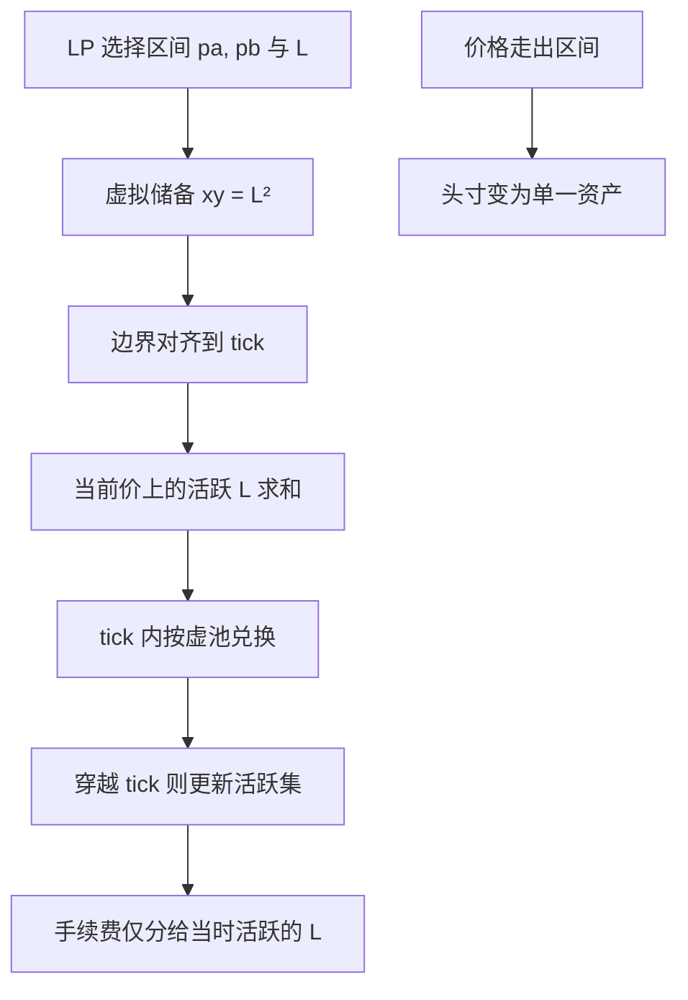

# Uniswap v3 集中流动性

    
把恒定乘积限制在做市商自行选择的价格区间内，同一单位资金在区间里表现得像一个更深的虚池；区间外该头寸不提供流动性，曲线由许多头寸拼接而成。

    <footer>—— Adams, Zinsmeister, Salem, Keefer and Robinson, Uniswap v3 Core, 2021</footer>

[恒定乘积](/quant/uniswap-cpmm) 把流动性均匀（按对数价格并不均匀，但头寸覆盖 $(0,\infty)$）摊在整条双曲线上。多数成交发生在当前价附近，远翼的库存很少被碰到，却同样占用资本。Adams、Zinsmeister、Salem、Keefer 与 Robinson 在 2021 年 *Uniswap v3 Core* 里把做市改成**集中流动性**（concentrated liquidity）：LP 选定区间 $[p_a,p_b]$，只在该区间内按一条「虚拟储备」的恒定乘积做市；价格走出区间后，头寸变成单一资产，不再被成交。许多这样的区间头寸在离散的 tick 上叠加，合成一条分段的有效曲线。本篇写虚拟储备、tick 与手续费档的公开机制，以及集中化如何改变资本效率与 LP 的路径风险。它不是如何排区间的操作指南。

## 问题

v2 的不变量是全局的 $xy=k$。给定总价值，ATM 附近的瞬时深度被整条曲线摊薄。要在 $p$ 附近达到某种美元冲击，LP 必须存入远超过「只覆盖这一邻域」所需的库存。限价簿没有这个问题：挂单本来就可以只存在于某几档。v3 要回答的是：能否在 AMM 的自动撮合里，让 LP 把库存限制在自己愿意做市的价格集合上，并保持局部仍是恒定乘积，从而沿用 v2 的兑换公式与套利直觉。

第二个问题是聚合。若每个头寸自己一条曲线，兑换要对「当前价格上所有活跃头寸」求和。白皮书用虚拟储备 $x_{\mathrm{virt}},y_{\mathrm{virt}}$ 与流动性 $L=\sqrt{x_{\mathrm{virt}} y_{\mathrm{virt}}}$ 把单个区间映射回标准乘积；再用 tick 把价格轴离散化，使跨越边界时只需更新活跃集合。问题收成：区间头寸在数学上等于带边界的 v2 池，整池等于这些虚池在当前 tick 上的并行。

### 虚拟储备把区间映射回 $xy=L^2$

价格用 $p=y/x$（按白皮书的代币顺序）。区间 $[p_a,p_b]$ 内，真实储备 $(x,y)$ 与虚拟量的关系是从两端「截去」不会再用到的库存：

$$
x_{\mathrm{virt}}=x+\frac{L}{\sqrt{p_b}},\qquad y_{\mathrm{virt}}=y+L\sqrt{p_a},
$$

并满足 $x_{\mathrm{virt}} y_{\mathrm{virt}}=L^2$。当价格等于 $p_a$ 时真实 $y$ 耗尽，头寸全成代币 A；等于 $p_b$ 时真实 $x$ 耗尽，全成代币 B。这与「在 $p_a$ 放置一笔限价卖出、在 $p_b$ 放置一笔限价买入、中间用 AMM 填满」的直观一致，白皮书也把窄区间解释为近似的区间订单。$L$ 是该头寸提供的流动性深度：同样的 $L$，区间越窄，真实存入的 $x,y$ 越少，资本效率越高，但价格一旦走出区间，该 $L$ 立即从活跃集合消失。

资本效率不是无风险杠杆。把同样的美元压进更窄的区间，等价于在该区间内加杠杆做市：手续费收入按活跃时间累积更快，同时「被换仓到单一资产」的速度也更快。窄区间 LP 的主要风险是区间被穿越，而不是手续费公式算错。

## 方法

Tick。价格被离散成 $p(i)=1.0001^i$，每个整数 $i$ 是一个 tick。头寸的边界必须落在允许的 tick 上（间距随手续费档变化）。兑换在当前 tick 内沿虚拟乘积滑动；碰到边界则激活或停用以该 tick 为端点的头寸，更新全局 $L$，再继续。这保证状态更新是局部的，不必每笔扫过全部头寸。手续费按「在该 tick 区间内活跃的 $L$」份额分配：只有当时正在为这笔成交提供深度的 LP 分成，区间外的头寸既不承担冲击也不收费。这与 v2「全池按份额分成」不同，会计必须按价格路径积分，而不是按存入市值一次性估算。

手续费档。v3 在同一交易对上允许多个池，典型公开档位为 $0.05\%$、$0.30\%$、$1\%$（后续实现还可有更细档）。稳定对倾向于低费率、窄区间；波动大的配对倾向更高费率、更宽区间。档位是竞争参数：费率低吸引成交，但 LVR 与被穿越风险要用更宽的区间或更高的费率补偿。没有唯一最优档，只有「深度、费率、波动」是否匹配。

### 合成曲线与「有效 v2 深度」

在当前价格 $p$，所有覆盖 $p$ 的头寸的 $L$ 相加，得到瞬时深度 $L_{\mathrm{active}}(p)$。小额兑换看到的冲击与一个虚拟储备为 $L_{\mathrm{active}}^2$ 的 v2 池相同；大额兑换会穿越 tick，深度阶梯式变化，冲击不再是单一双曲线。因此 v3 的滑点不是一个 $k$ 能概括的：必须沿 tick 路径积分。对外报价若只引用「当前 tick 的 $L$」去外推远额成交，会低估穿越后深度下降（或偶尔上升）带来的额外冲击。套利与路由的公开逻辑仍是：比较这笔路径的有效均价与外部价格，扣费、扣 gas；公式变的是均价如何从分段 $L$ 积出来。

## 机制

集中流动性把 AMM 做成「可程序化的限价簿骨架」：深度可以在价格轴上任意堆叠，但撮合仍然是曲线而不是价格优先的离散档。LP 之间的竞争从「是否进入这个全区间池」变成「在哪些 tick 上放多少 $L$」。ATM 附近若堆了极厚的 $L$，小单冲击极小，费用被许多 $L$ 摊薄；远翼若无人驻守，大单会在穿越后滑向真空。这改变了逆向选择的分配：始终覆盖当前价的头寸更频繁地与知情流成交，也更频繁收费；把区间设在远端的头寸像限价单，可能长时间无费，一旦被碰到则一次性被换仓。

对交易者，同一资产可能存在多个费率池、多段深度。公开的最优路由是在这些池与 v2 池、其他 AMM 之间拆分，使边际冲击加费用最小。这与限价簿智能路由是同一运筹问题，目标函数里的「冲击」来自白皮书的虚拟储备公式，而不是来自隐藏的对手方名单。对 LP，再平衡损失被杠杆放大：价格在区间内振荡时，集中头寸的 LVR 高于同等美元的全区间 v2；价格单边走出区间后，损失变成方向性持仓，手续费停止。Evans、Angeris 与 Chitra 等后续工作把集中流动性写成可优化的分布问题：在给定价格过程下，如何把 $L(p)$ 铺在轴上。本篇只需记住结论的方向——集中化提高的是**局部深度/资本**，不提高做市的信息优势。

### 区间被穿越之后还剩什么

头寸在区间外不再做市，但代币还在。若价格下跌穿过 $p_a$，头寸变成全部是较弱的那一侧资产（按方向），要重新打开做市必须另选区间并承担买卖价差与 gas。这与 v2「永远在曲线上、只是比例改变」不同：v3 允许 LP 主动退出报价，也把「忘记移区间」变成一种常见的路径错误——不是智能合约漏洞，是策略没有把区间当成必须维护的限价单。费用只在活跃期累积，用历史费率年化去外推一个长期无人问津的窄区间，会把条件期望写成无条件收益。

v3 的价格累积与预言机观察值按 tick 穿越和秒数加权，比 v2 的储备比积分更接近「几何布朗意义上的时间加权」。它仍然是本池状态的函数，薄流动性或异常穿越会留下痕迹。引用时要与深度、档位写在一起，不能当成外部现货的替代物。

## 边界与工程取舍

白皮书给出的是核心配对的状态机，不是 LP 策略。集中流动性使做市更像主动管理：区间、档位、再平衡频率都是参数，收益分布比 v2 更宽。gas 随 tick 穿越次数上升，极端行情里一笔大兑换可以穿过很多 tick，链上成本成为冲击的一部分。离散 tick 引入最小价格分辨率；稳定币对用更细间距，波动对用更粗间距，这是实现选择，会改变「窄区间」到底有多窄。

v3 不消除 MEV 与外部价差，只改变被冲击的曲线形状。深度在 ATM 极厚、两翼真空时，中等规模交易的均价可能仍优于 v2，但尾部滑点更差。风险系统应按穿越路径做压力，而不是按当前 $L_{\mathrm{active}}$ 做线性外推。Adams 等人提供的是集中化的不变量与 tick 会计；资本效率数字是给定区间宽度下的几何比，不是历史收益承诺。

把 v3 头寸描述成「无常损失更小」通常是错的。无常损失随杠杆与是否被穿越而变；窄区间在区间内的相对损失可以更大。能说的只是：同样美元在目标区间内提供了更大的 $L$，因而单位深度的资本更少。

## 小结

- v3 用虚拟储备把每个价格区间映射回局部恒定乘积，流动性 $L$ 只在区间内活跃。
- 全池深度是覆盖当前价的各头寸 $L$ 之和；大兑换沿 tick 分段变深度，不能用单一 $k$ 外推。
- 手续费只分给当时活跃的 LP；窄区间提高资本效率，同时放大被穿越后的方向性风险。
- 多费率池与 tick 间距是公开竞争参数，把 AMM 推向「可程序化的深度分布」，而不是取消库存风险。
- 出处：Adams, Zinsmeister, Salem, Keefer and Robinson, *Uniswap v3 Core*, 2021；对照 v2 见 Adams, Zinsmeister and Robinson, 2020。
