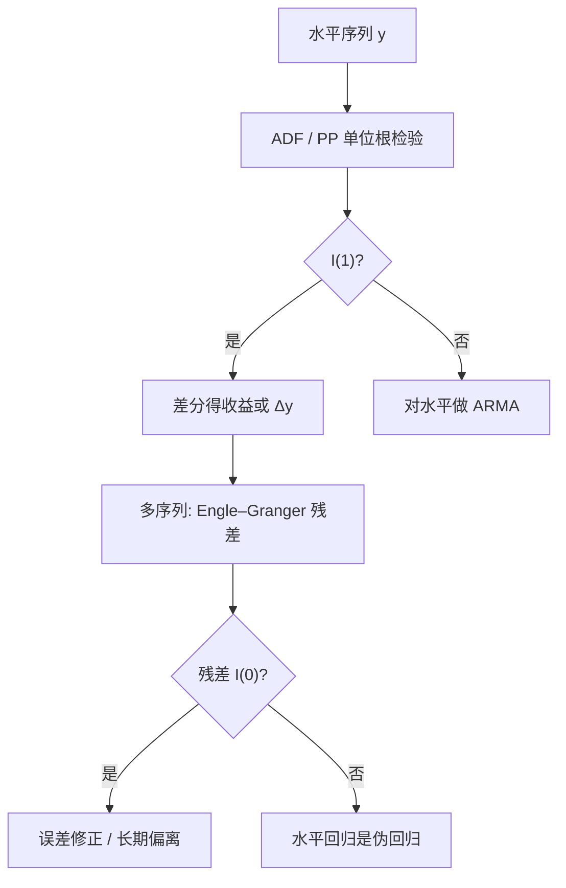

# 单位根与协整预备

自回归系数等于一时，普通 t 统计量不再服从学生氏分布；检验「有没有单位根」，必须用另一张表。

<footer>—— Dickey and Fuller, Distribution of the Estimators for Autoregressive Time Series with a Unit Root, Journal of the American Statistical Association 1979</footer>

价格、汇率、宏观总量经常看起来像随机游走：差分后才像平稳。Dickey 与 Fuller（1979）给出单位根下最小二乘估计量的非标准极限，并构造了检验 $\rho=1$ 的统计量。Engle 与 Granger（1987）接着指出：若干个各自有单位根的序列，线性组合却可以平稳——这就是协整。本篇是预备：弄清 I(1) 与 I(0)、伪回归、以及协整作为「长期均衡残差」的对象。它为 [宏观状态变量](/quant/macro-state-variables) 里的 $cay$、配对交易的价差、以及「能不能对价格做 AR」提供语言，并不展开 Johansen 的全部向量系统。

## 问题

AR(1) $y_t=\rho y_{t-1}+\varepsilon_t$。$|\rho|<1$ 时平稳，$y$ 有有限无条件方差，冲击衰减。$\rho=1$ 时，$y_t=y_0+\sum_{s=1}^t\varepsilon_s$，方差随 $t$ 线性涨，冲击永久留下。Dickey–Fuller 要检验的原假设是后者。金融里对数价格常被当作 I(1)，收益当作 I(0)；利率、实际汇率、宏观比率则有争议——可能是单位根，也可能是持久的平稳根。

若两列独立随机游走做回归，$R^2$ 可以很高、t 值可以「显著」，这是 Granger 与 Newbold 的伪回归：极限不是高斯，残差仍是 I(1)。问题因此是双重的：单序列是否必须差分；多序列是否存在平稳组合，从而水平回归可以有意义。

### 检验式必须写清确定性项

DF 回归有三种常见设定：无常数、有常数、有常数加趋势。真实过程若有漂移，用无常数的表会错；真实若是趋势平稳，用带趋势的单位根检验势会变。ADF（Said–Dickey）在差分项上加滞后，以吸收 ARMA 型短记忆。Phillips–Perron 用非参数修正残差自相关。没有一种设定对所有金融序列正确：对数股价通常带漂移（正的平均收益），实际汇率常争的是有无均值回复水平。设定错误比选 ADF 还是 PP 更致命。

接受单位根，不等于接受「不可预测」。I(1) 只说水平的无条件均值不是好的锚；收益仍可有时变溢价、波动聚集与弱自相关。拒绝单位根，也不等于有可交易的强均值回复：根可以是 0.98，半衰期以年计，成本后为零。

## 方法

**ADF。** 回归 $\Delta y_t=c+\delta t+\gamma y_{t-1}+\sum_{j=1}^p\beta_j\Delta y_{t-j}+\varepsilon_t$，检验 $\gamma=0$。滞后 $p$ 用信息准则或从长滞后删起，目的是让残差近白噪声。临界值来自 Dickey–Fuller 表或 MacKinnon 响应面，不是 $N(0,1)$。样本短、根接近 1 时势很低：许多宏观序列「不能拒绝单位根」，应读成证据不足，不是证明了随机游走。

**从单方程到协整预备。** 两个 I(1) 序列 $y_t,x_t$，若存在 $\beta$ 使 $y_t-\beta x_t$ 为 I(0)，则协整。Engle–Granger 两步法：先对水平做 OLS 得 $\hat\beta$，再对残差做 ADF（临界值更严，因为 $\beta$ 是估出来的）。协整残差是长期均衡的偏离，可进入误差修正：短期 $\Delta y$ 被偏离拉回。Lettau–Ludvigson 的 $cay$ 正是消费、财富、劳动收入协整后的残差；配对交易的价差若协整，才有统计上的「该收敛」对象。

**阶数与差分。** 价格 I(1)、收益 I(0) 是默认工作假设，但仍应检查：利率可能近单位根，信用利差更常是持久平稳，已实现波动近平稳或分整。错误地把 I(0) 差分会过差分，引入 MA 单位根，伤害 [ARMA](/quant/arma) 的识别。错误地对 I(1) 做水平 AR，预测会假装存在一个会把价格拉回去的无条件均值。

### 结构突变会伪装成单位根

Perron 指出，一次水平或趋势断裂会使 DF 偏向不拒绝单位根。危机、汇率制度、指数编制规则都是断裂。检验单位根前应看序列是否在已知日期换了数据生成过程；未知日期的断裂检验存在，但会再消耗样本并进入设定搜索。对交易用的价差，先问合约与指数是否可比，再问 ADF。

## 机制

单位根的机制是冲击的永久成分。Beveridge–Nelson 把 I(1) 拆成随机趋势加平稳周期；资产价格的有效市场版本说，信息进入后价格不再为回归而回归。协整的机制是共同随机趋势：两个价格被同一组基本面拖着走，价差不能无限扩散。误差修正是这一约束的短期表达——并不是「有一个套利机器人保证当天收敛」，而是「偏离在样本的平均意义上会被后续变化抵消」。

势的机制：$\gamma$ 的 t 统计量在局部到单位根（$\rho=1+c/T$）时仍非标准，有限样本里 $c$ 不太负就会看起来像单位根。因此「ADF 不拒绝」极弱。反过来，大样本、高频的对数价格几乎总会表现为 I(1)，因为微观噪声与隔夜跳并不能提供一个把指数拉回五年前水平的锚。

协整系数的 OLS 在三角系统里超一致，但有限样本偏倚可以很大，尤其内生性与短样本并存时。用 Engle–Granger 残差去做交易信号，应把 $\beta$ 做成滚动或递归估计，并承认全样本 $\beta$ 含未来。

### 与体制切换、近单位根 AR 的边界

Hamilton 的体制切换可以在平稳体制里产生很长的「看起来像游走」片段。持久 AR 与单位根在短样本几乎不可分。实务选择往往不是哲学，而是用途：做预测区间与误差修正，用协整/VECM；做波动与收益，用差分后的平稳模型；做叙事性「均值回复策略」，必须把半衰期、成本与结构突变写进拒绝域，而不能只扔一个 5% 的 ADF。

## 边界与工程取舍

单位根检验不是数据清洗的替代。拆股、分红、指数调整会造成水平跳跃，ADF 会把它读成永久冲击或断裂。多元时，Engle–Granger 只能找一个协整向量，且依赖谁当左边；系统方法（Johansen）能测秩，但预备阶段先保证单序列阶数一致、样本期没有把两段制度拼在一起。

不要对几百只股票的价格对做批量 EG 检验再报告「显著配对」的个数——这是未经多重检验校正的搜协整。不要把不能拒绝单位根的利率直接当可交易的随机游走来做久期；近单位根下久期与均值回复策略的风险都很大。工程默认：价格与对数价格当 I(1)，收益、RV、利差先当 I(0) 再检验持久性；协整只留给有经济约束的少量系统（宏观预算、同一标的的期货–现货、紧密替代的债券）。

临界值随是否含趋势、样本量、协整残差是否估 $\beta$ 而变。软件默认表若与回归设定不一致，会把 5% 变成另一种错误。写出检验式，再用匹配的 MacKinnon 值。

## 小结

- Dickey–Fuller（1979）给出 $\rho=1$ 时估计量的非标准分布；检验单位根必须用对应临界值，并写清常数与趋势。
- I(1) 序列的水平回归会伪回归；协整意味着共同随机趋势，Engle–Granger 残差才是长期偏离。
- 不能拒绝单位根常常是势不足，不是证明了随机游走；近单位根的半衰期可以长到不可交易。
- 结构突变、数据拼接与多重配对搜索会污染检验；协整应留给有约束的少数系统。
- 对数价格当 I(1)、收益当 I(0) 是工作默认；波动与利差的阶数要单独检查，以免过差分。
- 出处：Dickey and Fuller, *Distribution of the Estimators for Autoregressive Time Series with a Unit Root*, JASA, 1979；Engle and Granger, *Co-integration and Error Correction*, Econometrica, 1987。
