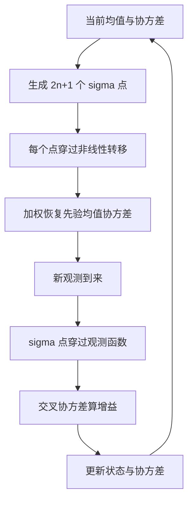
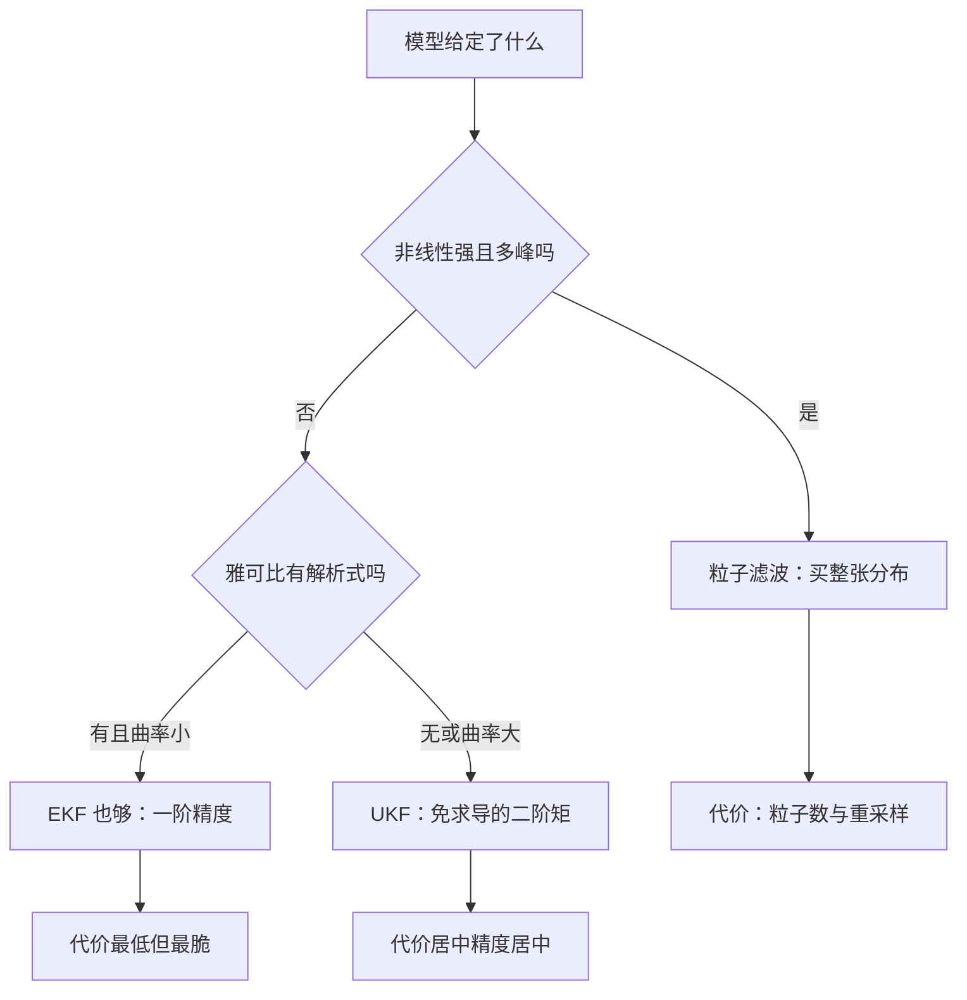

# 无迹卡尔曼滤波

非线性不一定靠雅可比硬线性化——挑一组确定性采样点穿过非线性函数，加权恢复均值与协方差，二阶矩精度，免求导。

<footer>—— 据 Julier and Uhlmann, Proceedings of the IEEE, 2004</footer>

[上一课](/quant/particle-filter)用随机粒子把整个后验搬进内存，代价是粒子和重采样。若非线性温和、后验仍近似单峰，没必要为整张分布买单：无迹变换用 $2n+1$ 个确定性 sigma 点传播一阶二阶矩，把 EKF 的求导环节整个拿掉。它不是粒子滤波的低配版——粒子要的是分布形状，sigma 点要的是矩。本课写选点、传播与增益更新，不写平方根滤波的数值细节。

## 问题

扩展卡尔曼滤波把观测函数在当前均值处泰勒展开取一阶：非线性弱时够用，强时均值被拉偏、协方差被低估；雅可比未必有解析式，数值差分又贵又不稳。跳跃式转移或多峰观测函数下，一切「围绕单点线性化」的方法都失真。粒子滤波接得住但预算高。缺口是中间地带：非线性中等、分布仍像高斯——价差状态、对数波动率这类平滑映射正落在这里。本课不处理状态分量的正性约束，那属于实现层的变换。

## 方法

$n$ 维状态取 $2n+1$ 个 sigma 点：一个在均值处，其余沿协方差平方根矩阵的列方向对称展开，尺度由参数组控制。预测步让每个点穿过非线性转移，按权重恢复先验均值与协方差；更新步同样穿过观测函数，用交叉协方差算 Kalman 增益。数字实例：状态维 $n=4$ 时 sigma 点共 $2\times4+1=9$ 个，一步滤波就是 9 次函数求值加一次 $4\times4$ 矩阵运算；同等精度下粒子滤波动辄上千粒子、每个还要过转移与似然两个函数——UKF 常省一到两个数量级的浮点预算。参数常取 $\alpha=10^{-3}$、$\beta=2$，$\lambda=\alpha^2(n+\kappa)-n$ 决定展开宽度。

## 机制

无迹变换承诺的是矩精度而非分布精度：高斯输入下，任意光滑非线性作用后，sigma 点恢复的均值与协方差精确到二阶泰勒阶，误差只出现在三阶及以上；EKF 的一阶截断误差随曲率增长，且在尖点附近雅可比爆炸。UKF 全程不求导，函数只需可求值——查表式或分段定义的观测模型也能进滤波器。它继承 Kalman 的线性更新律，这一点不因 sigma 点而变。常见误区：以为 sigma 点传播后「协方差自动保正、状态自动合规」。错在恢复环节——平方根矩阵把点撒开，加权重构只是线性组合，波动率穿过模型算出负值照样发生。正解是在状态层做对数变换或对结果加投影，不是事后安慰自己。

## 边界

甜区是「平滑非线性加近高斯后验」。强非线性把 sigma 点甩出有效范围，后验双峰时矩匹配直接失义——两种情况都退回粒子滤波。参数敏感：$\lambda$ 取负时权重出现负值，恢复的协方差可能失正，工程上常配平方根实现兜底。直觉类比：EKF 像在山谷当前落脚点把地形拉成一块平面再滑一步；UKF 像在落脚点周围按固定阵型撒 $2n+1$ 枚探针，各自下坡后重新拟合椭圆。探针撒得再准，恢复的也只是椭圆的圆心与长短轴，不是整张地形图。粒子滤波答不了的便宜题它答了，但它给不出形状，只给矩。下一课把注意力从滤波器挪到状态本身：价差这类量的动力学长什么样——Ornstein–Uhlenbeck 均值回复。

## 小结

- UKF 用确定性 sigma 点传播均值与协方差，免雅可比、二阶矩精度。
- $2n+1$ 个点换一整套导数，预算比粒子滤波低一到两个数量级。
- 甜区是平滑非线性加近高斯后验；多峰与强非线性退回粒子滤波。
- 状态约束与协方差保正要在实现层处理，恢复环节不自动保证。
- 出处：Julier and Uhlmann, *Proceedings of the IEEE*, 2004；Wan and van der Merwe, 2000；Kalman, *Journal of Basic Engineering*, 1960。
