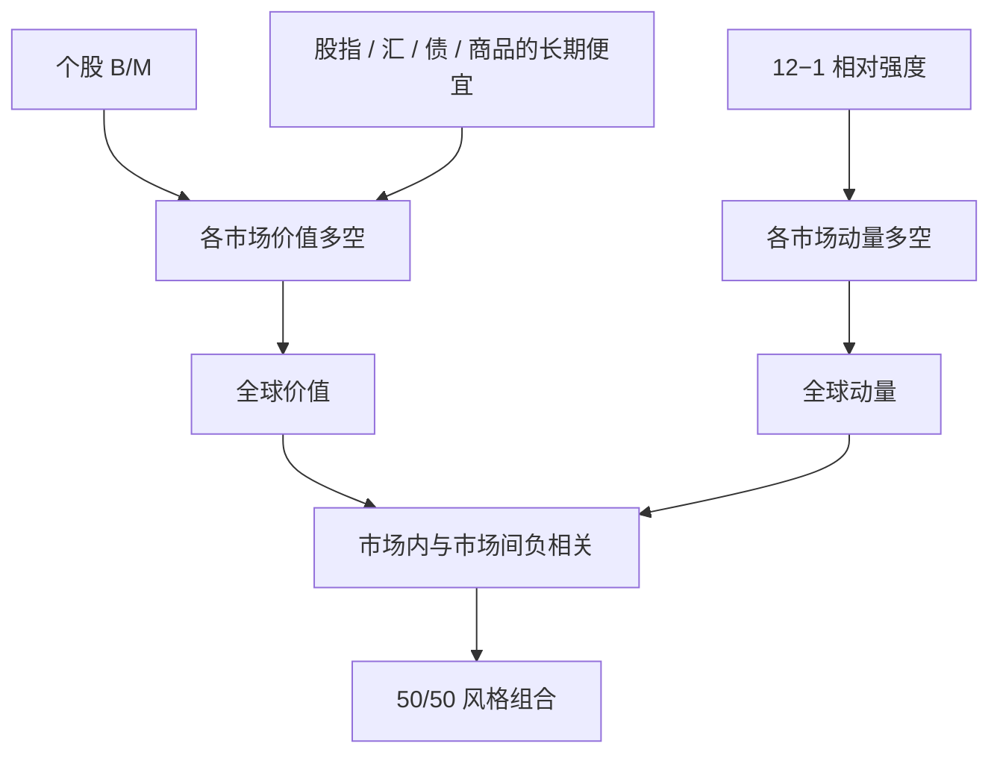

# 跨资产价值与动量

价值与动量不仅存在于美股，也存在于国际股票、股指、外汇、国债与商品；两者在各类内部负相关，合在一起的夏普远高于单独一条腿。

<footer>—— Asness, Moskowitz & Pedersen, Value and Momentum Everywhere, Journal of Finance, 2013</footer>

股票里的价值是 [B/M、E/P、CF/P](/quant/value-factors)，动量是 [12−1 WML](/quant/momentum-wml)。Asness、Moskowitz、Pedersen 把同一对风格搬到八个市场：美股、英国、欧洲、日本个股，以及全球股指、外汇、国债、商品。非股票资产没有账面股权，价值改用长期反转一类的「便宜」代理；动量仍用过去约一年的相对收益。本文的贡献不是再发现美股 HML，而是：**风格是跨资产的，负相关也是跨资产的**。

## 问题

若价值溢价只是美股会计与 Compact Disclosure 样本的产物，它就很难当风险因子。若动量只是散户对个股消息反应不足，它就不该出现在外汇与商品里。AMP 要检验的是风格是否「到处都在」。同时，股票里价值与动量负相关是配置事实：[HML Devil](/quant/hml-devil) 还说明负相关强弱取决于价值时效。若在商品、外汇里也能看到「便宜的继续便宜的对立面是最近的赢家」，则分散化不是美股特有的偶然。

第二个问题是共同因子。若各国价值在同一月一起赚、一起亏，就存在全球风格风险，而不是互不相关的国家异常。原文用全球资金流动性等宏观变量去看价值、动量的共同变动。这为后来把风格写进多资产风险模型提供了实证许可。

### 非股票的「价值」是什么

个股：B/M（可用当期价格，接近 Devil）。股指：国家或指数层面的 B/M 或股利收益率。外汇：长期实际汇率偏离、或五年过去收益的反转（高利率货币若已大涨则不再「便宜」）。国债：真实债券收益率或相对期限结构的偏离。商品：现货相对长期均价、或五年反转。这些度量不统一，原则统一：**价格相对于缓慢基本面或相对于自身长期历史是否低**。五年反转是最脏但最可移植的定义，它与动量的形成期必须错开，否则两条腿数学上接近负号。

日本个股是著名的例外：价值长期有效，截面动量弱甚至为负。原文仍把日本放进全球价值、全球动量组合。单看日本动量「不存在」而否定 everywhere，忽略了组合在其他市场的证据，也忽略了价值-动量在日本仍可能负相关。

## 方法

每个市场内部：按价值度量排序做多空，按 12−1（或类似）动量排序做多空，价值加权或等权视资产流动性而定。再把各国/各资产的价值腿合成「全球价值」，动量腿合成「全球动量」。关键统计量是：各市场溢价的均值与 t 值、价值与动量的相关矩阵（市场内与市场间）、50/50 组合相对单腿的夏普提升。

$$
r_t^{50/50}=\tfrac12 r_t^{\mathrm{VAL}}+\tfrac12 r_t^{\mathrm{MOM}}
$$

在负相关下方差下降多于均值牺牲。时效：价值若用陈旧价格，与动量的对冲变弱，50/50 的好处会被低估或高估。应与 Devil 的原则一致：基本面滞后、价格尽量新。动量在非股票上通常不必跳月，但商品有展期收益，须把展期从「动量」里讲清楚，避免与[Carry](/quant/carry-everywhere) 双计。

### 市场间相关：风格风险而不是国家风险

各国价值腿彼此正相关，各国动量腿彼此正相关，价值与动量跨市场仍常为负。这意味着有一种全球「价值因子」和全球「动量因子」，而不是 8 个独立赌局。资金流动性收紧时，杠杆投资者同时削减动量等多空，动量崩溃可以全球同步；价值有时在此时作为对手盘赚钱，有时一起被砸（去杠杆不看风格）。配置上，50/50 降低的是平常月份的波动，不一定降低融资踩踏的尾部。

## 机制

行为：过度外推使贵的更贵（动量），缓慢基本面回归使便宜的最终胜出（价值）。同一群投资者可以同时制造两条异常，并因仓位拥挤而让它们负相关——刚被追涨的不会出现在价值多头里。风险：价值像困境与高久期生产资本，动量像增长期权与流动性需求；两种风险的价格可以异号。资金：动量是高换手、高杠杆策略，对融资更敏感；价值换手低，对融资的暴露不同，于是相关为负。

原文并不裁决哪一条机制唯一正确。它提供的约束是：机制必须能同时解释股票与非股票、必须允许负相关、必须允许全球共同变动。只解释美股应计的故事不够；只解释商品套保的故事也不够。

### 与 TSMOM、Carry 的边界

[时间序列动量](/quant/tsmom) 用绝对趋势，AMP 的动量主要是截面相对强度。期货池上两者相关，但净暴露不同。Carry 是「价格不变时的收益」，价值是「价格相对基本面偏低」。高 Carry 的货币可以很贵（已升值），高价值的货币可以低 Carry。三因子风格——价值、动量、Carry——应分开报告，再看相关，而不是把商品的 backwardation 既当价值又当动量又当 Carry。

everywhere 不是「每个市场每个十年都显著」。单市场 t 值可以平凡，联合与合成才强。用某一个十年的外汇动量崩溃否定 2013 年论文，与用日本动量弱否定它，是同一类以偏概全。

## 边界与工程取舍

交易成本：个股动量贵，商品与外汇动量相对便宜；价值在个股上便宜，在商品上「五年反转」换手也不低。容量：全球个股价值加权远大于商品截面。数据：国债与商品的价值代理有研究自由度，预注册排序规则，避免为 everywhere 而挑选度量。A 股可作为又一个股票市场加入，但涨跌停与融券会改动量空头，不能直接套用欧洲的换手假设。

不要把 AMP 的全球动量叫做 Moskowitz–Ooi–Pedersen 的 TSMOM。不要把五年反转叫做 HML。不要在回归里同时放各国 HML 再放「全球价值」声称多个 α。实施 50/50 时两边的波动往往不同，应按风险预算而不是名义资金 50/50，否则动量腿会主导。

出处：Asness, Moskowitz & Pedersen, *Value and Momentum Everywhere*, Journal of Finance, 2013。HML 时效见 Asness & Frazzini, 2013。TSMOM 见 Moskowitz, Ooi & Pedersen, 2012。Carry 见 Koijen 等, 2018。

## 小结

- 价值与动量在个股与多种期货/外汇/国债上重复出现。
- 市场内及市场间，两者常负相关；50/50 提升夏普，但不自动消灭融资尾部。
- 非股票价值需可移植代理，并与动量形成期错开。
- 与 TSMOM、Carry 分工，避免把展期收益三记。
- 出处：Asness, Moskowitz & Pedersen, Journal of Finance, 2013。
