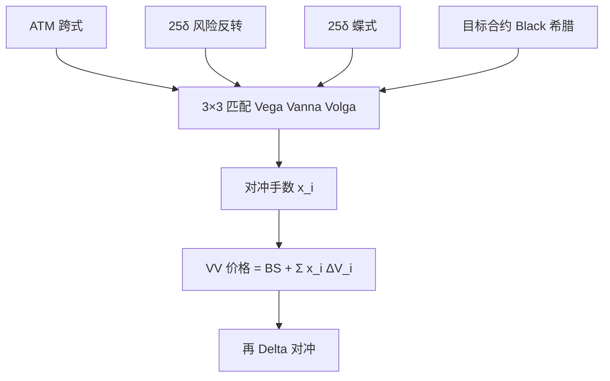

# Vanna / Volga 对冲

    
用平值跨式、风险反转与蝶式三张流动性最好的香草，去匹配目标合约的 Vega、Vanna 与 Volga，可以把一阶波动风险以及现货–波动交叉、波动凸性从 Black–Scholes 价格里校正到市场微笑上。

    <footer>—— Castagna and Mercurio, The vanna-volga method for implied volatilities, Risk, 2007；外汇一致定价见二人同期工作</footer>

[Delta / Gamma / Vega 对冲](/quant/greeks-hedge) 把日常账本收成现货一阶、二阶与波动一阶。外汇与部分商品做市还要显式处理两个二阶对象：**Vanna** $\partial^2 V/\partial S\partial\sigma$（等价于 Vega 对现货、或 Delta 对波动）与 **Volga**（Vomma）$\partial^2 V/\partial\sigma^2$（Vega 对波动）。Antonio Castagna 与 Fabio Mercurio 把这一观察收成可计算的定价与对冲术：在 Black–Scholes 价格之上，用 ATM、25-delta 风险反转、25-delta 蝶式三张工具的市价与模型价之差，按目标合约的 Vanna / Volga / Vega 权重去加权，得到与市场三点一致的调整。它不是 [Heston](/quant/heston) 那样的过程，也不是 [SABR](/quant/sabr) 的摄动展开，而是微笑市场上的工具对冲与插值。本篇写方法与适用边界，曲面几何见 [SVI](/quant/svi-ssvi)。

## 问题

Black–Scholes 用单一 $\sigma$ 给障碍、触碰、欧式香草定价。市场却报三张坐标：ATM 波动、风险反转（偏斜）、蝶式（凸度）。若只把 ATM 的 $\sigma$ 塞进障碍公式，等于忽略偏斜与凸度对路径产品的价值。完整模型（Heston、局部波动、跳）能吸收这三点，但校准慢、障碍对动态假设敏感。实务需要一种快的、与经纪商报价同坐标的调整：承认 Black 作为展开点，把微笑的一阶（Vega）与二阶（Vanna、Volga）用可交易香草对冲掉。

三个市场工具恰好对应三个希腊字母。ATM 跨式主要是 Vega；风险反转一边 Delta 一边 Vega 符号相反，主要加载偏斜即 Vanna；蝶式加载凸度即 Volga。问题是解一个 $3\times 3$ 线性系统，使组合

$$
X=\mathrm{BS}(\sigma_{\mathrm{ATM}})+\sum_{i=1}^{3}x_i\bigl(V_i^{\mathrm{mkt}}-V_i^{\mathrm{BS}}\bigr)
$$

对目标合约匹配 Vega、Vanna、Volga（再回头对冲 Delta）。$V_i$ 为三张香草。这样目标在这三项上与市场一致，剩余是更高阶与动态假设。

### 与单一 Vega 分桶的差别

单一 Vega 假设微笑平行移动。真实移动常是：ATM 变、偏斜变、凸度变，三者不完全相关。分桶 Vega 按到期切开，仍可能在每个到期内假设平行。Vanna–Volga 在每个到期内用 RR 与 BF 把倾斜和弯曲当成独立可对冲因子，这与外汇经纪商的报价惯例一致。股票指数较少直接报 RR/BF，但同样可以把 25-delta 点当工具。不要把它理解成又一种 Heston Vega（对 $v_0$ 的偏导）；单位是对 Black 隐含波动的导数。

Vanna 的记号在文献里有时是 $\partial\Delta/\partial\sigma$，有时是 $\partial\nu/\partial S$，Black–Scholes 下二者通过混合偏导相等。报告时写清是「每 1% vol、每 1% 现货」还是绝对点，避免与股票 Vega 的百分数习惯混用。

## 方法

**Castagna–Mercurio 调整。** 选展开波动 $\sigma_{\mathrm{ATM}}$（或远期 ATM）。计算目标与三张香草在该 $\sigma$ 下的 Black 价格及 Vega、Vanna、Volga。解 $x=(x_{\mathrm{ATM}},x_{\mathrm{RR}},x_{\mathrm{BF}})$ 使

$$
\begin{pmatrix}
\nu_{\mathrm{ATM}} & \nu_{\mathrm{RR}} & \nu_{\mathrm{BF}}\\
\mathrm{Va}_{\mathrm{ATM}} & \mathrm{Va}_{\mathrm{RR}} & \mathrm{Va}_{\mathrm{BF}}\\
\mathrm{Vo}_{\mathrm{ATM}} & \mathrm{Vo}_{\mathrm{RR}} & \mathrm{Vo}_{\mathrm{BF}}
\end{pmatrix}
\begin{pmatrix}x_{\mathrm{ATM}}\\x_{\mathrm{RR}}\\x_{\mathrm{BF}}\end{pmatrix}
=
\begin{pmatrix}\nu_X\\\mathrm{Va}_X\\\mathrm{Vo}_X\end{pmatrix}.
$$

目标的 VV 价格是 Black 价加上 $\sum x_i(V_i^{\mathrm{mkt}}-V_i^{\mathrm{BS}})$。对香草，该方法在三个校准点精确重现市价，中间执行价给出一种微笑插值。对障碍等，给出相对纯 Black 的微笑调整，但障碍监控、触碰回扣仍用 Black 过程——动态并未变成随机波动。

**对冲解释。** $x_i$ 就是对冲手数：持有目标的同时持有 $-x_i$ 的三张香草（再 Delta 对冲），组合的 Vega、Vanna、Volga 为零（在展开点线性化的意义上）。市场微笑移动若落在由 ATM/RR/BF 张成的三维里，对冲组合一阶免疫；若移动是更高阶扭曲或期限结构扭转，残差留下。

### 权重衰减与短到期

有的实现按 $\nu_X/\nu_i$ 一类因子把调整在短到期或远翼衰减，避免障碍价格被翼部蝶式过度拉动。这是工程稳定，不是 2007 年方法的定理部分。短到期跳跃主导时，Volga 极大，矩阵接近病态：三张香草的 Volga 剖面在短 $\tau$ 上过于相似。应改用带跳的模型或直接把短端障碍当事件产品，而不是硬解 VV 系统。

## 机制

Taylor 展开把 $V(S,\sigma)$ 在 $\sigma_{\mathrm{ATM}}$ 处展开到波动的二阶，并保留 $S$–$\sigma$ 交叉。市场三点给出这三个导数方向上的「价格增量」。线性系统是把增量分配到可交易基上。几何上，VV 微笑通过 ATM、25-delta 看跌、25-delta 看涨（由 RR 与 BF 还原）三点，中间形状由 Black Vega 剖面的线性组合决定，与 SVI 双曲线不同：VV 是对冲构造，SVI 是几何参数化。二者都可以做香草插值，无套利不自动成立，仍须 [蝶式扫描](/quant/butterfly-calendar-arb)。

为何外汇爱用它：RR 与 BF 有经纪商，三点每天可观测；障碍流动性相对香草差，需要快定价；Heston 在外汇上相关 $\rho$ 不稳定。VV 用市场坐标说话。代价是：障碍的触碰概率仍按 Black 路径计算，只是终端支付按微笑调整——与真实的杠杆、随机波动路径不一致。Hagan 等人用 SABR 正是为了让 Delta 与微笑移动一致；VV 的 Delta 仍接近展开点的 Black Delta 加上对冲香草的贡献，是否「管理微笑风险」取决于你是否真去交易那三张对冲，而不是只把 VV 当价格公式。

### 与 Heston、SABR 的使用分工

Heston 给出过程、特征函数、远期微笑；用来给方差产品、需要动态一致的奇异定价。SABR 给出单到期标记与解析近似 Delta。Vanna–Volga 给出与 FX 报价惯例对齐的三点对冲与快速障碍调整。生产上常见：香草曲面用 SVI 或 SABR 发布，障碍用 VV 或 SLV 定价，风险报告把 VV 对冲手数与模型 Vega 分桶对照。不要把 VV 的 $x_{\mathrm{RR}}$ 解释成 Heston 的 $\rho$，尽管二者都「加载偏斜」。

矩阵奇异意味着三张工具在 Vega–Vanna–Volga 空间线性相关，常见于极短到期或几乎无偏斜的微笑。此时不是「没有风险」，而是三点不够区分风险，应减少因子或换模型。

## 边界与工程取舍

VV 是展开与三点投影，不是无套利定理。插出的香草微笑可能局部破凸，发布前要扫描。障碍、美式、离散监控的路径依赖超出三点能锁定的范围：不同模型可以共享三点香草、给出不同障碍价，VV 只是其中一种约定。利率、远期点、Delta 惯例（即期 / 远期 / 溢价调整）必须与经纪商一致，否则三点解的是错误工具。

Castagna–Mercurio（2007）提供的是方法与外汇实践，不是全球期权的官方定价标准。股票指数上 RR/BF 流动性差时，三点噪声会放大 $x_i$。多到期时每个到期各解各的系统，期限之间的日历由各切片独立决定，可能破坏 [SSVI](/quant/svi-ssvi) 一类跨期约束——VV 不管期限结构一致性。高阶希腊如 Charm 不在 $3\times 3$ 里，隔夜与到期周仍要单独政策，见 [隔夜跳空](/quant/overnight-gap-hedge) 与 [Charm / Color](/quant/higher-greeks)。

把 VV 价格与 Heston 价格的差当成「套利」通常不成立：二者动态不同，障碍不能静态复制。差是模型风险，只有在香草三点上二者都应贴近市场，比较才有意义。

## 小结

- Vanna 是现货–波动交叉，Volga 是波动凸性；Castagna–Mercurio 用 ATM、RR、BF 三张香草匹配这两项与 Vega。
- VV 价格是 Black 价加上按对冲手数加权的市场–模型价差；三点香草可精确重现。
- 它是对冲构造与快速微笑调整，不是随机波动过程，障碍路径仍常按 Black 计算。
- 与 Heston / SABR / SVI 分工：动态、单到期标记、切片几何、三点对冲，不要用一个参数去冒充另一个。
- 短到期矩阵病态、微笑无套利、跨期日历，都要在 VV 之外另检。
- 出处：Castagna and Mercurio, *Risk*, 2007；希腊字母框架见 Hull；对照 Heston，1993 与 Hagan et al.，SABR，2002。
