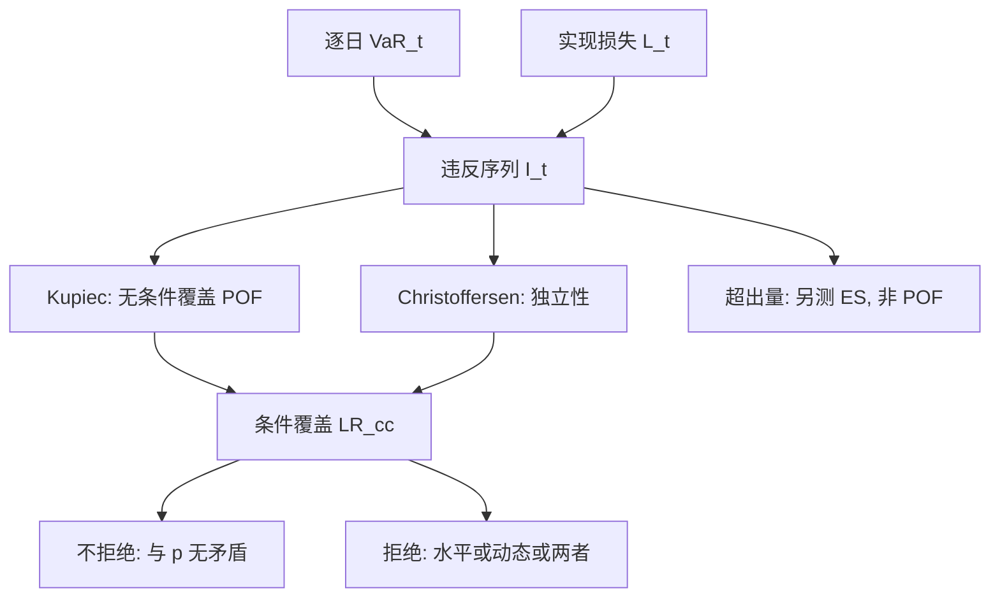

# 回测 VaR：Kupiec / Christoffersen

VaR 是一组区间预测：每个地平线都应把实现损失盖在声明的概率之内，且违反不应在波动聚集时成串出现。次数检验只看覆盖率；条件覆盖还要看违反是否独立。

<footer>—— Kupiec, Techniques for Verifying the Accuracy of Risk Measurement Models, Journal of Derivatives, 1995；Christoffersen, Evaluating Interval Forecasts, International Economic Review, 1998</footer>

算出 [VaR](/quant/var-methods) 之后，模型是否校准只能用后来实现的损失来检验。把第 $t$ 日损失 $L_t$ 与前一日做出的 $\mathrm{VaR}_{t|t-1}$ 比较，定义违反指示 $I_t=\mathbf{1}\{L_t\gt \mathrm{VaR}_{t|t-1}\}$。若声明水平为 $\alpha$（例如 99% VaR 对应违反概率 $p=1-\alpha=0.01$），则在正确的条件覆盖下，$I_t$ 应像成功概率为 $p$ 的伯努利，且对过去信息独立。Kupiec（1995）给出无条件覆盖的似然比检验（比例失败检验，POF）：只问违反次数对不对。Christoffersen（1998）把区间预测的评价拆成无条件覆盖加独立性，再合成条件覆盖。Basel 的交通灯用的是次数规则的监管简化。本篇写检验的假设、功效与误用，不把「通过 Kupiec」写成模型正确的证书——尤其对 [Expected Shortfall](/quant/expected-shortfall)，次数检验本来就不够。

## 问题

风险模型每日输出一个数字 $v_t$，声称 $\mathbb{P}(L_t\gt v_t\mid\mathcal{F}_{t-1})=p$。这比「长期平均违反率是 $p$」更强：在已经知道今日波动很高时，$v_t$ 应升高，使条件概率仍为 $p$。无条件覆盖只要求 $E[I_t]=p$；条件覆盖要求 $E[I_t\mid\mathcal{F}_{t-1}]=p$，因而 $\{I_t\}$ 在正确设定下是独立同分布伯努利。波动聚集的市场里，一个过时的无条件 VaR 会在危机中连续违反，平均次数也许还能用更长的平静期「摊平」，独立性则立刻失败。Christoffersen 要检验的正是这种成串。

样本很小。一年 250 日、99% VaR，期望违反 2.5 次。次数检验的功效极低：模型把 $p$ 错成 0.02，也常常无法拒绝。这是检验设计的核心约束，不是操作上「再多积累几年」就能完全消失的细节。问题是：在如此稀疏的事件上，哪些假设还值得检验，以及不拒绝时应该怎样陈述结论。

### 违反序列是唯一输入

标准回测不看 $L_t-v_t$ 的幅度，只看 $I_t$。这与 VaR 作为分位数、对尾部形状不敏感是一致的：分位数模型的一阶含义就是覆盖事件的概率。ES 的一阶含义还包括超出量的均值，需要另一类检验。把 Kupiec 用在 ES 上，是在检验一个 ES 并不声称的对象。Berkowitz（2001）把整段预测分布经概率积分变换变成均匀变量再检验，信息更多，也要求模型输出整段分布而不是一个分位数。

回测窗口必须与模型声称的信息集一致。用含未来参数的「全样本估一次再回看违反」，不是真实的逐日 VaR。应做的是当时点估计：每日只用 $t-1$ 及之前的数据（或当时实际生产参数）生成 $v_t$。

## 方法

设样本长 $T$，违反次数 $x=\sum I_t$，经验频率 $\hat p=x/T$。Kupiec 的无条件覆盖似然比为

$$
\mathrm{LR}_{\mathrm{uc}}=-2\ln\frac{(1-p)^{T-x}p^{x}}{(1-\hat p)^{T-x}\hat p^{x}},
$$

在原假设 $E[I_t]=p$ 下渐近 $\chi^2(1)$。$\hat p=0$ 时公式需用极限或精确二项，不要强行取对数。监管交通灯大致是这条检验的分区：绿（次数接近期望）、黄、红（次数过多），红灯要求附加资本。次数过少（模型过保守）在 Kupiec 里同样可拒绝，交通灯通常不惩罚过保守。

Christoffersen 的独立性检验看一阶马尔可夫：令 $n_{ij}$ 为从状态 $i$ 到 $j$ 的转移次数，$i,j\in\{0,1\}$。原假设是 $P(I_t=1\mid I_{t-1}=0)=P(I_t=1\mid I_{t-1}=1)$，似然比 $\mathrm{LR}_{\mathrm{ind}}$ 渐近 $\chi^2(1)$。条件覆盖 $\mathrm{LR}_{\mathrm{cc}}=\mathrm{LR}_{\mathrm{uc}}+\mathrm{LR}_{\mathrm{ind}}$，渐近 $\chi^2(2)$。还可以用违反之间的持续时间做检验（Christoffersen 与 Pelletier，2004），对成串更敏感。

### 功效、精确分布与多重比较

渐近 $\chi^2$ 在 $T p$ 很小时空洞。应用二项精确检验或蒙特卡洛临界值。即使如此，99% 水平一年数据几乎看不出 $p=0.01$ 与 $p=0.015$ 的差别。提高功效的正当办法是：降低 $\alpha$ 做辅助检验（检验 95% VaR 的覆盖，作为 99% 模型的诊断）、拉长样本、或检验多个水平的联合覆盖。对许多交易台、许多账簿同时回测，再挑「没通过的那张」报告，会落入多重比较：总有桌子因噪声失败。应预先指定主账簿与主水平，其余当诊断。

Campbell（2005/2006）综述了回测程序与监管实践。要点是：回测是关于**预测分布的校准**，不是关于「危机里亏了钱所以模型错」。正确校准的 99% VaR 仍应在约 1% 的日子被超过；那些日子亏多少，VaR 本来不说。

## 机制

无条件覆盖失败，机制通常是波动估计偏了、窗口过长导致危机后仍用平静期 $\sigma$、或分布形状过薄（正态相对 $t$）。独立性失败，机制通常是模型给出的是无条件分位数：限额不随 $\sigma_t$ 上升，于是 $I_t$ 在 GARCH 意义上成串。过滤历史模拟或条件参数 VaR 的设计目标，正是让 $I_t$ 更接近独立。通过独立性、失败无条件，说明条件波动对了但水平（均值、倍数、自由度）偏了；反过来则是水平凑对了、动态不对。两个 LR 分开读，比只看 $\mathrm{LR}_{\mathrm{cc}}$ 更有诊断价值。

连续违反还会通过交易行为进入真实 $L_t$：限额收紧、强平、停报价，使损失过程在压力期与模型假设的外生 P&L 不同。回测若用纸面标记，可能显示覆盖良好，而资金账户已经因保证金被清算。这不是检验公式的错误，是 $L$ 的定义与 [杠杆、保证金与强平](/quant/leverage-liquidation) 不一致。

一年 2 次违反、期望 2.5，Kupiec 几乎必然不拒绝。正确的书面结论是「在该样本与该水平上，数据与 $p=0.01$ 无矛盾」，不是「模型已验证」。把不拒绝翻译成验证，是对低功效检验的标准误用。

### 与 ES、EVT 的接口

ES 回测需要超出量。在 VaR 校准成立的前提下，超出量 $L_t-v_t\mid I_t=1$ 的均值应等于 $\mathrm{ES}- \mathrm{VaR}$。点太少时这一步比 Kupiec 更没功效，这也是 Yamai–Yoshiba 担心 ES 难以验证的原因。EVT 给出的高分位几乎无法用常规违反次数证实：99.9% 日 VaR 期望每四年一次违反量级，交通灯没有意义。高分位的「回测」应改成分位数回归诊断、阈值稳定性、以及压力情景是否被模型以非零概率生成，而不是再跑一遍 POF。

## 边界与工程取舍

检验假设 $I_t$ 的伯努利结构，组合与市场在样本期内结构性变化（新产品、新政、流动性消失）会让 $p$ 不恒定，拒绝可能来自体制而非来自当日 $\sigma$ 估错。重叠地平线（十日 VaR 每日滚动）使 $I_t$ 必然相关，标准 Christoffersen 不能直接用，需要非重叠或调整相关。日内 VaR、开盘跳空、假期，都要在 $T$ 与 $I_t$ 的构造里写明。

通过全部检验仍可以在下一次危机里崩溃：回测是样本内校准，不是对未知未知的保险。Jorion 把回测放在风险管理流程里，与压力测试并列，而不是替代。工程报告应同时给出：违反日期与幅度、$\hat p$、$\mathrm{LR}_{\mathrm{uc}}$、$\mathrm{LR}_{\mathrm{ind}}$、交通灯颜色、以及是否当时点估计。缺任何一项，数字都可以被选择窗口操纵。

把回测做成「调窗口直到绿灯」是对检验的破坏。窗口、$\alpha$、账簿范围应在模型文档里预先锁定，更改须留痕。否则 Kupiec 统计量不再有名义水平。

## 小结

- Kupiec（1995）用违反次数的似然比检验无条件覆盖：$E[I_t]$ 是否等于声明的 $p$。
- Christoffersen（1998）再检验违反是否独立，并与无条件覆盖合成条件覆盖。
- 99% 日 VaR 的年样本期望违反极少，检验功效低；不拒绝不是验证。
- 独立性失败常指向未条件化的波动；次数失败常指向水平或形状。
- 次数检验不评价尾部均值，不能当作 ES 的回测。
- 必须当时点估计、预先锁定窗口，避免为绿灯而数据挖掘。
- 出处：Kupiec, *Journal of Derivatives*, 1995；Christoffersen, *International Economic Review*, 1998；Christoffersen and Pelletier, duration-based tests, 2004；Berkowitz, *JBES*, 2001；综述见 Campbell 对回测程序的评论；监管交通灯见巴塞尔框架；VaR 定义见 Jorion, *Value at Risk*。
