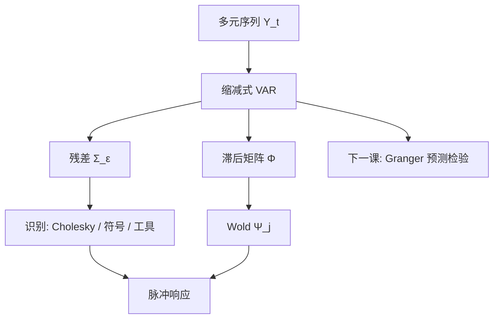

# VAR 与脉冲响应

让每个变量都对所有变量的滞后回归，把共同动态写成向量自回归；脉冲响应问的是一次正交化冲击之后，系统往哪走，而不是某一条回归的斜率叫因果。

<footer>—— Sims, Macroeconomics and Reality, Econometrica, 1980</footer>

上一课 [分位回归](/quant/quantile-regression-finance) 仍是单方程。利率、利差、波动、订单流一起动时，把其中一个当「外生 $x$」会把反馈写进残差。[ARMA](/quant/arma) 是一元的有理近似；Sims 的 VAR 把 $k$ 个序列写成

$$
Y_t=c+\Phi_1 Y_{t-1}+\cdots+\Phi_p Y_{t-p}+\varepsilon_t.
$$

本单元「多元与长记忆」的第一课：对象从截面推断转到**系统的条件均值**。缺口是识别——$\varepsilon$ 的协方差不是结构冲击。脉冲响应（IRF）依赖正交化；下一课 Granger 因果是同一 VAR 上的另一套检验，不自动等于 IRF 的结构解读。

## 问题

宏观与金融想看「政策突然收紧之后风险溢价怎么走」，或「波动冲击之后订单流怎么走」。单方程 $y$ 对 $x$ 的滞后，漏掉 $y$ 对 $x$ 的反馈，OLS 斜率没有系统含义。VAR 让反馈进 $\Phi$。问题是 $\varepsilon_t$ 同期相关：不先给一个冲击排序或短期约束，IRF 不是唯一的。

Sims 的原意是少用不可信的排除，让数据说话，再用对 $\Sigma_\varepsilon$ 的识别（Cholesky、符号约束）把缩减式变成可讲的冲击。金融里 $k$ 稍大、$T$ 日频看似很大，其实持续与结构突变让有效样本短。对象是**缩减式动态 + 明示识别**，不是无约束的「因果图」。

### 滞后阶与信息准则

$p$ 用 AIC/BIC/HQ，金融日频常偏大（日历、微观结构）。应先问对象是日还是周；周 VAR 更稳。过拟合的 IRF 在中期乱颤，应报置信带（Runkle 自助或 Kilian 偏误修正）。单位根序列上水平 VAR 的 IRF 可以不回到零，应差分或 VECM，见 [单位根](/quant/unit-root) 与 [Johansen](/quant/johansen)，本课不重写协整。

Cholesky 顺序是识别假设：排在前面的变量对后面的同期冲击「先动」。把订单流放在收益前还是后，IRF 可以换号。必须用经济时序（谁在毫秒上先印）来排，不能按让 IRF 好看排。

## 方法

**估计。** 方程间回归元相同，OLS 即方程方程的有效（在高斯下）。标准误对残差同期相关稳健；推断 IRF 要用 $\Phi$ 与 $\Sigma$ 的联合分布，delta 或自助。贝叶斯 VAR（Minnesota 先验）是收缩课在滞后矩阵上的应用，$k$ 大时几乎必需。

**IRF。** 正交冲击 $u=A^{-1}\varepsilon$，Cholesky 取 $A$ 为下三角。广义脉冲（Pesaran–Shin）不依赖顺序，但对应的是对某一方程残差的冲击并按历史相关「带上」其他，不是结构正交。报告须写是哪一种。累积 IRF 对利率、价差更有读法；对收益则累积是价格水平。

**与 GARCH。** VAR 是条件均值；残差仍可有波动聚集，应做 VAR-GARCH 或至少用 HAC/自助，否则 IRF 带假窄。本课不把 BEKK 提前讲完，只标记缺口，后课 [BEKK](/quant/bekk-mgarch) 接多元方差。

### 金融里常见的错误对象

把股票收益 VAR 的 IRF 当「谁引领谁的可交易领先」：日频上领先滞后多半是非同步，见 [Hayashi–Yoshida](/quant/hayashi-yoshida)。分钟 VAR 更糟，微观结构主导 $\Phi$。VAR 更适合：利率期限结构、宏观–溢价、波动指数与利差这类较慢的系统。高频领先应用报价时间戳，不是低阶 VAR。

## 机制

Wold 表示 $Y_t=\mu+\sum_{j=0}^\infty\Psi_j\varepsilon_{t-j}$，$\Psi_j$ 由 $\Phi$ 递推。IRF 的第 $j$ 步是 $\Psi_j$ 乘识别矩阵。机制是线性系统的脉冲：无非线性、无体制（除非门槛 VAR）。结构突变会把全样本 $\Psi$ 变成两段的平均，IRF 谁也不代表，后课 Chow 接这个缺口。

识别的机制是给 $\Sigma_\varepsilon=AA^\top$ 足够约束。刚好识别时似然与缩减式相同，数据不检验识别；过度识别（符号、长期约束）才可检验。金融叙事常把恰好识别的 Cholesky 讲成发现，其实是假设。

局部投影（Jordà）直接回归 $Y_{t+h}$ 对冲击代理，不经 VAR 递推，对误设 $\Phi$ 更稳、对 $h$ 更大时更噪。与 VAR-IRF 并列是好纪律，尤其 $p$ 不确定时。

### 到 Granger 的交接

IRF 需要识别。Granger 因果只问：滞后 $x$ 是否帮助预测 $y$（均方），不需要正交化。下一课写清：预测帮助 $\neq$ 结构因果，也 $\neq$ IRF 的符号。两者都从本课的 VAR 出发。

## 边界与工程取舍

$k=15$、$p=5$ 参数爆炸。应因子 VAR、贝叶斯收缩、或只留理论变量。季节、隔夜应进确定性项，见后课日内季节性（高频）与 [日历](/quant/calendar-overnight)。汇率、商品的 VAR 常有异方差与跳，IRF 的线性响应在危机日不适用。

工程：小系统 OLS-VAR + 自助 IRF；大系统贝叶斯；识别顺序预登记并做置换敏感性。不要用日股指 VAR 宣称货币政策传到股票的结构弹性——宏观识别文献（符号约束、外生工具）比 Cholesky 更对口。不要把 IRF 置信带穿过零写成「无效应」而不看经济幅度。

## 小结

- VAR 把多元条件均值写成系统，IRF 来自 Wold 乘上对 $\Sigma_\varepsilon$ 的识别。
- Cholesky 顺序是假设；广义脉冲不是结构正交冲击。
- 金融高频领先滞后不是低阶 VAR 的对象；慢系统、小 $k$、收缩或贝叶斯更稳。
- 残差的 GARCH 与断点会让 IRF 带与形状同时坏掉。
- 出处：Sims, *Econometrica*, 1980；IRF 推断见 Runkle、Kilian；广义脉冲见 Pesaran and Shin；局部投影见 Jordà, *American Economic Review*, 2005。
