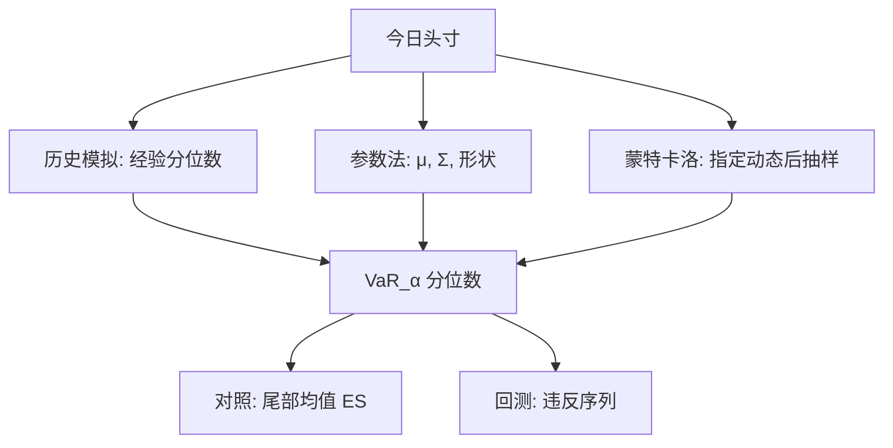

# VaR：历史、参数、MC

在险价值把「正常市场里、给定地平线上、组合损失不超过某个数」的陈述收成分位数；它不描述分位数以外的尾巴有多长，计算方法却决定这个分位数从哪一种损失分布里读出来。

<footer>—— Jorion, Value at Risk: The New Benchmark for Managing Financial Risk；Duffie and Pan, An Overview of Value at Risk, Journal of Derivatives, 1997</footer>

[上一课](/quant/glft-market-making)把最优报价收到库存。缺口从交易台控制换成账簿分位数：VaR 是损失的语言，不是再优化一层价差。VaR（Value at Risk）在 1990 年代成为交易账簿的通用语言：选定置信水平 $\alpha$（如 99%）与地平线 $h$（如一日），VaR 是损失分布的 $\alpha$ 分位数。JP Morgan 的 RiskMetrics（1996）把参数法普及到业界；Jorion 的教科书把它写成风险管理的基准定义；Duffie 与 Pan（1997）综述了从线性头寸到期权非线性的计算路径。三种标准算法——历史模拟、参数（方差–协方差）、蒙特卡洛——对应三种对损失分布的假设，而不是三种不同的风险定义。定义本身的缺陷（非次可加、忽略尾部形状）由 [Expected Shortfall](/quant/expected-shortfall) 承接；数字是否校准则由 [Kupiec / Christoffersen 回测](/quant/var-backtest) 检验。本篇只写 VaR 作为分位数如何被三种方法算出来，以及各自把不确定性藏在哪里。

## 问题

记组合在地平线 $h$ 上的损失 $L$（损失为正）。$\alpha$-VaR 定义为

$$
\mathrm{VaR}_\alpha(L)=\inf\{ \ell\in\mathbb{R}: \mathbb{P}(L\le \ell)\ge\alpha \},
$$

即最小的 $\ell$ 使得损失不超过它的概率至少为 $\alpha$。P&L 若定义为 $-L$，VaR 是收益分布的左尾分位数的相反数。问题是：真实的 $\mathbb{P}$ 未知。历史法用过去一段窗口的经验测度代替；参数法用一个带参数的族（常是正态或 $t$，协方差由 RiskMetrics 的指数加权或 [GARCH](/quant/garch) 给出）；蒙特卡洛用一个数据生成过程抽样，再取样本分位数。三种方法回答同一个分位数，对非线性、对体制切换、对「从未见过的损失」的态度完全不同。

Jorion 反复强调 VaR 是**在给定模型与窗口下的分位数**，不是「最多能亏多少」。地平线 $h$ 若用平方根法则从一日延到十日，隐含独立同分布与方差有限；交易账簿的期权与可提前执行头寸会破坏这条法则。方法选择首先是在「用哪些假设去填未知的 $\mathbb{P}$」，其次才是计算速度。

### 损失定义、标记价与地平线

$L$ 必须先规定：是理论盈亏还是可实现盈亏，是否含手续费，外汇账簿用哪一种货币，期权用中间价还是可成交价。纸面标记忽略变现，会把不可执行的价格当成 $h$ 期末仍可平仓的价格，这与 [实施缺口](/quant/implementation-shortfall) 和后文 [杠杆与强平](/quant/leverage-liquidation) 直接冲突。地平线应与决策节奏匹配：日内限额用更短 $h$，但更短 $h$ 上微观结构噪声会污染分位数。合并不同流动性的头寸到同一 $h$，是监管常用的简化，不是统计上的无害假设。

99% 日 VaR 在一年约 250 个交易日里，期望违反约 2.5 次。把「从未违反」当成模型很好，在短样本上几乎没有意义；把「违反了就证明模型坏」同样草率。校准属于回测，不属于定义。

## 方法

**历史模拟。** 取过去 $n$ 日的风险因子变化（或收益率），应用到**今天**的头寸上，得到 $n$ 个假设损失，再取经验 $\alpha$ 分位数。不必假设联合正态，能保留厚尾与部分非线性（若用全定价）。Hendricks（1996）比较过历史法与参数法在真实组合上的表现。缺陷是：窗口是带宽，$n$ 太短则分位数方差大，$n$ 太长则包含过时体制；每个历史日等权，除非做加权或波动调整；Pritsker（2006）指出历史模拟会隐藏对最近波动的迟钝。Barone-Adesi 等人的过滤历史模拟先用 GARCH 去波动，再对标准化残差重抽样并配上今日 $\sigma_t$，部分修补这一点。

**参数法（方差–协方差）。** 假设因子收益近似正态（或椭圆），头寸对因子线性，则 $L$ 近似正态，

$$
\mathrm{VaR}_\alpha \approx \mu_L + \sigma_L \Phi^{-1}(\alpha),
$$

$\sigma_L^2=w^\top\Sigma w$。RiskMetrics 用指数加权移动平均估 $\Sigma$，衰减因子约 0.94（日频）。线性假设对期权失效，须用 delta–gamma 等局部展开，或放弃参数闭式。正态使尾部分位数完全由 $\sigma$ 决定，厚尾被低估；换成多元 $t$ 只是把形状参数当成新的带宽。与 [Markowitz](/quant/markowitz) 共用同一套 $\Sigma$，也共用同一套估计病态：维度高时协方差噪声会让组合 VaR 看起来过度分散。

**蒙特卡洛。** 指定因子的动态（扩散、跳、随机波动、风险中性或真实测度——风险度量通常在真实测度的预测分布上），抽样 $M$ 条路径，每条对组合做全定价，取损失的样本分位数。非线性、路径依赖、提前执行都可以放进定价器。代价是模型风险与计算：分位数的抽样误差随 $M$ 与尾部稀疏下降得很慢，99.9% 尤其如此。MC 不是「更真」，它只是把假设从「联合正态加线性」换成「你写下的那个过程」。

### 三种方法对同一张簿会给出不同数字

设组合含深度虚值期权。历史窗口若从未出现相应的因子跳跃，历史 VaR 接近线性头寸的分位数，期权的凸性不出现。参数 delta 法则同样看不见凸性。MC 若过程含跳或随机波动，尾部可以远大于前两者；若过程仍是布朗，MC 只是在做昂贵的正态抽样。因此「用了蒙特卡洛」不构成审慎证明。Jorion 建议把方法对照：线性账簿上三者应接近，差在波动估计；非线性账簿上历史与 MC 的差距本身就是模型诊断。

## 机制

VaR 作为分位数，对分布在 $\alpha$ 以下的部分完全不敏感：把超过 VaR 的损失再放大一倍，VaR 可以不变。这是 Artzner 等人批评它不适合作为唯一资本规则的起点，也是 Expected Shortfall 要补的信息。三种算法都在估计同一个不敏感的对象，差别在估计所用的测度。历史法的测度是经验测度，机制是「未来的一天像窗口里随机抽到的一天」；参数法的机制是「二阶矩加形状假设决定一切」；MC 的机制是「你相信的动态」。

波动聚类使无条件分位数与条件分位数分家。今日若已处于高 $\sigma_t$，无条件历史 VaR（等权窗口）会偏低，参数 EWMA/GARCH 与过滤历史会升高。监管常要的是条件覆盖：高波动日限额应自动收紧。这与回测时「违反应独立出现」的假设互相牵扯：条件 VaR 若正确，违反近似独立；无条件 VaR 在波动堆叠期会连续违反。Christoffersen 的检验正是冲着这一点来的。

平方根法则 $\mathrm{VaR}(h)\approx\sqrt{h}\,\mathrm{VaR}(1)$ 在 i.i.d. 零均值正态下成立。有自相关、有均值、有期权时间衰减、有跳，它都不成立。用它把一日 VaR 乘成十日，是计算便利，不是定理。

### 因子映射与基础风险

参数与 MC 都要把头寸映到有限因子：收益率曲线关键点、信用利差、隐含波动曲面、外汇。映射剩余的基础风险不在 VaR 里，除非单独加项。历史法若用组合的真实 P&L 序列，自动包含曾出现过的基础风险，但不包含未曾出现的。两种遗漏不同：一个是结构性的「没映射」，一个是样本的「没见到」。压力测试与 [EVT](/quant/evt) 用来补「没见到」的尾巴；映射审计用来补「没映射」的风险。

## 边界与工程取舍

VaR 不是连贯风险度量，分散化可能失效：两个组合各自 VaR 之和可以小于合并 VaR，见 Artzner 等（1999）的反例。它也不回答强平、保证金追缴、流动性枯竭——那些改变 $L$ 的定义本身。窗口、衰减因子、置信水平、是否含隔夜跳空，每一个都是带宽。99.9% 对日数据几乎是外推，历史法尤其没有足够的点。

工程上，历史法透明、难处理体制突变；参数法快、对期权和厚尾差；MC 灵活、贵、模型风险最大。实务常并行：日常限额用条件参数或过滤历史，复杂产品用 MC，再辅以压力情景。数字必须带方法标签与窗口标签，否则无法回测、也无法比较交易台。Jorion 把 VaR 定位为沟通工具与限额工具；把它当成「风险的充分统计量」是误用。

同一 $\alpha$、同一 $h$，把历史 VaR、参数 VaR 与 MC VaR 报成三个数，比报一个「官方 VaR」更有信息。三者发散时，先查非线性与近期波动，而不是先调 $\alpha$。

## 小结

- VaR 是损失分布的分位数，不描述超过该分位数之后的损失有多严重。
- 历史模拟用经验测度；参数法用椭圆族加协方差；蒙特卡洛用显式动态加全定价。
- 三者在线性近正态账簿上应接近，在期权、跳与体制切换上会分叉；分叉是诊断。
- 条件波动（EWMA、GARCH、过滤历史）决定限额是否随今日 $\sigma_t$ 收紧。
- 平方根法则与「从未违反即正确」都不是定理。
- 映射剩余的基础风险与窗口外的极值，要靠压力测试和 EVT 补，不能靠把 $\alpha$ 再提高一点。
- 出处：Jorion, *Value at Risk*；Duffie and Pan, *Journal of Derivatives*, 1997；JP Morgan, *RiskMetrics Technical Document*, 1996；Hendricks, FRBNY, 1996；Pritsker, *Journal of Banking & Finance*, 2006；连贯性批评见 Artzner, Delbaen, Eber and Heath, *Mathematical Finance*, 1999。
