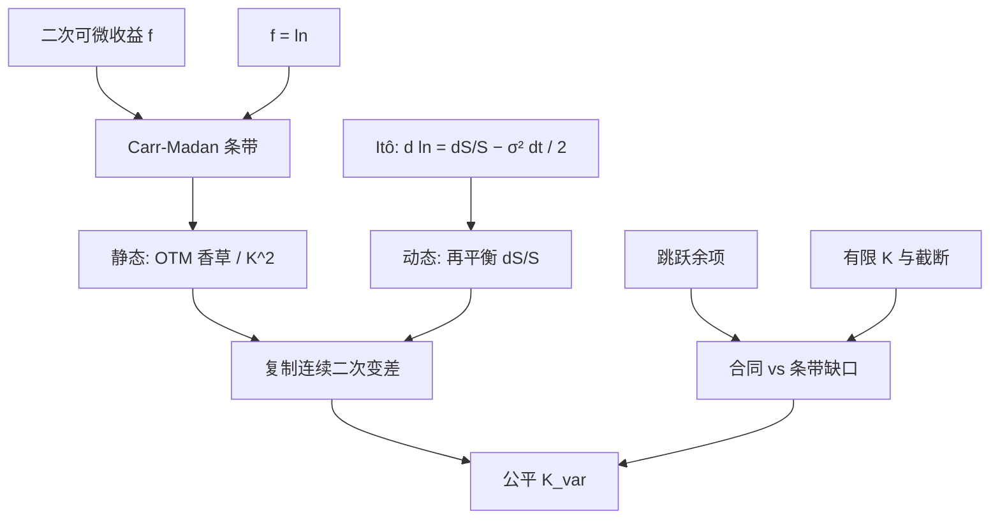

# 方差互换复制

    
任意两次可微的欧式收益可由债券、远期与虚值香草条带静态合成；取对数收益，再与 Itô 的二次变差项配对，已实现方差的公平执行价就不依赖波动率模型。

    <footer>—— Carr and Madan, Towards a Theory of Volatility Trading, 1998；对数合约见 Neuberger, Journal of Portfolio Management, 1994；交易员算法见 Demeterfi, Derman, Kamal and Zou, 1999</footer>

[方差互换与 VIX](/quant/variance-swap-vix) 给出产品与指数的全景：[隐含 vs 已实现](/quant/iv-vs-rv) 对齐两个测度；[波动率风险溢价](/quant/variance-risk-premium) 解释二者之差。本篇只把复制恒等式写清楚：Peter Carr 与 Dilip Madan 1998 年关于波动率交易的理论，如何把任意欧式收益拆成条带；Anthony Neuberger 的对数合约为何正好对上二次变差；以及 Kresimir Demeterfi、Emanuel Derman、Michael Kamal 与 Joseph Zou 如何把连续积分收成有限执行价的权重。跳跃、离散采样与有限翼把恒等式变成近似，出价来自这些缺口，而不是来自 Heston 参数。不重复 VIX 官方离散和的逐步规则，也不把期货凸性展开成定价篇。

## 问题

方差互换到期支付与 $\frac1T\sum r_i^2$ 或连续 $\frac1T\int\sigma_t^2\mathrm{d}t$ 成正比的金额，减去事先约定的方差执行价 $K_{\mathrm{var}}$。若公平 $K_{\mathrm{var}}$ 依赖某个随机波动模型，做市就要承担模型风险。连续路径下 Itô 给出

$$
\mathrm{d}\ln S=\frac{\mathrm{d}S}{S}-\frac12\sigma^2\mathrm{d}t,
$$

积分后 $\int\sigma^2\mathrm{d}t=-2\ln(S_T/S_0)+2\int\mathrm{d}S/S$。右端第一项是对数合约，第二项是期货的动态再平衡（Delta 对冲）。于是公平方差变成对数合约的价格，问题化为：对数合约能否用可交易香草静态复制。Carr–Madan 的答案是肯定的，只要执行价连续、欧式、函数二次可微。市场给的是有限 $K_i$，且路径有跳，复制成为带已知误差结构的算法，而不是恒等。

### Carr–Madan 条带：任意欧式收益

对 $f\in C^2$，选定锚点 $F$（通常取远期），

$$
f(S_T)=f(F)+f'(F)(S_T-F)+\int_0^F f''(K)(K-S_T)^+\,\mathrm{d}K+\int_F^\infty f''(K)(S_T-K)^+\,\mathrm{d}K.
$$

这是带余项的 Taylor 公式在正半轴上的积分形式。取 $f(x)=\ln x$，则 $f''(x)=-1/x^2$，对数合约等于常数加远期，减去虚值看跌与看涨按 $1/K^2$ 的积分。与 Itô 配对后，公平方差执行价（零利率、连续、无跳）为

$$
K_{\mathrm{var}}=\frac{2}{T}e^{rT}\Biggl(\int_0^F\frac{P(K)}{K^2}\,\mathrm{d}K+\int_F^\infty\frac{C(K)}{K^2}\,\mathrm{d}K\Biggr)
$$

的标准形式（有利率、分红时改锚点与折现）。权重 $1/K^2$ 使低执行价看跌贡献大：偏斜越陡，公平方差越高于 ATM 隐含方差的平方。这不是模型，是几何。

合同结算的是方差，报价却常写成波动率点 $\sqrt{K_{\mathrm{var}}}$。复制公式给出的是 $K_{\mathrm{var}}$。把点当作结算对象，会把 Jensen 项错当成复制误差。

## 方法

**连续理想。** 持有条带（OTM 看跌低于 $F$、OTM 看涨高于 $F$），权重 $\Delta K/K^2$ 在连续极限下成为积分；同时对标的做 $\mathrm{d}S/S$ 的再平衡，使对数的线性项被对冲掉。静态腿锁定 $f(S_T)$，动态腿锁定 $\int\mathrm{d}S/S$。二者一起复制二次变差。Neuberger（1994）强调对数合约作为波动交易的标的；Carr–Madan 把「为何香草足够」写进一般 $f$。

**Demeterfi 等的离散算法。** 有限执行价 $\{K_i\}$，相邻间距 $\Delta K_i$。每个虚值期权的权重正比于 $\Delta K_i/K_i^2$（梯形或中点规则）。平值附近用看涨或看跌之一，避免双边重复。另加一项 $(F/K_0-1)^2$ 的修正，补偿最接近远期的执行价与 $F$ 的缺口——CBOE VIX 公式里也能见到同类项。翼部截断使积分偏低；Jiang–Tian 讨论截断偏差：两端不够远时无模型方差被低估，做市若按截断条带出价，等于少收了左翼保险费。

**对冲操作。** 条带随现货移动要换月、换执行价，以保持对 $k=\ln(K/F)$ 的覆盖。Delta 来自动态腿，也来自条带本身的现货暴露；二者不要重复对冲。离散再平衡产生 Gamma 误差，形状与卖出香草加 Delta 对冲同类，但权重更接近 $1/K^2$ 而不是单一执行价的 $\Gamma(S)$。这是方差互换相对「卖跨式」更干净的原因，也是翼部流动性成为瓶颈的原因。

### 跳跃：恒等式的余项

路径有跳跃 $\Delta S$ 时，二次变差包含 $(\Delta S/S)^2$，对数增量是 $\ln(1+x)$，$x=\Delta S/S$。差项

$$
x^2-2\bigl(e^{x}-1-x\bigr)
$$

（符号约定随「谁付实现方差」而写）在 $x\neq 0$ 时不为零，且对大负跳尤其显著。复制组合跟踪的是对数，合同结算的是平方收益和：崩盘日方差互换多方相对条带复制多收一笔跳误差。Broadie–Jain 以及 Carr–Wu 把这一缺口定量化：指数方差互换的公平值在有跳时不再等于条带，做市必须加跳溢价，或改用带跳的模型只为给缺口定价，而不是为了给扩散部分定价——扩散部分仍由条带给出。离散采样（日收益而非连续二次变差）是另一项已知偏差，合同必须写清观测频率与是否含隔夜。

## 机制

$f''(K)$ 是把支付在执行价上「拆开」的密度：对数的二阶导是 $-1/K^2$，故每张执行价为 $K$ 的香草贡献一份与 $1/K^2$ 成比的 Arrow 质量。这与 Breeden–Litzenberger 把 $\partial_{KK}C$ 读成密度是同一数学的不同用法：这里用已知的 $f''$ 去合成 $f$，那里用市场的 $C$ 去读密度。无模型并不神秘——它只说：在扩散族里，二次变差的期望被欧式表唯一决定。局部波动、Heston、Bergomi 只要拟合同一张欧式表，给出的公平 $K_{\mathrm{var}}$ 在无跳极限下相同；它们的差别出现在路径产品与跳缺口上。

VIX 是这一复制的公开、离散、固定期限版本，再开方。期货定价要用 $\mathbb{E}[\sqrt{\mathrm{VS}}]$，多一层凹性，见 [VIX 期货](/quant/vix-futures)。做波动率套利的人若只比较 ATM 隐含与已实现，等于丢掉了 $1/K^2$ 加权的翼；公平比较对象是条带给出的 $K_{\mathrm{var}}$ 与合同规定的已实现方差。

### 单名、股息与借券

指数复制相对干净：欧式上市、借券摩擦小。单名股票常有美式、离散股利、借券费进入远期 $F$。分红假设错误会把整条偏斜扭曲，条带积分跟着错。停牌与涨跌停截断已实现方差的路径，合同如何处理必须事先写进确认书，否则复制在事件日失效。单名方差互换流动性远差于指数，翼部缺失使截断偏差成为一等项，不能把 SPX 的 VIX 精度预期搬过去。

复制是静态加 Delta，不是无风险套利。你仍然暴露于跳余项、离散对冲、融资与期权买卖价差。模型无关指的是公平 $K_{\mathrm{var}}$ 的扩散部分，不是 PnL 的方差为零。

## 边界与工程取舍

欧式、连续 $K$、连续交易、纯扩散或有限活动跳的可积条件，是恒等式的假设。美式提前行权破坏「持有到期」的 $f(S_T)$。利率随机时，对数复制要在远期测度重写，股票公式不能直接贴到债券期权。相关交易所报价不同步会造成条带瞬时套利幻觉。

Carr–Madan（1998）是理论骨架，收入波动率交易文集，不是 1999 年 FFT 定价那篇。Neuberger（1994）是对数合约。Demeterfi–Derman–Kamal–Zou（1999）是高盛说明与随后的 *Journal of Derivatives* 文本，把权重写成交易员可执行的表。Britten-Jones–Neuberger（2000）在金融学里把无模型隐含方差写严谨。引用「方差互换复制」应指向这一组，而不是 Dupire 1994：Dupire 抽出的是局部方差函数，复制抽出的是积分方差的价格。

左翼缺档时，不要用无约束外推把条带「补全」再当无模型。外推是假设，应单独做敏感性：新增一个更低的 $K$ 使 $K_{\mathrm{var}}$ 动多少，就是翼部模型风险。

波动率互换结算的是 $\sigma$ 而非 $\sigma^2$，复制不再是对数条带单独能完成，需要波动率的凸性（或相关）调整。不要把方差互换的权重直接用于波动率互换。

## 小结

- Carr–Madan 把欧式收益写成条带；对数的 $f''=-1/K^2$ 加上 Itô，给出扩散下公平方差执行价。
- 离散实现用 $\Delta K/K^2$ 权重与远期缺口修正；截断使无模型方差偏低。
- 跳跃留下对数与平方收益的余项，条带不再等于合同，构成出价。
- 无模型指扩散部分由欧式表唯一决定，与 Heston 或 Dupire 的参数无关。
- 单名还叠加美式、股利与借券；指数 VIX 是同一复制的公开离散版。
- 出处：Carr and Madan, 1998；Neuberger, *JPM*, 1994；Demeterfi, Derman, Kamal and Zou, 1999；对照 Britten-Jones and Neuberger, *JF*, 2000。
