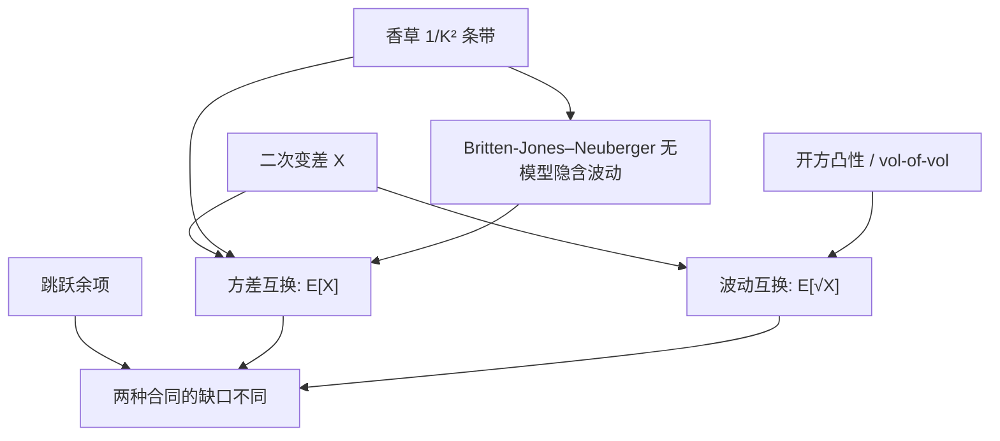

# 方差互换 vs 波动互换

    
方差互换复制的是二次变差的期望，公平执行价由对数合约的香草条带给出；波动互换复制的是二次变差平方根的期望，多一层凹性，因而一般不能用同一条带模型无关地钉住。

    <footer>—— 对数合约与方差见 Neuberger, 1994 与 Carr–Madan, 1998；模型无关波动见 Britten-Jones and Neuberger, Journal of Finance, 2000；凸性与波动互换见后续 Carr–Lee 等</footer>

[方差互换复制](/quant/var-swap-replication) 把公平 $K_{\mathrm{var}}=\mathbb{E}^{\mathbb{Q}}[\mathrm{QV}]$ 写成虚值香草按 $1/K^2$ 的积分。[方差互换与 VIX](/quant/variance-swap-vix) 把同一对象做成产品与指数。本篇对齐的是另一份合同：波动互换（volatility swap）支付已实现波动 $\sqrt{\mathrm{QV}}$（按合同年化），公平执行价是 $K_{\mathrm{vol}}=\mathbb{E}^{\mathbb{Q}}[\sqrt{\mathrm{QV}}]$。二者常被用「波动率点」混着报价，Jensen 缺口于是被算进 alpha。不重复条带权重的逐步推导，也不把 VIX 期货的开方凸性再展开成定价篇——那里的标的是未来隐含方差的平方根，这里的标的是路径已实现波动。

## 问题

设 $X=\mathrm{QV}_{0,T}$。方差互换的浮动腿是 $X$，固定腿是 $K_{\mathrm{var}}$；波动互换的浮动腿是 $\sqrt{X}$，固定腿是 $K_{\mathrm{vol}}$。凹函数开方给出

$$
K_{\mathrm{vol}}=\mathbb{E}[\sqrt{X}]\lt \sqrt{\mathbb{E}[X]}=\sqrt{K_{\mathrm{var}}},
$$

等号仅在 $X$ 几乎必然为常数时成立。vol-of-vol 越大、期限越长、跳跃越肥，缺口越大。交易员把方差互换执行价报成「波动率点」$\sqrt{K_{\mathrm{var}}}$，把波动互换报成 $K_{\mathrm{vol}}$，两个数字看起来像同一单位，差的正是这笔凸性。问题是：何时必须分开定价、波动互换有没有模型无关复制、以及用方差互换去对冲波动互换会留下什么希腊字母。

Britten-Jones 与 Neuberger（2000）证明：在扩散、无跳的前提下，从欧式价格可以读出整个风险中性二次变差的分布信息中与「模型无关隐含波动」对应的那一块——其平方对应方差条带。波动互换要的是 $\mathbb{E}[\sqrt{X}]$，还需要 $X$ 的更高阶或整条分布，欧式香草一般不够，除非再假设动态或引入方差上的期权。

### 报价点、结算方差、合同波动

合同必须写清：结算的是 $\sum r_i^2$ 还是 $\sqrt{\sum r_i^2}$，观测频率，是否含隔夜，年化因子是 $252$ 还是 $365$。把 VIX 当波动互换的代理更错一层：VIX 是隐含方差开方，不是已实现波动的互换。用 ATM 隐含波动减随后已实现波动，既不是方差互换 PnL，也不是波动互换 PnL，见 [隐含 vs 已实现](/quant/iv-vs-rv)。

$\sqrt{K_{\mathrm{var}}}$ 是方差互换的「波动率点报价」，不是波动互换的公平执行价。把二者当成同一个数去对账，凸性会被记成交易员的技能或模型误差。

## 方法

**方差腿。** 连续无跳时，$K_{\mathrm{var}}$ 由对数合约条带给出，模型无关。有跳时复制有已知余项，做市加跳溢价，见复制篇。

**波动腿。** 无模型的精确静态复制一般不存在。实务三条路。（1）用方差互换加凸性对冲：持有方差互换的名义对 $K_{\mathrm{vol}}$ 做一阶匹配，再用方差期权、VIX 期权或香草 Volga 去近似对冲 $X\mapsto\sqrt{X}$ 的二阶。凸性调整的领头项是

$$
K_{\mathrm{vol}}\approx\sqrt{K_{\mathrm{var}}}\Bigl(1-\frac{\mathrm{Var}(X)}{8K_{\mathrm{var}}^2}\Bigr),
$$

$\mathrm{Var}(X)$ 来自模型（Heston 矩、Bergomi 曲线的 vol-of-vol、或历史）。（2）Carr–Lee 一类：在相关为零或特定动态下，用香草组合逼近已实现波动的支付。（3）直接做 OTC 波动互换，内部用随机波动模拟 $\mathbb{E}[\sqrt{X}]$，外部用方差互换把线性暴露对冲掉，留下纯凸性账。

校准纪律：若账面同时有方差与波动互换，应用**同一** $\xi_0$ 与同一 vol-of-vol 给两者定价，差别只来自开方。用 Heston 给波动互换、用条带给方差互换，基差里会混进模型错误。粗糙核抬高短端 $\mathrm{Var}(X)$，同样的 $K_{\mathrm{var}}$ 下 $K_{\mathrm{vol}}$ 掉得更多，见 [rBergomi](/quant/rough-bergomi)。

### 复制误差与跳跃的不对称

跳跃对两种合同的打击不同。方差互换的跳余项来自 $x^2$ 对 $2(e^{x}-1-x)$ 的缺口，大负跳时合同多方相对条带多收。波动互换的浮动腿是 $\sqrt{\sum x_i^2}$，单次大跳贡献一次平方再开方，不像方差那样按平方累加后由固定腿全部吸收。用「跳溢价」同时给两种合同加价，权重应对不上。离散采样（日收益而非连续二次变差）同样以不同方式进入 $\sqrt{\cdot}$ 与线性。

## 机制

无模型方差来自 Itô：$\mathrm{d}\ln S=\mathrm{d}S/S-\frac12\sigma^2\mathrm{d}t$，二次变差被对数与 Delta 对冲锁住。开方没有对应的 Itô 对象可以静态复制——$\sqrt{\int\sigma^2}$ 不是某函数 $f(S_T)$。Britten-Jones–Neuberger 的贡献是：在扩散族里，欧式面决定了隐含的二次变差期望（及一条与之相容的瞬时方差过程的积分），因而「模型无关隐含波动」应定义为 $\sqrt{K_{\mathrm{var}}}$，而不是 ATM Black 波动。它仍然是方差对象的平方根，不是 $\mathbb{E}[\sqrt{X}]$。

凸性的经济含义：卖出波动互换、买入按 $\sqrt{K_{\mathrm{var}}}$ 标定的方差互换，近似做多 $X$ 的分散度。危机里 $X$ 的不确定性上升，这笔凸性值钱。它与 [波动率风险溢价](/quant/variance-risk-premium) 相关但不是同一笔：VRP 是 $\mathbb{E}^{\mathbb{Q}}[X]-\mathbb{E}^{\mathbb{P}}[X]$，凸性是同一测度下 $\sqrt{\mathbb{E}[X]}-\mathbb{E}[\sqrt{X}]$。归因必须分开。

### 与 VIX 期货凸性的差别

VIX 期货是 $\mathbb{E}[\sqrt{\mathrm{VS}_{T,T+\tau}}]$，里面的 $\mathrm{VS}$ 是**未来**三十天隐含方差，不是到 $T$ 的已实现。波动互换是 $\mathbb{E}[\sqrt{\mathrm{QV}_{0,T}}]$，路径从今天积到到期。对冲工具不同：前者用未来条带与 VIX 期权，后者用方差互换加路径。用 VIX 日历去代理波动互换，期限与开方对象都错。Bergomi 曲线对两者都自然，但积分窗口不同。

Heston 可以同时给出 $K_{\mathrm{var}}$ 与 $K_{\mathrm{vol}}$ 的矩近似，但 $K_{\mathrm{var}}$ 应以市场条带为准，只让模型提供 $\mathrm{Var}(X)$。用模型重定价方差互换再开方，等于丢掉无模型锚。

## 边界与工程取舍

翼部截断使 $K_{\mathrm{var}}$ 偏低，从而 $\sqrt{K_{\mathrm{var}}}$ 偏低；凸性调整若再用被截断的条带估 $\mathrm{Var}(X)$，误差同向叠加。有限执行价下「无模型」已是算法。利率、分红、离散采样写进合同附录，两边必须同一套。外汇波动互换常按已实现波动结算、名义对 Delta 风险，股权方差互换更标准；跨资产搬公式要注意年化与报价惯例。

不要把 ATM IV、VIX、$\sqrt{K_{\mathrm{var}}}$、$K_{\mathrm{vol}}$ 四个数画在一张图上当同一序列。不要用 Heston 特征函数给波动互换「闭式」却不声明那是 $\mathbb{E}[\sqrt{X}]$ 的数值积分。粗糙波动下 $X$ 的短尺度更噪，凸性更大，用半鞅矩公式会低估缺口。

波动互换不是「更直观所以更干净」的方差互换。它对交易员直观，对复制更脏。干净的无模型对象是方差；波动是带凸性的衍生。

Bakshi–Kapadia 的 Delta 对冲收益研究的是香草，不是互换合同。香草 Gamma 剖面不是 $1/K^2$，其期望 PnL 接近加权已实现方差，更像方差互换而不是波动互换。

## 小结

- 方差互换钉 $\mathbb{E}[\mathrm{QV}]$，条带复制在扩散下模型无关；波动互换钉 $\mathbb{E}[\sqrt{\mathrm{QV}}]$，多一层开方凸性。
- $\sqrt{K_{\mathrm{var}}}$ 是报价习惯，不是 $K_{\mathrm{vol}}$；缺口随 vol-of-vol、期限与跳增大。
- Britten-Jones–Neuberger 的无模型隐含波动对应方差条带的平方根，仍不是波动互换。
- 波动互换的对冲是方差互换加凸性工具；跳跃余项对两种合同不对称。
- 与 VIX 期货凸性对象不同：一个是已实现路径，一个是未来隐含条带。
- 出处：Britten-Jones and Neuberger, *Journal of Finance*, 2000；Neuberger, 1994；Carr and Madan, 1998；凸性与波动互换见 Carr–Lee；曲线凸性对照 Bergomi / rBergomi。
