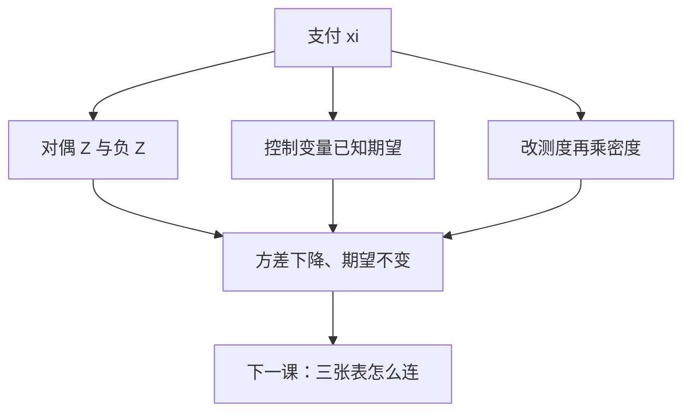

# 方差缩减

蒙特卡洛的误差是 $\sqrt{\mathrm{Var}(\xi)/N}$。对偶变量、控制变量与重要性采样改的是 $\xi$ 的方差，不是再多画几条无结构的路径。

<footer>—— 据 Glasserman, Monte Carlo Methods in Financial Engineering, 2003, 第 4–5 章整理</footer>

上一课[蒙特卡洛路径](/quant/mc-paths)给出样本均值与标准误。缺口是：虚值期权、稀有触碰、长到期会使 $\mathrm{Var}(\xi)$ 大到 $N$ 无法补。本课只给三条标准缩方差接口，作为定价数学课序的收束。下一课离开随机分析，进入[三张表怎么连](/quant/three-statements-link)：公司报表与基本面，不再加期权引擎。

## 问题

独立再抽样把误差按 $1/\sqrt{N}$ 降，成本线性。缺口是构造新的 $\tilde\xi$，使 $\mathbb E[\tilde\xi]=\mathbb E[\xi]$（或已知偏差），且 $\mathrm{Var}(\tilde\xi)<\mathrm{Var}(\xi)$。没有无偏性，缩方差会偷偷变成改价格。本课不重写 SDE 离散，只在已经能模拟 $\xi$ 之后改估计量。

三条经典手段对应三种结构：对称（对偶）、相关的已知期望（控制）、改抽样测度再加权（重要性）。它们可以叠加，但每加一层都要核验期望不变。

### 方差缩减不是「把异常路径删掉」

截尾、winsorize 会改期望，估的不再是原合约。稀有事件要用重要性采样把质量移到支付发生的区域，同时乘 RN 权重，而不是扔掉零支付样本装作方差变小。

控制变量常取同一路径上的欧式 Black 闭式：$\xi$ 与 $C_{\mathrm{BS}}$ 高度相关，而 $\mathbb E[C_{\mathrm{BS}}]$ 已知。相关来自共同的 $W$，不是来自回归故事。

## 方法

对偶：用 $Z$ 与 $-Z$ 各走一条 GBM，$\tilde\xi=\tfrac12(\xi(Z)+\xi(-Z))$。支付对 $Z$ 单调时负相关，方差下降。控制：$\tilde\xi=\xi-\beta(C-\mathbb E[C])$，最优 $\beta=\mathrm{Cov}(\xi,C)/\mathrm{Var}(C)$，样本内估计 $\beta$ 即可。重要性：在 $\tilde Q$ 下抽样，令 $\tilde\xi=\xi\,\mathrm d Q/\mathrm d\tilde Q$；$\tilde Q$ 把漂移推向实值区域。Girsanov 密度正是这个权重——RN 课与换测度课在模拟里落地。

美式的缩方差更窄：对偶仍可用；控制变量要对每个停时策略保持无偏，设计更硬。本课只要求：任何缩方差不破坏最优停定义里的期望。

## 机制

对偶利用高斯的中心对称：奇函数部分抵消。看涨对 $Z$ 近似单调，效果好；数字、障碍在边界附近对称被破坏，效果不确定。控制变量是 $L^2$ 投影：把 $\xi$ 里能被 $C$ 解释的部分减掉，残差正交于 $C$，方差即残差能量——与[条件期望作为投影](/quant/conditional-expectation-proj)同一几何。重要性采样把 $Q$ 换成对支付更友好的 $\tilde Q$，权重的二次矩若爆炸，方差反而变大；指数倾斜要有节制。

随机数共用：控制变量与对冲差分一样，必须让 $\xi$ 与 $C$ 走同一条 $W$，否则协方差估不准，$\beta$ 失效。

## 边界

本课不把分层、拉丁超立方、拟蒙特卡洛写全，它们改收敛速率，对象仍是同一 $\xi$。不讨论机器学习控制变量的最新变体。跳过程上的重要性采样要改泊松强度，只留接口。后课默认：报 MC 价格时允许也应当报缩方差后的标准误；本课程的随机分析到此结束。下一课[三张表怎么连](/quant/three-statements-link)把对象换成报表勾稽，定价引擎不再使用。

## 小结

- 误差由 $\mathrm{Var}(\xi)$ 决定；缩方差改估计量，不改合约。
- 对偶用 $\pm Z$；控制变量减已知期望的相关项；重要性采样乘 RN 权重。
- 删异常路径会改期望，不是缩方差。
- 随机分析课序在此收束；下一课进入财务报表。
- 出处：Glasserman, Monte Carlo Methods in Financial Engineering, 第 4–5 章。
