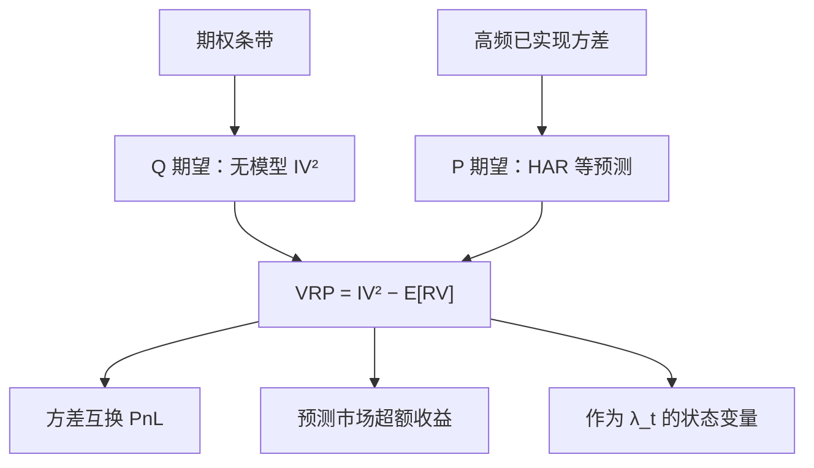

# 波动率风险溢价

    
期权隐含的方差是风险中性期望，已实现方差是物理测度下走完的二次变差；二者之差不是预测误差的同义词，而是方差作为风险因子被定价的补偿。

    <footer>—— Carr–Wu 对方差风险溢价的估计；Bollerslev, Tauchen & Zhou, Expected Stock Returns and Variance Risk Premia, Review of Financial Studies, 2009</footer>

隐含波动通常高于随后实现的波动。把这个缺口叫「期权太贵」只说了一半：卖出方差的人在市场暴跌、波动跳跃时赔钱，要求事先补偿。波动率风险溢价（variance risk premium, VRP）把缺口写成风险价格：$\mathrm{VRP}_t=\mathbb{E}^{\mathbb{Q}}_t[\mathrm{QV}_{t,t+h}]-\mathbb{E}^{\mathbb{P}}_t[\mathrm{QV}_{t,t+h}]$。无模型隐含方差来自期权条带，与[方差互换和 VIX](/quant/variance-swap-vix) 同一套复制；物理期望来自已实现方差的预测。本篇写如何对齐这两个期望、Bollerslev–Tauchen–Zhou 用 VRP 预测超额收益，以及把 ATM 隐含波动减历史波动当成 VRP 会错在哪里。

## 问题

[隐含与已实现波动](/quant/iv-vs-rv) 对象不同。IV 在 $\mathbb{Q}$ 下，含对波动路径、跳跃与尾部的风险调整；RV 在 $\mathbb{P}$ 下，是已经发生的二次变差。即使投资者对未来 RV 的预测完全正确，只要厌恶方差上升的状态，$\mathbb{Q}$ 期望仍可高于 $\mathbb{P}$ 期望。于是「VIX 高于随后 RV」可以同时是风险溢价和预测偏差，不能只用事后均值差去做择时回测还声称测到了溢价。

定义还要统一二次型。方差互换与 VIX 复制的是方差（$\sigma^2$），不是波动率（$\sigma$）。用波动率点相减会引入 Jensen 项：$\mathbb{E}[\sigma]\neq\sqrt{\mathbb{E}[\sigma^2]}$。Carr 与 Wu 在指数期权上估计持有方差多头的溢价为负——买方付费买保险。Bollerslev、Tauchen 与 Zhou 把隐含方差减预期已实现方差当作时变溢价的代理，发现它对市场超额收益有预测力：VRP 高（隐含远高于预期实现）时，随后股票收益更高。问题是把代理做成与期限、测度对齐的序列，而不是把任意 IV−HV 叫 VRP。

### 无模型隐含方差，不是 ATM 的 Black–Scholes

ATM 隐含波动丢掉微笑的翼。方差互换的权重是 $1/K^2$，虚值看跌对隐含方差的贡献大于它对「平值波动」叙事的贡献。Britten-Jones–Neuberger 与 Jiang–Tian 的无模型隐含方差、CBOE VIX 的离散条带，才是 $\mathbb{E}^{\mathbb{Q}}[\mathrm{QV}]$ 的可操作对象。跳跃下，对数合约期望与二次变差期望不再相等，条带测的是前者；VRP 的标签仍沿用，但经济解释要承认跳风险被捆进来。

$$
\mathrm{IV}_t^2=\mathbb{E}^{\mathbb{Q}}_t\bigl[\mathrm{QV}_{t,t+h}\bigr], \qquad
\mathrm{VRP}_t=\mathrm{IV}_t^2-\mathbb{E}^{\mathbb{P}}_t\bigl[\mathrm{RV}_{t,t+h}\bigr].
$$

$\mathbb{E}^{\mathbb{P}}[\mathrm{RV}]$ 必须是条件期望：HAR、已实现 GARCH、或隐含–实现联立模型，只用过去一个月的历史方差当预测，会把已知的均值回复算进「溢价」。

符号惯例不统一。有人定义 VRP 为 $\mathbb{P}$ 减 $\mathbb{Q}$（卖方收到的溢价为正），有人相反。Bollerslev–Tauchen–Zhou 用隐含减预期实现，再讨论它对股票收益的预测。比较论文或策略前先对符号，不要把「VRP 为负」在两种定义之间来回翻译。

## 方法

隐含腿。用与预测期限匹配的期权条带：30 天对 VIX，或合成 1 个月方差互换公平费率。离散执行价、截断翼、买卖价差会造成 IV² 偏低或偏高，须同一套过滤规则贯穿样本。不要把 VIX 指数与随后 30 天的日收益标准差直接比：VIX 是方差开方再年化，RV 的年化约定、是否含隔夜、是否去噪声都要声明。

物理腿。高频 RV 估已实现二次变差，再用 HAR-RV 一类模型把 $t$ 时信息映射到未来 $h$ 天的期望。样本内拟合过好会把 VRP 压得过小、过平；样本外预测才是 $\mathbb{E}^{\mathbb{P}}$ 的诚实版本。得到 VRP 序列后，两条用途分开：一是作为可交易信号（卖方差、或按 VRP 调节股票暴露）；二是作为定价状态，进入市场溢价的预测回归 $r_{m,t+1}=a+b\,\mathrm{VRP}_t+e_{t+1}$。BTZ 强调第二条：VRP 捕捉短期风险价格，比股息价格比更「快」。

### 从方差互换到股票溢价

方差互换多头的平均 PnL 接近 $-$VRP（在卖方溢价为正的符号下）。这是方差因子自己的风险价格。BTZ 的主张更进一步：同一溢价还预测股票超额收益，因为高边际效用状态与高方差状态重合——方差风险与市场风险在坏状态下捆绑。这把 VRP 写成[风险溢价时变](/quant/time-varying-rp) 的一个可观测代理，而不只是期权市场的内部核算。检验上应同时看：方差互换的均值是否显著；VRP 对 $r_m$ 的 $b$ 是否样本外仍在；以及控制 VIX 水平、信用利差之后 $b$ 是否只是在代理「恐慌」。

## 机制

为什么 $\mathbb{Q}$ 方差高于 $\mathbb{P}$ 方差？均衡：递归效用或习惯下，波动上升往往伴随消费与财富变差，投资者为对冲方差愿意付费。中介：做市商与经销商在波动冲击下资本紧缩，卖出期权的供给下降，隐含方差被顶高。跳跃：崩盘保险把左尾写进条带，$1/K^2$ 权重让虚值看跌主导隐含方差，VRP 里有一块其实是跳风险溢价。三条通道在欧式条带上无法完全拆开；要用方差互换与偏度互换、或已实现跳检验，才能把连续方差与跳分开，见[偏度风险溢价](/quant/skew-risk-premium)。

时变方面，VRP 在压力期放大：IV 跳得比条件 RV 预测更快，因为风险价格本身在跳。这使 VRP 作为状态变量比慢的估值比率更适合短期条件化，但也更像一个「恐慌指标」，样本外预测力会在平静期萎缩。

### 指数与个股、卖方与容量

指数方差溢价通常显著为负（对多方）；个股更杂，部分被特质波动与借券、做市摩擦主导。卖指数方差（或卖 VIX 期货升水）吃的是系统性保险费，回撤发生在最需要资本的时候，夏普的时间分布极不匀。容量受期权翼的流动性与保证金约束，不是股票因子那种年度重构。把 VRP 当成又一个 SMA 信号去叠加在股票动量上，会在 2008、2020 同时爆掉两条腿。

VIX 期货升水（contango）与 VRP 相关，但不是恒等。期货定价的是未来的 VIX，而 VIX 已是 30 天隐含方差的开方；期限结构还含方差的均值回复。用现货 VIX 减 RV 去做期货 roll 的归因，会留下基差。

## 边界与工程取舍

期限必须对齐：用 30 天 IV² 减未来 5 天 RV 的年化值，缺口里全是期限结构。日历：节假日、提前收盘改变 RV 的积分窗口。跳跃日：是否把跳计入 RV 会改变 VRP 的水平，须与复制公式的对象一致。跨国市场的期权翼更稀，无模型 IV 截断偏差更大，溢价会被低估。

不要用 ATM IV 减 20 日历史波动写成「VRP 策略」还引用 BTZ。不要把 VIX 当 $\mathbb{P}$ 预测：它是 $\mathbb{Q}$。也不要在五因子股票回归里塞进一条 VRP 当第七个可交易因子——VRP 是状态或是期权组合的收益，须先做成可交易腿再谈 α。A 股与港股的方差互换市场深度不同，用 VIX 当全球风险价格可以，用本地 50ETF 期权复制时要对齐人民币期限与涨跌停对 RV 的截断。

真实出处：Bollerslev, Tauchen & Zhou, *Expected Stock Returns and Variance Risk Premia*, Review of Financial Studies, 2009；Carr & Wu 对方差风险溢价的估计与方差互换文献。无模型隐含方差见 Britten-Jones & Neuberger；VIX 方法见 CBOE。禁止把 ATM 减 HV 标成 2009 年论文的定义。

## 小结

- VRP 是风险中性期望方差与物理条件期望已实现方差之差，度量方差因子的风险价格。
- 隐含腿用期权条带（VIX / 方差互换），物理腿用 RV 的条件预测，期限与年化必须对齐。
- 指数上多方通常付费；同一缺口可作为股票溢价的短期状态变量。
- 其中捆着跳风险与中介资本，不能等同于「期权定价错误」。
- 出处：Bollerslev, Tauchen & Zhou, Review of Financial Studies, 2009；Carr–Wu。
