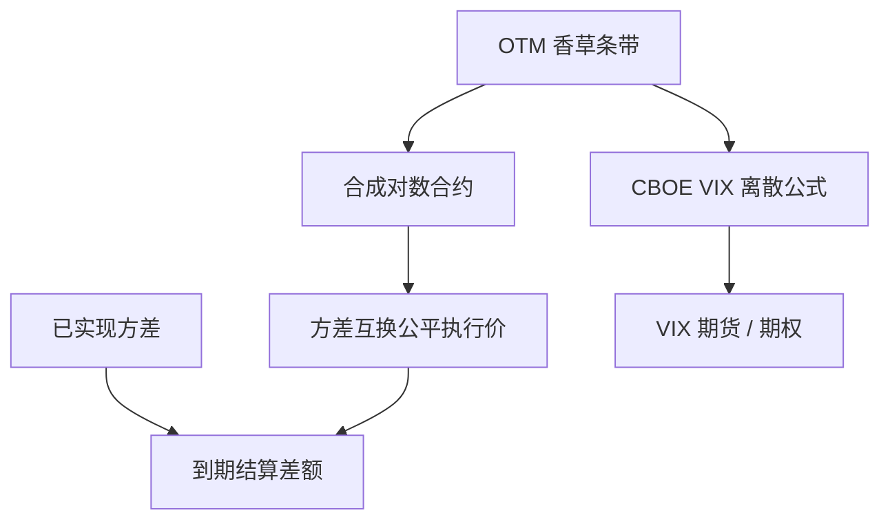

# 方差互换与 VIX

    
对数合约可由香草期权的连续条带复制；因此已实现方差的公平价格不依赖波动率模型，只依赖可观测的欧式价格。

    <footer>—— Carr and Madan, Towards a Theory of Volatility Trading, 1998；CBOE VIX 方法说明书</footer>

[上一课](/quant/sabr)用 $\alpha,\beta,\rho,\nu$ 标记单一到期的微笑，交付物是 Black/Bachelier 隐含波动的奇异摄动近似，便于插值，而不是特征函数。缺口是「交易波动率」若只停留在切片插值，标的仍混着 Delta 与执行价选择：方差互换把已实现方差做成可复制合同，VIX 把 30 天隐含方差做成可观测指数。Carr–Madan 与 Demeterfi 等人说明对数合约条带能去掉模型依赖的公平方差执行价。本课写复制与指数规则，不重写 SABR 的 $\beta$–$\rho$ 辨识。

## 问题

SABR 把单一到期的微笑写成可插值的 $\sigma_{\mathrm{imp}}$。交易「波动率」若只买卖 ATM 期权，希腊字母会混进 Delta、Gamma、Theta，执行价选择还暗含模型。若能直接交换已实现方差，标的就变成二次变差，对冲应落在对数合约上：Itô 公式把 $(\mathrm{d}S/S)^2$ 与 $\mathrm{d}\ln S$ 连起来，剩余的是边界项与跳跃。连续路径下，方差的风险中性期望等于对数合约的价格，而 Carr–Madan 的跨执行价积分把任意两次可微收益写成香草条带。于是问题变成：市场是否提供足够密的看涨看跌，以及离散执行价、跳跃、股息、利率如何修正理想公式。

VIX 要解决的是另一侧的可观测性：把「30 天隐含方差」做成实时指数，供期货与期权挂靠。它必须用有限的上市执行价、两个到期、以及公开的报价规则，去逼近连续条带与连续到期。指数是复制组合的价格（再开方、年化），不是历史已实现波动，也不是 Heston 或 SABR 的参数。

### 对数合约与二次变差

对扩散 $\mathrm{d}S=\mu S\mathrm{d}t+\sigma S\mathrm{d}W$，Itô 给出

$$
\mathrm{d}\ln S = \frac{\mathrm{d}S}{S} - \frac12 \sigma^2\mathrm{d}t,
$$

积分并取期望，已实现方差 $\int_0^T\sigma_t^2\mathrm{d}t$ 的公平值由 $\mathbb{E}[\ln(S_T/F)]$ 与可交易的期货滚动决定。跳跃会留下与跳跃大小有关的额外项，复制不再完美，方差互换相对波动率互换（对 $\sigma$ 而不是 $\sigma^2$ 结算）的凸性也来自 Jensen。Carr–Madan 强调的是收益的静态复制：与路径无关的欧式收益，可用 $\int \mathrm{OTM}/K^2\,\mathrm{d}K$ 合成。

方差互换的执行价报价常写成「波动率点」：公平方差开方后再年化。合同结算的是方差，不是波动率；用波动率点只是习惯。把 VIX 期货当成「已实现波动的预测」而不看方差凸性，会算错期望。

## 方法

连续执行价下，公平方差执行价（适当年化）形如

$$
\frac{2}{T}\mathrm{e}^{rT}\left(\int_0^{F}\frac{P(K)}{K^2}\,\mathrm{d}K+\int_F^{\infty}\frac{C(K)}{K^2}\,\mathrm{d}K\right)
$$

的离散或带利率修正版本，其中 $P,C$ 为欧式看跌与看涨，$F$ 为远期。实盘用有限的 $K_i$，权重 $1/K^2$ 用梯形或 CBOE 的 $\Delta K/K^2$。OTM 一侧用看跌、另一侧用看涨，是为了用更宽的流动性，并在平值附近衔接。

CBOE VIX 对近月与次近月的 S&P 500 期权分别做上述离散和，得到两个方差，再线性插值到 30 天，最后开方乘 100。排除权价过低的执行价，选用中间价，并规定买卖价差与不可用报价的过滤。指数以「波动率点」显示，对应方差互换公平值的平方根，不是该方差互换本身的交易价格——交易的是 VIX 期货、期权与 OTC 方差互换，指数只是复制公式的公开计算。

### 从条带到 VIX 期货

方差互换 OTC 合约直接对已实现方差结算，对冲是持有对数条带并 Delta 对冲标的。VIX 期货是对未来某一时刻 VIX 指数的期货，而 VIX 指数本身已是期权条带；因此 VIX 期货的标的是「未来的 30 天香草条带」，不是现货指数的已实现方差。期限结构可以升水或贴水，反映方差的风险溢价与均值回复。用现货 VIX 去对冲 VIX 期货会留下基差：复制组合的成分期权与期货到期并不相同。

## 机制

$1/K^2$ 权重来自对数收益对执行价的二阶导。虚值看跌（低 $K$）权重大，故左翼流动性与跳风险对公平方差极敏感：缺了低执行价，VIX 会被低估。这与微笑管理一致——偏斜越陡，方差互换越贵，ATM 波动不能代表公平方差。Heston 里公平方差可由方差过程的期望直接积分，但那是模型内的数；市场方差互换价格应由条带给出，再用模型去解释风险溢价。

离散采样的已实现方差（日对数收益平方和）与连续二次变差有差别；合同会规定观测频率、开盘开盘还是收盘收盘、是否包含隔夜。复制论证对应连续路径与连续对冲；离散对冲误差与跳跃使 OTC 做市必须加价。VIX 用期权市场价格，已经把风险溢价含进指数：VIX 通常高于事后已实现波动，这是方差风险溢价的现象，不是计算 bug。

### 与隐含波动率曲面的关系

每个执行价的 Black 隐含波动进入的是期权价格，再经 $1/K^2$ 积分。因此 VIX 是微笑的积分变换，不是 ATM 点。SABR 或 Heston 校准若只拟合 ATM 与 25Delta，可能仍错方差互换，因为翼部积分权重大。反过来，方差互换是检查曲面无套利与翼部质量的诊断：条带积分若对新增远翼执行价极度敏感，说明外推不稳。

2003 年前的旧 VIX（常称 VXO）基于 S&P 100 与 Black 公式的隐含波动平均，与现行 VIX 不可混用。论文与时间序列若跨越修订，必须声明口径。

## 边界

复制假设欧式、连续 $K$、连续交易、有限跳跃或纯扩散。美式提前行权、离散股息、停牌、相关交易所的报价不同步，都会造成条带误差。CBOE 规则是指数定义，不是 OTC 合同条款；SPX 周期权与标准月期权的纳入规则会变，历史序列要按当时说明书复原。开方把方差变成波动率，Jensen 使「期望 VIX」不等于「期望已实现波动」。

方差互换对单名股票还有借券、股息与跳跃风险，流动性远差于指数。VIX 只锚定 S&P 500。Carr–Madan（1998）给出波动率交易与香草复制的理论骨架；CBOE 说明书给出指数的操作定义；二者一起解释「为什么可以用期权条带来谈 30 天方差」，而不要把 VIX 理解成 Heston 的 $v_0$ 或历史标准差。

把 VIX 当成「恐惧指数」只是叙事。数量上它是 30 天方差互换复制的平方根；叙事不能替代 $1/K^2$ 积分与期货基差。

## 小结

- 连续路径下，已实现方差的公平价格由对数合约给出；Carr–Madan 用香草条带静态复制对数收益。
- 权重 $1/K^2$ 使左翼看跌对公平方差极重要；ATM 隐含波动不是方差互换。
- CBOE VIX 是 SPX 期权离散条带插值到 30 天再开方，贴近方差互换而不是旧式 Black ATM。
- VIX 期货标的是未来的指数复制，与 OTC 方差互换、与已实现波动都有基差。
- 跳跃、离散对冲、有限执行价使复制不完美，构成出价。
- 出处：Carr and Madan, 1998；Demeterfi, Derman, Kamal, Zou, 1999；CBOE *VIX White Paper*；产品语境见 Hull。
