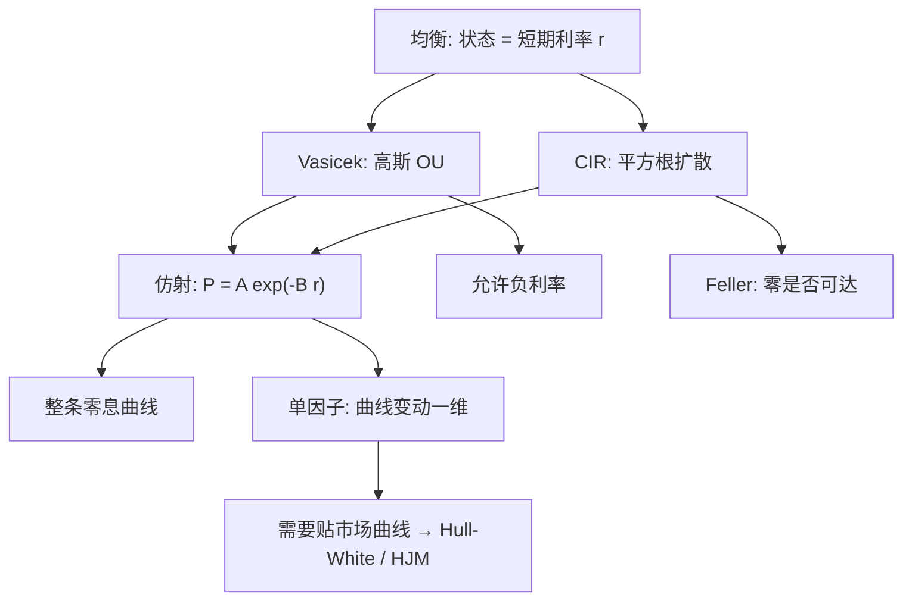

# Vasicek / CIR

短期利率若是均值回复的扩散，整条贴现曲线就是短期利率的仿射函数；高斯设定给出封闭解，平方根扩散则禁止利率穿过零。

<footer>—— Vasicek, An Equilibrium Characterization of the Term Structure, Journal of Financial Economics, 1977；Cox, Ingersoll & Ross, A Theory of the Term Structure of Interest Rates, Econometrica, 1985</footer>

单因子短期利率模型问的是：若今天的瞬时利率 $r_t$ 是唯一状态变量，整条零息曲线 $P(t,T)$ 能否被它写出来。Vasicek（1977）把 $r$ 写成高斯 Ornstein–Uhlenbeck，在均衡里推出债券价格对 $r$ 仿射。Cox、Ingersoll 与 Ross（1985）把扩散改成 $\sigma\sqrt{r}$，让利率停在正象限，并在一般均衡里给出同样仿射的贴现。二者都是**均衡模型**：漂移与波动由经济给出，不保证精确贴住今天的整条市场曲线——那是下一篇 [Hull-White](/quant/hull-white) 用时变漂移去补的。本篇只写 Vasicek 与 CIR 的状态方程、仿射解、Feller 条件，以及单因子对曲线形态的限制。

## 问题

债券定价需要一条从今天到每个到期日的贴现。若每条到期都单独做布朗运动，无套利会把漂移钉死，状态空间却无限维，见 [HJM](/quant/hjm)。短期利率路线走另一头：只让 $r_t$ 动，更长的利率由 $r$ 的条件分布生成。要让这条路可算，需要对 $r$ 的动态加以结构：均值回复，否则远期会爆炸；扩散别太野，否则零息债没有封闭解。

Vasicek 选高斯：利率可以变负，债券价格对 $r$ 线性指数，期权可用债券作为计价物写成类似 Black 的公式。CIR 选平方根：零是可达或不可达取决于 Feller 条件，分布是非中心卡方，同样仿射。问题不是「哪个更像真实利率」，而是「在单因子马尔可夫短期利率下，曲线的平行移动、斜率与曲率能被一个状态解释多少」，以及「负利率与零下界哪一个是你更不能接受的建模错误」。

### 均衡模型与曲线拟合不是同一句话

Vasicek 从代表性投资者与状态变量的均衡出发，风险的市场价格进入风险中性漂移，长期均值、回复速度、波动是常数。用这样的三个到四个参数去拟合几十个到期的市场报价，残差会系统性地落在曲线的某些区段上：单因子只能产生高度相关的平行型变动，无法独立地动 2s10s 斜率再动蝶式。把拟合残差解释成「模型错了」是对的；把残差再用时变参数逐日重估吃掉，模型就不再是 1977 年的均衡对象，而滑向校准机器。CIR 同理。需要精确贴住今日曲线时，应换 [Hull-White](/quant/hull-white) 或 [HJM](/quant/hjm)，不要给 Vasicek 的 $b$ 每天一个新值还称为均衡。

Vasicek 允许 $r\lt 0$。在 2010 年代负利率成为事实之前，这常被当成缺陷；之后又被当成优点。CIR 的零下界在负利率环境里反而成了错误约束。模型选择跟着制度走，不是跟着「利率必须为正」的哲学走。

## 方法

Vasicek 的风险中性（或已吸收风险溢价的）动态为

$$
dr_t = a(b-r_t)\,dt + \sigma\,dW_t,
$$

$a>0$ 为回复速度，$b$ 为长期均值，$\sigma$ 为常数扩散。$r_t$ 是高斯的，条件均值指数回复到 $b$，条件方差有上界 $\sigma^2/(2a)$。零息债 $P(t,T)=\mathbb{E}\big[\exp(-\int_t^T r_s ds)\big|\mathcal{F}_t\big]$ 对 $r_t$ 仿射：

$$
P(t,T)=A(\tau)\exp\big(-B(\tau)r_t\big),\qquad \tau=T-t,
$$

$$
B(\tau)=\frac{1-e^{-a\tau}}{a},\qquad
A(\tau)=\exp\Big(\big(b-\tfrac{\sigma^2}{2a^2}\big)\big(B(\tau)-\tau\big)-\tfrac{\sigma^2}{4a}B(\tau)^2\Big).
$$

即期 $R(t,T)=-\tau^{-1}\log P(t,T)$ 对 $r_t$ 线性，$B(\tau)/\tau$ 是久期权重。欧式债券期权在高斯下可写成折现的正态公式，Jamshidian 把同一技巧用到附息债。

CIR 把扩散改成水平依赖：

$$
dr_t = a(b-r_t)\,dt + \sigma\sqrt{r_t}\,dW_t.
$$

Feller 条件 $2ab\ge\sigma^2$ 时，零不可达，利率几乎必然为正。零息债仍是仿射，但

$$
B(\tau)=\frac{2(e^{\gamma\tau}-1)}{(a+\gamma)(e^{\gamma\tau}-1)+2\gamma},\qquad
\gamma=\sqrt{a^2+2\sigma^2},
$$

$A(\tau)$ 是 $\gamma,a,b,\sigma,\tau$ 的显式幂函数。转移密度是非中心卡方，便于伪极大似然；债券期权没有 Vasicek 那样的简单正态公式，通常用积分或树。

### 仿射结构才是可计算的原因

Vasicek 与 CIR 同属 Duffie–Kan 仿射类：漂移对 $r$ 仿射，扩散的平方对 $r$ 仿射，于是折现特征函数满足 Riccati 常微分方程，$A,B$ 不是猜出来的，是 Riccati 的解。多因子仿射（两个短期因子、加上通胀或信用强度）沿同一条路走。工程上若放弃仿射，单因子短期利率仍可用树或 PDE 定价，但校准与风险报告会失去「曲线 = $A,B$ 的函数」这一层可检查的结构。保留仿射，是为了让久期、凸性、对 $a,b,\sigma$ 的希腊值能从 $A,B$ 解析微分，而不是对每个到期单独做有限差分。

## 机制

均值回复阻止利率做带漂移的随机游走：远期曲线在长端被拉向由 $b$ 与凸性调整决定的水平，这是期限结构「不会无限变陡」的模型内机制。高斯凸性调整随 $\tau$ 增长，长端即期可以低于长期均值，这不是预期假说的失败，而是 Jensen 项。CIR 的扩散在 $r$ 低时变弱，低利率区域的波动被压住，高利率区域放大，这与经验上「利率高时波动也高」一致，也使分布右偏。

单因子意味着所有到期的瞬时冲击完全相关。曲线的变动只能是 $B(\tau)$ 形状的一维族：Vasicek 的 $B(\tau)$ 从 0 增到 $1/a$，短端动得多、长端被回复压住，看起来像「水平加一点斜率」，但没有独立的曲率因子。实证上第一主成分确是平行，第二、第三是斜率与蝶式；单因子只能近似第一主成分。要斜率独立运动，至少两个因子，或直接用 HJM / [LMM](/quant/lmm) 给不同到期各自的波动。

把 Vasicek 的 $\sigma$ 理解成「短端波动」、把 $a$ 理解成「曲线在多远开始变钝」，比把三个参数理解成「真实的自然利率与政策规则」更接近定价用途。均衡故事提供参数的符号约束，不提供逐日校准的许可证。

### 风险的市场价格藏在哪里

物理测度下 Vasicek 可以另有长期均值 $b^{\mathbb{P}}$，风险中性均值 $b$ 吸收了风险的市场价格 $\lambda$。CIR 的 $\lambda$ 常取与 $\sqrt{r}$ 成比例，以保持仿射。估计时若只用债券价格，你看到的是风险中性参数；若再用短期利率的时间序列，可以分开 $\mathbb{P}$ 与 $\mathbb{Q}$。只做定价、不做计量，应明确全部参数都在 $\mathbb{Q}$ 上，不要用历史短端波动去当 $\sigma$ 再抱怨模型卖不出市场的期权溢价。

## 边界与工程取舍

不要用 Vasicek 生成必须为正的模拟利率去给路径依赖产品定价，除非你接受截断或把负利率解释成便利收益。不要用 CIR 硬套负利率样本：平方根在零处退化，数值上会出现吸收，校准会把 $b$ 推向零附近的怪异区域。不要把单因子模型的校准残差当成交易信号：残差里混着第二因子、流动性与报价惯例。不要在贴现与预测混用同一套参数：$\mathbb{Q}$ 上的 $b$ 不是宏观的中性利率。

数值上，CIR 的欧拉离散会穿到负值，应用隐式或截断、或直接从非中心卡方抽样。Vasicek 的树在利率很负时折现因子大于 1，对某些路径依赖契约是真实的模型性质，不是 bug。多曲线与 OIS 贴现出现之后，单因子 $r$ 不再同时代表预测与贴现；要把预测曲线与贴现曲线拆开，单因子短端模型只适合教学、风险的一阶情景，或作为 [Hull-White](/quant/hull-white) 的常数参数特例。

CIR 的 Feller 条件在校准里经常被违反：拟合短端波动会把 $\sigma$ 抬大，$2ab\ge\sigma^2$ 不再成立，零变成可达。这时「CIR 保证正利率」已经不成立。报告参数时要同时报告 Feller 余量，否则正利率是口头保证。

## 小结

- Vasicek（1977）用高斯均值回复短端利率，零息债对 $r$ 仿射，封闭解存在，利率可负。
- CIR（1985）用 $\sigma\sqrt{r}$ 扩散，Feller 条件成立时利率为正，仿射结构保留，转移律是非中心卡方。
- 二者都是均衡单因子模型：不保证贴住今日整条市场曲线，曲线变动高度相关。
- 仿射来自漂移与扩散平方对 $r$ 仿射，Riccati 给出 $A,B$；这是可计算性的来源。
- 负利率、多因子形态、精确拟合，分别指向接受高斯、加因子、或换成 Hull-White / HJM，而不是给 $b$ 逐日重估仍称为 Vasicek。
- 出处：Vasicek, *Journal of Financial Economics*, 1977；Cox, Ingersoll & Ross, *Econometrica*, 1985；仿射类见 Duffie & Kan, *Mathematical Finance*, 1996。
