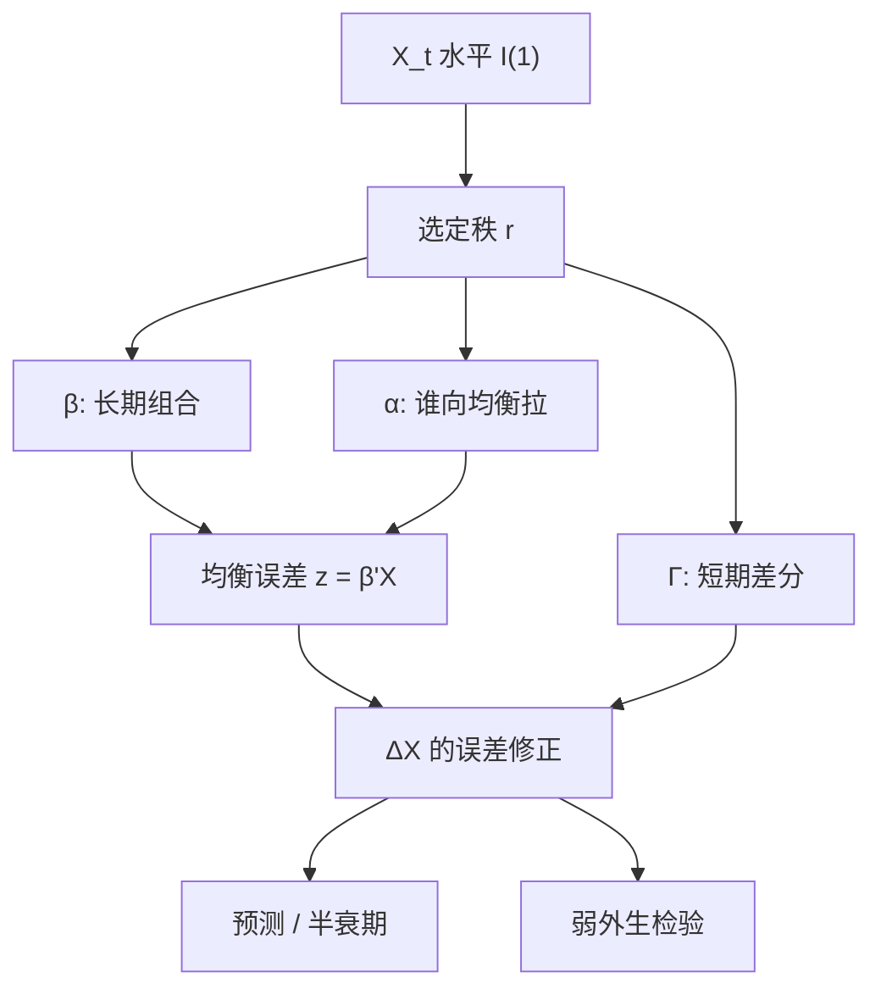

# VECM 向量误差修正

协整系统可以写成差分的向量自回归，外加一项用滞后水平把变量拉回长期关系；调整速度与协整向量把水平项的系数矩阵分解成两个矮矩阵。

<footer>—— Granger 表示定理；Johansen 将 VECM 写成 Π = αβ′ 并在高斯 VAR 上做极大似然，Journal of Economic Dynamics and Control 1988，Econometrica 1991</footer>

[单位根预备](/quant/unit-root) 说明水平可能是 I(1)。[Engle–Granger](/quant/engle-granger) 给出两变量的两步误差修正。[Johansen](/quant/johansen) 专写如何用迹与最大特征值选协整秩 $r$。本篇写选定秩之后真正拿来做动态的那套方程：向量误差修正模型（VECM）。交易上它决定谁向谁拉、拉多快、短期差分怎么传导；检验上秩通过只意味着可以写 VECM，不意味着价差可交易。A 股的期现、行业篮子、AH 与利率曲线，问的都是这套短期–长期分解，而不是把几条腿直接做差分 VAR 或直接对价格做水平 VAR。

## 问题

$p$ 维 I(1) 向量 $X_t$ 的 VAR($k$) 经过差分改写为

$$
\Delta X_t=\Pi X_{t-1}+\sum_{i=1}^{k-1}\Gamma_i\Delta X_{t-i}+\Phi D_t+\varepsilon_t.
$$

若 $X$ 协整，则 $\Pi$ 的秩为 $r\lt p$，$\Pi=\alpha\beta'$。$\beta'X_{t-1}$ 是 $r$ 个均衡误差（价差），$\alpha$ 是把误差喂回各条差分方程的载荷，$\Gamma_i$ 是短期动态。没有协整时 $\Pi=0$，应在差分上做 VAR；若误把 I(1) 当 I(0) 做水平 VAR，就是伪回归。问题是在给定 $r$ 下估 $(\alpha,\beta,\Gamma)$，并解释哪些方程真正做误差修正。

两变量时 Engle–Granger 的 ECM 是 VECM 的特例：$p=2,r=1$，且 $\beta$ 由单方程 OLS 钉死。多变量、$r\gt 1$ 时必须在系统里估，否则协整空间的基选错，载荷无意义。Johansen 篇处理 $r$ 的检验；本篇假定 $r$ 已选定（或作为情景），聚焦方程与识别。

### 长期与短期是两块矩阵

$\beta$ 决定「什么组合是平稳的」，$\alpha$ 决定「偏离之后谁动」，$\Gamma$ 决定「差分的惯性与交叉传导」。三者不要混名。把 $\beta$ 当对冲比、却忽略 $\alpha$ 接近零，价差可以统计平稳但几乎不回调，交易半衰期不可用。只估 $\alpha,\beta$ 而把 $\Gamma$ 设零，等于假设误差修正是一阶马尔可夫，日频金融里通常太短。滞后阶 $k$ 同时影响三者：过短则残差相关，过长则水平项被吃掉。

$\beta$ 只识别到空间：右乘可逆矩阵，$α$ 左乘其逆，$\Pi$ 不变。软件输出的「协整方程 1」是某种规范化（某一元素为 1，或特征向量模长），不是按夏普排序的价差。交易方向要另加经济约束或在空间里再选，见 Johansen 篇的识别。

## 方法

**估计。** 高斯假设下 Johansen 的约化秩回归同时给出 $\hat\beta$ 的空间与 $\hat\alpha$、$\hat\Gamma$。实践：先用信息准则选 $k$，再选确定性项（常数限制在协整内还是进入差分），再检 $r$，最后在给定 $r$ 下估系统。确定性项放错，价差会带漂移，均值回复交易的「均值」不存在。价差应在某水平附近摆动时，把常数放进协整方程，而不是给每条腿独立漂移。

**弱外生。** 若某条变量对应的 $\alpha$ 行（或块）为零，则该变量的差分方程不含误差修正项，长期系数可以在其余方程里有效估计，该变量在长期意义上「不被拉」。期现里若期货腿 $\alpha$ 显著、现货不显著，回调主要发生在期货，做市应对齐期货腿。检验弱外生是对 $\alpha$ 的零约束似然比，不是看哪条腿波动大。

**预测与脉冲。** VECM 的一步预测是 $\widehat{\Delta X}_{t+1}=\hat\alpha(\hat\beta'X_t)+\sum\hat\Gamma_i\Delta X_{t-i}$。水平预测把差分累加回去。正交化脉冲在 I(1) 系统里会永久移动水平；协整方向上的冲击应衰减。报告脉冲时须声明识别（Cholesky 顺序是任意的）。交易更关心的是均衡误差的半衰期：对 $\beta'X_t$ 拟合 [OU](/quant/ou-spread) 或从 $\alpha,\beta,\Gamma$ 推出误差过程的 AR，再进入[阈值](/quant/half-life-bands)。

### 与差分 VAR、水平 VAR 的选择

ADF 显示各列为 I(1)、Johansen 显示 $r\ge 1$，才写 VECM。全部 I(0) 则水平 VAR 即可。全部 I(1) 且 $r=0$ 则差分 VAR。混整（有的 I(0) 有的 I(1)）时，标准 Johansen 不适用，应先分块或改用其他协整概念。A 股指数与期货近月在正常交易日接近 I(1) 且 $r=1$ 是工作假设；涨跌停、贴水跳变、合约换月会把 $\Pi$ 打成分段常数，全样本 VECM 是错误设定。

## 机制

Granger 表示定理：协整的 I(1) 系统等价于误差修正形式；反过来，VECM 里 $\alpha\beta'$ 降秩保证存在平稳组合。经济含义是：水平可以一起游走（共同随机趋势 $p-r$ 个），但不能在协整方向上永久分开。$\alpha$ 的大小是拉回强度，不是「谁领先」的因果口号——领先滞后还依赖 $\Gamma$ 与抽样频率。日频上现货对资讯反应慢、期货快，常表现为期货 $\alpha$ 更大；把这写成「期货操纵现货」超出了 VECM 能支持的陈述。

结构 VECM 进一步给 $\varepsilon$ 加同期约束，才能谈「供给冲击」。未识别的简化式 VECM 只对预测与降秩约束负责。统计套利用的是简化式：要一条半衰期短、波动覆盖成本的 $z_t$。$r=2$ 时平面里只有少数方向满足该条件，其余方向是慢趋势。秩检验通过不等于有两条可交易腿。

### A 股对象上的制度项

股指期货与现货篮子：涨跌停使现货腿的 $\Delta X$ 截断，期货腿不同步，残差非正态，Johansen 尺寸扭曲，见[期现](/quant/cn-index-fut-basis)。AH 股票：两地日历、汇率与额度把 $X_t$ 变成带洞的序列，VECM 应在两地均交易的日上估，或显式加入制度哑变量。行业篮子：成份调整使 $\beta$ 在调仓日跳跃，常系数 VECM 只能当局部近似；需要时变 $\beta$ 时是 Kalman 或滚动系统，已经离开教科书 VECM。商品与国债期货的多合约，必须先处理换月，不能把主连价格当同一 I(1) 对象。

日频金融几乎从不满足高斯 IID 新息。VECM 仍是有用的线性近似，但 p 值、半衰期和脉冲都应辅以 bootstrap 或样本分割。把全样本 $\alpha$ 当执行强度，会在 2015、2020 一类断裂后系统性做错方向。

## 边界与工程取舍

不要在未做单位根与秩检验时直接对价格向量估 VECM。不要把软件默认的第一个特征向量当交易价差。不要 $p$ 很大时对十只股票估 $r=3$ 再同时开三组仓——识别不足。不要忽略 $\Gamma$：只拿 $\beta'X$ 做阈值，等于假设短期差分不重要，开仓后的路径会与回测不同。

与 Engle–Granger 分工：两腿、报告一个对冲比，两步更透明；多腿、要秩、要弱外生，用 VECM。两者都要把成本、停牌与涨跌停放进可执行价差，统计平稳不是下单规则。结构识别、外生政策变量，需要额外约束，不是把 $\varepsilon$ 画成带箭头的因果图就完成。

出处：Engle and Granger, *Econometrica*, 1987（表示与 ECM）；Johansen, *JEDC*, 1988 与 *Econometrica*, 1991（系统 VECM 与秩）。专著：Johansen, *Likelihood-Based Inference in Cointegrated Vector Autoregressive Models*, 1995。

## 小结

- VECM 把协整 VAR 写成 $\Delta X_t=\alpha\beta'X_{t-1}+\Gamma(L)\Delta X_{t-1}+\cdots$，长期由 $\alpha\beta'$、短期由 $\Gamma$ 分担。
- $\beta$ 只识别到空间；$\alpha$ 决定谁被拉、是否弱外生；两者都要通过经济约束才有交易含义。
- 先单位根与秩，再估系统；确定性项与滞后改含义，不是调参装饰。
- 秩通过后仍要问误差的半衰期、成本与样本外 $\Pi$ 是否稳定。
- A 股期现、AH、换月与涨跌停使常系数高斯 VECM 只是局部工具。
- 出处：Johansen 1988/1991；Granger 表示见 Engle and Granger, 1987。
