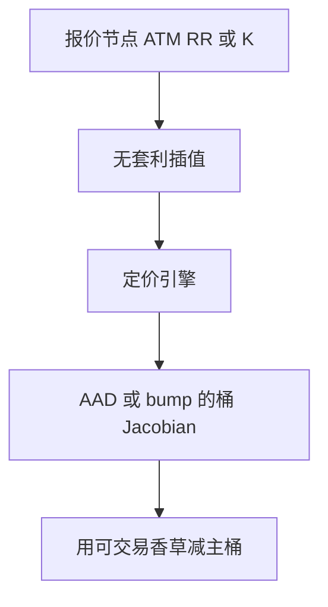

# Vega 桶与曲面风险

一个总 Vega 把微笑的水平、斜率和弯曲捆在一起；桶风险是按到期与 Delta 把曲面节点当成可 bump 的市场数据。

<footer>—— 对照 Derman 对波动率曲面风险的论述；桶划分见期权风险报告惯例</footer>

[上一课](/quant/pathwise-likelihood-ratio)给出如何估 $\partial V/\partial\theta$。本课的 $\theta$ 不再是一个 $\sigma$，而是**曲面上的一排节点**。主干 [隐波曲面](/quant/vol-surface) 与 [Delta 对冲](/quant/greeks-hedge) 已写水平和局部对冲。缺口是报告：结构产品的风险要按桶加总，才能拿去对冲香草。后课曲面动态再把桶随时间怎么一起动写进去。

## 问题

BSM Vega 是价值对常数 $\sigma$ 的导。真实市场动的是一张 $(T,K)$ 或 $(T,\Delta)$ 网格。总 Vega 可能接近 0，同时短到期数字桶和长到期斜度桶都很大——autocallable、cliquet 典型如此。问题是定义 bump：按原始报价惯例（FX 的 ATM/RR/BF，股权的按 $K$ 或按 $\Delta$）去 bump，再通过无套利插值传到定价引擎，而不是在引擎内部的参数（Heston $\kappa,\nu$）上 bump 再假装那是市场 Vega。

桶边界是设定：到期 1M/3M/1Y、Delta 25/10 等。边界一改，同一组合的「最大桶」会换位置。报告必须固定网格，校准与 AAD 的输入应对齐这张网格。

### 模型 Vega 不是市场 Vega

在 [Heston](/quant/heston) 里对 $\nu$ 求导，是模型参数敏感度，用于校准与模型风险。市场 Vega 是对可交易香草价格（或隐波节点）的导数。对冲只能买后者。把 Heston Vega 拿去下香草单，单位都对不上。AAD 若以曲面节点为输入，输出的才是市场桶；若以模型参数为输入，输出的是另一张表，两张都要，不要合并成一行「Vega」。

平行 bump 整张曲面，近似「水平」风险，对偏斜产品会漏掉主风险。至少要水平、倾斜、弯曲三个情景，或完整桶矩阵。

## 方法

选择与报价一致的节点；用 [无套利插值](/quant/arb-free-iv) 填充。每个节点 bump 1 个波动点（或按 RR/BF 的惯例 bump），重估或用 AAD。加总到内部限额：按到期、按货币、按标的。对冲：用该桶附近的香草或方差互换去减最大项，残差进次主桶。数字与障碍在对应 $K$ 的短到期桶上会出尖峰，对冲应用价差而不是 ATM。

利率与股权混合结构要同时报 IR 桶与 EQ 桶，不要把一切折成「股权总 Vega」。

## 机制

定价映射 $\mathrm{surface}\mapsto V$ 的 Jacobian 就是桶风险。插值核决定 bump 如何传染邻居：局部插值让桶更「对角」，全局参数化（SVI 全期限一个参数）会让一次 bump 污染整张曲面，报告看起来平滑、对冲却对不上可交易工具。这就是为什么桶应定义在报价节点上，而不是定义在内部参数上。

## 边界

流动性：10 Delta 翼部 bump 1 点可能比 ATM 1 点贵得多，名义风险与可对冲风险不同。跳空使短到期桶的已实现与 bump 情景不一致。XVA 的曲面风险还含对手方与自身曲线，后课再接。不要用历史 PCA 的第一主成分去替代当日桶——那是下一课动态，不是今日对冲清单。

## 小结

- 总 Vega 不够；风险是曲面上按报价惯例定义的桶。
- 市场桶与模型参数敏感度必须分表。
- 插值核会污染邻居，桶应钉在可交易节点上。
- 出处：曲面作为市场数据见 Derman 等关于波动率的论述；报告网格是市场惯例。
