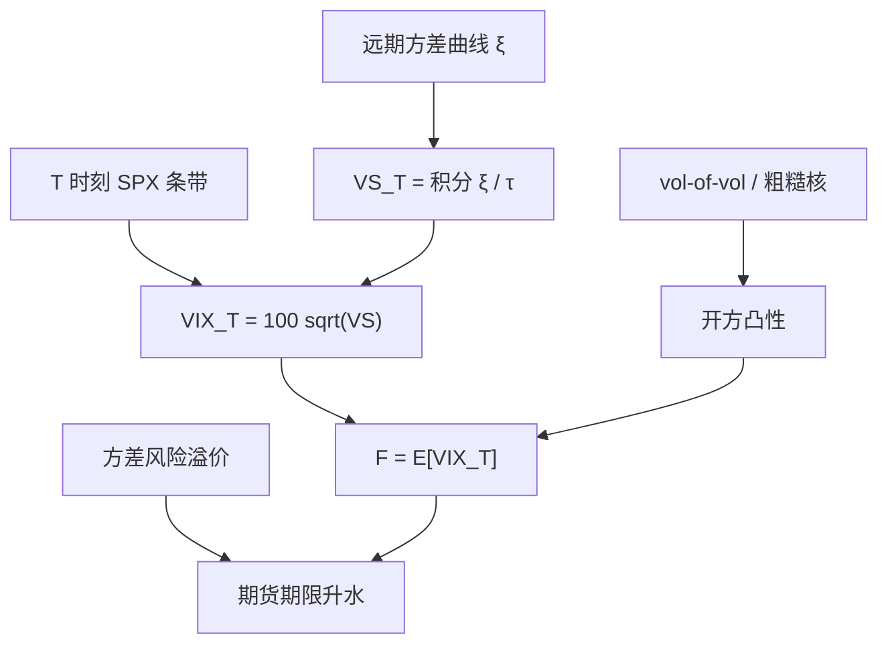

# VIX 期货定价

    
VIX 期货的标的不是现货指数的已实现方差，而是未来某一时刻那张三十天香草条带的平方根；定价因而落在方差曲线的凸性上，而不是落在对 VIX 现货做简单贴现。

    <footer>—— 指数定义见 CBOE VIX 方法说明书；早期波动期货见 Grünbichler and Longstaff, Journal of Banking & Finance, 1996；曲线框架对照 Bergomi</footer>

[方差互换与 VIX](/quant/variance-swap-vix) 写的是指数本身：CBOE 用 SPX 虚值期权的 $1/K^2$ 离散条带，插值到三十天再开方。交易的主要工具却是 VIX 期货（及期货期权）。期货到期时盯的是结算时刻的 VIX 指数，而该指数已经是「当时起三十天」方差互换复制的平方根。因此期货价格是

$$
F_{t,T}^{\mathrm{VIX}}=\mathbb{E}^{\mathbb{Q}}_t\bigl[\mathrm{VIX}_T\bigr]=\mathbb{E}^{\mathbb{Q}}_t\Bigl[100\sqrt{\mathrm{VS}_{T,T+\tau}}\Bigr],
$$

其中 $\mathrm{VS}_{T,T+\tau}$ 为从 $T$ 起 $\tau=30/365$ 的公平方差执行价（年化约定以说明书为准）。本篇写这一凸性、期限结构为何常年升水、以及 Heston / Bergomi / [粗糙波动](/quant/rough-vol) 如何给 $F_{t,T}$ 定价。不重复条带公式的逐步推导，也不把 VIX 期权的波动曲面当成另一本书。

## 问题

若标的是可交割现货 $S$，期货在利率确定时是 $\mathbb{E}^{\mathbb{Q}}[S_T]$（适当测度）。VIX 不是可交易现货：复制组合每天随期权集改写，且指数是方差的凹函数（开方）。Jensen 给出

$$
\mathbb{E}\bigl[\sqrt{X}\bigr]<\sqrt{\mathbb{E}[X]},
$$

$X$ 为未来三十天方差。于是 VIX 期货低于「未来方差互换公平值的平方根」——差一项凸性调整，随 vol-of-vol 与剩余期限增大。把现货 VIX 当成期货的持有成本标的去贴现，等于忽略：指数不可持有、开方凹性、以及 $T$ 时刻的条带与今天的条带不是同一组期权。

期限结构 $T\mapsto F_{t,T}$ 在多数年份呈 contango：远月期货高于近月，展期空头吃升水、多头付升水。这与商品库存的 Working 曲线不是同一机制：这里没有仓单，升水主要来自方差风险溢价与均值回复——市场为尾部保护预付，近端隐含方差被顶高，远端向长期均值回落。问题是把升水拆成：凸性（模型技术项）、风险溢价（补偿卖方差）、以及指数定义与期货结算规则的基差。

### 标的是未来的三十天线，不是路径已实现

OTC 方差互换对 $[t,t+h]$ 的已实现二次变差结算。VIX 期货在 $T$ 结算的是 $\mathrm{VIX}_T$，即当时市场对 $[T,T+\tau]$ 的**隐含**方差开方。即使你对冲了从今天到 $T$ 的已实现方差，仍暴露于 $T$ 时刻微笑是否还在、翼部是否还贵。这是「方差互换」与「VIX 期货」之间的基差来源，也是用现货 VIX 去对冲期货会留下 roll 与微笑风险的原因。Grünbichler–Longstaff（1996）在 VIX 修订之前就把波动当作均值回复扩散来写期货与期权；现行指数改为条带复制之后，状态变量更自然的是整条远期方差曲线，而不是一个瞬时 $\sigma_t$。

报价惯例是波动率点。合同乘数（如每点 1000 美元）把点变成美元。PnL 归因若用方差单位，必须先把点平方再差分化，否则凸性被算进「alpha」。

## 方法

**从方差曲线到期货。** 记远期瞬时方差为 $\xi_t(u)$。理想连续复制下，$\mathrm{VS}_{T,T+\tau}=\frac1\tau\int_T^{T+\tau}\xi_T(u)\,\mathrm{d}u$。VIX 期货是该积分开方（再乘 100）的条件期望。Heston 只有一个 $v_t$，蕴含的 $\xi$ 是指数型，Zhang–Zhu（2006）一类仿射规格可以写出矩，再对开方做近似或模拟。曲线不呈指数时，仿射会同时错方差互换与 VIX 期货。Bergomi 把今日 $\xi_0$ 从市场填入，期货变成曲线因子在 $T$ 时刻的泛函，用对数正态曲线的矩或蒙特卡洛估 $\mathbb{E}[\sqrt{\int\xi}]$。粗糙核抬高短端 vol-of-vol，凸性调整更大，近月期货相对「方差开方」掉得更多。

**复制与对冲。** 理论对冲是一篮子到期落在 $[T,T+\tau]$ 附近的 SPX 香草，权重随 $T$ 临近收敛到 CBOE 条带。实务用可交易的 SPX 期权、VIX 期权与日历，并接受基差：上市到期与三十天整数不重合、执行价网格与官方规则不完全相同。对冲比应对 $\xi$ 的分桶敏感（短方差、长方差），而不是单一 Vega。Mencía–Sentana 把 VIX 衍生品估值写成仿射或二次项规格，强调水平与 vol-of-vol 因子；交易台语言更接近 Bergomi 的快慢方差。

**升水的交易。** 空头展期吃 contango，等价于持续卖出近端方差风险溢价，回撤发生在 VIX 曲线翻成 backwardation 的危机日——与 [波动率风险溢价](/quant/variance-risk-premium) 同一类资金需求。这不是无风险套利。定价模型的用途是：把当前曲线形状拆成「公允凸性」与「额外溢价」，而不是预测 VIX 现货的点位。

### 开方凸性与仿射矩

若 $X\sim$ 对数正态或已知前两矩，可用

$$
\mathbb{E}[\sqrt{X}]\approx\sqrt{\mathbb{E}[X]}\Bigl(1-\frac14\frac{\mathrm{Var}(X)}{(\mathbb{E}[X])^2}+\cdots\Bigr)
$$

把凸性写成方差的相对波动。$\mathrm{Var}(X)$ 来自 $\xi$ 在 $[T,T+\tau]$ 上的联合波动，短端核越糙、$\eta$ 越大、剩余时间越长（在均值回复拉回来之前），调整越大。Heston 的 $\kappa$ 大则凸性小，往往低估近月 VIX 期货相对方差互换的折价。校准若只用 SPX 香草、不用 VIX 期货，这一项是样本外检验；若把期货也纳入目标，则在用市场给 vol-of-vol 的期限结构加锚。

## 机制

VIX 指数已经把微笑积成一个数；期货再把这个数在时间上做成鞅（期货测度下）。曲线动态决定「这个数以后怎么随机翻动」：均值回复使远月向长期水平靠拢，负相关使现货崩盘时整条近端 $\xi$ 上跳、期货曲线可以一夜之间从 contango 翻成倒挂。开方把高方差状态压低权重，故期货对尾部的敏感弱于方差互换本身——买 VIX 期货当崩盘保险，买的是 $\sqrt{\mathrm{VS}}$ 而非 $\mathrm{VS}$，保险效率低于直接买方差或买虚值看跌条带。这是产品选择问题，不是定价公式的 bug。

结算规则：CBOE 用开盘拍卖特殊结算价（VRO 一类），与收盘 VIX 可以有缺口。模型若用收盘条带校准、用结算价归因，基差会进入「模型误差」。历史序列还要声明 2003 年指数修订：旧 VXO 与现行 VIX 不可混接。周期权纳入规则的变更会移动现货 VIX 的微观结构，期货远月相对钝一些。

### 与 OTC 方差互换、VIX 期权的三角

同一 $\xi$ 必须同时服务：今日方差互换期限结构、SPX 香草偏斜、VIX 期货曲线。只贴前两张、第三张系统性偏高或偏低，说明凸性（vol-of-vol）或风险溢价期限结构不对。VIX 期权的标的是期货，隐含波动是对 $\sqrt{\mathrm{VS}}$ 的微笑，再经一层凸性，不能直接当成 SPX 的 $\sigma_{\mathrm{imp}}$。用 VIX 期权去校准粗糙 $H$ 或 Bergomi 的 $\eta$，信息与 SPX 短端偏斜相关但不重复——前者更干净地看到方差自身的波动。

contango 不是「期货一定高估实现 VIX」。事后平均实现可以低于期货，那是溢价；也可以在一段样本里期货偏低。用历史平均 roll 当未来收益，忽略了翻倒挂的尾部。

## 边界与工程取舍

复制假设欧式、连续 $K$、无跳或跳被条带吸收。跳跃使对数复制与二次变差分家，VIX 作为条带仍有定义，但与已实现方差的保险关系出现缺口，见复制篇。期货保证金与涨跌停（若有）改变可交易性，不改变 $\mathbb{E}[\mathrm{VIX}_T]$ 的定义。A 股与欧洲波动指数有各自的条带规则，不能把 VIX 模型换标的即用。

Grünbichler–Longstaff 是波动作为资产的早期期货公式；CBOE 白皮书是指数定义；Bergomi 与 Bayer–Friz–Gatheral 提供曲线与粗糙核。不要把「VIX 期货定价」写成 1994 年 Dupire 的应用——局部波动钉的是 SPX 香草边际，不自动给出未来条带平方根的期望。也不要把期货升水写成 Keynes 商品正常贴水：这里没有存货便利收益。

用现货 VIX 减随后三十天已实现波动，测的是方差风险溢价的一个代理；用近月期货减随后结算 VIX，测的是期货风险溢价。两套数字相关，期限与开方凸性不同，不能互相替代去写策略。

模型若在风险中性下校准期货曲线至零残差，vol-of-vol 里已经含溢价。再用历史方差曲线 PCA 去「验证」同一 $\eta$，量纲会对不上——那是两个测度。

## 小结

- VIX 期货是 $\mathbb{E}^{\mathbb{Q}}[\mathrm{VIX}_T]$，标的为未来三十天条带的平方根，不是现货已实现方差。
- 开方凹性产生相对方差互换的凸性折价；折价随 vol-of-vol 与粗糙核增大。
- 期限升水主要来自方差风险溢价与均值回复，空头展期赚溢价、在倒挂日回撤。
- 定价应在远期方差曲线上进行，使香草、方差互换与期货共用 $\xi$；Heston 指数曲线常常不够。
- 对冲是未来条带的近似复制，现货 VIX 不是持有成本标的。
- 出处：CBOE *VIX White Paper*；Grünbichler and Longstaff, *JBF*, 1996；对照 Bergomi；粗糙核见 Bayer, Friz and Gatheral, 2016；复制见 Carr and Madan。
