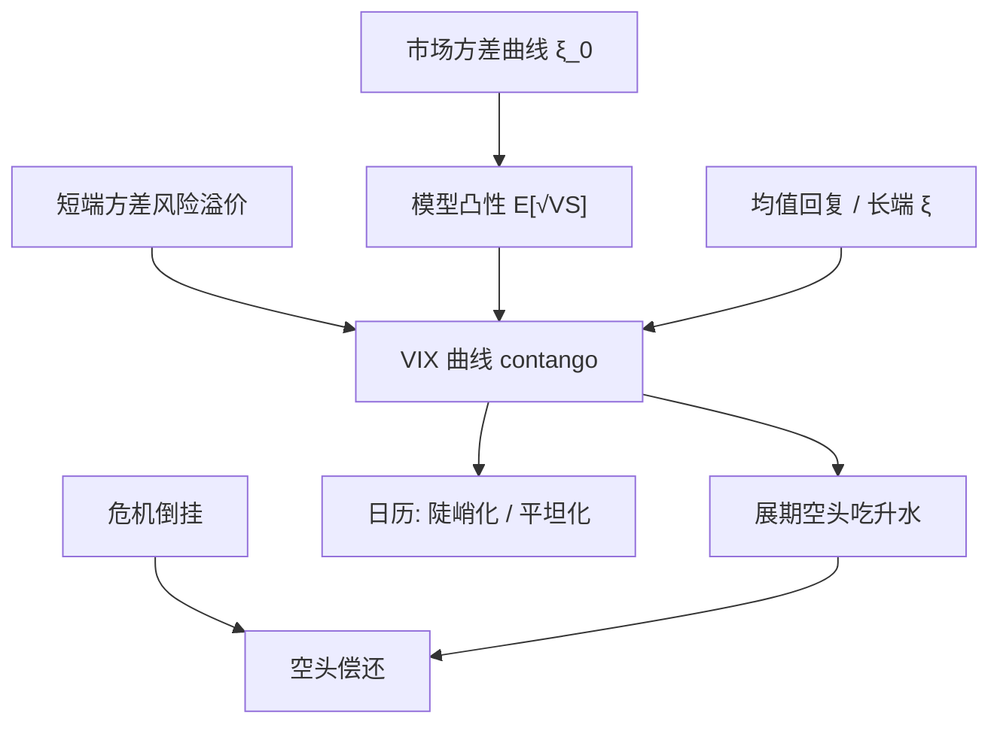

# VIX 期限结构交易

    
VIX 曲线多数时候升水：近月隐含方差被风险溢价顶高，远月向长期均值回落；空头展期吃的是这笔升水，在曲线翻成 backwardation 的危机日一次性偿还。

    <footer>—— 期货凸性与曲线对象对照 Bergomi；升水与方差风险溢价见 Bollerslev–Tauchen–Zhou 一类文献；指数定义见 CBOE</footer>

[VIX 期货定价](/quant/vix-futures) 写标的是未来三十天条带的平方根，以及开方凸性。[方差互换与 VIX](/quant/variance-swap-vix) 写指数本身。本篇写**期限结构上的仓**：日历、展期、陡峭化与平坦化，如何把曲线形状拆成凸性、溢价与均值回复，以及 [Bergomi](/quant/bergomi) / [rBergomi](/quant/rough-bergomi) 的快慢方差如何映射到可交易月份。不重复 CBOE 条带逐步规则，也不把单月期货的仿射近似再推一遍。

## 问题

记 $F_{t,T}$ 为到期 $T$ 的 VIX 期货。曲线 $T\mapsto F_{t,T}$ 在多数年份呈 contango：远月高于近月。空近月、滚到更远月，展期收益为正，直到曲线倒挂。倒挂出现在现货 VIX 飙升、近端方差被实时危机定价的时候。问题不是「预测 VIX 点位」，而是：当前升水里有多少是无风险的凸性（$\mathbb{E}[\sqrt{X}]\lt \sqrt{\mathbb{E}[X]}$ 在不同 $T$ 上不同）、有多少是方差风险溢价的期限结构、有多少是均值回复使长端 $\xi$ 低于短端。三者的对冲工具不同，混成一笔「卖 VIX」会在错误的月份上爆。

另一混淆：VIX 现货不可持有。用现货减近月当「基差交易」，复制组合每天改写，基差里含微笑与规则噪声，不是仓储成本。期限结构交易的可交易腿是期货日历与 VIX 期权日历，现货只做信号。

### 升水的三分解

（1）**凸性。** 远月 $F_{t,T}=\mathbb{E}_t[\sqrt{\mathrm{VS}_{T,T+\tau}}]$ 相对 $\sqrt{\mathbb{E}_t[\mathrm{VS}]}$ 的缺口随剩余期限与 vol-of-vol 增大。Heston 均值回复会低估短端凸性；粗糙核把它抬起来。模型能定价的是这一块。（2）**风险溢价。** $\mathbb{E}^{\mathbb{Q}}[\mathrm{VS}]-\mathbb{E}^{\mathbb{P}}[\mathrm{VS}]$ 在短端通常更厚，因为保险买的是近端尾。这是展期空头真正在卖的东西。（3）**曲线形状。** 即使无溢价，均值回复也使远期方差低于即期，contango 可以来自 $\xi_0(u)$ 向下倾斜。今日 $\xi_0$ 应从 SPX 方差互换读入，而不是从 VIX 期货反推后再解释升水——否则循环。

把 contango 当成「期货市场无效」会把保险费写成套利。Working 曲线的库存逻辑在这里不适用：没有仓单，只有方差的期限结构与风险价格。

## 方法

**展期空头。** 空最近流动性月，临近到期滚出。期望 PnL ≈ 升水衰减减去危机日的曲线倒挂。仓位应按方差单位或 Vega 分桶，而不是按「几张合约」：近月对 $\xi$ 的短端更敏感，同样张数的远月风险小得多。回撤控制必须按倒挂情景（例如 2008、2020）的曲线形状，而不是按历史日波动。

**日历陡峭化 / 平坦化。** 陡峭化：空近、多远，押升水扩大或近端溢价上升；平坦化相反。希腊字母：对短方差与长方差的暴露符号相反，净对平行移动可以压低，对扭转敏感。这与 Bergomi 两因子语言一致：快因子打近月，慢因子打远月。rBergomi 的 $H$ 主要污染近月凸性，陡峭化在粗糙世界里还带一笔短端凸性差。

**对冲与基差。** 用 SPX 香草条带对冲「未来三十天方差」时，上市到期与三十天整数不重合，留下日历基差。VIX 期权的微笑是波动的波动，与 SPX 偏斜相关但不相同。期限结构交易若再叠 VIX 期权，必须单独限额 vol-of-vol。不要用单一 SPX Vega 去对冲 VIX 日历。

### 从方差曲线到月份权重

理想连续下，$\mathrm{VS}_{T,T+\tau}=\frac1\tau\int_T^{T+\tau}\xi_T(u)\,\mathrm{d}u$。近月期货对 $\xi$ 在 $[T_{\mathrm{n}},T_{\mathrm{n}}+\tau]$ 的桶敏感，远月对更远的桶敏感。把曲线按关键到期扰动 1 个方差点，重定价各月期货，得到关键方差久期。仓位优化应在这些桶上做，而不是在「第 1、2、3 月」标签上做——月合约的 $T$ 在滚动，桶在变。Heston 只有一个 $v_t$，所有月份共线，不能表达陡峭化；这是期限结构交易必须用曲线模型的原因。

## 机制

投资者买近端指数保险，抬高短 $\xi$ 与近月 $F$。长端保险需求较弱，且均值回复把冲击稀释，远月 $F$ 贴近长期水平。展期空头提供保险、收取期限溢价，直到共同因子（危机）把整条短端曲线抬过长端。这与商品展期同形、异机制。开方凹性使期货低于「方差开方」，升水的一部分是技术项：即使物理测度下方差无溢价，只要 vol-of-vol 为正，不同 $T$ 的凸性调整不同，曲线形状仍被扭曲。定价模型的用途是扣掉技术项，剩下的才是可讨论的风险价格。

与 SPX 方差互换日历的差别：方差互换线性于 $\xi$ 的积分，VIX 期货线性于其平方根的期望。同样的 $\xi$ 扭转，两种日历的 PnL 比例随水平变化（高波动时开方更平）。在 VIX 高位做「与低位相同张数」的日历，凸性暴露已经变了。

### 信号：现货、RV、曲线斜率

用现货 VIX 减近月、或 VIX 减随后 RV，可以做择时，但它们测的是水平溢价与基差，不是期限结构相对价值。曲线斜率（远月减近月）本身含溢价，均值回复的速度决定升水衰减有多快。把斜率当预测现货的信号，方向往往反了：升水大时现货低，随后现货上升不是「斜率失效」，而是均值回复与溢价共存。应把交易定义为曲线上的相对价值，把现货方向另做限额。

VIX 期货结算价是特殊开盘拍卖的 VIX，不是前收盘。展期若留到结算，基差跳一层规则风险。多数期限结构账在到期前滚出，把结算当独立事件。

## 边界与工程取舍

流动性集中在前三、四个月份，远月买卖价差宽，陡峭化的多头腿可能填不上官方权重。VIX 期权与期货的保证金、涨跌停与熔断与 SPX 不同，危机日对冲可能中断。不要用 Heston 校准的香草去给远月 VIX 定价还报告「已对冲」：一因子月份共线。不要把 ETF 展期产品（XIV 一类历史）的结构产品风险当成期货日历本身——那些产品有日内再平衡与终止条款。

粗糙波动改变近月凸性，不自动给出远月信号。用 rBergomi 扣凸性之后，若短端仍贵，那是溢价；若模型把全部升水解释成凸性，检查 $H$ 与 $\eta$ 是否在用香草过拟合。多曲线、利率对 VIX 期货影响小，但对把 SPX 条带换算成方差点的折现有二阶影响，对账时用同一利率。

报价是波动率点，归因若用方差单位，先平方再差分。点差的 PnL 在高波动时不等于方差差的 PnL，凸性又会被算进 alpha。

期限结构交易赚的是保险费的期限差，不是无风险套利。风控情景必须包含曲线倒挂与近月跳空，而不是把历史 contango 的夏普外推。

## 小结

- VIX 曲线升水来自短端溢价、均值回复形状与开方凸性；展期空头卖的是前两项，模型应扣掉第三项。
- 日历陡峭化是对短–长方差扭转的暴露，需曲线模型（Bergomi）而不是一因子 Heston。
- 仓位按方差桶而不是按月份标签；滚动时 $T$ 在变，桶在变。
- 现货 VIX 不可持有；基差与结算规则是独立风险。
- 高波动下开方变平，同样张数的日历凸性暴露会变。
- 出处：CBOE VIX 方法；曲线框架见 Bergomi；凸性对照 Grünbichler–Longstaff、VIX 期货篇；溢价见方差风险溢价文献；短端核见 Bayer–Friz–Gatheral。
