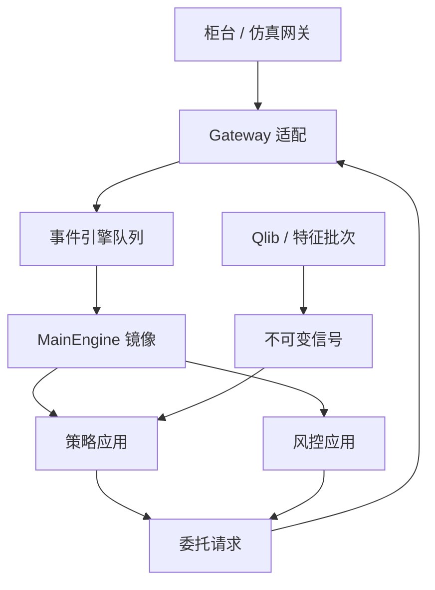

# vn.py 交易框架

    
把网关、事件引擎、账户与策略应用拆开：行情与委托都变成事件，策略只对事件做有限状态反应——vn.py 的形状是国内期货与证券柜台生态上的事件驱动骨架，而不是交易所本身。

    <footer>—— 据 vn.py（VeighNa）文档对其事件引擎、MainEngine 与网关接口的说明</footer>

[事件驱动回测](/quant/event-driven-backtest) 把仿真写成事件队列；生产上需要同一观念落到真实柜台：CTP、证券柜台、仿真盘。vn.py 用 Python 事件引擎把网关推送的行情、委托回报、成交回报变成总线消息，策略与风控以应用形式挂上去。它降低的是「接柜台协议」的工程税，不降低微观结构保真度——默认仍是你在策略里看到的 tick 或 bar，而不是 L3 队列。本篇写它作为交易系统架构：进程如何切、状态如何存、与 [Qlib](/quant/qlib-quant) 研究栈如何单向衔接。不提供针对任何柜台的绕过或未授权接入，也不把示例 CTA 当可复制收益。

## 问题

国内个人与小团队面对的接口是碎片化的：期货 CTP、不同券商的证券接口、仿真环境。每个接口的回调线程、字段名、错误码都不同。若策略直接绑在某一 SDK 上，换期货公司等于重写策略。vn.py 的网关层把这些差异收成统一的 Tick、Order、Trade、Position、Account 对象，送到事件引擎。问题是统一之后仍然存在的语义差：价格类型、开平仓、投保、撤单是否同步、夜盘资金是否可用。框架可以翻译字段，不能把上期所与某证券柜台变成同一撮合规则。

第二个问题是 Python 与延迟。事件引擎在进程内用队列串行化回调，适合中低频与研究型自动化，不适合与共址 C++ 网关比微秒。架构必须诚实：vn.py 是控制面与策略面的骨架，热路径若存在，应在网关之外。把所有信号计算塞进主引擎回调，会把 GC 与策略 bug 变成全账户停摆。

### 事件总线与主引擎

MainEngine 持有网关与应用。网关在自己的线程收柜台推送，转成事件放入引擎队列；引擎线程按序分发。这个串行化是正确性的朋友：策略不必在柜台回调里自己加锁。它也是延迟的来源：慢策略拖住整条总线。规范是：回调里只更新状态与发出委托请求，重计算放到独立工作线程或预先算好的计划里。账户、持仓以引擎内的内存镜像为准，定期与柜台查询对账——镜像与柜台不一致时，以柜台为真，策略暂停而不是用镜像强行平仓。

示例里的 CTA 模板用 bar 合成与均线，是教学状态机，不是执行算法。把模板参数扫一遍得到的曲线，受同一套前视与成本假设约束，见过拟合与回测隔离条目。框架作者不替你做净化。

## 方法

进程切分建议至少两层。交易进程：网关 + 引擎 + 风控应用 + 少数策略，目标是稳定与可重启。研究进程：读 [DolphinDB](/quant/dolphindb) 或文件，产出信号表。信号以不可变批次或消息进入交易进程，交易进程不反向写研究库的「最新权重」。这与 Qlib 的记录器、与生产隔离一文一致。持久化：委托与成交落本地日志，重启后先对账再允许新委托。不要只靠内存里的策略变量当唯一账本。

网关配置、合约主数据、交易日历应外部化。夜盘属于哪一个交易日、集合竞价能否撤单，写进日历对象，而不是写进某个策略的 `if`。仿真盘与实盘共用策略代码时，差别只能出现在网关与资金数字，不能出现在另一套信号公式——否则仿真通过毫无信息。

### 回测与实盘的同一状态机

vn.py 提供历史回测模块，用 bar 或 tick 重放驱动同一套策略回调。保真度取决于重放时钟是否包含委托延迟与排队。默认 bar 回测通常假设在 bar 内可成交，与事件驱动引擎的高档撮合不同。方法是：策略状态机（空仓、挂单、持仓）在回测与实盘共用；撮合器在回测里可插拔。若回测用了未来 bar 的高低点当止损触发，这是前视，应在代码审查里当缺陷，而不是当参数。涨跌停、停牌、下单失败必须作为事件进入状态机，否则实盘第一次拒单就会让状态机卡死。

风控应用应独立于策略：限额、撤单失败重试上限、异常波动暂停。策略请求委托，风控可拒绝。拒绝是事件，策略要能处理，而不是假定请求等于在簿。这与订单状态机一文是同一要求，只是实现落在 Python 应用而不是 C++。

## 机制

机制上，vn.py 是把「柜台推送 → 统一对象 → 串行事件 → 应用」做成开源骨架，并围绕国内期货生态提供大量网关适配。事件引擎保证同一进程内的因果次序：先看到的 tick 先处理。它不保证跨进程、跨机房的次序，也不保证你的策略在看到 tick 时该笔仍可按该价成交——那是市场，不是框架。Python GIL 使多线程计算受限，因此并行应落在多进程或多账户隔离，而不是在同一引擎里堆策略线程抢总线。

与研究栈的机制差异：Qlib 面向离线矩阵与日频切分；vn.py 面向在线事件。两者之间应是文件或消息的预测/目标仓位，而不是共享一个可变的 pandas 对象。共享可变对象会让研究侧的一次重算直接打进实盘委托路径。日志与遥测（委托、拒单、延迟）是事后归因的输入，见交易遥测相关条目；没有日志的实盘，回测再漂亮也无法对照。

### 失败域与重启

网关断线、策略异常、风控拒绝，应是不同的失败域。网关断线：停止新开仓，等待重连与查询。策略异常：卸载该策略，不影响其他应用。风控拒绝：记事件。重启后的顺序是：连网关 → 查资金持仓 → 查挂单 → 恢复策略内部状态或选择安全的扁平状态。试图在没有对账的情况下「接着上次的均线计数」继续交易，会在隔夜持仓与强平之后对错方向。这些是架构纪律，与 CTA 参数无关。

把 vn.py 接到生产柜台之前，先在仿真盘验证：重启、拒单、部分成交、夜盘切日。这些路径比均线参数更决定账户安全。框架提供事件，不提供你的运行手册。

## 边界

vn.py 不是 HFT 平台，不是托管合规产品，也不是数据供应商。网关质量随柜台与版本变化，字段遗漏要当缺陷跟踪。Python 依赖与许可证要内部审查。社区插件不是供应链安全的替代。A 股 T+1、期货保证金、期权组合保证金，必须由账户与风控对象显式建模，事件引擎不知道这些规则。

不要在策略里硬编码账户密码。不要把回测模块的成交假设说成「与 CTP 一致」。不要用框架做未授权的接口逆向。多账户时应进程隔离，避免一个策略的死循环拖垮所有网关。延迟敏感的做市应离开这层 Python 总线。

vn.py 的价值是事件驱动的工程公约：网关可替换、策略可卸载、日志可对账。它不把任何示例策略变成经过统计检验的产品。收益来自你的研究与风控，不来自框架 logo。

## 小结

- vn.py 用事件引擎与网关适配，把国内柜台差异收成统一的行情与委托对象。
- 适合中低频控制面；热路径与微观结构保真度不在默认 bar/tick 回调里。
- 研究栈单向输入信号；交易进程以柜台对账为真，重启必须先查询再交易。
- 回测与实盘应共用状态机、插拔撮合器；默认 bar 成交不是 CTP。
- 风控独立于策略；失败域拆开。
- 出处：vn.py / VeighNa 文档中的事件引擎、MainEngine 与网关接口说明。
