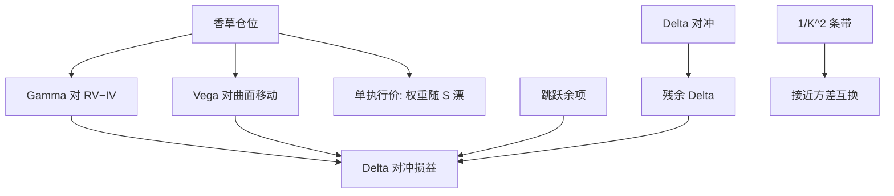

# 波动率套利

    
Delta 对冲后的香草损益，领头项是 Gamma 对已实现方差与隐含方差之差的积分；它看起来像套利，实际上是卖出（或买入）一条在崩盘时赔钱的风险因子。

    <footer>—— 复制骨架见 Carr and Madan, 1998；Delta 对冲收益与负的波动率风险溢价见 Bakshi and Kapadia, Review of Financial Studies, 2003</footer>

交易台把「隐含对已实现」叫做波动率套利：买低估的期权、卖高估的期权，Delta 对冲标的，让 PnL 跟方差缺口走。Carr–Madan 的对数复制说明，若你真能持有 $1/K^2$ 条带，标的接近方差互换，模型依赖被压到跳与离散误差上。实务里的「vol arb」却几乎总是有限的执行价、离散对冲、买卖价差，以及指数与个股混在一个账本里。Gurdip Bakshi 与 Nikunj Kapadia（2003）证明：买入期权并 Delta 对冲，平均收益为负——与 [波动率风险溢价](/quant/variance-risk-premium) 同号。本篇写 Gamma–Theta 核算、它与方差互换的距离、以及为何这不是蝶式那种静态套利。对象对齐见 [隐含 vs 已实现](/quant/iv-vs-rv)；条带权重见 [方差互换复制](/quant/var-swap-replication)。

## 问题

Black–Scholes 下，连续对冲、无跳、以 $\sigma_{\mathrm{imp}}$ 定价并以同一 $\sigma$ 对冲时，期权价值沿 PDE 滑动，Theta 与 Gamma 互相抵消。真实路径的瞬时方差是 $\sigma_t^2$，离散时刻的损益近似

$$
\mathrm{d}\Pi \approx \frac12\Gamma S^2\bigl(\sigma_t^2-\sigma_{\mathrm{imp}}^2\bigr)\,\mathrm{d}t
$$

再加上高阶与跳跃。多头期权在 $\sigma_t>\sigma_{\mathrm{imp}}$ 的时段赚钱，这就是 Gamma scalping 的来源。问题有三层。第一，单一执行价的 $\Gamma(S)$ 随现货移动，权重不是方差互换的 $1/K^2$，现货一旦远离执行价，你不再交易「纯方差」。第二，$\sigma_{\mathrm{imp}}$ 本身会变：Vega 与 Vanna、Volga 让曲面运动进入 PnL，对冲若只用 Black Delta，等于把微笑风险当 alpha。第三，平均而言 $\mathbb{E}^{\mathbb{Q}}[\sigma^2]>\mathbb{E}^{\mathbb{P}}[\sigma^2]$，买波动的期望是付保险费，不是领免费午餐。

因此「套利」二字在这里是行话。静态蝶式违例才是模型无关、持有到期的锁定价；vol arb 是带风险价格的相对价值，胜率来自溢价是否过高、对冲是否足够干净，而不是来自 $g(k)<0$。

### 从单期权到条带：何时才像方差互换

$\Gamma$ 在 ATM 附近最大、在两翼衰减。卖出平值跨式加 Delta，近似做空对 ATM 加权的已实现方差，对左翼跳的暴露小于方差互换（方差互换刻意重权重低 $K$）。买虚值看跌加 Delta，则在崩盘时 Gamma 爆炸，PnL 与保险更像。要把账做成接近 $K_{\mathrm{var}}-\mathrm{RV}$，应对一列执行价按 $1/K^2$ 配权，并随 $F$ 滚动——那已经是方差互换做市，不再是「挑一个 IV 看起来高的执行价」。Coval–Shumway（2001）对零 Delta 跨式收益的研究说明：即使 Delta 中性，期权组合仍有负的平均超额收益，来自波动与跳风险，不是来自 Delta 残余。

用 ATM 隐含减二十日历史波动当信号，测的不是公平 $K_{\mathrm{var}}$ 与合同 RV 的差。翼部、期限、年化约定都会造出假的「便宜」。

## 方法

**核算。** 每日把账拆成：Delta 残余、Gamma×（已实现方差）、Theta（隐含方差的时间衰减）、Vega×（隐含曲面移动）、跳。vol arb 的 alpha 应落在 Gamma 项相对入场时锁定的隐含方差；Vega 项是曲面观点，应单独限额。对冲频率提高能减小离散误差，但成本按买卖价差线性涨，最优频率随 $\Gamma$、波动与价差变化，见离散对冲误差一类文献，而不是固定五分钟。

**对象选择。** 指数上溢价通常更稳、翼更密，卖方差的容量大、回撤也更系统性。个股「IV 高」常常是借券、事件与做市摩擦，卖出后跳空一次可以吃掉数月 Theta。 dispersion 把指数与成分股的相对方差做成另一笔交易，见 [Dispersion](/quant/dispersion-trade)，不要和单名 vol arb 混成同一个信号。期限：短端跳风险占比高，长端更多是方差风险溢价与相关；把所有到期压成一个 IV−RV 排序会混两种风险。

**入场比较。** 公平对象是条带 $K_{\mathrm{var}}$（或 VIX 对三十天）对随后合同口径的 RV，而不是 ATM IV 对收盘标准差。Bakshi–Kapadia 的检验用 Delta 对冲的看涨组合，发现平均损失，且损失在高波动时期更大——与「保险在需要时赔钱」一致。策略若只用历史胜率、不看当时 VRP 水平与杠杆，会在溢价最薄的时候加仓。

### 对冲比：Black Delta 还是模型 Delta

用 $\sigma_{\mathrm{imp}}(K,T)$ 插入 Black 公式得到的 Delta，是 sticky strike 的一阶。市场偏斜更接近 sticky delta 或随现货上跳的杠杆，局部波动与随机波动给出不同的 $\Delta$。对冲误差的残差会表现为假的 vol arb PnL。实践是：Delta 用与记账模型一致的曲面（无套利插值上的 Black，或 Heston/SLV），并把剩余的 Vanna/Volga 用香草或方差产品收进桶里。不要用 Dupire 的 $\Delta$ 去对冲一个按 SVI 中间价成交的仓，却把残差叫「实现波动 alpha」。

## 机制

PDE 把期权的时间衰减钉在隐含方差上：市场按 $\sigma_{\mathrm{imp}}$ 收费。路径按 $\sigma_t$ 走，Gamma 是把二者差换成现金的杠杆。风险中性下这个差的期望被定价进权利金；物理测度下你赚不赚，取决于是否承担了方差因子。崩盘时 $\sigma_t$ 与跳同时出现，空头 Gamma 的损失与股票空头、信用空头同源——边际效用高的状态。这就是溢价的来源，也是「高夏普卖波动」在样本内好看、在 2008 与 2020 同时爆掉的原因。

曲面运动：即使已实现方差等于入场隐含，若偏斜变陡、ATM 上升，短 Gamma 仍可亏在 Vega 上。vol arb 账必须把「方差观点」和「微笑观点」拆开。后者是 [Skew](/quant/vol-skew) 与风险逆转，不是 IV−RV。相关崩溃时指数 IV 相对个股 IV 跳起，看起来像指数 vol 变贵，其实是相关溢价，应归 dispersion 而不是把指数当单名卖。

### 容量、保证金与杀开关

Gamma 在现货靠近执行价、临近到期时放大，保证金与交易所涨跌停使对冲无法执行，离散误差变成跳。容量受翼部深度限制：条带要加低 $K$ 时，那里买卖价差最宽。把 vol arb 做成「无方向」而堆杠杆，等于用保证金换尾部。风控应看压力情景下的 Gamma 再评估（现货跳 5%、IV 跳 10 个点），而不是看过去一年的日度夏普。

卖方平均赚钱不证明期权「标错价」。Bakshi–Kapadia 把平均负的 Delta 对冲收益解释为波动率风险的价格。策略评价应相对这笔溢价，而不是相对零。

## 边界与工程取舍

无跳、连续对冲、常数隐含波动的领头公式，在事件日失效。涨跌停与停牌截断 RV，合同与账簿口径必须事先一致。美式个股的隐含波动含早行权，IV−RV 比较会把早行权溢价当成「贵」。交易成本使高频 scalping 的理论 Gamma 利润消失；低频对冲则留下路径依赖。

Carr–Madan（1998）解释如何把波动变成可交易的欧式对象；Bakshi–Kapadia（2003）给出指数期权上风险溢价的证据。Sinclair 一类交易手册提供操作语言，不是定价定理。不要把 vol arb 写成 Dupire 校准误差，也不要写成蝶式扫描：前者是过程，后者是静态违例。A 股 50ETF 期权的涨跌停与 T+1 改变对冲可行性，把 VIX 策略参数直接搬到本地会低估跳空。

同一笔记若既扫静态负蝶式、又跑 IV−RV 排序，应分成两张单：前者能锁则先锁，后者永远带着方差因子。混在一个「套利」账户里，归因会把保险费当成 alpha。

波动率互换与方差互换的 PnL 差一项 Jensen。用波动率点做 vol arb 排序，会把凸性偏好写成错误定价。

## 小结

- Delta 对冲香草的领头 PnL 是 $\tfrac12\Gamma S^2(\mathrm{RV}-\mathrm{IV}^2)$，权重随现货漂，一般不是纯方差互换。
- 指数上买入并 Delta 对冲平均亏损，对应负的波动率风险溢价，不是免费套利。
- 核算须拆开 Gamma（方差）、Vega（曲面）、跳与离散对冲；信号应对齐条带 $K_{\mathrm{var}}$ 与合同 RV。
- 静态蝶式违例才是模型无关套利；vol arb 是带尾部的相对价值。
- 出处：Carr and Madan, 1998；Bakshi and Kapadia, *RFS*, 2003；对照 Coval and Shumway, *JF*, 2001；溢价见 Bollerslev, Tauchen and Zhou, 2009。
