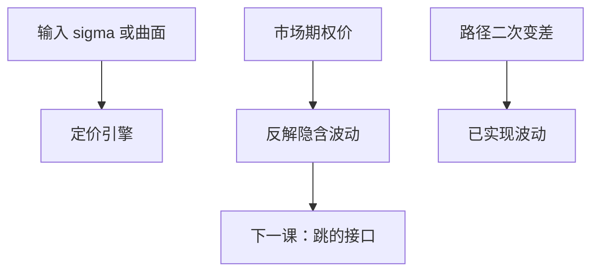

# 波动率是输入不是输出

BSM 把 $\sigma$ 当作方程的系数。市场把价格当输入、反解 $\sigma_{\mathrm{imp}}$。历史方差是另一套统计量，不是定价引擎的输出。

<footer>—— 据 Black and Scholes, 1973；Dupire, Pricing with a Smile, Risk, 1994；Gatheral, The Volatility Surface 整理</footer>

上一课[利率不是常数](/quant/stochastic-rate-preview)拆开了 $r$ 的三重身份。缺口是 $\sigma$ 同样被误用：有人从历史收益估计一个数，塞进 Black 当「模型输出的公平价」；有人从期权反解 $\sigma_{\mathrm{imp}}$，又把它当成预测未来已实现波动。本课钉死：在定价数学里 $\sigma$ 是输入；市场报价把它变成隐含量；已实现二次变差是路径泛函。三者同名，不是同一个对象。

## 问题

GBM 课里 $\sigma$ 进入 SDE 与 PDE，价格 $C(\sigma)$ 对 $\sigma$ 严格递增，故给定 $C$ 可反解唯一的 $\sigma_{\mathrm{imp}}$。缺口是解释这个反解：它是**报价的语言**，使不同 $K,T$ 的价格能画在一张波动率曲面上，不是从时间序列估计出来的参数，更不是本课序列要「算出来」的公平波动。历史波动 $\hat\sigma$ 是 $P$ 下的统计；定价用 $Q$ 下的输入。把 $\hat\sigma$ 填进 Black 得到的数，一般不是市场价。

微笑：$\sigma_{\mathrm{imp}}$ 随 $K$ 变，说明单一 GBM 被市场拒绝。模型可以换成局部波动、随机波动或跳，但每种仍先**输入**一组波动相关量，再输出价格。没有一种把「正确 $\sigma$」当作理论推导的终点。

### 隐含波动率不是对已实现波动的无偏预测

即使市场有效，$\sigma_{\mathrm{imp}}^2$ 对应的是 $Q$ 下的期望二次变差（在确定利率等条件下），与 $P$ 下已实现方差可以有方差风险溢价。用 $\sigma_{\mathrm{imp}}$ 去减后面的已实现，得到的是溢价，不是「市场预测误差」的定义。本课程不把溢价做成实证课，只禁止把三个 $\sigma$ 画等号。

Dupire 局部波动从整个微笑曲面反解 $\sigma_{\mathrm{loc}}(K,T)$，仍然是把价格当输入。曲面不够密或有套利时，反解不合法。

## 方法

接口三条。(1) 定价：指定 $\sigma$（或函数、或过程），输出 $V$。(2) 报价：指定 $V$，输出 $\sigma_{\mathrm{imp}}(K,T)$，用 Black 反解，以便插值与比较。(3) 风险：已实现 $[ \ln S]_T$ 沿路径累加，来自二次变差课，是 $P$ 的对象。对冲用的 Vega 是 $\partial V/\partial\sigma$，对的是输入参数，不是对 $\hat\sigma$ 的回归系数。

无套利约束：蝶式为正 $\Rightarrow$ 风险中性密度为正；日历价差约束期限方向。这些约束的是价格，翻译成 $\sigma_{\mathrm{imp}}$ 曲面的形状。校准必须先满足它们，再谈拟合误差。

## 机制

Black 公式对 $\sigma$ 的单调性让反函数存在，这是语言能成立的数学原因。市场用这门语言说话：交易员报的是 $\sigma_{\mathrm{imp}}$ 不是货币价格，但合约结算仍按价格。引擎若输出与市场 $\sigma_{\mathrm{imp}}$ 不一致的价格，差额是可交易的。历史估计没有这个直接对应，除非再加一层「如何把 $P$ 的 $\sigma$ 映射到 $Q$」——那是不全市场里选 $Q$ 的额外假设。

局部波动把微笑解释成 $\sigma(S,t)$，随机波动把微笑解释成相关的方差过程。它们改变输入的维度，不改变「先输入、后定价」的方向。本课程主干仍用常数 $\sigma$ 把公式写完；曲面是对照。

## 边界

本课不校准 Heston，不写 SVI 参数化细节。不进入限价簿上期权做市的微观结构。后课默认：写 BSM 时 $\sigma$ 是给定输入；比较市场用 $\sigma_{\mathrm{imp}}$；路径统计用二次变差。下一课[跳过程直觉](/quant/jump-process-intuition)说明连续路径假设本身也可以被市场拒绝。

## 小结

- 定价：$\sigma$ 是输入；市场：$\sigma_{\mathrm{imp}}$ 是反解的报价语言。
- 历史波动是 $P$ 的统计，默认不等于 $Q$ 的输入。
- 微笑否定单一 GBM，但不把「先输入」改成「先输出」。
- Vega 对的是模型输入，不是回归系数。
- 出处：Black–Scholes 1973；Dupire 1994。
