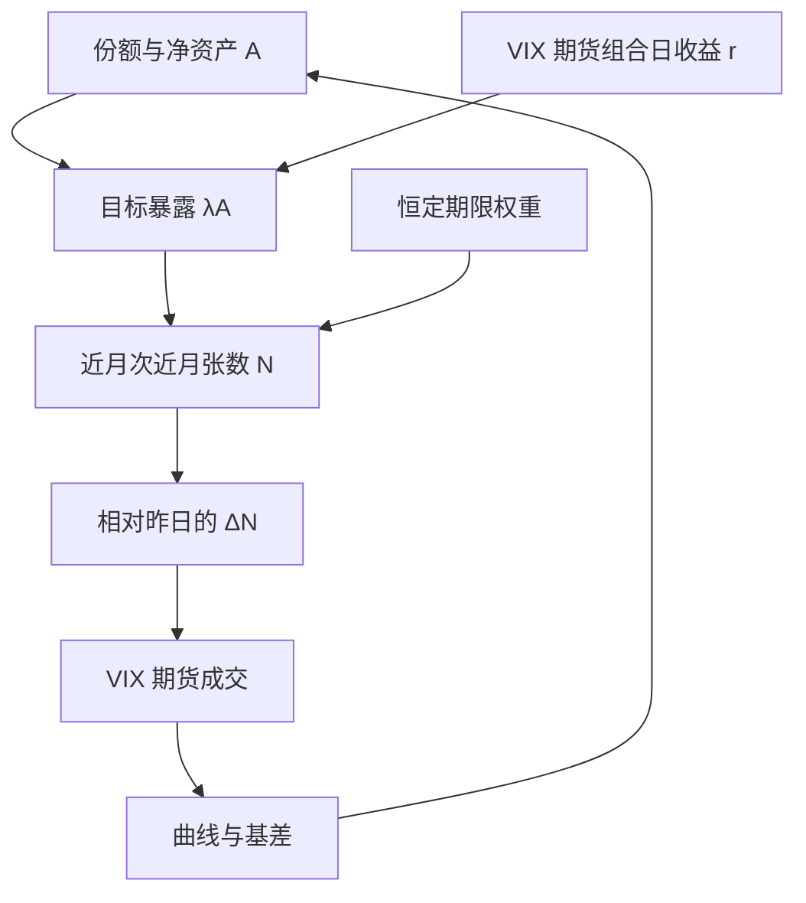

# Vol ETP 每日再平衡流

杠杆与反向波动率交易所产品为维持目标暴露，须在每个交易日近收盘按份额变动买卖 VIX 期货；这是公开的再平衡恒等式，在压力日会变成期货曲线上的冲击，而不是可日常抢跑的稳定日程。

<footer>—— 杠杆基金每日再平衡的代数是恒等式；VIX 期货 ETP 的展期与危机见 Alexander and Korovilas、Eraker and Wu 以及 2018 年 2 月反向产品终止的公开事后分析</footer>

VXX、UVXY、SVXY 一类产品把短期 [VIX 期货](/quant/vix-futures) 包装成股票代码：有的目标是恒定期限的多头方差暴露，有的再乘杠杆或取反向。为保持目标，管理人必须**每日**调整期货数量，并沿曲线展期以维持加权期限，见 [Contango](/quant/contango-backwardation) 与一般 [再平衡规则](/quant/rebalance-rules)。Alexander 与 Korovilas、Eraker 与 Wu 等把这类 ETP 的定价、展期损耗与反馈写成可检验对象；2018 年 2 月 5 日前后，反向产品在波动率急升中按规则买回期货，XIV 等终止，使「再平衡流」进入公共记忆。本篇写份额、杠杆与期货张数之间的公开恒等式，以及它何时大到足以冲击曲线。这不是教人在收盘前几分钟抢 ETP 执行的流程。

## 问题

记产品净资产为 $A$，目标对基准的杠杆为 $\lambda$（多头短期 VIX 期货 $\lambda=+1$ 或 $+1.5$，反向 $\lambda=-1$）。基准当日收益为 $r$（VIX 期货组合的日收益）。日初暴露为 $\lambda A$；基准走完 $r$ 后，期货市值变为 $\lambda A(1+r)$，产品净值约为 $A(1+\lambda r)$（忽略费、滑点与申赎）。目标暴露是 $\lambda$ 倍新净值，即 $\lambda A(1+\lambda r)$，须交易

$$
\Delta=\lambda A\bigl[(1+\lambda r)-(1+r)\bigr]=\lambda(\lambda-1)Ar.
$$

$\lambda=1$ 时 $\Delta=0$，非杠杆多头只需展期、不必为杠杆漂移调仓。$|\lambda|>1$ 或 $\lambda<0$ 时出现**额外交易**：与杠杆 ETF 相同，价格向不利方向移动会强制买入更多期货，向有利方向移动会强制卖出。波动率产品的特殊性在于基准本身是波动的期货，压力日 $r$ 极大，$A$ 也因申赎跳变，再平衡规模可以在一天内从可忽略变成曲线深度的可观比例。

第二个问题是展期。即使 $\lambda=1$ 的非杠杆短期产品，为维持约 30 天加权期限，也须卖近买远（升水曲线上持续亏损），见 [方差互换与 VIX](/quant/variance-swap-vix) 与期货基差。再平衡流因此有两层：**杠杆/反向的每日凸性交易**与 **期限结构上的展期**。媒体常把二者都叫做「VXX 在卖」，但驱动不同：一个来自 $r$ 与 $\lambda$，一个来自日历与曲线形状。

### 申赎、创建赎回与 A 的跳变

ETP 份额可创建赎回，$A$ 不是只跟 $r$ 走。散户在 RV 上升日买入多头产品，会放大次日须持有的多头期货；反向产品在平静日吸引资金，会在随后的第一天大涨波动里被迫覆盖。Bhansali、Tuzun 以及 2018 年的事后报告强调：流的规模是 $A$ 与 $r$ 的乘积，事后用「当天谁在交易」讲故事，不如先把恒等式算完。公开数据有份额变动与期货持仓报告的滞后版本，足够做日频规模估计，不够还原执行时钟。

把「收盘再平衡」画成每天下午 3:45 的固定钟点，忽略了授权参与人、期货流动性与产品说明书中的时间窗。恒等式约束的是**日终暴露**，不是撮合秒数。

## 方法

**期货张数。** 设近月、次近月权重为 $w_1,w_2$ 以匹配目标期限，$F_1,F_2$ 为点位，$M$ 为乘数。目标美元暴露 $\lambda A$ 换成张数

$$
N_j \approx \frac{w_j\,\lambda A}{F_j M}.
$$

日终把 $A$、$w_j$、$F_j$ 更新后重算 $N_j$，差额即须交易的张数。杠杆与反向还要把日间 $\lambda$ 偏离（因 $r$ 导致的实际杠杆漂移）一次性拉回，这就是再平衡单。

**规模相对深度。** 将 $| \Delta N |$ 对照该时段 VIX 期货的成交量与持仓。若占比低，反馈可忽略，产品只是曲线的被动客户；若占比在压力日升到双位数，才进入「流冲击曲线、曲线再冲击 $A$」的循环。2018 年 2 月的公共分析是这一循环的极端样本，不是日常基准。

**对照。** 非杠杆短期产品的展期损耗应对对照期限结构升水，而不是对照「操纵」。杠杆产品的方差损耗应对照 $|\lambda|(\lambda-1)$ 一类杠杆 ETF 公式。把所有亏损都叫做再平衡冲击，会混进早已定价的 [波动率风险溢价](/quant/variance-risk-premium) 与展期。

### 与经销商 Gamma 的关系

Vol ETP 交易的是 VIX 期货，不是 SPX 香草。对 SPX [GEX](/quant/gex-calculation) 的影响是间接的：VIX 期货冲击改变短端方差预期，香草微笑与经销商 vanna 可能联动，见 [Vanna / Charm](/quant/dealer-vanna-charm-flows)。不要把 UVXY 再平衡直接加进 SPX GEX。识别上，VIX 期货持仓有公开报告，比期权经销商符号更干净，但仍是滞后快照。

反向产品在波动上升日必须买入期货，符号与「做空波动的人在补仓」一致。这是规则，不是恐慌情绪的额外假设。情绪可以解释份额申购，不解释再平衡代数。

## 机制

升水曲线上，短期多头 ETP 系统性地卖便宜近月、买更贵次近月（或按权重滚动），期望持有收益为负，除非现货波动足够补偿。这是 roll yield，Alexander–Korovilas 与产品说明书都写过。杠杆凸性：多头杠杆在趋势日再平衡买入、在震荡日卖出，路径依赖与杠杆 ETF 相同。反向产品在 $r>0$（波动期货上涨）时实际 $|\lambda|$ 变大，必须买入期货把杠杆拉回，于是**越涨越买**，直到 $A$ 因净值下跌而缩小、或产品触发终止。2018 年 2 月：已实现与隐含急升，反向 AUM 仍大，再平衡买盘碰到流动性不足，期货与产品净值螺旋，监管与发行人按文件终止。机制是规则加深度，不是神秘的「收盘猎杀」。

对 VIX 曲线的反馈：可测的是压力日近月相对次近月的冲击、基差与成交。对 SPX 现货的反馈更弱、更间接。把每一次下午的 ES 波动写成「VXX 再平衡」通常过度归因。

### 日常与压力日应分开写

日常：份额稳定，$r$ 不大，$\Delta N$ 相对深度很小，再平衡是常规客户流，不构成策略。压力日：恒等式给出的 $|\Delta N|$ 可预先用盘中 $A$ 与 $r$ 的代理估计上界，风险系统可以提高 VIX 期货冲击假设。估计上界属于风险管理；把上界当成「在某分钟前交易」属于另一套需要执行数据的问题，公开说明书不提供。

## 边界与工程取舍

产品名会变、会终止、会改杠杆，历史序列要按当时说明书复原。欧洲与亚洲上市的同类产品有不同时钟，不能用美股收盘去对。VIX 只锚定 S&P 500 方差，商品或个股波动 ETP 是另一市场。不要用 ETP 净值去「预测 VIX」——净值是期货的滞后包装。不要把 XIV 的单日当成每日可重复的 alpha 来源：那是尾部加上产品设计。

正当用途：把 $\Delta N$ 当 VIX 期货市场的可计算客户流上界、把展期当持有成本、把压力日当流动性情景。与 SPX 经销商 Gamma 分市场写清。公开恒等式已经足够做风险，不必发明钟点配方。

杠杆波动产品的长期期望收益为负，主要来自升水展期与方差损耗，不是来自「每次再平衡都被抢跑」。用长期亏损证明存在可交易的再平衡 alpha，逻辑反了。

## 小结

- Vol ETP 的每日期货调整由目标杠杆、净资产与期限权重决定，是公开恒等式。
- 流包含杠杆/反向凸性与曲线展期两层；日常规模通常小，压力日可冲击 VIX 期货深度。
- 2018 年 2 月展示的是反向产品规则与流动性的螺旋，不是可复制的收盘策略。
- 对 SPX GEX 只有间接联系；VIX 期货与 SPX 香草应分列。
- 出处：Alexander and Korovilas；Eraker and Wu；杠杆 ETF 再平衡代数；产品说明书与 2018 年 2 月反向 VIX ETP 终止的公开报告；曲线见 Contango 与 VIX 期货定价。
