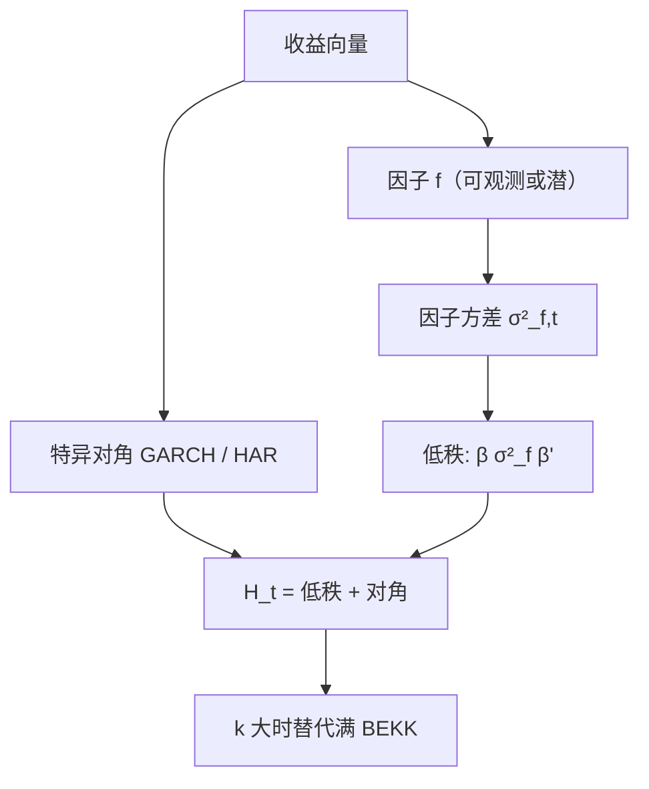

# 波动率因子模型

许多资产的条件方差一起涨落；用少数共同因子承担这部分，特异波动再各自一方程，维数从 BEKK 的矩阵落到因子载荷。

<footer>—— Diebold and Nerlove, The Dynamics of Exchange Rate Volatility: A Multivariate Latent Factor ARCH Model, Journal of Applied Econometrics, 1989；因子 ARCH 见 Engle, Ng and Rothschild</footer>

[BEKK](/quant/bekk-mgarch) 在小 $k$ 上给出满 $H_t$，大 $k$ 不可行。收益的因子模型 $r_t=\beta f_t+u_t$ 已经把均值–协方差的大部分写成 $\beta\,\mathrm{Var}(f_t)\,\beta^\top+\mathrm{Var}(u_t)$。波动因子模型让 $\mathrm{Var}(f_t)$ 与可能的共同特异波动再随时间变。Diebold–Nerlove 对汇率用潜因子 ARCH；Engle–Ng–Rothschild 把因子 ARCH 写成可估形式。本课缺口：用**共同波动**代替满矩阵 GARCH。下一课日内季节性把「共同」进一步拆成钟内模式——对象从日 $H_t$ 转到一天之内的确定性形状。

## 问题

股票在危机里相关升高，主要是共同因子方差升高，不是 3000 只股票的 BEKK 溢出。问题是估计：因子可观测（指数、FF 因子）还是潜的（滤波、PCA on squares）。可观测因子：对因子估 [GARCH](/quant/garch)/HAR，个股 $\sigma_{i,t}^2=\beta_i^2\sigma_{f,t}^2+\sigma_{e,i,t}^2$，特异再一元。潜因子：平方或 RV 的截面 PCA，取前几个成分当波动因子（类似 Connor–Korajczyk，但对象是二阶）。

对象是条件协方差的低秩部分加对角特异，不是已实现协方差的高频估计。与 [协方差收缩](/quant/cov-shrinkage) 分工：收缩是静态 $\Sigma$ 的正则；本课是动态 $H_t$ 的因子结构。

### 载荷时变

$\beta$ 若时变（Kalman、滚动），共同波动对个股 $H_t$ 的映射跟着变。危机里 $\beta$ 升与 $\sigma_f$ 升会纠缠。应声明：固定 $\beta$ + 时变因子方差，还是两者都变。两者都变则识别弱，需要状态空间约束，见 [Kalman](/quant/state-space-kalman-smoother)。

用指数已实现方差当 $\sigma_f^2$，再用日 $\beta$ 映射到个股，是工程上最稳的一档。个股 RV 对噪声更敏感，见 rv-noise。先共同、后特异。

## 方法

**可观测因子。** 市场 + 若干行业。因子方差：GARCH 或 HAR-RV。特异：对角 GARCH 或异质 HAR。相关升来自 $\sigma_f$ 升。评估：组合方差的 QLIKE，不是个股对角。

**潜因子。** 对 RV 面板或对 $|r|$ 做动态因子（Barigozzi–Hallin 一类）。滞后阶、因子个数用信息准则或边缘似然（接贝叶斯比较的精神）。平方的 PCA 会被离群日主导，应稳健或用 log RV。

**与 DCC。** DCC 让相关慢变、方差各走各的。因子模型让相关变化主要由因子方差驱动，更省、更符合「危机时相关升」。DCC 能描述因子结构解释不了的相关漂移。可以：因子 $H_t$ + 残差 DCC。参数仍要克制。

### 定价与风险

条件 CAPM 说 $\lambda$ 或 $\beta$ 时变。波动因子给出 $\beta_i^2\sigma_{f,t}^2$ 作为时变风险。是否定价是 [条件 CAPM](/quant/conditional-capm) 与 FM 的对象，本课只提供 $H_t$ 的构造。不要把波动因子载荷直接叫风险价格。

## 机制

共同冲击抬高 $f$ 的方差，所有暴露 $\beta_i$ 的资产方差与协方差同比例升（固定 $\beta$ 时）。这自动产生相关的逆周期：$\mathrm{Corr}_{ij}=\beta_i\beta_j\sigma_f^2/\sqrt{h_i h_j}$ 在 $\sigma_f$ 大时升高（若特异不太一起升）。机制是低秩，不是两两溢出。BEKK 的 $A_{ij}$ 试图描述的许多「溢出」，其实是共同因子。

测量：日平方当因子方差，噪声大，共同成分仍相对可估（截面平均）。个股特异噪声大，特异 GARCH 的 $\alpha$ 往往不稳——应对特异再收缩，接经验贝叶斯课。

行业因子既是收益因子也是波动因子。能源冲击日，能源股共同方差升，市场因子不够。因子名单应与均值模型对齐，否则 $H_t$ 的低秩部分指错空间。

### 到日内季节性的交接

日 $H_t$ 假定一天一个协方差。开盘 $\sigma$ 是收盘的数倍，把季节性塞进日 GARCH 会污染 $\alpha,\beta$。下一课把钟内确定性模式除掉，再谈随机波动与 RV。因子结构在日内同样存在（开盘共同忙），但先估季节，再估随机。

## 边界与工程取舍

潜因子个数随样本变，滚动重估会导致 $H_t$ 跳。IPO、退市让 $\beta$ 面板非平衡。外汇、商品的「市场因子」不如股票清晰，Diebold–Nerlove 的潜因子更对口。

工程：股票用可观测指数 RV + $\beta$ + 对角特异；汇率用低维潜因子 ARCH。评估组合 QLIKE。不要对个股满 BEKK。不要用 PCA on raw returns 的第一主成分当波动因子而不看平方——那是均值因子，对象不同。下一课：把一天之内的确定性波动形状从随机部分拆开。

## 小结

- 条件协方差的共同部分用少数波动因子承担，特异走对角，避免满 BEKK。
- 可观测因子加指数 RV 是稳妥工程；潜因子对汇率等无单一指数时需要。
- 危机相关升高可以是 $\sigma_f$ 升高的代数结果，不必两两溢出。
- $\beta$ 与 $\sigma_f$ 同时时变会弱识别；载荷空间应与均值因子对齐。
- 出处：Diebold and Nerlove, *Journal of Applied Econometrics*, 1989；Engle, Ng and Rothschild, *Journal of Econometrics*, 1990；动态因子后续见 Barigozzi and Hallin 等。
