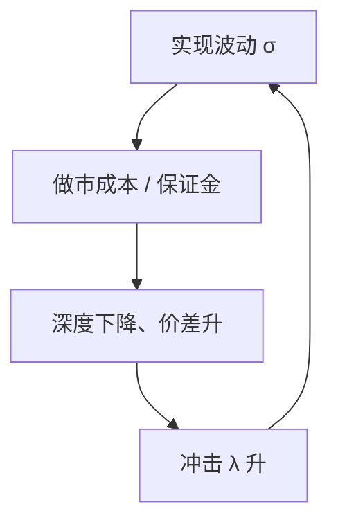

# 波动率-流动性反馈

波动上升提高做市的库存与被捡成本，价差加宽、深度下降；更薄的市场让同样的订单流把价格推得更远，实现波动再升。流动性与波动可以互相喂养，而不需要新的基本面方差。

<footer>—— Brunnermeier and Pedersen, Market Liquidity and Funding Liquidity, Review of Financial Studies, 2009</footer>

[做市义务与撤退](/quant/mm-obligations-withdrawal)给出压力期 $M$ 下降的开关。缺口是连续反馈：即使尚未完全离场，波动与流动性也可以沿螺旋走。Brunnermeier 与 Pedersen（2009）把市场流动性与融资流动性连在一起；Hameed、Kang 与 Viswanathan（2010）提供股票流动性共同恶化的证据。本课写微观结构内的螺旋，不把宏观杠杆周期整章搬进来。

## 问题

Ho–Stoll 的价差随 $\sigma$ 升。$\sigma$ 若用实现波动测量，而实现波动本身含微观结构冲击（$\lambda$ 变大时同样的 $u$ 造成更大 $\Delta p$），则 $\sigma$ 与 $\lambda$ 互为输入。Kyle 比较静态：$\lambda$ 随 $\sigma_V$ 升、随 $\sigma_u$ 降。压力期 $\sigma_u$ 往往降（策略噪声不敢来），$\sigma_V$ 后验升（事件不确定），两头夹击 $\lambda$。问题是写出最小闭环：深度下降 → 冲击升 → 实现波动升 → 库存成本升 → 深度再降，并指出何处可以切开（熔断、融资、义务）。

融资流动性：做市商用抵押融资持有库存，价格下跌触发保证金，被迫卖，进一步打薄。这是 Brunnermeier–Pedersen 的核心。纯微观结构螺旋在没有杠杆时也能存在，只要风控用实现波动。

### 与信息揭示的区分

多期 Kyle 里波动在揭示过程中可以升，那是学习。螺旋里的波动有暂时成分，回复后 VR 在短窗极低。识别：若收益在次日大部分拉回，更像流动性螺旋；若新的宏观消息保持低位，更像 $\sigma_V$。闪电崩盘是极端螺旋加回复。

Nagel（2012）指出 Evaporating liquidity 与 VIX、资金成本相关。本课把 VIX 当波动状态变量的代理，不进入期权定价。

## 方法

简化闭环。做市边际成本 $c\propto \sigma^2 / M$。深度 $D\propto 1/c$。冲击 $\lambda \propto 1/D$。实现波动 $\sigma^2 \approx \sigma_V^2 + \lambda^2 \mathrm{Var}(y)$。若 $\mathrm{Var}(y)$ 不完全随 $\lambda$ 下降而下降（市价单更急），系统可以有高 $\lambda$ 的不动点。融资约束把 $M$ 写成价格与保证金的函数，不动点可以突然跳到薄市场。

经验：用价差、深度、Amihud ILLIQ 对滞后实现波动回归，再把波动对滞后非流动性回归，看共同恶化是否在资金紧张期更强。必须控制公告，避免把信息当天叫做螺旋。

## 机制

两条腿。库存腿：$\sigma$ 进入 Ho–Stoll 宽度与限额距离。信息腿：$\sigma$ 被当成事件后验的证据，限价被捡升，Foucault 供给退。融资腿：抵押品价值与 haircut。三腿同向时，平静期 Menkveld 画像迅速失效。策略噪声若有择时，会在螺旋开始时离开，Admati–Pfleiderer 的热闹期在压力期反转成真空。

切开点：熔断停止 $\mathrm{Var}(y)$ 一段时间，让 $M$ 重新进入；FBA 降低狙击腿对 $\sigma$ 的贡献；义务把 $M$ 下界钉住。没有一刀切掉信息腿——该涨的风险溢价仍应涨。

## 边界

线性闭环会过度预测多重均衡。真实还有新做市商进入、对冲工具、央行流动性。个股螺旋与市场范围螺旋不同：后者更像融资与共同做市资本。把所有「涨时流动性好、跌时流动性差」写成 BP 螺旋，会忽略非对称信息在下跌时更严重（杠杆投资者被迫显示需求）。

执行上，螺旋期不能用历史 $\lambda$ 做 Almgren 轨迹。状态依赖冲击是最小修正，停下来等熔断结束往往优于假设深度还在。

下一课把不同品种的 $\lambda$ 与价差放到生意量上缩放，问螺旋的幅度能否在截面上搬运。本课的闭环只解释同一资产上的互推，不解释为何大盘与小盘的数字差一个数量级。

## 小结

- 波动进入做市成本，流动性进入实现波动，可形成无需新基本面的螺旋。
- 融资约束把 $M$ 内生化，使薄市场成为可能的跳变结果。
- 与学习造成的波动要用随后回复来区分。
- 出处：Brunnermeier and Pedersen, *Review of Financial Studies*, 2009；Hameed, Kang and Viswanathan, *Journal of Finance*, 2010。
