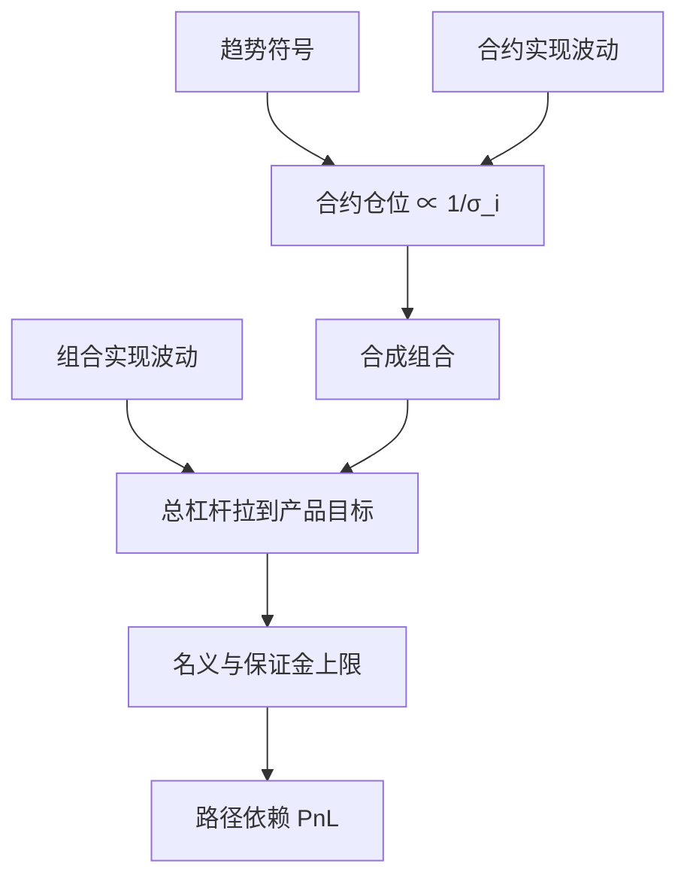

# 波动缩放仓位

时间序列动量把仓位写成趋势符号除以已实现波动再乘目标风险；没有这一层，高波合约会主导组合，夏普与左尾都会变差。

<footer>—— Moskowitz, Ooi & Pedersen, Time Series Momentum, Journal of Financial Economics, 2012</footer>

CTA 的方向来自趋势，但盈亏的尺度来自仓位。Moskowitz、Ooi、Pedersen 的单资产权重与 $\hat\sigma_{i,t}$ 成反比，目标常取较高的合约层波动再在组合层面对冲。Barroso 与 Santa-Clara 在股票动量上证明，对策略自身的已实现波动做缩放，能显著改善崩溃月。Moreira 与 Muir 把「波动管理」写成更一般的风险定价事实：低波动状态之后的夏普更高。本篇只管 **CTA 语境下的波动缩放**：它改变权重与杠杆路径，不创造新的方向信息；它减回撤，也可能在趋势加速的危机初段少赚钱。把危机 alpha 全部算进 $\mathrm{sign}(\cdot)$，会高估信号、低估风控规则。

## 问题

不加缩放时，名义等权的期货组合方差由原油、天然气、股指来决定，汇率与短端利率几乎不占风险。趋势信号即使在汇率上同样有效，也表现不出来。问题是把每条合约的风险贡献拉齐，使组合更接近「信息的等权」而不是「波动的等权」。第二个问题是时间序列上的杠杆：$\hat\sigma$ 低时加杠杆，$\hat\sigma$ 高时去杠杆。这既是对波动聚类的响应，也是一条与经纪商保证金平行的减仓规则，会在拥挤时变成市场供给。

识别上必须区分三种「波动」：合约已实现波动、策略组合已实现波动、隐含波动。CTA 主规则用第一种估权重；产品说明书盯第二种；用 VIX 对股指腿做第三种择时是额外赌注。混用而不声明，回测不可复现。

### 合约层：目标波动除以估计波动

MOP 的形式是

$$
w_{i,t}=\mathrm{sign}(r_{t-L,t}^{i})\cdot\frac{\sigma_{\mathrm{tgt}}}{\hat\sigma_{i,t}}.
$$

$\hat\sigma$ 常用日收益的 EWMA 或过去约两个月实现波动，年化时注意交易日数。$\sigma_{\mathrm{tgt}}$ 是规则参数，不是预测。估计窗太短，仓位抖动、换手上升；太长，对危机中的波动跳升反应迟钝。应预先固定衰减因子或窗口，并报告有无缩放两列夏普、偏度与最大回撤。缩放会改变有效杠杆，基准必须是同等目标风险下的被动组合，而不是未杠杆的现货指数。

波动缩放不是 Kelly。Kelly 用期望与方差决定最优分数；这里的 $\mathrm{sign}$ 不含幅度，期望被当成只来自方向。把 $1/\hat\sigma$ 解释成增长最优，会在信号失效时仍然加满杠杆。

## 方法

估计：对数收益、去周末与节假日、对跳空单独处理。股指与商品在公告日的实现波动会上升，EWMA 会在事后加一脚减速；这是特征还是缺陷，取决于你是否愿意在跳完之后还留着危机前的杠杆。上限：对 $\hat\sigma$ 设地板，防止平静期杠杆无穷大；对 $|w|$ 设天花板，防止单合约占满保证金。组合层再按总波动缩放到产品目标，避免「合约层已经 40%、十个同向合约合成远超说明书」。

诊断：把 PnL 拆成「方向对了」与「杠杆对了」。危机月里若方向对但缩放把名义砍光，危机 alpha 会小于未缩放版本——这不是 bug，是规则。应同时给投资者看：未缩放、仅合约缩放、合约加组合缩放三列。与风险平价的关系：等风险权重是截面上的 $1/\sigma$；vol targeting 是时间上的 $1/\sigma$。CTA 常常两者都做，杠杆对总波动的弹性大约是两层相乘。

### 策略层缩放与合约层缩放不是同一开关

Barroso–Santa-Clara 对股票 WML 的缩放，针对的是动量策略自身的波动爆发（动量崩溃）。CTA 的合约层缩放针对的是资产异质波动。两者可以同时开：先按合约 $1/\sigma_i$ 配权，再按组合 $\sigma_{\mathrm{port}}$ 调总杠杆。只开后者、合约仍等名义，高波商品依旧主导。只开前者、不开总杠杆上限，同向趋势时产品波动会漂。工程上这是两个旋钮，回测应做 $2\times 2$，而不是一个「vol target」标签。

## 机制

资产收益有波动聚类：高波动后往往仍高。若条件夏普在高波动状态更低（Moreira–Muir 的方向），则降低杠杆提高无条件夏普。趋势策略还有一条特有机制：波动上升常与转折或拥挤减仓同时发生，不加缩放会在最差流动性上留着最大名义。缩放提前减仓，牺牲趋势加速段的一部分利润，换更薄的左尾。

反向成本是「波动挤压」：平静期加杠杆，突然跳升时所有 vol target 账户一起卖，见[拥挤螺旋](/quant/crowding-spiral)。因此缩放改善的是单策略在外生波动下的风险调整收益；当策略本身大到推动波动，缩放变成内生反馈。容量评估必须把同业规则相关算进去。

### 估计误差会写成错误的杠杆

$\hat\sigma$ 向下偏，杠杆向上偏。用未调整的已实现波动、忽略隔夜、或在涨跌停下把零收益当成低波动，都会在国内期货上系统性加杠杆。隐含波动通常高于已实现，若用 IV 做缩放会整体更保守，并引入波动风险溢价的暴露。选择哪一种要写进说明书：CTA 传统用已实现，因为信号是价格趋势，风控也想跟已实现风险走；用 IV 是另一种产品。

目标波动定到 20% 再宣传「与论文同样的 40% 合约目标」，只是把组合层缩放藏进了营销。投资者看到的回撤由最终产品杠杆决定。信息比不会因为你把目标写大而提高。

## 边界与工程取舍

不要把波动缩放叫做新的 alpha 因子。不要在已经缩放后再用未缩放多头当基准。不要把 VIX 择时、合约 $1/\sigma$ 与组合目标三个开关搅在一个回测里只报最好的一列。保证金与变异保证金已经在高波时要钱，vol target 是额外的自选减仓；两者同日触发时，执行计划要预先错开，避免与清算盘抢价。

与 [BAB](/quant/frazzini-bab) 的差别：BAB 利用的是杠杆约束造成的 beta 定价错误；CTA 缩放是主动选择风险暴露。不要把低波超配与趋势 vol target 写成同一个「低波动溢价」。A 股与商品的涨跌停使 $\hat\sigma$ 在极限日失真，应使用限价调整或跳过该日的稳健估计。

出处：Moskowitz, Ooi & Pedersen, *Time Series Momentum*, JFE, 2012。策略波动管理见 Barroso and Santa-Clara, Journal of Financial Economics, 2015；Moreira and Muir, Journal of Finance, 2017。保证金螺旋见 Brunnermeier and Pedersen, RFS, 2009。

## 小结

- CTA 的波动缩放把仓位写成方向除以已实现波动，使风险贡献可比较，并在波动上升时自动降杠杆。
- 合约层 $1/\sigma_i$ 与组合层目标波动是两个开关；危机 alpha 有一部分来自后者而非符号函数。
- 缩放改善风险调整收益，但在拥挤的 vol target 同步减仓时会自我强化冲击。
- 估计窗、地板、上限与是否用隐含波动必须预先固定，并报告有无缩放的对照。
- 出处：Moskowitz et al., 2012；Barroso–Santa-Clara, 2015；Moreira–Muir, 2017。
