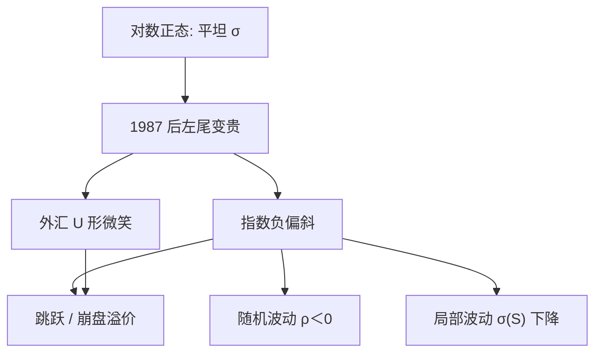

# Skew 与 Smile

    
1987 年之后，同一到期日的隐含波动率不再是一条水平线：股票指数上虚值看跌贵、虚值看涨相对便宜，切片呈现偏斜；外汇上则更常看到两端翘起的微笑。

    <footer>—— Rubinstein, Implied Binomial Trees, Journal of Finance, 1994</footer>

Black-Scholes 假定单一 $\sigma$，隐含波动应对所有执行价相同。经验不是这样。1987 年股灾之后，S&P 等指数期权的虚值看跌隐含波动显著高于平值，形成负偏斜（skew）；外汇与部分个股短到期更接近对称微笑（smile）。Rubinstein（1994）用隐含二项树从切片抽出风险中性密度，发现崩盘后左尾变肥。Merton（1976）的跳跃、Heston（1993）的随机波动、Bates 的跳加随机波动，都是为这一形状服务的动力学。偏斜不是「市场算错了 Black-Scholes」，而是 $\mathbb{Q}$ 下 $S_T$ 不是对数正态。本篇写形状的度量与经济来源，曲面的插值与无套利见 [隐含波动率曲面](/quant/vol-surface)，把切片变成 $\sigma(S,t)$ 见 [Dupire](/quant/dupire)。

## 问题

固定 $T$，把 $\sigma_{\mathrm{imp}}$ 对 $K$ 或对 $k=\ln(K/F)$ 作图。若函数不是常数，Black-Scholes 的单一对数正态被拒绝。要回答三件事：形状如何度量（斜度、凸度、翼）；它随 $T$ 怎样变（短端陡、长端平是典型期限结构）；何种机制能在无套利下生成它。机制候选包括：杠杆与负相关（股价跌则波动升）、崩盘恐惧与跳风险溢价、需求压力（组合保险买虚值看跌）、以及局部波动把密度扭曲成与切片一致。这些机制对香草可以给出相近切片，对障碍、远期起动与方差互换的价格与对冲却分歧，所以「拟合了微笑」不等于「模型对」。

风险中性密度相对对数正态的左尾更肥，表现为低执行价 $\sigma_{\mathrm{imp}}$ 更高。右尾在指数上通常不那么肥，故不是对称微笑。外汇因为两边都能暴动，更对称。个股还叠加借券费与破产跳跃，偏斜可以更陡。

### 度量：斜度、风险反转与蝶式

经验上常用 25-delta 风险反转 $\sigma_{25P}-\sigma_{25C}$ 表示斜度，蝶式 $(\sigma_{25P}+\sigma_{25C})/2-\sigma_{\mathrm{ATM}}$ 表示凸度。股票上斜度为负且大。对 $k$ 的导数 $\partial\sigma_{\mathrm{imp}}/\partial k$ 在 ATM 附近与风险中性偏度相联系（Bergomi-Guyon 一类展开），但只在短期限、近 ATM 的渐近里干净。远翼要用 Lee 的矩公式，不能把 ATM 斜度直线拉到 $k=\pm 2$。Rubinstein 的隐含树给出整段密度，比单看两个 delta 点完整，但对插值假设敏感。

把「skew」说成历史收益率的偏度，是另一组统计量。隐含偏斜是 $\mathbb{Q}$ 的对象，含风险溢价。1987 年后实现偏度也变了，但隐含左尾通常比历史左尾更肥，差的部分是崩盘溢价。

## 方法

跳跃：Merton（1976）让 $S$ 乘上泊松到达的随机因子，风险中性密度立刻有肥尾；短到期微笑最陡，因为扩散来不及，跳贡献占主导。Bates（1996）在货币期权上把跳与随机波动合在一起，短端靠跳、长端靠波动均值回复。随机波动：Heston 的 CIR 方差、$\rho\lt 0$ 的杠杆相关，生成负偏斜；均值回复使长到期切片变平。局部波动：$\sigma(S,t)$ 随 $S$ 下降也能生成负偏斜，且可精确拟合当日所有欧式，但当 $S$ 下跌时局部波动的未来切片会朝错误方向移动（著名的 sticky-delta / sticky-strike 与局部波动动态的冲突）。

混合是实践：短端跳或粗糙波动，长端随机波动，再用局部乘子贴残差。校准目标是切片上的 $\sigma_{\mathrm{imp}}$，不是历史 $\mathrm{d}S$ 的矩；历史矩属于 $\mathbb{P}$。也可以先用 Breeden-Litzenberger 抽出密度，再讨论密度的偏度峰度，而不立刻选模型。

### 期限结构与粘性规则

短 $T$ 的偏斜通常更陡：要在两周内产生大的左尾，需要跳或极高的瞬时波动。长 $T$ 被均值回复稀释。交易员用 sticky strike（$K$ 固定时 $\sigma_{\mathrm{imp}}$ 暂不变）或 sticky delta（按 $k$ 固定）作为对冲经验规则；这些规则与无套利动态一般不相容，只是局部启发式。Hagan 指出 SABR 的动态接近 sticky delta，而 Dupire 局部波动接近另一种错误的 sticky 行为，这是路径产品对模型敏感的来源。检验模型不能只看今日拟合，还要看 $S$ 移动后切片如何搬。

## 机制

对数正态下，$K$ 变只改变支付，不改变用来折现的波动参数。市场改变参数，等于说不同执行价「看见」不同的风险中性分布切片——其实是同一分布的不同积分，却被 Black-Scholes 错误坐标系读成不同 $\sigma$。负偏斜的经济内容是：下跌状态的状态价格更贵，要么因为那些状态概率更高（跳、杠杆），要么因为那些状态边际效用更高（风险溢价）。二者在欧式上无法分离，这是 $\mathbb{Q}$ 与 $\mathbb{P}$ 的老问题。指数看跌的需求（基金买保护）可以把溢价推得更高，形状里有「保险溢价」而不只是动力学。

凸性（smile 的 U 形）来自峰度：两边尾都比对数正态肥。纯跳对称、纯杠杆偏斜、二者叠加得既斜又弯。Rubinstein 发现崩盘后密度在低行权价出现额外质量，与「一次大跳」叙事一致，也与「波动在跌市中上升」一致。单凭切片不能判决。障碍期权、方差互换与远期波动协议才把动态暴露出来：局部波动通常低估 down-and-out 一类对路径的敏感，随机波动对 vanna、volga 的记账不同。

「市场在用错误的 Black-Scholes」这种说法容易误导。市场用 Black-Scholes 当计算器报 $\sigma_{\mathrm{imp}}$，定价内核早已不是常数 $\sigma$。偏斜是坐标系里的形状，不是有人不会积分。

### 杠杆、需求与风险溢价无法用切片拆开

$\rho\lt 0$ 的杠杆、虚值看跌的配置需求、崩盘状态的高边际效用，在欧式价格上可以给出相近的负偏斜。要分开它们需要 $\mathbb{P}$ 上的实现偏度、期权持仓或方差互换的风险溢价估计，单凭 $\sigma_{\mathrm{imp}}(K)$ 不够。指数与个股也不同：指数偏斜部分来自成分股跳跃的相关，个股还叠加破产与借券。把某一交易日的风险反转直接叫做「杠杆系数 $\rho$」，是把校准参数当成了因果分解。

## 边界

切片是边际。美式个股期权的隐含波动混了提前行权，偏斜会被股利与利率扭曲。借券费使合成远期偏离，虚值看跌与看涨的反解不一致，看起来像偏斜其实是持有成本。买卖价差在远翼可以「创造」假微笑。短到期的隔夜期权对跳极度敏感，模型若无跳就只能把瞬时波动推到不合理的水平。

历史偏度、隐含偏斜、实现偏度三者不要互相代替。用历史收益率去「验证」Heston 的 $\rho$，是 $\mathbb{P}$ 估计；用期权校准的 $\rho$ 是 $\mathbb{Q}$。符号通常同为负，数值不必相等。Rubinstein 1994 年的隐含树依赖当日无套利插值，不是唯一的密度估计器。Bates 的论文对象是马克外汇期权，把系数直接贴到今日的 S&P 不成立。

Heston（1993）给出随机波动的闭式特征函数，是微笑模型的工作马，但它的短端偏斜往往不够陡，这才需要跳或粗糙波动。拟合失败时不要只加参数，先看是短端还是长端在拒绝。

## 小结

- 隐含波动随执行价变化，常数 $\sigma$ 被拒绝；指数多为负偏斜，外汇多为微笑。
- 1987 年后左尾状态价格上升；Rubinstein 的隐含树显示肥左尾。
- 跳解释短端陡峭，随机波动加负相关解释期限结构，局部波动精确拟合当日欧式但动态差。
- 风险反转与蝶式是切片的交易度量；翼部受矩约束，不能直线外推。
- 欧式切片不决定过程；障碍与波动产品才能区分模型。
- $\mathbb{Q}$ 偏斜含风险溢价，不可等同于历史收益率偏度。
- 出处：Rubinstein, *Journal of Finance*, 1994；Merton, *JFE*, 1976；Heston, *RFS*, 1993；Bates, *RFS*, 1996。
