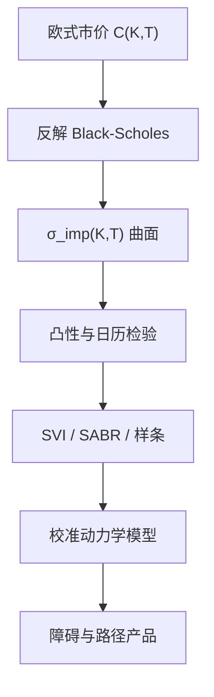

# 隐含波动率曲面

    
把每张香草期权的市价反解成 Black-Scholes 波动率，得到以期限与执行价为坐标的曲面；无套利要求该曲面对应的看涨价格在 $K$ 上凸、在 $T$ 上递增。

    <footer>—— Gatheral, The Volatility Surface, Wiley, 2006</footer>

市场不报 $\sigma$，报的是价格。交易员却几乎总把香草写成隐含波动率 $\sigma_{\mathrm{imp}}(K,T)$：同一个 Black-Scholes 公式，每个执行价、每个到期日塞进不同的 $\sigma$。曲面不是模型假设，而是坐标变换——把价格里的凸性与保险价值翻译成波动数字，便于插值、比较与对冲。1987 年之后曲面不再平坦，偏斜成为一等事实，见 [Skew 与 Smile](/quant/vol-skew)。Dupire 把整张欧式价格表翻译成局部波动，见 [Dupire](/quant/dupire)。本篇写曲面的定义、无套利约束与参数化，不把 Heston 或 SABR 的全部校准展开成另一本书。

## 问题

给定折现、远期与欧式看涨市价 $C(K,T)$，定义 $\sigma_{\mathrm{imp}}(K,T)$ 为使 Black-Scholes 公式等于 $C$ 的那个波动率。反解对 $C$ 严格单调，只要价格落在无套利界 $ (S e^{-qT}-K e^{-rT})^+ \le C \le S e^{-qT}$ 内，就存在唯一 $\sigma_{\mathrm{imp}}\ge 0$。问题是：离散的执行价与期限如何插成光滑曲面，使插值后的价格不出现静态套利；以及如何用少数参数（SABR、SVI）描述每个切片，并在期限之间拼接。

静态套利有两条硬约束。对固定 $T$，到期支付 $(S_T-K)^+$ 对 $K$ 凸，故 $C$ 必须对 $K$ 凸，蝶式价差非负；Breeden-Litzenberger 说 $\partial^2 C/\partial K^2 = e^{-rT} p^{\mathbb{Q}}(K)$，二阶导必须是密度。对固定 $K$（更精确是对日历价差的适当定义），更长期限的看涨不能更便宜，否则日历套利。Gatheral 把这些写成对 $\sigma_{\mathrm{imp}}$ 的微分不等式，比直接盯价格网格更符合交易习惯。

### 从价格到密度

$$
e^{-rT}p^{\mathbb{Q}}(K)=\frac{\partial^2 C}{\partial K^2}.
$$

数值二阶导对报价噪声极度敏感，直接差分会得到负密度。实践上先参数化切片再求导，或用光滑样条加凸性约束。密度的尾部对应远翼隐含波动：Lee（2004）的矩公式给出 $\sigma_{\mathrm{imp}}^2(K,T)T / \ln(K/F)$ 在 $K\to\infty$ 或 $0$ 时的极限与风险中性矩的关系，无界翼会蕴涵无限矩，与许多模型矛盾。插值不能在翼上任意拉直线。

隐含波动率是欧式香草的坐标，不是实现波动，也不是对冲时用的预测。用 $\sigma_{\mathrm{imp}}$ 当 $\Delta$ 的输入是「Black-Scholes delta」，用局部或随机波动的 $\Delta$ 是另一套数。混用会在偏斜上留下残余。

## 方法

切片参数化：SABR（Hagan et al., 2002）用 $\mathrm{d}F=\sigma F^\beta\mathrm{d}W$、$\mathrm{d}\sigma=\nu\sigma\mathrm{d}Z$，$\rho=\mathrm{d}\langle W,Z\rangle$ 控制偏斜，$\beta$ 控制骨干，$\nu$ 控制翼的弯曲；期限短时有近似闭式 $\sigma_{\mathrm{imp}}$。SVI（Gatheral）对每个 $T$ 写

$$
w(k)=a+b\bigl(\rho(k-m)+\sqrt{(k-m)^2+\sigma^2}\bigr),
$$

$w=\sigma_{\mathrm{imp}}^2 T$，$k=\ln(K/F)$。参数要满足无套利条件，Gatheral-Jacquier（2014）给出无套利 SVI 曲面（SSVI）的充分条件，避免切片拼接时日历套利。期限结构还可用凸组合总方差 $w(k,T)$ 对 $T$ 递增来约束。

插值：执行价方向用凸样条或 SVI；期限方向用总方差线性插值（在无套利区域内）比插 $\sigma_{\mathrm{imp}}$ 本身更接近日历约束。缺的执行价不要用 Black-Scholes 在相邻 $\sigma$ 上线性插价格——那会破凸性。外汇常用 delta 报价，股票常用执行价或对数执行价；转换时要固定是即期 delta 还是远期 delta。

### 校准与对冲坐标

校准是让模型产生的 $\sigma_{\mathrm{imp}}^{\mathrm{model}}(K,T)$ 贴近市场曲面。局部波动可以完美拟合今日曲面（在理想数据下），但动态差；随机波动拟合切片形状并给出微笑动态，却不一定过所有点；跳扩散解释短端陡峭。生产上常是「参数模型拟合切片 + 残差用局部波动或乘子补」。对冲时，曲面运动被分解成水平（ATM 升降）、倾斜、凸度，Cont-da Fonseca（2002）用 PCA 看曲面因子。做市的 vega 是对 $\sigma_{\mathrm{imp}}$ 的，不是对瞬时 $\sigma_t$ 的，转换要经过模型。

## 机制

Black-Scholes 公式在每一对 $(K,T)$ 上只是一个从价格到 $\sigma$ 的单调映射。整张曲面编码的是 $\mathbb{Q}$ 下 $S_T$ 的边际族（所有 $T$ 的分布），以及这些边际是否来自一个无套利过程。仅有边际不足以决定过程：局部波动、随机波动、跳跃可以共享同一组欧式价而给出不同的障碍与美式价。因此曲面校准香草，不校准路径产品——这正是要单独建模型的原因。

无套利曲面保证存在一个风险中性分布族与日历一致的看涨价格，不保证存在扩散过程。Dupire 在额外假设（纯扩散、无跳）下从曲面抽出 $\sigma_{\mathrm{loc}}(K,T)$。有跳时同一公式会给出「假」局部波动。交易上，曲面每日重标，参数漂移；静态无套利是相对当日报价表的，动态对冲误差来自曲面下一步怎么走，那是模型风险，不是蝶式约束能锁住的。

ATM 的定义有多种：执行价等于即期、等于远期、或 delta 中性。不同定义下「ATM 波动」差几个点是正常的。写曲面时要声明横坐标是 $K$、$k=\ln(K/F)$ 还是 delta。

### 报价惯例：执行价、对数货币性与 delta

股票期权常用执行价或 $k=\ln(K/F)$；外汇常用 10-delta、25-delta 的风险反转与蝶式。同一曲面在两种横坐标下形状不同，ATM 的定义也不同：即期、远期或 delta 中性。把外汇的 25-delta 点误当成股票的 $K=0.75S$，偏斜数字完全不可比。插值应在报价惯例的自然坐标上进行，再映射到 $K$ 去做蝶式检验。期限要用实际日历与营业日约定，短端隔夜与周末使 $T$ 的年化对 $\sigma_{\mathrm{imp}}$ 极敏感。

## 边界

离散执行价、买卖价差、过期近、远翼流动性差，使「唯一」反解在数字上不稳定。深度实值看涨几乎是远期，vega 接近零，反解 $\sigma$ 无意义，应用看跌或平价转换到虚值端。美式股票期权的市价含提前行权溢价，不能直接当欧式去倒 $\sigma_{\mathrm{imp}}$，要先剥美式或用欧式上市的指数期权。分红假设错误会把全部偏斜扭曲。

参数化过拟合当日会在次日参数乱跳，对冲比率不稳。SABR 的原始 Hagan 展开在翼上可以破无套利，需要修正或改用精确数值。Gatheral 的书是系统整理，不是 1973 年的定理；Black-Scholes 原论文假定单一 $\sigma$，没有曲面。引用时应把「坐标系」和「生成模型」分开。

隐含波动率曲面描述的是欧式边际。用它直接给美式看跌定价，等于忽略了执行策略对过程假设的依赖。至少要把曲面映到一个过程（局部波动或带跳），再对过程做美式，而不是把 $\sigma_{\mathrm{imp}}(K,T)$ 塞进 Black-Scholes 美式公式里当常数。

## 小结

- $\sigma_{\mathrm{imp}}(K,T)$ 是把欧式市价经 Black-Scholes 反解得到的坐标，不是常数模型假设。
- 无套利要求看涨对 $K$ 凸、日历价差合理；二阶导给出风险中性密度。
- 翼部由矩约束（Lee）限制，不能任意线性外推。
- SABR 与 SVI 是切片的常用参数化；SSVI 提供跨期限无套利的一类充分条件。
- 曲面固定的是边际族，不固定过程；路径产品要另选动力学。
- 美式、价差与分红假设会污染反解，应在虚值欧式上工作。
- 出处：Gatheral, *The Volatility Surface*, 2006；Breeden and Litzenberger, *Journal of Business*, 1978；SABR 见 Hagan et al., *Wilmott*, 2002；SSVI 见 Gatheral and Jacquier, *Quantitative Finance*, 2014。
