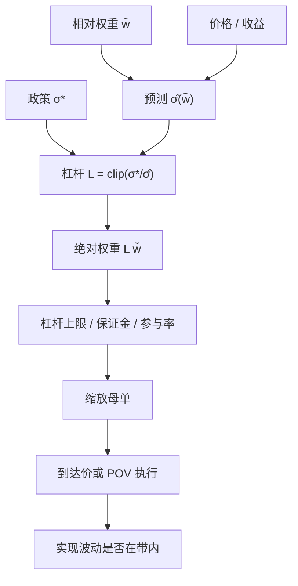

# 波动目标 vol targeting

    
把名义仓位乘上目标波动与预测波动之比，组合的事后波动被钉在一条可审计的带子上；代价是：预测所用的实现波动一跳，你就必须交易，而且往往是在压力里减仓。

    <footer>—— 据 Moreira and Muir, Volatility-Managed Portfolios, Journal of Finance, 2017；对照 Merton 连续时间下的比例仓位</footer>

给定期货、因子组合或风险预算解出的相对权重 $\tilde w$，波动目标（volatility targeting）再乘一个标量 $L_t$，使预测组合波动 $\hat\sigma(L_t\tilde w)$ 等于政策值 $\sigma^\star$。Moreira 与 Muir（2017）表明，用滞后已实现波动缩放的「波动管理」组合在若干资产类上提高了样本内夏普——不是因为会预测收益，而是因为收益的条件均值不像方差那样涨。Merton 对数效用下最优仓位含 $1/\sigma^2$；波动目标通常只用 $1/\sigma$，相当于假定条件夏普稳定、只修风险单位。本篇写预测、缩放、再平衡与执行，强调它是风险规则而不是 alpha。它与[Kelly](/quant/kelly-sizing) 相邻：Kelly 还要用 $\mu$，波动目标故意不用。

## 问题

无约束的相对权重 $\tilde w$ 在低波动期会给出过小的绝对风险，在高波动期给出过大的绝对风险。投委会用「年化 10% 波动」说话，交易账本却按名义或按合约张数说话。两者之间必须有一条每日可复现的映射。问题是选择 $\hat\sigma_t$ 的定义、$\sigma^\star$ 的水平、对 $L_t$ 的平滑与上限，以及当缩放要求大额买卖时如何执行而不把冲击写进「风险没管住」。

若 $\hat\sigma$ 用极短窗口，目标会被隔夜跳空和单日平方收益绑架，$L_t$ 高频抖动，换手接近日频择时。若用过长窗口，压力到来时杠杆降得太慢，目标名存实亡。若 $\sigma^\star$ 本身随制度切换（牛市抬、熊市压），规则已经掺进观点，不能再称为纯波动目标。执行问题与[风险预算再平衡](/quant/rb-rebalance)耦合：总杠杆 $L_t$ 变了，即使相对权重不动，所有名字都要按比例买卖。

### 目标的是波动，不是夏普

缩放 $L_t=\sigma^\star/\hat\sigma_t$ 使 $\mathbb{E}[\sigma_{t+1}\mid \hat\sigma_t]\approx\sigma^\star$ 只在预测无偏且冲击可忽略时成立。它不最大化夏普。Moreira–Muir 的经验规律——高波动期事后夏普并不更高——是对「波动目标伤害收益」这一担忧的部分回答，不是定理：一旦策略的 $\mu$ 在高波动期上升（某些趋势或危机 alpha），减仓会砍掉边缘。把波动目标的样本夏普增益写成「证明该策略该上杠杆」，是把一条风险规则的回测结果当成了 alpha 发现。

$L_t\propto 1/\hat\sigma_t$ 与 $L_t\propto 1/\hat\sigma_t^2$ 差一阶。后者更接近 Kelly / Merton，对波动估计更敏感，杠杆在低波动期膨胀更快。政策文件必须写明用的是哪一个；口头都叫「波动目标」时，两套规则的换手可以差一倍。

## 方法

预测端常用：过去 $k$ 日已实现波动、EWMA、[GARCH](/quant/garch)、隐含波动或已实现核。组合级应直接预测 $L\tilde w$ 的波动，而不是对每个资产预测再合成——合成要处理相关，相关在压力里失效。对期货可以按合约的美元波动（价格 $\times$ 乘数 $\times\hat\sigma$）分配张数。杠杆上限 $L\le L_{\max}$、单名参与率上限、保证金缓冲应与 $\sigma^\star$ 同时写入，否则低波动期会把名义加到不可执行或不可融资的水平。

平滑：$L_t$ 对 $L_{t-1}$ 做 $\mathrm{EWMA}$ 或对 $\hat\sigma$ 做下限（vol floor），避免 $\hat\sigma\to 0$ 时杠杆发散。带宽：仅当 $|\hat\sigma-\sigma^\star|>\delta$ 才调整 $L$，与权重再平衡的阈值同构。离散再平衡日（例如每周）把交易赶到固定日期，便于容量规划，但会在周中波动跳升时让实现波动暂时越带。

$$
L_t=\mathrm{clip}\Bigl(\frac{\sigma^\star}{\hat\sigma_t},\,L_{\min},\,L_{\max}\Bigr),\qquad
w_t=L_t\,\tilde w_t.
$$

$\tilde w$ 可以来自风险平价、风险预算或趋势信号；波动目标只负责标量。若 $\tilde w$ 每日大变，再叠 $L_t$ 的日频调整，换手归因必须拆开：一块是信号，一块是缩放。

### 执行：缩放日的母单是「全市场同向」

$L$ 下调 20%，几乎所有风险资产都要卖一截（对多头组合）。这与个股 alpha 再平衡不同：相关性极高，冲击与流动性枯竭同时出现。期限 $T$ 不宜按「把临时冲击摊平」无限拉长——目标之所以存在，就是为了在波动升高时尽快降风险；但也不应在开盘集合竞价用市价一次甩出，那会把缺口集中在最差的价格发现窗口。实务是把缩放母单按[到达价格](/quant/arrival-price)或带[参与率封顶](/quant/participation-cap)的日程执行，并允许当日实现波动短暂越带。期货与 ETF 通常比一篮子股票更适合承担缩放腿，股票腿留给相对权重。

核对：事后实现波动是否落在 $\sigma^\star$ 的带子里（含执行延误）；缩放交易的实施缺口；以及「若把 $L$ 的调整推迟一天」的反事实风险——用来衡量执行耐心的代价。不要用包含缩放交易本身冲击的价格去证明 $\hat\sigma$ 预测准确。

## 机制

机制的第一句是风险的近齐次：名义乘 $L$，波动近似乘 $L$。第二句是波动聚类：高 $\sigma$ 之后仍高 $\sigma$，所以用滞后 $\hat\sigma$ 缩放不是无谓的。第三句是杠杆与流动性的反馈：许多人同时用实现波动降杠杆时，卖盘制造更多实现波动，Brunnermeier–Pedersen 一类螺旋把外生的 $\sigma^\star$ 规则变成内生冲击。波动目标在单个账户里是稳定器，在拥挤的同质规则里是放大器。

Moreira–Muir 讨论的经验机制是方差风险溢价与收益的弱条件关系：高波动期平均回报没有同比例上升，降低暴露提高了单位风险回报。这是无条件样本里的统计，不是执行保证。另一些机制对执行更要紧：隐含波动领先已实现波动时，用 IV 缩放会更早减仓，也可能在 IV 偏贵时过度收缩；用已实现波动则落后，在跳空日早上仍保持高杠杆。

### 与风险预算、Kelly 的接口

波动目标钉 $\sigma(w)$；风险预算钉贡献份额。可以先预算再缩放，也可以只缩放一个风险平价组合。Kelly 同时用 $\mu$ 与 $\sigma$：边缘消失时 Kelly 应降杠杆，波动目标若夏普已坏仍维持 $\sigma^\star$，会稳定地生产风险而没有补偿。工程上波动目标更可审计，Kelly 更接近增长最优；把纸面 $\mu$ 塞进 Kelly 再宣称「比波动目标科学」，通常只是把估计误差翻译成更高杠杆。

目标波动 $\sigma^\star$ 的单位必须是实现度量的单位：日波动年化、还是指数期货的年化、是否包含隔夜。用日间已实现去钉含隔夜的政策带子，杠杆会系统性偏高。

## 边界与工程取舍

跳跃、涨跌停、停牌使 $\hat\sigma$ 与可交易波动脱节：价格没动不是风险消失。A 股 T+1 使当日买入的股票不能用于当日降杠杆的卖出腿，缩放应优先发生在可回转的期货与 ETF 上，见 [T+1](/quant/cn-tplus1)。期权、信用、私募等非线性资产的「波动」不是 $\sqrt{w^\top\Sigma w}$，标量 $L$ 不能当万能乘数。

不要在全样本上搜 $\sigma^\star$ 与窗口 $k$ 使夏普最大：那是把风险规则当成因子来过拟合。应先由政策与回撤容量定 $\sigma^\star$，再选预测器使越带频率可接受。不要把波动目标当成容量工具：降杠杆减少名义，但拥挤日所有人都降，市场深度同时下降。核对应分体制：平静期是否过度加杠杆、压力期是否来得及降、执行短fall 是否把实现波动重新抬起。

「我们做 10% 波动目标」若未声明预测器、再平衡频率、杠杆上下限与执行算法，只精确到宣传。内部应给出越带天数、缩放换手、以及缩放腿相对到达价的缺口。

## 小结

- 波动目标用 $L_t=\sigma^\star/\hat\sigma_t$ 把绝对风险钉在政策带子上，一般不用 $\mu$；与 Kelly 的 $1/\sigma^2$ 不同。
- Moreira–Muir 的样本内夏普增益来自条件风险与条件收益的不对称，不是执行定理，也不能用来事后挑选 $\sigma^\star$。
- 缩放日的母单高度同向，应与个股相对再平衡分开，并受参与率与可回转工具约束。
- 预测器窗口决定换手与滞后；过短噪声交易，过长则压力里降杠杆太慢。
- 同质规则在拥挤时放大抛压，平静期校准的冲击会失效。
- 出处：Moreira and Muir, *Volatility-Managed Portfolios*, Journal of Finance, 2017；Merton, *Lifetime Portfolio Selection under Uncertainty*, Review of Economics and Statistics, 1969；Kelly, *A New Interpretation of Information Rate*, 1956。
