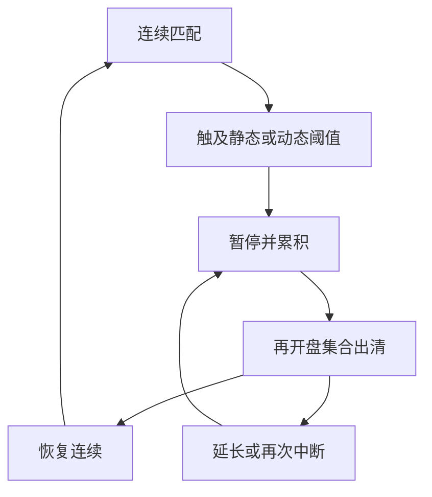

# 波动性中断与再开盘

交易暂停把连续匹配关掉，不是把价格发现关掉；再开盘集合要在一段极端到达之后重新找到可交易价格，而日历上的开盘并没有这段刚刚中断的连续历史。

<footer>—— 据 Christie, Corwin and Harris 对 NASDAQ 交易暂停的研究；对照 SEC Limit Up–Limit Down 与各交易所波动性中断规则</footer>

[开盘与收盘集合竞价](/quant/opening-closing-call)给出了日历上预先安排的两场拍卖。本课的缺口是**状态触发**的暂停：价格相对参考价移动过快、触及静态或动态阈值，连续协议被强制换成集合协议，然后再开盘。Christie、Corwin 与 Harris 表明，暂停之后的恢复质量取决于暂停期间信息是否仍在别处交易、以及再开盘如何组织。LULD、欧洲的波动中断、A 股的临时停牌与盘中临停，同属这一族，参数不同。本课不重讲批量出清公式，只补：触发、冻结、再开盘与连续段重启。

## 问题

连续段的价差会计假定匹配一直开着。极端到达时，做市商撤出、深度空洞、市价沿空簿扫出离谱成交。监管与交易所用波动性中断（volatility interruption / auction halt）把时钟切成：触发 → 暂停/累积 → 再开盘出清 → 恢复连续。问题是这把刀切在哪。阈值太宽，等于没有保护；太窄，正常的跳价也会把股票反复送进拍卖，流动性被制度本身切断。参考价用谁——前一次拍卖价、一段时间的成交均价、还是指数挂钩的参考带——决定「波动」测量的是个股跳跃还是共同冲击。

与涨跌停的差别必须写清。涨跌停是价格栅格的硬边界，匹配可以继续，只是一侧没有对手价。波动中断是**停止匹配**一段时间。A 股涨跌停与临停并存：停板时连续仍可能排队，临停则进入停牌状态。把 LULD 的经验数字直接当成涨跌停的成本，对象错了。

### 暂停期间信息在哪交易

若同一证券在期货、ETF、暗池或海外上市处仍在交易，暂停只关掉了一张簿，没有关掉价格发现。再开盘时，公开股票簿必须一次性吸收别处已经写出的价格，跳价会显得「拍卖很差」，其实是连续段被关掉的后果。Christie–Corwin–Harris 对 NASDAQ 暂停的讨论，核心就是暂停是否伴随信息继续流动。单市场、单上市的股票，暂停更接近真正的信息真空，再开盘更像一次小型开盘。

参考价若用「最后一笔连续成交」，而最后一笔已是扫空簿的离谱打印，中断会被自己的错价触发。规则通常用一段时间的参考价或排除异常打印。研究样本必须用交易所定义的参考价，不能自己用最后成交重算阈值。

## 方法

事件研究以触发时刻 $t_0$ 为原点。记录：触发前 $k$ 秒的深度与价差、触发原因（静态带 / 动态带 / 监管停牌）、暂停时长、再开盘是否延长、出清价相对触发前中点与相对参考价的位置、再开盘量、恢复连续后价差与深度回到中位的时间。对照组用未触发但收益同样大的日子，否则会把「大新闻」与「中断制度」混在一起。

再开盘集合沿用先修课的出清语言：最大成交量、剩余处理、是否披露虚拟价。与日历开盘的差别应单独成列：开盘前有隔夜订单簿的累积；波动中断前有刚刚还在报价的做市商，他们可能已经撤光。恢复连续后第一批报价的宽度，是存货与逆向选择在极端事件后的重新开张，不要并入全日平均价差。

### 阈值、延长与「再次中断」

动态阈值随近期价格移动，静态阈值相对前收或前一次拍卖。两者同时存在时，慢牛可以用完静态带而不触发动态带，闪崩则先撞动态带。再开盘若仍无法在阈值内出清，规则允许延长累积或再次中断。样本里「一次中断」可能是一串中断，统计上应把串当成一个事件，否则暂停次数被制度的递归放大。执行算法必须把中断写成状态机：暂停期能否改单、再开盘是否自动转入、失败后订单是过期还是留到连续。回测若在中断期仍按历史成交价给你成交，是在虚构对手盘。

## 机制

中断的直接机制是停止错误价格上的匹配，让买卖双方在集合里重新显示需求。间接机制是协调：所有人知道暂时不能成交，抢跑连续簿的价值下降，但抢虚拟参考价的价值上升。若再开盘披露不平衡，博弈类似收盘拍卖；若不披露且时长很短，更像蒙眼批量。做市商在触发前的撤单，使中断看起来像「流动性消失」；中断本身又使流动性合法地消失一段时间。要把这两种消失分开：前者是代理人选择，后者是规则。

对价格发现：中断推迟了连续写入，把一段信息压进再开盘跳价。若信息是共同的（指数闪崩），个股再开盘应对齐期货与 ETF；若信息是个股的（公告误发、乌龙指），再开盘应对齐公告文本的时间戳。把所有再开盘跳价都叫「发现价值」，会把乌龙指的回吐也算进 alpha。

[Kyle](/quant/kyle-model) 的批量拍卖没有「先连续再强制改集合」这一段历史。波动中断的 $\lambda$ 若用中断窗口的收益对成交量来估，分母接近零、分子是跳价，数字会爆炸。应把中断事件从连续 lambda 样本里剔除，单独报告。

### 乌龙指与公告停牌不要进同一事件样本

价格路径触发的中断与待披露公告的监管停牌，外形都是暂停再开盘，信息集完全不同。混样会把「规则切断匹配」与「公司即将说话」估成同一个再开盘质量。事件表必须用交易所原因码，不能只用收益率阈值。

## 边界

监管停牌（待披露公告）与波动中断外形相似，信息集不同：前者常伴随即将发布的公司信息，后者常伴随已经发生的价格路径。不要合并样本。跨上市股票在一处中断、别处仍开，套利约束决定再开盘价，个股拍卖质量不能当单市场实验。加密永续的标记价格与分档强平是另一套中断，见[标记价格](/quant/crypto-mark-price)，不要把 LULD 的阈值语言套过去。

本课不提供如何在中断边界上下单以获取优先成交的操作说明。研究问题是制度如何改变连续价差会计的样本：哪些分钟必须从有效价差均值里拿掉，哪些再开盘必须当集合事件。

A 股盘中临停、临时停牌与涨跌停是三条规则。临停有时长与复牌集合；涨跌停不一定停牌。写代码时用交易所状态字段，不要用「收益率超过 10%」当停牌代理。

## 小结

- 波动中断把连续协议暂时换成集合协议，触发是状态依赖的，不是日历。
- 与涨跌停不同：中断停止匹配；停板仍可能排队。
- 再开盘质量取决于暂停期信息是否在别处交易，以及披露与延长规则。
- 事件研究要对照「同样大的未中断日」，并把连续中断串当成一个事件。
- 连续 lambda 与全日价差均值必须剔除中断窗口。
- 出处：Christie, Corwin and Harris, *Journal of Financial Economics*, 2002；Corwin and Lipson 对纽约暂停的相关工作；LULD 与各交易所公开的波动性中断规则。
