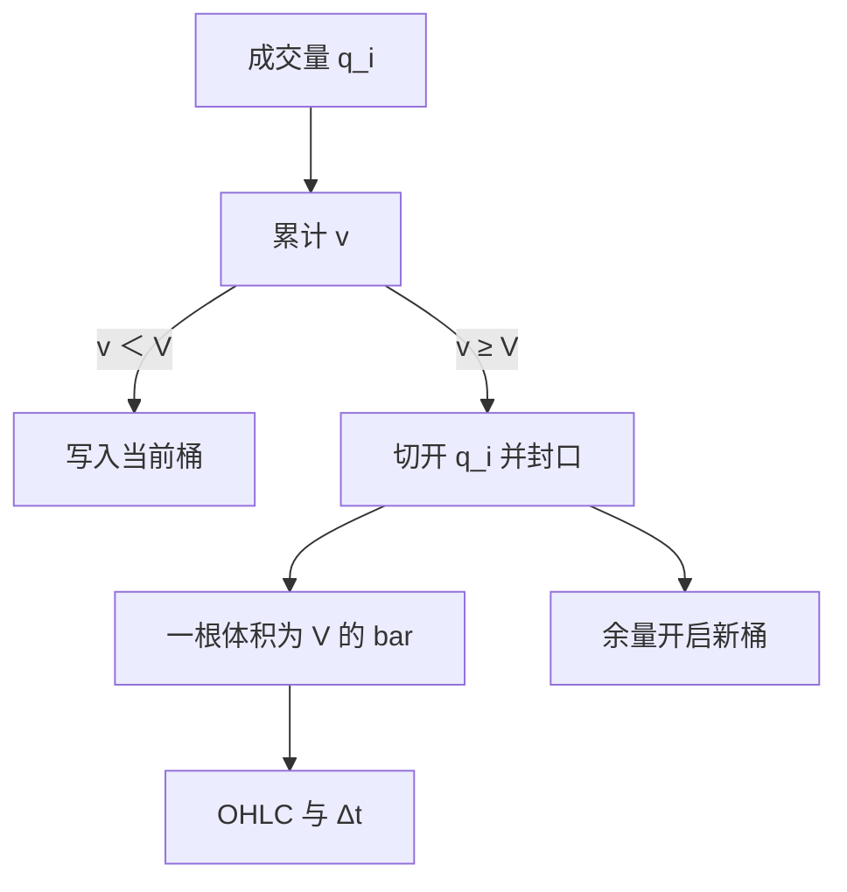

# Volume bars

每累积固定股数或合约数就封一根 bar。成交加快时时钟走快，空窗不再被当成一步；每根 bar 转移的是同量的可交易单位，而不是同样多的打印次数。

<footer>—— Easley, López de Prado & O'Hara 的成交量时钟；López de Prado 将等体积采样收成 volume bars</footer>

[Tick bars](/quant/tick-bars) 让每根 bar 的成交笔数相同，但仍让一笔 100 股与一笔 10 万股平权。[VPIN](/quant/vpin) 已经把毒性放在等体积桶上，因为做市商被消耗的是深度，不是打印次数。**Volume bars** 是同一成交量时钟的 OHLC 版本：累计成交量达到 $V$ 就封口，输出开高低收与时间戳。López de Prado 把它放在活动同步采样的第二档。本篇写 $V$ 的单位、跨桶切分、以及它相对 tick 与 [dollar bars](/quant/dollar-bars) 的识别差异。

## 问题

冲击、存货、毒性都随**数量**走。同样 100 笔，可能总共只有很少的股数，也可能扫掉若干档。tick bars 在算法切片加密时会疯狂封口，经济规模却很小。时钟 bars 在开盘把大量体积糊进一根分钟线。volume bars 要对齐的问题是：每一步完成大约同等的风险转移（在价格尚且稳定时，股数是风险的代理）。价格若在样本里变了一个数量级，等体积就不再等名义，这是 dollar bars 要接手的场景。

定义问题：成交量用股数、手数还是乘数后的合约单位？复权、拆股如何进入累计器？同一毫秒多笔是先加总再判断封口，还是逐笔累加并在跨越 $V$ 时切开？这些选择改变 bar 的边界，从而改变高低价与收益。采样方案是估计量的一部分。

### 累计到 V 并切开跨桶成交

成交按时间排序，维护累计 $v$。第 $i$ 笔数量 $q_i$，若 $v+q_i\lt V$，则并入当前桶；若 $v+q_i\ge V$，则 $q_i$ 被切开：前 $V-v$ 封旧桶，余量开启新桶。一笔大单可以连续封掉若干根 bar。开盘价是桶内第一笔（或切分后的第一截）价格，收盘价是封口那一截的价格。高低在桶内所有成交价上取。

$$
\text{封口当且仅当}\quad \sum_{i\in\text{桶}} q_i = V.
$$

$V$ 常取过去 $n$ 日均成交量的 $1/50$ 或 $1/100$，使全日大约几十到上百根 bar。固定 $V$ 跨年时，成交量趋势会让近年 bar 变密或变稀；可用滚动中位数更新 $V$，但要避免用未来成交量设今天的 $V$。

切开大单不是可选优化。若整笔并入下一根 bar，单笔 3$V$ 会制造一根体积为 3$V$ 的异常 bar，等体积性质被破坏。VPIN 与 BVC 的桶同样要求切开。

## 方法

清洗后按单一市场、单一合约累计，避免把两个场所的量加总成虚假的 $V$。复权：在原始股数上累加、事后只对价格复权，或全程用复权量，二者不可混。输出每根 bar 的墙钟长度 $\Delta t_j$，它是活跃度的对偶：$\Delta t_j$ 短表示成交密。可以把 $\Delta t_j$ 当作特征，但不要再把收益除以 $\sqrt{\Delta t_j}$ 却声称仍在成交量时钟上——那是把序列拉回日历强度。

齐次性检查：bar 收益的标准差是否比分钟线更稳定、成交笔数变异是否仍大。若笔数变异极大，说明体积由少数大单主导，volume bars 接近「大单时钟」，tick 结构被吃掉。此时可同时输出 bar 内笔数，作为质量标记。与 [BVC](/quant/bulk-volume-classification) 衔接：BVC 默认就在 volume bars 上算 $\Phi(\Delta P/\sigma)$；先锁 $V$，再谈分类。

### V 随制度与会话变化

开盘集合竞价可能一笔打出全天 10% 的量，第一根 volume bar 在开盘瞬间封完，高低价是拍卖价，几乎没有路径。连续盘的 $V$ 若沿用这个节奏，开盘后会连续封许多根几乎同价的 bar。会话应分开设 $V$，或把拍卖排除在连续 volume bars 之外。涨跌停时量仍可堆积、价格不动，volume bars 继续封口但收益为零——这是制度，不是低波动。

## 机制

成交量时钟的机制是：信息到达伴随成交，等体积的一步更接近「同等多次的深度消耗」。做市商按数量补货，毒性按数量累积，因此 VPIN 选这一时钟。相对 tick bars，volume bars 对拆单不那么敏感——一百笔小单若总量仍是 $V$，只封一根。相对时钟，它在闪崩里自动加密：墙钟几分钟可以对应几十根 bar，路径被保留。

失败机制：成交量可以没有信息，例如指数再平衡、到期滚月、开盘拍卖。这些机制性体积会让 volume bars 在没有价格发现时仍快速封口，收益接近零或被制度约束。另一失败是价格水平变化：一只股票从 10 元涨到 100 元，同样 $V$ 股的名义金额变了十倍，等体积不再等风险。长期样本应改 dollar 或按浮动 $V$。

### 与时钟 RV 的关系

在成交量时钟上算已实现方差，是对时间变形后的过程求和。它回答「每转移 $V$ 股，二次变差贡献多少」，不直接回答「这一日历日的波动是多少」。要回到日历日，把当日所有 volume bars 的 $r_j^2$ 加总即可，这与把一日切成等体积再求和相同。不要把单根 volume bar 的 $|r_j|$ 当成「分钟波动」去和 VIX 比。隔夜没有成交，volume 时钟无法跨越，隔夜收益必须在日历上单独处理。

多资产 refresh time 若定义成「各资产都成交了 $V$」，会被最不活跃的成分拖死。更常见的是各资产自己走 volume bars，协方差再用重叠时间对齐。不要假装存在统一的全球成交量时钟。

## 边界与工程取舍

不要用分钟线的成交量列去构造 volume bars——分钟内顺序丢失，切开无法做。不要把期货手数与股票股数的 $V$ 放在同一张表比较 bar 密度。换月时旧合约体积枯竭，$V$ 应跟主力合约走，并在换月日切断。A 股有最小交易单位与涨跌停，零收益的 volume bars 在停板日会成串出现，应标记而不是当作平稳样本。

Tick bars 回答笔数齐次，volume bars 回答数量齐次，dollar bars 回答名义齐次。三者不是精度递进，而是不同的「一步」。毒性与冲击优先体积；跨年份、跨价格水平的特征优先金额；消息到达的点过程优先笔数。写方法时用目标选时钟，而不是默认「高频就用 volume bars」。

出处：Easley, López de Prado & O'Hara, RFS 2012（成交量时钟与等体积桶）；López de Prado, *Advances in Financial Machine Learning*（volume bars 作为采样菜单的一档）。BVC 见 Easley 等, JFE 2016。

## 小结

- Volume bars 每累积固定成交量 $V$ 封一根，跨桶成交必须切开。
- 等体积对齐的是深度消耗，不是打印次数，也不是名义金额。
- $V$ 应用历史滚动量设定，避免用未来；拍卖与连续盘应分开。
- 与 BVC、VPIN 共用同一封桶纪律。
- 机制性放量与价格水平变化会破坏「等风险」解读。
- 日历波动是当日各 bar 的 $r_j^2$ 之和；单根 bar 不是分钟波动。
- 出处：Easley–López de Prado–O'Hara；López de Prado, AFML。
