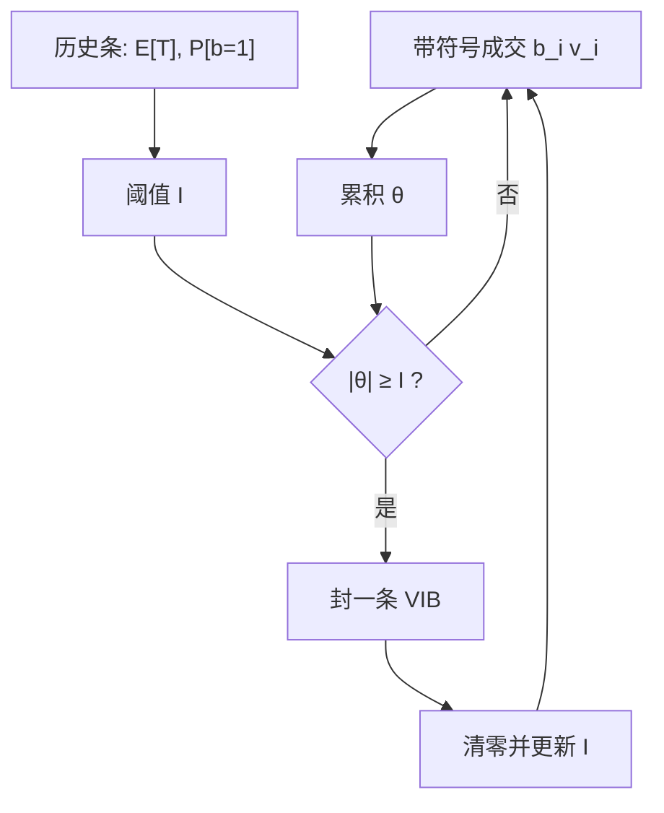

# 成交量不平衡条

信息到来时，买卖方向会在成交量上持续偏向一侧；让采样边界跟着这种不平衡走，条带就会在有内容的时候变密，而不是在墙上时钟上均匀切开。

<footer>—— 据 Easley, López de Prado, O'Hara 对成交量时钟的论述，以及 López de Prado, Advances in Financial Machine Learning 对不平衡条的构造</footer>

日历 K 线把一天切成等长格子，[事件时间](/quant/event-time) 按消息或成交计数前进，等体积条则每累积固定股数封一桶——[VPIN](/quant/vpin) 用的就是后一种时钟。成交量不平衡条（volume imbalance bars, VIB）再往前一步：桶的边界不再由「已经成交了 $V$ 股」单独决定，而由带符号成交量的累积何时越过阈值决定。方向持续的时候，同样的日历时段会被切成更多条；来回洗刷、符号对冲的时候，一条可以跨过很长的墙钟。本篇写这种采样的定义、阈值如何随历史更新、以及它相对等体积桶与 [盘口不平衡](/quant/order-imbalance) 的分工。它是研究用的时钟，不是一份保证能挖出 alpha 的因子配方。

## 问题

微观结构里「一步」应当对应一轮有经济含义的消耗或信息写入。等间隔分钟线在开盘把几十笔方向相同的主动单压成一根 OHLC，在午间又制造许多空步。等体积条纠正了活跃度不均，但仍把「有方向的流」和「无方向的对敲」等权：两边各成交 $V/2$ 与单边成交 $V$，对毒性与冲击的含义完全不同，却同样只产出一条。VPIN 是在等体积桶**内部**再看不平衡；若不平衡本身才是该加密采样的对象，边界就应该由不平衡触发。

López de Prado 把这类对象叫做 imbalance bars：用 tick 规则（或更可靠的成交分类）给每笔一个符号 $b_i=\pm 1$，再对成交量加权求和。问题收成三件可操作的事：符号从哪来、阈值怎样避免被一笔大单永久锁死、以及封条之后如何把价格、量、方向汇总成一条不泄漏未来的记录。

### 带符号成交量何时构成一条

记第 $i$ 笔成交量为 $v_i$，符号 $b_i$。从上一根条结束后起算

$$
\theta_t=\sum_{i=t_0}^{t} b_i v_i.
$$

当 $|\theta_t|$ 首次超过阈值 $I_t$ 时封条。$I_t$ 不是任意常数：通常写成期望条长（按笔数或按无条件量）乘上期望不平衡比例。若历史里买卖接近各半，阈值低，条更密；若市场本来就单边，阈值升高，避免把趋势里的每一笔都切成独立条。与 [订单流不平衡 OFI](/quant/ofi-cont) 的差别是：OFI 是簿事件的会计，VIB 是成交量时钟上的**采样规则**。二者可以同时算，但不要把 VIB 的 $\theta$ 叫做 OFI。

tick 规则用涨跌相对上一笔成交价定符号，在一字板、拍卖与自成交里会整段同号。分类误差直接进入 $\theta$，条的边界会跟着错。能用交易所标记的主动方向时，应优先用标记，并把规则写进研究说明。

## 方法

实现上维护两个累加器：无符号量 $V_t=\sum v_i$ 与带符号量 $\theta_t$。每来一笔就更新，一旦 $|\theta_t|\ge I_t$ 就输出一条：开高低收用该区间成交价，成交量用 $V_t$，不平衡用 $\theta_t$，墙钟起止一并保留。然后把累加器清零，用刚完成的条去更新 $I$ 的指数平滑——例如平滑期望笔数 $\mathbb{E}[T]$ 与买入比例 $\mathbb{P}[b=1]$，使下一根的阈值反映近期体制，而不是全样本一个数。

阈值必须对异常成交稳健。一笔占全日很大比例的大宗若整段计入，会瞬间封出一根几乎没有内部结构的条，并把随后的 $\mathbb{E}[T]$ 拉歪。处理是研究选择：截尾、拆成多笔、或把超过某分位的量单独标记为「强制封条但不参与阈值更新」。清洗见 [异常成交](/quant/outlier-trades)。A 股午休应切断累加，否则上午尾与下午开被连成一根跨越制度的条。

### 与等体积条、VPIN 桶的对齐

等体积条的边界是 $V_t=V^\ast$，与 $\theta$ 无关；VPIN 在每个等体积桶里估计买卖量再算不平衡。VIB 把「不平衡够大」提成封条条件，因此条的体积是随机的：单边市里条短而密，来回市里条长。若要把 VIB 拿去喂 VPIN 一类毒性指标，分母不再是常数 $V$，跨条比较必须改用 $|\theta|/V$ 或显式报告每条的 $V_t$。更干净的做法是：毒性仍用等体积时钟，VIB 专供需要「信息到达时加密」的特征与标签对齐——例如下一根条的收益，而不是下一分钟的收益。

标签与特征必须落在同一套边界上。用 VIB 当特征、用分钟收益当标签，等于把不等间隔的 $X$ 对等间隔的 $y$ 回归，空步与爆发会改写有效样本权重。事件驱动回测应按条的结束时刻决策，并加上行情到下单的滞后。

## 机制

机制叙事来自 Easley–O'Hara 的序贯交易：知情到达会使买卖强度失衡，非知情对敲则让符号在短窗内对冲。$\theta$ 的随机游走在无信息时方差增长但均值接近零，要很久才碰到阈值；有信息时 $\theta$ 带漂移，很快封条。于是 VIB 自动在「可能有人对价值表态」的时段提高分辨率。这与 Hawkes 描述的成串到达相容：成串若同向，不平衡加速积累；成串若是买卖互激，则 $\theta$ 对冲、条变长——时钟区分了「热闹但无净方向」与「热闹且有净方向」。

它解释不了价格为何移动。封条只说明带符号量越过了阈值，中点变动仍取决于当时深度、OFI 与隐藏流动性。把 VIB 当成冲击模型，类型错了：冲击要数量对价格的函数，采样规则只决定你在哪些时刻去观察这个函数。同样，VIB 密不等于毒性高——开盘的机制性单边也会密。毒性还要看不平衡是否在多条上持续、以及事后价差，见 [订单流毒性](/quant/ofi-toxicity)。

### 条带内部的路径仍被压扁

即使边界由不平衡决定，一条内部仍可能先买后卖再买。OHLC 与净 $\theta$ 保留的是端点与极值，格子内的队列消耗顺序对限价成交仍是实质。需要路径时，应在条内保留事件序列或至少保留主动买量、主动卖量两条，而不是只存一根净不平衡。VIB 解决的是**何时切开**，不是把微观结构账做完。

金额不平衡条把 $v_i$ 换成 $p_i v_i$，见 [金额不平衡条](/quant/dollar-imbalance-bars)。价格水平相差大的截面里，成交量条会过度采样低价股；同一标的的研究里两者往往高度相关，真正的差别出现在拆细、分红与价格台阶之后。

## 边界

VIB 依赖成交分类与阈值自适应。分类噪声大时，条边界变成分类器的函数，样本外不可比。阈值若更新太快，会把刚刚出现的单边写进「正常不平衡」，随后漏掉真正的加速；更新太慢，则体制切换后会连续切出过密或过稀的条。应报告阈值的半衰期，并做固定阈值的对照。

不要在集合竞价的一次性撮合上跑连续 $\theta$。不要把 VIB 的条数当作「信息事件个数」去讲故事——阈值与分类规则能把条数改一个数量级。多市场合并时，各交易所成交时钟不同步，把所有成交倒进一个 $\theta$ 会把延迟当成领先；应锁定一本市场的撮合时间。回测里用当日全体成交去估 $\mathbb{E}[T]$ 是前视；只能用过去的条。

不平衡条加密的是有净方向的流，不是把未来收益提前写进当前条。若标签用了条内最后一笔之后才公开的信息，那是标签泄漏，与采样规则无关，见 [前视偏差](/quant/look-ahead-bias)。

## 小结

- 成交量不平衡条在带符号成交量越过自适应阈值时封条，使采样在方向持续时加密。
- 它是时钟，不是 OFI，也不是 VPIN：后两者在给定窗口内计量流量，VIB 决定窗口本身。
- 符号分类、大单截尾、午休切断与阈值半衰期，都是方法的一部分。
- 条密不等于知情；机制性开盘与互激对敲会给出完全不同的 $\theta$ 路径。
- 特征与标签必须共用边界；用分钟收益去对 VIB 特征会扭曲样本权重。
- 出处：Easley, López de Prado, O'Hara 关于成交量时钟与 VPIN 的工作；不平衡条的操作性定义见 López de Prado, *Advances in Financial Machine Learning*。
