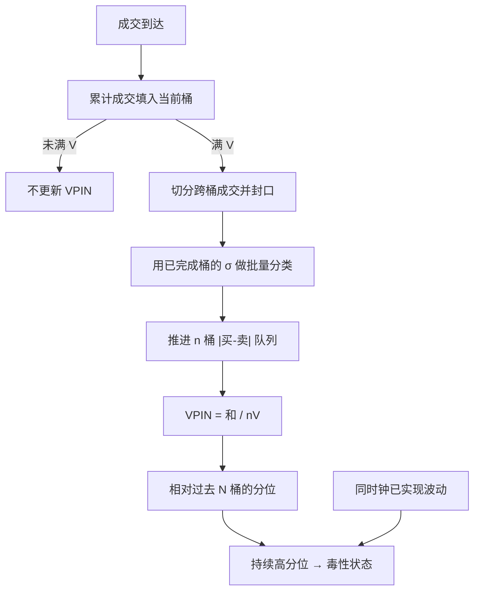

# VPIN 实时毒性

毒性是流量而不是月末参数：等体积桶每封一次口，不平衡就可以更新一次，做市商不必等日历日结束才知道自己正在被知情单消耗。

<footer>—— Easley, López de Prado, O'Hara, Flow Toxicity and Liquidity in a High-Frequency World, Review of Financial Studies, 2012</footer>

[上一课](/quant/roll-effective-spread)把负的一阶协方差开方当成无中点时的隐含有效宽度；协方差为正应报告失败，有 BBO 时用直接有效价差。缺口是盘中毒性仪表：日度 PIN 等不到收盘，日历窗又把开盘脉冲糊成一点；[VPIN](/quant/vpin) 的成交量时钟在概念上已经写过，尚未落成流式——桶未满要不要输出、 $\sigma$ 用哪一段、分位会不会每天机械报警。本课钉实时 VPIN。不重讲 Roll 的鞅假设。后课 OFI 默认仪表更新时刻是桶封口，不是墙上每秒一次。

## 问题

Roll 给出无中点时的隐含宽度；盘中毒性等不了收盘似然。日度 PIN 要等收盘后才有 $(B,S)$ 计数，再跑混合泊松似然。盘中做市的存货与报价修订等不了这个周期。日历五分钟窗则在开盘把许多事件糊成一点、在午后把空窗当成平稳。成交量时钟的好处是：成交越快，桶封得越快，指标更新越密。实时问题是：桶尚未满 $V$ 时，要不要输出一个「部分桶」的 VPIN？分类用的 $\sigma$ 是用已完成桶还是用正在填充的价格？分位阈值用过去多少桶、是否含当天已封的桶？

第二件事是运维而不是公式。毒性仪表若驱动自动撤单，开盘集合竞价后的成交脉冲会让第一批桶迅速封口，批量分类把开盘方向标成极端买或卖，VPIN 机械跳高。这是交易机制，不一定是知情涌入。实时系统必须把「机制性脉冲」与「持续同向不平衡」分开，否则仪表本身会在每天同一时刻报警。

### 流式对象：未完成桶与已完成窗

记桶体积 $V$，滚动长度 $n$。状态是：当前累计成交 $v\lt V$、当前桶开盘价、已完成桶的 $(V^B,V^S)$ 队列、以及最近桶收益的波动估计 $\sigma$。只有当 $v$ 跨过 $V$ 时才封桶、才更新 VPIN。未完成桶若提前按 $v$ 缩放不平衡，等于让最后一截噪声以满桶权重进入分子，实时序列会在封口前抖动。默认应只在封桶时更新；若需要更密的心跳，应单独定义「预览 VPIN」，不要与研究用的封桶 VPIN 画在同一张图上当互相复制。

实时 VPIN 的时间戳是桶封口的交易所时间，不是墙上每秒一次。成交稀疏时，仪表可以十分钟不动；闪崩时可以一秒封许多桶。用时钟采样去画它，会把「更新变密」误读成「数值变大」。

## 方法

成交到达时累加数量（或金额，须预先锁定），直到 $\sum q \ge V$。跨桶的一笔成交要切开：前半填满旧桶并封口，余量开启新桶。封口时取桶内开盘与收盘（或首末成交价），做批量分类

$$
V^B = V\cdot Z\bigl((P_{\mathrm{close}}-P_{\mathrm{open}})/\sigma\bigr),\qquad V^S=V-V^B,
$$

$Z$ 为标准正态 CDF。$\sigma$ 用**已完成**桶收益的滚动标准差，不要用正在填充的桶去更新 $\sigma$——否则分类与波动在同一笔数据上互相定义，实时值会对最后一笔极端成交过度反应。把新桶的 $\lvert V^B-V^S\rvert$ 推进长度为 $n$ 的队列，

$$
\mathrm{VPIN}=\frac{\sum_{\tau=1}^{n}\lvert V_\tau^B-V_\tau^S\rvert}{nV}.
$$

分位阈值在过去 $N$ 个已完成 VPIN 上取，例如 90%、95%。$N$ 应覆盖多个交易日，避免当天上午的高位成为下午的「正常」。参数 $(V,n)$ 仍按[概念篇](/quant/vpin) 对齐做市存货与毒性消化速度；实时并不提供新的最优参数，只提供更新纪律。

### 分类规则在流式里的代价

批量分类便宜，对报价延迟不敏感，但把价格变化写进订单流，VPIN 与已实现波动共享信息源。Tick 规则或交易所「主动买」标志更接近方向，却要求可靠的 BBO 对齐，延迟一毫秒就会把一串成交标反。实时系统若在延迟高的通道上用 tick 规则，毒性会跟着喂送质量跳，而不是跟着知情到达跳。折中是：主序列用批量分类，对照序列用主动标志；只有当两者同时进入高分位，才触发撤挂，而不是让单一 CDF 报警。

多市场加总时，同一套利腿会在两个通道各记一次不平衡。实时尤其危险，因为腿间到达几乎同时，VPIN 会把一对冲交易读成双倍毒性。应按可成交的综合簿或按主上市地单通道计算，并在文档里写死。

## 机制

原作者的机制是：知情流在成交量时钟上留下持续同向不平衡；做市商若按日历时间补货，会在毒性已高时仍维持窄价差，直到存货被打穿。实时更新让这条机制变得可操作：连续若干桶的 VPIN 处在历史高分位，是撤掉被动挂单、拉宽价差的候选状态。预警的时间尺度是「若干桶」，不是「若干分钟」——桶在加速成交里可以对应很短的墙钟。

竞争性机制不需要知情者：波动上升时 CDF 把每桶标成极端方向，VPIN 被推高。实时对照应在同一成交量时钟上并排已实现波动或绝对桶收益。若 VPIN 分位的上升完全被波动分位解释，仪表没有增量，自动撤单等于在波动上升时撤单——那也许仍合理，但不要把它叫做信息毒性。Andersen 与 Bondarenko 的质疑在实时场景里更尖锐：你没有事后「真毒/假毒」标签，只有是否与随后的价差扩大、深度下降共变。

### 开盘脉冲与制度边界

集合竞价、开盘竞价、涨跌停只有一侧队列时，价格变化受制度截断，$Z(\cdot)$ 失真。实时规则应在这些时段冻结 VPIN 更新或改用 tick 规则并单独一套分位。否则每天开盘后的机械跳高会训练出「忽略开盘报警」的运维习惯，真的毒性事件若碰巧发生在开盘附近也会被忽略。这是仪表设计问题，不是把 $V$ 调大就能消失的噪声。

名字里的 P 仍来自 PIN 的类比。实时输出 0.45 不表示「45% 的成交来自知情者」，只表示最近 $n$ 桶的绝对不平衡占成交量的比例处于某种历史位置。把该数字接到风控限额上，应使用分位或标准化分数，而不是绝对水平的跨品种比较。

## 边界与工程取舍

不要用闪崩单日去标定 $(V,n)$ 与阈值，再声称样本外能预警——那是单事件过拟合。回测应预先锁定参数，在不含标定日的样本上看：高分位之后价差与深度是否恶化，以及同样分位的波动对照是否已解释该恶化。不要把 VPIN 当作 PIN 的高频似然去放进资产定价回归；日度信息风险与盘中流量毒性不是同一回归元。

未完成桶、预览值、时钟重采样后的序列，三者不能混着做回测。多通道重复计算、主动标志与批量分类混用，都会制造虚假的实时尖峰。与[有效价差](/quant/effective-realized-spread) 对照：价差是事后成本，VPIN 是订单流状态；撤挂单若只看 VPIN 不看存货与价差，会在无毒但波动高的日子里过度退出。

出处仍是 Easley, López de Prado, O'Hara, Review of Financial Studies, 2012。实时形态没有另一篇「官方实时 VPIN」公式；增量封桶、冻结开盘、对照波动，是把原文成交量时钟落到生产纪律上。质疑见 Andersen 与 Bondarenko 对 VPIN 及闪崩的讨论。

## 小结

- 实时 VPIN 只在等体积桶封口时更新；未完成桶不应按比例提前进入正式序列。
- $\sigma$ 须来自已完成桶；分类与波动若用同一笔未完成数据，仪表会对最后一笔过度反应。
- 开盘脉冲与涨跌停要冻结或单独分位，否则每天机械报警。
- 高分位须对照同时钟波动；增量消失时不要把撤单叫做知情毒性。
- 不要用闪崩标定参数；绝对水平跨品种不可比。
- 出处：Easley, López de Prado, O'Hara, Review of Financial Studies, 2012。
