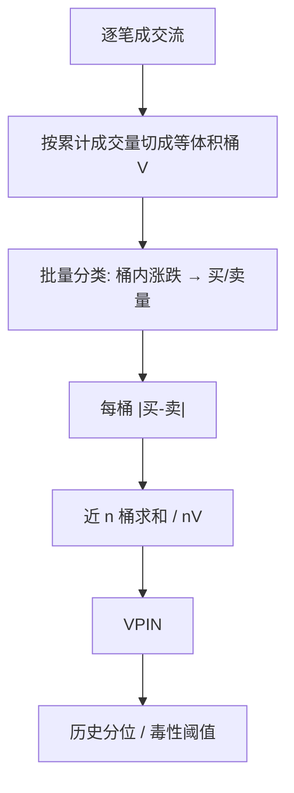

# VPIN

    
把时间换成成交量时钟，在等体积的桶里看买卖不平衡，毒性就可以在事件发生的节奏上更新，而不必等一个日历日结束。

    <footer>—— Easley, López de Prado, O'Hara, Flow Toxicity and Liquidity in a High-Frequency World, Review of Financial Studies 2012</footer>

[上一课](/quant/pin)用日度买卖计数做极大似然，适合问「这只股票这个月信息不对称有多严重」，不适合问「过去半小时流入的订单流有多毒」。本课把 PIN 的分子搬到成交量时钟上：等体积桶代替日历日，批量分类代替逐笔 Lee–Ready，得到 VPIN。它声称能在流动性蒸发之前发出毒性信号；后续文献则质疑它究竟在测信息，还是在测波动与成交量加速。

## 问题

日历时间里，开盘半小时和午后的成交强度可以差一个数量级。这与 [事件时间](/quant/event-time) 是同一类冲突。用等长时钟窗估订单流毒性，会在忙时把许多事件糊成一个点，在闲时把噪声当成结构。微观结构真正的「实验次数」更接近成交量：每成交一定股数，簿上就完成一轮消耗。

第二件事是分类成本。逐笔对照报价中点，在延迟、隐藏单、多交易所并行的环境里既贵又吵。若毒性只关心桶内净买量，不必精确到每一笔的方向。问题于是收成：能否用成交量同步的不平衡，构造一个可实时更新、且仍与 PIN 分子同构的毒性指标。

### 成交量时钟与毒性的时间尺度

毒性指的是做市商在不知情时持续接到知情单、期望利润被吃掉的程度。它是**流量**性质，不是股票的长期特征。日历日 PIN 把一天压成一个数字，默认信息体制日内不变。高频做市需要的是：当不平衡在连续若干桶里维持高位，就该撤掉挂单、拉宽价差。时钟必须能在成交加速时自动「走得更快」。

成交量时钟不是把时间戳丢掉。每桶仍有墙钟起止，只是边界由累计成交量 $V$ 切开。闪崩这类事件在墙钟上只占几分钟，在成交量时钟上可以占几十桶——这正是 VPIN 相对五分钟 PIN 的分辨率来源。

## 方法

选定桶体积 $V$（例如过去 $n$ 日均成交量的 $1/50$）。把成交按时间顺序累加，每满 $V$ 封成一桶。桶 $τ$ 内需要买量 $V_τ^B$ 与卖量 $V_τ^S$，满足 $V_τ^B+V_τ^S=V$。方向不必逐笔判定：Easley 等人常用**批量成交量分类**（bulk volume classification）。用桶内价格变化标准化后的正态 CDF 当买的比例：

$$
V_τ^B = V\cdot Z\left(\frac{P_τ-P_{τ-1}}{\sigma}\right),\qquad V_τ^S=V-V_τ^B,
$$

其中 $Z$ 是标准正态 CDF，$\sigma$ 是桶收益的滚动波动。价格大涨则该桶几乎全标成买。也可用 tick 规则在桶内加总，但计算更重，对报价延迟更敏感。

在最近 $n$ 个桶上定义

$$
\mathrm{VPIN}_n=\frac{\sum_{τ=1}^{n}\lvert V_τ^B-V_τ^S\rvert}{nV}.
$$

分母是这段成交量时钟里的总成交，分子是绝对不平衡之和。它对应 PIN 里 $\alpha\mu/(\alpha\mu+2\varepsilon)$ 的一种高频、免似然近似：把「知情造成的期望不平衡」直接用已实现的绝对不平衡代替。滚动 $n$ 桶相当于 PIN 估计窗，只是单位从「日」换成了「桶」。

### 参数 $V$ 与 $n$ 不是装饰

$V$ 太小，桶内价格变化噪声大，批量分类接近抛硬币，VPIN 围绕高位抖动；$V$ 太大，闪崩被揉进一个桶，预警来不及。$n$ 太短，VPIN 就是最近几次不平衡的绝对值，和已实现波动一样跳；$n$ 太长，又退化成缓慢的日度 PIN。实务上 $V$ 应对齐「做市商一次愿意消耗的存货」，$n$ 应对齐「毒性被市场消化的桶数」。同一套 $(V,n)$ 不能跨流动性差异很大的标的硬比水平。

## 机制

VPIN 能预警的机制，按原作者的说法是：知情交易在成交量时钟上留下持续的同向不平衡；做市商若按日历时间补货，会在毒性已经很高时仍维持窄价差，直到存货被打穿、流动性骤降。成交量同步让指标在信息到达加快时加密采样，于是闪崩前 VPIN 可以先进入历史高分位。

另一条更平淡的机制不需要知情者：波动上升时，桶与桶之间的价格变化变大，批量分类把几乎每一桶都标成极端买或极端卖，$\lvert V^B-V^S\rvert$ 接近 $V$，VPIN 被推高。此时 VPIN 是已实现波动与成交加速的函数，不一定是信息不对称。Andersen 与 Bondarenko 指出，用事后波动去解释 VPIN，许多「预警」会消失。工程上必须做对照：同样的成交量时钟上，把 VPIN 和已实现波动、绝对收益并排，看它是否还有增量。

批量分类用价格变化推断方向，等于把收益的符号写进订单流。VPIN 与收益、波动共享同一信息源，相关是设计出来的，不是发现出来的。若用 VPIN 预测短窗波动，要交代这不是独立的订单流证据。

### 与 PIN 的同构只在分子

PIN 的分母含非知情到达 $\varepsilon$，靠似然从三种体制里分开 $\alpha$、$\mu$、$\varepsilon$。VPIN 不再估这三个参数，直接用 $\lvert V^B-V^S\rvert$ 当分子。没有事件的日子里，噪声买卖也会产生不平衡，VPIN 的无条件水平因此偏高。它更像毒性的**变化**与**分位数**有用，绝对水平跨品种不可比。不要把 0.4 的 VPIN 读成「40% 的成交来自知情者」——那个句子只对 EKOP 的 PIN 成立，还附带模型假定。

## 边界与工程取舍

VPIN 不是 PIN 的高频版似然，不要用同一套资产定价回归去替换。闪崩案例是单事件，不能当样本外检验；做回测应预先锁定 $(V,n)$、分类规则与分位阈值，禁止用崩盘日去调参。多市场、多通道的成交若简单加总，同一笔套利腿会被算两次不平衡。

不要在集合竞价、涨跌停只有一侧队列时照搬批量分类：价格变化受制度截断，$\sigma$ 与 $Z(\cdot)$ 失真。不要把交易所的「主动买」字段与批量分类混在同一条时间序列里。毒性信号若用于自动撤单，要处理 VPIN 在开盘成交量脉冲里的机械跳高——那是交易机制，不一定是知情涌入。

与 [有效价差与实现价差](/quant/effective-realized-spread) 对照：价差分解给的是事后交易成本，VPIN 给的是订单流状态；二者应一起看，不能互相替代。与 [微观结构噪声](/quant/microstructure-noise) 对照：VPIN 用的价格变化本身含噪声，极小 $V$ 会把弹跳当成方向。

López de Prado 后续把成交量时钟推广到许多高频特征。用时钟本身没有错，错的是把某一个时钟上的不平衡直接叫做「信息交易概率」。名字里的 P 来自 PIN 的类比，不是又一次极大似然。

## 小结

- VPIN 把 PIN 的不平衡搬到成交量时钟：等体积桶、批量分类、滚动绝对不平衡比。
- 它为高频毒性与流动性蒸发而设计，按桶更新，不按交易日做混合泊松似然。
- $V$ 与 $n$ 决定分辨率；批量分类让 VPIN 与波动天然相关，增量必须对照已实现波动。
- 不要把 VPIN 读成 EKOP 意义下的知情成交概率，也不要用闪崩单案例代替样本外纪律。
- 与 PIN、有效价差是不同对象：日度信息风险、流量毒性、事后执行成本。
- 出处：Easley, López de Prado, O'Hara, *Flow Toxicity and Liquidity in a High-Frequency World*, Review of Financial Studies 2012；质疑见 Andersen, Bondarenko 对 VPIN 与闪崩的讨论。
