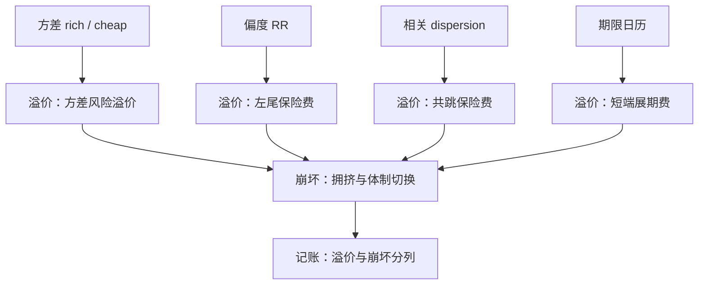
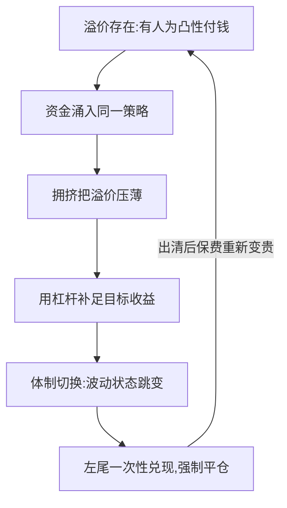

# 波动率套利案例

「波动率套利」里的「套利」二字是营销：清单上的每个案例都在把某种保险卖给需要凸性的人，赔率来自风险价格，不来自错误定价。

<footer>—— 据 Bakshi and Kapadia, 2003；Driessen, Maenhout and Vilkov, 2009 整理</footer>

[上一课](/quant/vt-greeks-portfolio)把组合的残差收敛成观点，「预测与工具」单元到此齐备。第二单元「策略与风控」用案例开题：把市场上叫「波动率套利」的策略逐个过堂——信号是什么、溢价谁在付、怎么死、账怎么记。基础课的[波动率套利](/quant/vol-arb)已给出恒等式与「指数上买 gamma 平均亏」的事实；本课做案例学与记账学，不再推导。

## 问题

案例复盘的共同陷阱有三：把风险溢价误读成错误定价，于是加杠杆去「收敛」；把无条件统计当成条件分布，于是在状态切换月爆仓；把两条腿的溢价记进一个桶，于是归因永远对不上。逐一过案例的意义，是让这三个陷阱在每个策略上有具体的形状。

常见误区：看到「套利」两个字就以为无风险。清单上的每笔交易其实都在卖保险——平时收小额保费，出事时赔付大额。把它当无风险去加杠杆，等于把保费收入当工资、把赔付当意外。

### 四个案例逐个过

方差 rich/cheap：信号来自[预测栈](/quant/vt-forecast-competition)与执行价之差，合同与账目见[方差互换的深化](/quant/vt-variance-swap-deep)。溢价是[方差风险溢价](/quant/variance-risk-premium)，卖方收 theta、付左尾；崩坏方式是拥挤平仓，记账要点是四栏账不得合并。

偏度：[风险反转](/quant/risk-reversal-skew)无条件买入平均付[偏度溢价](/quant/skew-risk-premium)（Kozhan–Neuberger–Schneider 的证据）；条件化后，崩盘刚过、保险最贵时卖出与恐慌未至时买入各有一段可做。崩坏方式是崩盘延续，比回撤预期更深；记账要点是 sticky 惯例下的隐含斜度重估 PnL 单列，不与已实现偏度混算。

相关：[Dispersion 交易](/quant/dispersion-trade)卖出「指数减成分」的隐含相关保险，溢价为正来自共跳保险更贵（[相关溢价](/quant/dispersion-corr-prem)，DMV 2009）；崩坏方式是[相关性崩溃](/quant/correlation-breakdown)日一次性偿还；记账要点是与偏度在崩盘重叠，两账必须正交化，防止双计。

期限：[VIX 期限结构](/quant/vix-term-structure-trade)的日历陡峭化，卖短端溢价、买长端方差；崩坏方式是倒挂日凸性暴露放大；记账要点是按方差桶且扣除开方凸性。

复盘口径建议三条全报：无条件年化夏普、条件最差月、拥挤度代理（空头未平仓、ETP 规模、成交占比）。只报第一条的案例研究，等于把死因从病历里删掉——[动量崩溃](/quant/momentum-crash)的教训原样适用于此。

## 方法

过堂的操作流程固定为四问。一问信号：用什么测量、对齐哪条合同（预测栈对齐条带执行价，而不是对齐 ATM IV）。二问溢价：谁在付、为什么非付不可——付方是持有凸性需求的人：杠杆投资者、发产品的机构、买尾部保险的组合；他们付的是预算内的保险费。三问崩坏：拥挤度怎么测、体制切换的先导指标是什么（市场方差状态、融资利差）。四问记账：溢价、凸性、崩坏三段是否分列，残差是否回到「已知持有」清单。

四问都答得出，策略才进入可投清单；答不出的一律当「带杠杆的贝塔」处理，仓位按崩坏日损失倒推限额。

术语翻译：「带杠杆的贝塔」意思是——剥掉故事包装后，这策略其实是在借钱买同一个风险因子。四问答不出时，宁可按贝塔的仓位纪律 sizing，也不要按 alpha 的信仰给额度。

## 机制

案例背后的共同结构是保险市场：波动率策略的对手盘不是「错的定价」，而是有结构性凸性需求的买方。这解释了两件事。其一，溢价的持续性：只要有人为凸性付钱，卖方溢价就会存在，但它以左尾为代价，无条件夏普必然高估。其二，死法的相似性：溢价吸引资金、资金压低溢价、杠杆补足收益、体制切换一次性清算——四个案例只是在不同维度上重演同一条路径。所以风控的对象不是单个信号，而是这条路径本身：拥挤度与杠杆是先导指标，不是事后注脚。

直觉类比：卖波动溢价像在压路机前弯腰捡钢镚——每次捡到的都是小钱（theta），压路机（崩盘）来时一次轧掉几年的积蓄。夏普高不是因为技术好，而是因为压路机还没来。

## 边界

本课不含事件窗内的专用打法，那是下一课；不含跨市场的价差，那是跨市场课；纯已实现波动的预测交易归预测栈与方差互换两课，不在此重复。所有案例都不给「必胜参数」：参数随状态变，写死参数等于把状态变量删掉。

## 小结

- 四个案例共享同一结构：把凸性保险卖给有结构性需求的人，收风险价格。
- 复盘四问：信号对齐哪条合同、溢价谁付、崩坏怎么来、记账怎么分列。
- 偏度与相关在崩盘重叠，两账必须正交化，防止溢价双计。
- 死法三部曲：拥挤、杠杆、体制切换；拥挤度是先导指标。
- 复盘必报三条：无条件夏普、条件最差月、拥挤度代理。
- 出处：Bakshi and Kapadia, 2003；Kozhan, Neuberger and Schneider, 2013；Driessen, Maenhout and Vilkov, 2009；恒等式见基础课。
