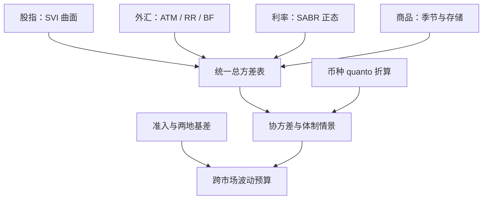

# 跨市场波动

波动在每个市场都说自己的方言：股指报曲面，外汇报三点，利率报正态；跨市场的第一件事不是比大小，而是把单位换成同一种方差。

<footer>—— 据 Hamao, Masulis and Ng, 1990；Longin and Solnik, 2001 整理</footer>

[上一课](/quant/vt-event-vol)把波动装进事件日程，对象仍是单一市场的名义。本课把语言搬到市场之间：股指、外汇、利率、商品、境内外两地。问题从「这个市场的方差贵不贵」变成「五个市场的方差预算怎么分、相关怎么定、币种怎么算」——方言不通，比较就是伪影。

## 问题

三个换算不过关，跨市场比较全是坐标错误。其一，报价方言：股指用执行价网格与 [SVI/SSVI](/quant/svi-ssvi)；外汇用 [ATM / RR / BF 三点](/quant/fx-vol-quotes)；利率用 [SABR](/quant/sabr-calib) 的正态世界。同一个「偏斜」在 RR 里与在执行价斜率里不是同一个数。其二，币种：以美元计的欧元市场波动，混着汇率自己的方差，quanto 调整不是可选项。其三，相关：跨市场相关有体制性，[平静期估计](/quant/correlation-breakdown)在压力日系统性失灵，拿它做预算等于用晴天测雨伞。

## 方法

### 统一口径的做法

先把各市场报价换算成同一种对象：按 delta 或 moneyness 归一的总方差，或直接用各市场方差互换的期限结构排成一张表。相关不用相关系数点估计表达，用可交易的工具：[相关互换](/quant/correlation-swap)与分散篮子，让「相关」本身有价格。预算分配按「方差贡献 × 相关体制修正」算，修正规则预声明，不临时拟合。

传递结构有两条证据线可依：Hamao、Masulis 与 Ng 在 1990 年记录了美日英市场间隔夜的波动传递；Longin 与 Solnik 的长期结论是相关随体制走、牛市与熊市不同。共同的因子结构（[波动率因子模型](/quant/vol-factor-model)）说明跨市场组合不必每市场独立建模：少数波动因子承担共同部分，特异部分走对角。境内外的摩擦是独立的基差：[A 股指数与境外对冲成本](/quant/cn-index-basis-hedge-cost)、[两地上市溢价](/quant/adr-premium)都是准入摩擦的价格，要当基差风险记账，不当免费套利。

## 机制

跨市场波动组合的真正对象是协方差矩阵的尾部：平静期相关低、压力日共同运动强。做情景必须先标准化波动再改相关——[相关性崩溃情景](/quant/corr-break-scenario)的规则——否则「相关性上升」被波动上升淹没，情景测了等于没测。溢价的跨市场比较同样要小心：VRP 的符号与大小按市场不同，股指上卖方收溢价，外汇视币对、商品视存储与季节而定——跨市场分散的前提是溢价不同源，同源的溢价分散不掉尾部。

外汇市场的「25 delta RR」在股指的执行价网格里没有直接对应物；先统一成同一 delta 或同一 moneyness 的总方差再比较。这一步做错，后面找出的所有「跨市场相对价值」都是坐标伪影，交易越多错得越多。

## 边界

本课不写外汇期权定价与利率期限结构模型本身，只消费它们的报价口径；信用波动与通胀挂钩产品另课；准入额度、结算路径是制度问题，本课只把它们折成基差。跨市场的波动传递也不宣称因果：隔夜传递的证据是条件统计，把它读成因果关系是传导机制课的事。

## 小结

- 方言先统一：各市场报价折成归一化总方差，再谈比较与预算。
- 相关用可交易工具表达（相关互换、分散篮子），不用点估计当预算。
- 情景先标准化波动再改相关；压力日共同运动是协方差矩阵的真正对象。
- 溢价按市场不同源：同源的溢价分散不掉尾部。
- 币种 quanto 与准入基差是独立风险，必须单独记账。
- 出处：Hamao, Masulis and Ng, 1990；Longin and Solnik, 2001；各市场报价口径见方言课。
