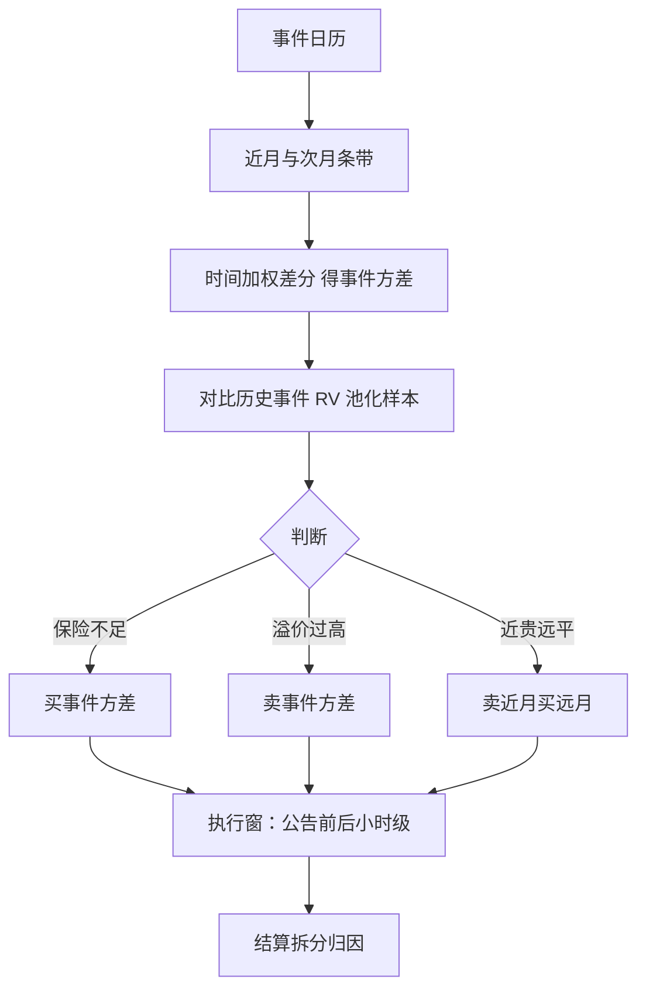

# 事件波动

日历把方差切成两种：事件日的与平常日的；市场为前者付保险费，因为那一天的风险无法分散，也无法像平常日那样摊开。

<footer>—— 据 Patell and Wolfson, 1981；Ederington and Lee, 1993 整理</footer>

[上一课](/quant/vt-arbitrage-cases)的案例清单里，事件驱动只占一行；本课把它单独展开，对象从「一段时间的总方差」变成「日程上的那一天」。做市课的[事件前的仓位管理](/quant/omm-event-positioning)给了台账、档级与分层减仓；本课站交易台一侧：怎么从期权里读出市场定价的事件方差、怎么建仓、怎么被 IV crush 打。

## 问题

同一个到期日的隐含波动同时包含事件日与平常日两部分方差，直接看 IV 谈贵贱没有意义：必须先把事件那一天的份额分解出来。分解错了会两头挨打——把平常日方差的错定价当成事件保险卖出去，或者把真实的跳空风险当成便宜的隐波卖掉。事件方差还有样本量问题：一家公司一年只有四次财报，历史均值的置信区间宽得难以区分贵贱。

### 分解与预测

分解用近月与次月条带的总方差之差：两个到期都覆盖事件日与否的差别，按时间加权归到事件日，得到市场定价的 $\sigma_{\mathrm{event}}^2$。预测腿用事件日已实现方差，但必须横截面池化：同行业的公告按公司加总再加公司项，并剔除结构变化——例如从季度财报转向年度指引，历史分布立刻作废。市场定价的另一样本是[事件前的仓位管理](/quant/omm-event-positioning)里的跨式隐含移动：它与条带差分互为校验，对不上先查条款（观察时点、到期日是否真的跨事件）。

## 方法

三种结构对应三种判断。买事件方差：付保险费换跳空保护，适合底仓不能卖又怕公告的组合，与[并购套利](/quant/merger-arb-event)宣布后持有的暴露同构。卖事件方差：吃溢价，必须先问溢价够不够覆盖左尾，并设重进场条件。日历结构：事件方差让近月比远月贵，卖近月买远月把事件单独剥离——与做市课「事件 Gamma 住近月、减仓按期限分层」是同一枚硬币的交易台版本。执行窗口是小时级的：Patell 与 Wolfson 早在 1981 年就记录，公告的价格反应集中在最初几小时；IV 的 crush 通常发生在公告后第一个小时内，跨式买卖两侧都要把窗口写进指令，不能靠盘中手感。

## 机制

事件溢价为什么存在：那一天的跳空对多数持有人不可分散、也不可在盘中摊平，保险费是时间集中风险的定价。条件化后可以倒挂：市场对高知名度事件（财报、选举）常定价过度，事件已实现方差低于隐含；被忽略的事件（指引电话会、监管听证）反而常定价不足——四问复盘在这里照用：信号对齐事件窗、溢价谁付、崩坏是连续跳、记账按事件日单列。跨名加总有个附加陷阱：组合里几十个名字的事件日在同两周，按 Vega 折算的总暴露看似分散，但公告日[相关性上升](/quant/correlation-breakdown)，分散在 events 日集体失效。

财报样本量陷阱：一年四次公告，「事件日方差历史均值」的置信区间宽到难分贵贱。实务用行业横截面池化再加公司随机项，且必须剔除结构性变化——例如改为不发布指引的公司，历史事件方差的下限直接换了一层。

## 边界

宏观事件（议息、通胀数据）用同一套分解，但时点与流动性不同：Ederington 与 Lee 记录的日内分布显示信息在公告后几分钟内进价，隐波的衰减路径与财报不同，不能混用参数。0DTE 时代事件 gamma 的做市侧机制见[0DTE 与波动](/quant/amaya-0dte-volatility)。本课不写盘前与竞价段的执行细节，也不把「卖事件 IV」当成无条件正期望——倒挂与正溢价都是条件分布。

## 小结

- 事件方差必须从条带差分里分解出来，直接看 IV 谈贵贱没有意义。
- 预测腿靠横截面池化，单名样本量不足以支撑判断。
- 三种结构：买保险、卖溢价、日历剥离；执行窗口是小时级并写进指令。
- 溢价来自不可分散的时间集中风险；条件化后可倒挂，被忽略的事件常定价不足。
- 跨名事件日集中时相关性上升，名义分散在事件日失效。
- 出处：Patell and Wolfson, 1981；Ederington and Lee, 1993；台账与档级见做市事件课。
