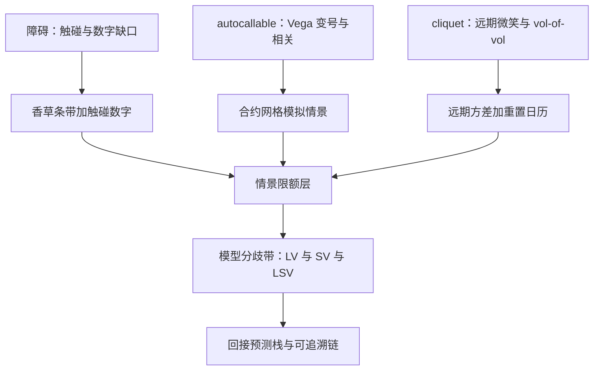

# 奇异的风控与收束

奇异的风险不是更多种的希腊字母，而是希腊字母在参数空间里失去连续性的那些点；风控地图的任务，是把不连续处事先画出来。

<footer>—— 据 Gatheral, The Volatility Surface, 2006；边界口径据场外衍生品风控实务整理</footer>

[上一课](/quant/vt-local-vol-practice)把局部波动落成日常引擎，并留下「模型带」的口子。本课把九课收进一张奇异风险地图：障碍、autocallable、cliquet 三大家族，每家族列主导风险、对冲工具、限额层与模型分歧带。这也是本课程的收束课：奇异账本同时需要预测、工具与风控的全部输入，本课程到此收束。

## 问题

奇异的希腊字母在障碍与敲出观察日附近不连续甚至变号：敲出看跌在障碍前一档的 Vega 可以一天内从多翻空；autocallable 的 Vega 随现货在正负之间翻转；cliquet 的暴露挂在还没发生的重置日上。单点希腊因此不足以表达风险，风控必须改用情景与模型带。更根本的是：奇异的价值同时挂在波动、偏度、相关与利率上，任何单一因子的「对冲干净」都是错觉，地图的任务是让每一维的残留有人负责。

## 方法

### 三家族三行图

障碍：主导风险是触碰概率与数字缺口——条款字段（连续或每日观察、观察时点、返现时钟）比公式更影响价格，见[障碍解析](/quant/barrier-analytics)与[监控频率](/quant/barrier-monitoring)。对冲用香草条带加触碰数字的静态组合，微笑修正用 [Vanna / Volga 三点](/quant/vanna-volga)；限额用「触碰概率乘损失」的情景表达，不用单点 Vega。

Autocallable：主导风险是 Vega 变号、偏度与篮子相关（[autocallable](/quant/autocallable)）；相关腿对照[相关溢价](/quant/dispersion-corr-prem)定价，篮子产品的相关与偏度互相借用参数。对冲以合约网格模拟上的情景为主，估值不走闭式；限额在[情景网格](/quant/omm-greeks-limits)上加敲出日专项。

Cliquet：主导风险是远期微笑与 vol-of-vol（[远期起始与 cliquet](/quant/cliquet-forward-start)）；纯局部波动不许单独报价——上一课的验收条。限额把重置日排进日历，逐日检查重置前后的暴露跳变。

## 机制

每家族最后加一列：局部波动、随机波动、LSV 三个引擎的价格分歧当**不确定性带宽**报告，不当四舍五入的误差（分歧的来源在局部波动课与混合校准课）。带宽突然扩大不是坏数据，是曲面或条款出了病态的信号。希腊按分钟重算解决不了不连续：障碍附近的正确表达是情景（现货到障碍、波动跳两档）加时间表（观察日倒排），[高阶希腊](/quant/higher-greeks)在此只做辅助。

收束口径如下。「预测与工具」单元给了三个输入：[预测栈](/quant/vt-forecast-competition)给出条件方差与它的置信区间；[方差互换的深化](/quant/vt-variance-swap-deep)给出把预测变成合同的四栏账；[希腊字母的组合管理](/quant/vt-greeks-portfolio)给出把残差收敛成观点的桶与情景。「策略与风控」单元给了五种行为：[案例](/quant/vt-arbitrage-cases)的溢价与崩坏、[事件波动](/quant/vt-event-vol)的分解与窗口、[跨市场波动](/quant/vt-crossmarket-vol)的方言换算与体制、[波动率产品的对冲](/quant/vt-product-hedging)的 delta 手册、[随机波动率校准](/quant/vt-sv-calibration-deep)与[局部波动实操](/quant/vt-local-vol-practice)的两条管线。奇异风控是它们的交汇处：每笔奇异头寸必须能回答四问——哪个预测支撑它、哪个工具对冲它、哪个限额看着它、哪两个模型框住它。四问都指向文件而不是人，波动率交易台才与 [期权做市收束](/quant/omm-map)那条「可追溯的链」接上。

障碍前一档，敲出期权的 Vega 可在一天内从正翻负；连续观察与每日收盘观察的触碰概率差异能吃掉报价的一半以上。把观察条款当字段管理而不是当公式管理，是奇异风控与香草风控最大的分野。

## 边界

本课不重讲定价推导，CVA 与融资成本归合同与对手方课程；危机日场外对冲买不回的流动性挤兑路径点名不展开。四问里答不出任何一问的头寸，处理规则与做市课同源：先减仓进限额，再补文档。

## 小结

- 奇异的风险在希腊失去连续处：障碍前 Vega 变号、autocallable 翻转、cliquet 挂在未来。
- 三家族各有主导风险与工具：静态条带、模拟情景、远期方差加日历。
- 模型分歧带是报告项：LV、SV、LSV 的价差是带宽，带宽突变是病态信号。
- 限额用情景与触碰概率表达，单点希腊只做辅助。
- 收束四问：哪个预测支撑、哪个工具对冲、哪个限额看着、哪两个模型框住——答案必须指向文件。
- 出处：Gatheral, *The Volatility Surface*, 2006；Hull, *Options, Futures, and Other Derivatives*；其余口径沿本课程各课链接。
