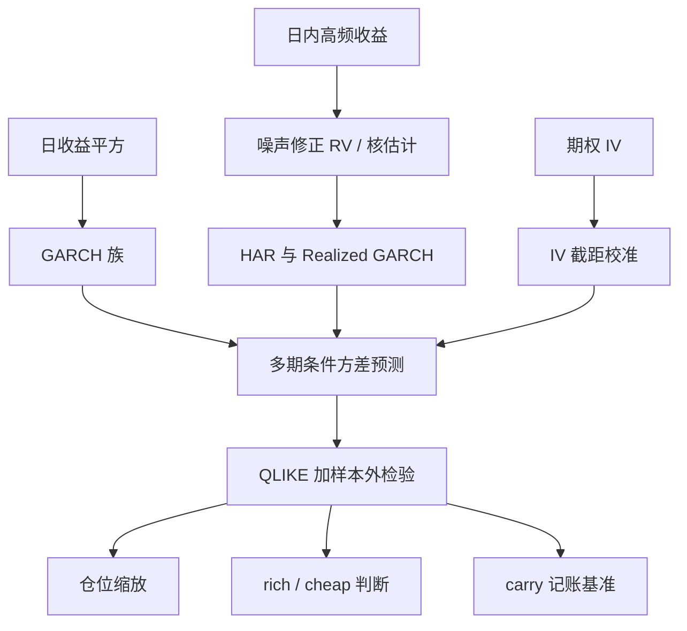
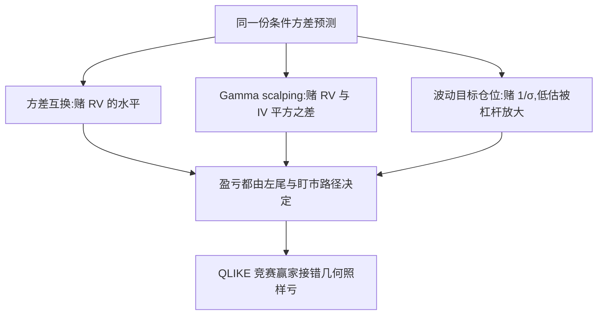

# 波动率预测的竞赛与实用

波动率是金融里最可预测的对象之一，也是最容易被「预测得准」骗着下单的对象之一；竞赛的价值不在名次，而在弄清你赌的是哪一段收益几何。

<footer>—— 据 Andersen and Bollerslev, 1998；Patton, 2011 整理</footer>

[上一课](/quant/pf-case-map)把组合构建收在接口纪律上：优化器是误差放大器，约束与税不是实现细节而是策略本身，验收放在成本链与危机故事上，并声明波动率产品的定价与对冲细节是下一门课的对象。深化课问交易台自己的问题：对未来一段时间的波动，你的数字从哪来、信到什么程度、接到哪笔交易上。本课是「波动率交易深化」的第一课，把预测整理成一个可竞赛、可评估、可装配的栈；本课程后续各课默认已经读完本课。

## 问题

「明天波动多少」有三种答法，信息集与偏差都不同。日收益的平方是噪声极大的测量：一天一个样本，隔夜缺口与微观结构噪声混在里面。日内高频收益加总的已实现波动（RV）把样本提到几百个，但要先做[噪声修正](/quant/noise-variance-estimate)与隔夜处理。[隐含波动率曲面](/quant/vol-surface)的 IV 是前瞻的，却含风险溢价：市场报价的 IV 系统性高于随后已实现的波动，差值就是[方差风险溢价](/quant/variance-risk-premium)。三种测量不统一，任何「模型 A 比 B 准」的结论都先要过测量这一关——这是竞赛第一件要钉死的事。

术语翻译：已实现波动（RV）就是把一天切成成百上千个小段，把每段收益平方加总再开方——用高频数据把「今天到底晃了多大」量出来。它比日收益平方多用几百个样本，噪声自然小得多。

### 三层模型栈

- 经典条件方差：[GARCH](/quant/garch) 只用日收益，胜在便宜稳健；[EGARCH/GJR](/quant/egarch-gjr) 补杠杆效应。
- 高频测量驱动：[HAR](/quant/har-rv-forecast) 用日、周、月三尺度回归，是 RV 预测的工作马；[已实现 GARCH](/quant/realized-garch) 把 RV 测量与收益联立，一步预测明显改进。
- 期权横截面：IV 本身是强预测变量，但水平有偏，适合做方向与截距校准，不能直接当预测值。

竞赛规则同样要钉死：损失用对不完美代理稳健的 [QLIKE](/quant/qlike-vol-forecast-eval)，样本外配 Diebold–Mariano 或 SPA 检验；期限对齐；Mincer–Zarnowitz 回归看斜率是否为 1，而不是只看 $R^2$。

Andersen 与 Bollerslev 在 1998 年回答「怀疑派」：同一批 ARCH 类模型，用日收益平方评估时 $R^2$ 常在 0.1 以下，换成高频 RV 评估后成倍上升——先变的是测量，不是模型。今天任何「新模型吊打基线」的说法，第一步都该检查它换的究竟是测量还是模型。

## 方法

预测的用途由收益几何决定，这是「实用」二字的全部内容。同一份条件方差预测，接到不同合同上是三件不同的事：方差互换看已实现方差的水平，预测直接当期望用；[Gamma scalping](/quant/gamma-scalping-pnl) 看 $\mathrm{RV}-\sigma_{\mathrm{imp}}^2$ 之差，预测与当前 IV 必须同时进场；[波动目标仓位](/quant/vol-targeting)看方差的倒数，预测的低估会被杠杆放大。竞赛里胜出的模型接错几何照样亏钱：HAR 在 QLIKE 上小胜 GARCH，不代表做空方差互换就能赢，因为后者的盈亏由左尾而不是均方误差决定。

第二个实用原则是条件化重于点预测。波动的水平难测，但「会聚集成簇、会随状态切换」可靠得多：把预测当状态变量去削尾——例如[动量崩溃](/quant/momentum-crash)里的市场方差状态——比把预测当点估计去押方向更经得起样本外。

直觉类比：预测波动像预报风力——精确说「下午三点风速 7.2 米每秒」很难，但「要起大风了」可靠得多。把预测当状态变量用（提前收帆、加绳），比把它当精确读数去押注经得起检验。

## 机制

QLIKE 为什么是默认：Patton 证明当代理变量（你的 RV 估计）不完美时，只有一族损失函数的排序不受代理噪声污染。换 MSE，测量误差的方差直接进损失，模型排序可能被代理噪声翻转——名次测的就是谁的 RV 估计更脏。这也解释了为什么拿 IV 当「真值」评估 RV 模型格外危险：IV 含风险溢价，把它记成预测误差，等于把保险费误记成模型的错。

IV 的偏差在使用侧反而是信息：条件预测减去条带隐含，就是市场为方差保险付的价格，是后续所有「rich / cheap」判断的锚。所以本课程把预测栈定位成输入层：它不直接产生仓位，只给出后续每课共用的那个数。

## 边界

本课不预测收益方向，也不做跳的逐笔分解：跳让 RV 偏大且不可对冲，[已实现半方差](/quant/realized-semivariance)与双幂变差是补丁，此处只引用。比较的边界要写明：波动预测的优势常在损失函数的噪声之内，样本外结论必须报置信区间。最后，预测不是仓位——把「预测 RV 高于执行价」直接当卖方信号，忽略左尾与盯市路径，那是下一课开始的全部内容。

常见误区：初学者常拿隐含波动当「真波动」去给已实现模型打分。IV 里掺着保险费，市场长期报得比实际高——把保险费记成模型误差，等于责怪消防队「预报的火总比实际烧的大」。

## 小结

- 预测竞赛先钉测量：日平方收益、噪声修正 RV、IV 三层信息集，偏差与噪声完全不同。
- 模型栈按信息集分工：GARCH 便宜稳健，HAR 与 Realized GARCH 用高频测量，IV 作方向校准。
- 评估用 QLIKE 与样本外检验；代理不完美时 MSE 排序可被测量噪声翻转。
- 预测的用途由收益几何决定：方差水平、RV 减 IV 平方、倒数缩放是三种合同。
- 条件化重于点预测：把波动当状态变量削尾，比押方向经得起样本外。
- 出处：Andersen and Bollerslev, 1998；Patton, *Journal of Business &amp; Economic Statistics*, 2011；测量与模型详见各链接课程。
