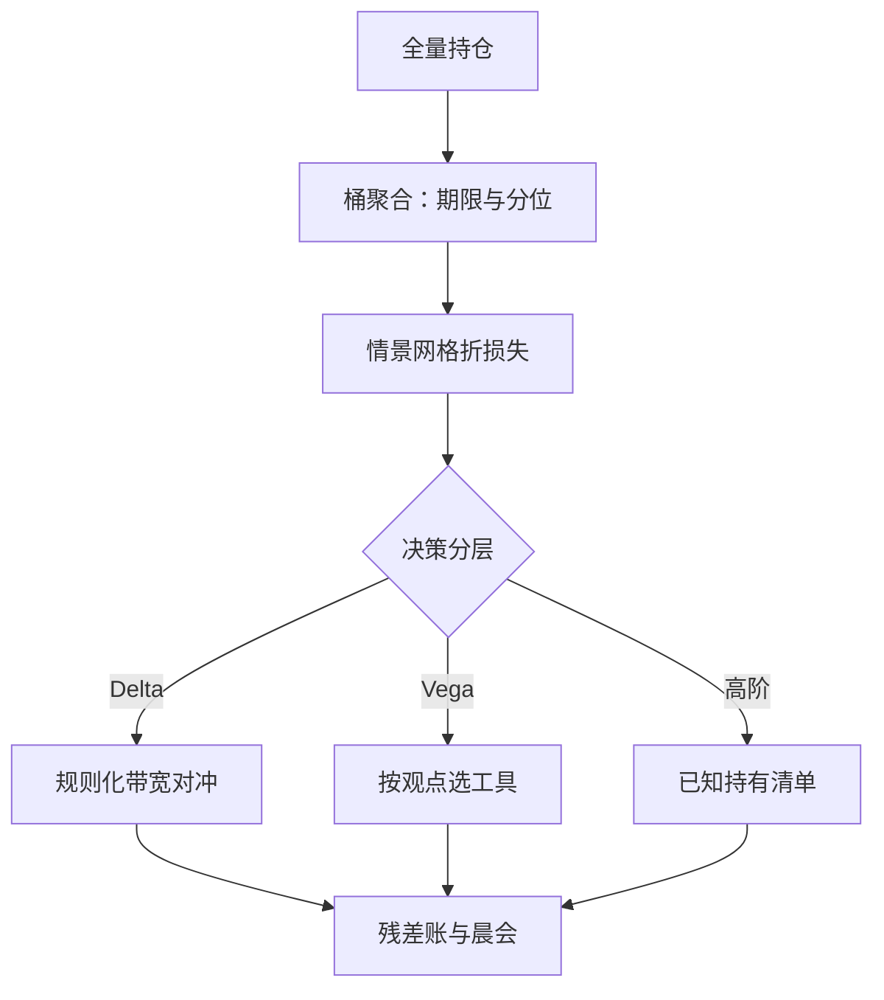

# 希腊字母的组合管理

单一头寸的希腊字母是物理量，组合的希腊字母是政策：加总方式、情景网格与残差预算，共同决定你真正持有什么。

<footer>—— 据 Hull, Options, Futures, and Other Derivatives；聚合口径据期权账簿实务整理</footer>

[上一课](/quant/vt-variance-swap-deep)把方差互换的持有期账拆成 carry、delta、期限与残差四栏；单一产品可以手算，多产品组合必须靠聚合。基础课给了单工具的 [Delta / Gamma / Vega 对冲](/quant/greeks-hedge)、[Charm / Color 高阶希腊](/quant/higher-greeks)与[对冲频率](/quant/delta-hedge-freq)；做市课给了账本与限额的流程。本课写波动率交易组合本身：怎么聚合、怎么决策、留什么残差——把账本上的残余收敛成策略观点。

## 问题

总 Vega 一个数会撒谎：一万三十天 Vega 与一万两年 Vega 相加成两万，但波动跳一个点时两者的盈亏差好几倍——期限结构被加总抹掉了。Vanna 与 Charm 让现货不动的隔夜头寸也在走。对冲还有成本与工具约束：Gamma 与 Vega 通常不能被单一工具同时清零，每个「清零」动作都在买入另一维度的暴露。不做组合管理，账本就同时持有一堆没人要过的观点，在压力日一起兑现。

### 三步走

第一步聚合：按到期桶与分位桶分列，桶内 Vega 加权、桶间不平均加总。做市课的[波动率仓位的账本](/quant/omm-vol-position-ledger)给了字段口径：每手的成交隐波与标记隐波、Vega 的期限与分位归属——交易组合直接沿用，别另造一套记号。

第二步情景：把各阶希腊折进统一的情景网格——平行 Vega、偏度加陡、日历变平、现货跳水配波动跳升。[敏感度 limits 与聚合](/quant/omm-greeks-limits)的四层限额给出分级：先聚仓位再算损失，跨标的保留相关性趋一的压力限额。

第三步决策分层：Delta 走规则，带宽由 [gamma-theta 权衡](/quant/gamma-theta-tradeoff)与[离散对冲误差](/quant/discrete-hedge-error)定，不逐日裁量；Vega 按观点对冲，用最流动的期限做工具；Vanna 与 Charm 的隔夜漂移按做市课的[每日排班](/quant/omm-vanna-charm-daily)预留偏移；高阶残差进「已知持有」清单，写明理由与止损线。

一个实用的验收问句：挑出组合里最大的一笔 Vega 桶，问「这是策略还是对冲副产品」。答不出策略名的桶，多半是某次对冲或调仓留下的化石——化石不会立刻咬人，但会在体制切换日集体醒来。

## 方法

组合管理的目标是**让残差就是观点**。建仓时主动构造：想留偏度暴露，就用 [Vanna / Volga 三点](/quant/vanna-volga)把平行 Vega 抽掉；想留期限结构暴露，就用远月对近月的 Vega 配比把整体 Vega 净平。做完这些，账本上的残余与策略论点一一对应，限额讨论的从「这个数字怎么来的」变成「这个观点该多大」——后者才是投资决策，前者只是对账。

## 机制

为什么情景网格先于单点希腊：希腊字母是局部导数，组合的价值函数在偏度与日历维度上高度非线性，单点数在「波动跳三个点」的情景下没有信息量。折成情景损失后，不同到期、不同执行、不同标的的头寸才落在同一把尺子上，限额也因此可比。

为什么 Delta 必须规则化：Delta 对冲是无观点的执行动作，逐日裁量会把执行台变成隐性策略台，事后无法归因。规则的成本是放弃小幅优化，换来的是每笔对冲都有据可查——这与第一课「数字从哪来」的口径同源。

## 边界

本课不重讲单工具对冲的推导；跨标的相关的压力情景归限额层，本课只消费；跨币种头寸的折算与准入摩擦留给跨市场那课。组合优化的解析解（如方差互换堆的解析 delta）不展开，数值情景已够日常决策。最后一句话作为下一单元的门：残差收敛成观点之后，观点本身值不值得持有——这是「策略与风控」单元要用案例回答的问题。

## 小结

- 总 Vega 会撒谎：先按到期与分位分桶，桶间不做平均加总。
- 情景网格先于单点希腊：不同头寸折成情景损失才可比、可限额。
- 决策分三层：Delta 规则化、Vega 按观点、高阶残差进已知持有清单。
- 组合管理的目标是「残差即观点」：建仓时净掉不想要的暴露。
- 化石桶是隐性风险：答不出策略名的暴露会在体制切换日集体醒来。
- 出处：Hull, *Options, Futures, and Other Derivatives*；账本与限额口径沿做市课字段整理。
