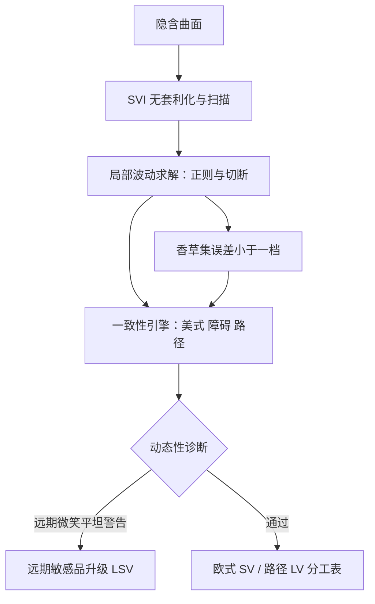
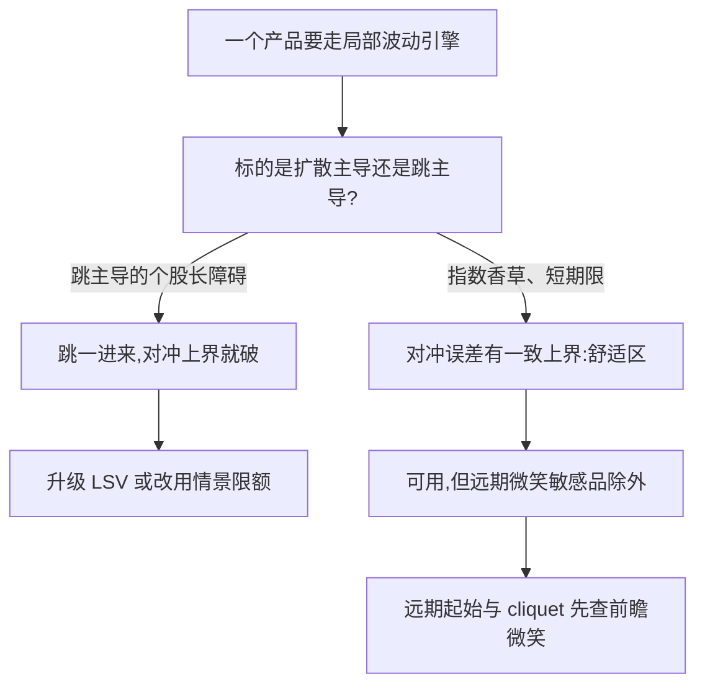

# 局部波动率的实操

局部波动用一个定理买到今日欧式的全部贴合，代价是把未来的微笑写成平的；实操的全部功夫，在于知道哪些产品付不起这个代价。

<footer>—— 据 Dupire, 1994；Gyöngy, 1986 整理</footer>

[上一课](/quant/vt-sv-calibration-deep)把随机波动校准钉进管线；但 SV 家族贴不满全部执行价，前瞻微笑也常不对。本课把 Dupire 局部波动落成日常引擎。[Dupire 局部波动校准](/quant/dupire-calib)讲了反问题与病态性；本课讲生产侧：插值、外推、引擎分工与动态性验收。

## 问题

Dupire 公式要对总方差 $w(k,T)$ 求时间导数与对执行价的二阶差分，对报价噪声极端敏感；离散到期日之间的插值假设直接改变障碍价；外推的翼部决定极端情景的价格。跳过这三件事得到的局部波动表面照样光滑，但价格是插值假设的产物，不是市场的产物——实操的第一课是承认：局部波动的输出质量由上游的曲面工程决定，不由公式决定。

术语翻译：局部波动就是把波动写成「标的价格与时间」的函数 $\sigma(S,t)$——价格走到哪一格，波动取哪个数，是一条事先铺好的轨道。它今天能完美贴合全部欧式报价，但轨道本身未必像真实世界。

### 管线五步

一、无套利化：先把报价参数化成 [SVI/SSVI](/quant/svi-ssvi) 并做蝶式与日历扫描，绝不对原始报价二阶差分。二、抽局部波动：时间导数按插值假设给出，空间用正则化或 [Andreasen–Huge 正向差分](/quant/dupire-calib)；分母近零处切断并记录切断位置——它就是模型的自认边界。三、外推：翼部按 SVI 的渐近斜率走，尾部检查密度非负。四、引擎分工：美式与百慕大行权（[美式期权与提前行权](/quant/american-exercise)）、障碍与触碰（[障碍解析](/quant/barrier-analytics)）交给局部波动做一致性重估；欧式精合交给参数模型；远期微笑敏感的产品升级到[局部-随机混合](/quant/lsv-hybrid-calib)。五、验收：同一香草集上，局部波动价格与市场价误差必须小于一个最小变动价位，然后才有资格谈其他产品的输出。

## 机制

为什么局部波动「今日全对、明天就错」：Gyöngy 的模仿定理说，局部波动复制的是随机波动的单期边际分布，不是它的联合动态。于是欧式贴合是定理保证的，前瞻微笑平坦是同一枚硬币的反面——[远期起始与 cliquet](/quant/cliquet-forward-start) 因此被系统性错价。对冲侧有一条互补结论：El Karoui、Jeanblanc 与 Shreve 证明，扩散世界里用错成局部波动的 Black–Scholes 对冲有一致的良好上界，跳一进来界就破。所以局部波动的舒适区是扩散主导的指数香草与短日期权，不是跳主导的个股长障碍。

局部波动会把「未来 ATM 波动先跌后涨」读成今天曲面上的斜率与曲率，远期起始与 cliquet 的价因此整体偏移。验收清单里永远要有一条「远期微笑是否平坦」：答案是平坦时，这一类产品不许用纯局部波动报价。

## 方法

日常运维三条。第一，插值假设写成文档：到期之间的方差按什么插（总方差线性、总隐波线性），障碍价对选择的敏感度每年至少测一次。第二，切断位置与正则强度进版本管理：局部波动表面的每次重生成，都要能回答「哪里变了、为什么变」。第三，与 SV 的价差当模型带报告：同一香草集两个引擎的价格差不是误差，是模型不确定性的带宽，带宽突然扩大本身就是诊断信号——通常是曲面出了局部病态。

常见误区：初学者把「表面重新生成后看着差不多」当成没变化。两条表面差半个波动点，长障碍期权的价格可以差出一位数百分比——所以切断位置与正则强度必须像代码一样进版本管理、可回滚。

## 边界

本课不重推 Dupire 公式，粒子法校准 LSV 在混合校准课；股息与提前行权的耦合只点名不展开。最后一条边界留给下一课：局部波动与 SV 的分歧是「模型带」，但奇异账本要的是把带宽变成限额——哪类产品的带宽不可接受、用什么情景看着它，是奇异风控收束课的内容。

直觉类比：LV 与 SV 的价差像两位测绘员对同一座山报的不同海拔——差别不是谁错了，而是「测不准的那部分」有多大。模型带宽就是这份不确定性的标价，交易与限额都要为它留出余量。

## 小结

- 局部波动的输出质量由上游曲面工程决定：无套利化、插值、外推三件先做对。
- 切断位置是模型的自认边界，正则强度进版本管理，可追溯。
- Gyöngy 定理是硬币两面：欧式贴合与前瞻微笑平坦同源。
- 舒适区是扩散主导的指数香草与短障碍；跳主导的个股长障碍不在此列。
- 与 SV 的价差当模型带报告，带宽突变本身是诊断信号。
- 出处：Dupire, 1994；Gyöngy, 1986；El Karoui, Jeanblanc and Shreve, 1998；数值细节见 Dupire 校准课。
