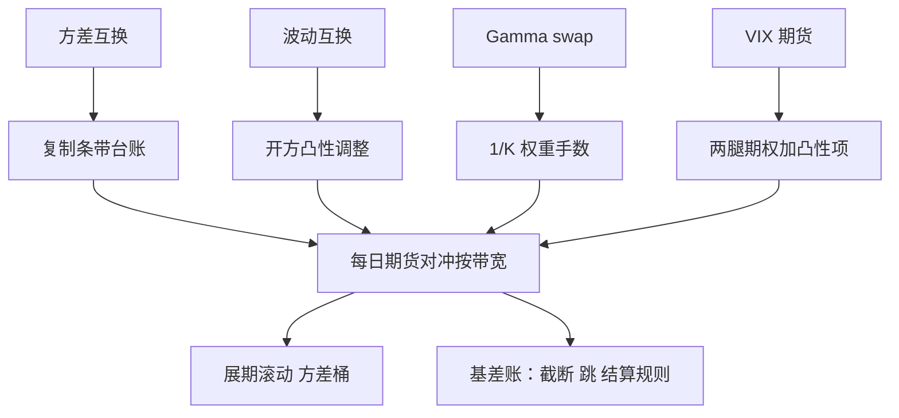

# 波动率产品的对冲

对冲方差互换，就是对冲它的复制条带；产品越「纯波动」，对冲越像一份记账工作——直到跳、截断与结算规则把账本重新打开。

<footer>—— 据 Carr and Madan, 1998；Demeterfi, Derman, Kamal and Zou, 1999 整理</footer>

[上一课](/quant/vt-crossmarket-vol)把波动预算铺到跨市场；本课回到产品层，回答「持有这些合同的人每天对冲什么」。复制课讲了条带怎么定价，方差互换深化课拆了持有期四栏账；本课把它们落成逐日执行的 delta 手册：每个产品的 delta 从哪来、用什么工具对、剩下的基差记在哪。

## 问题

方差互换号称「纯方差暴露」，但它的盯市与 delta 来自一个期权条带；不对冲条带，空头在跌市里被动接 gamma。VIX 期货的 delta 又落在另一套条带与期货上；波动互换、Gamma swap、相关互换各不相同。产品之间「名字像、delta 不像」，混用一份对冲手册，跌市里每个产品都会以自己特有的方式出错。

### 按产品列 delta 手册

方差互换：delta 就是复制条带的 delta，集中在平值附近，用标的期货对冲；权重 $1/K^2$ 使大跌后手数按凸性上升。波动互换：在方差 delta 上乘开方凸性调整，差额靠小面积期权补（[方差与波动互换](/quant/var-vs-vol-swap)）。[Gamma swap](/quant/gamma-swap)：复制权重 $1/K$，delta 单侧偏重，与方差互换的价差本身是偏度仓位，对冲不得共用一套手数。VIX 期货：标的是未来三十天条带的平方根，delta 拆到两腿期权与[VIX 定价](/quant/vix-futures)的凸性项，还带一条到期的日历腿。相关互换：没有一阶工具，只能用分散篮子近似并接受残差（[相关互换](/quant/correlation-swap)）。

## 方法

对冲按「复制镜像」组织：理论上合同等于条带，于是「持有合同加反向条带」等于现金加固定利息，剩下的一切都是基差。执行三步。一，建仓日把条带手数、到期、权重存成台账，delta 由台账实时算出，不由模型情绪决定。二，每日按[对冲频率](/quant/delta-hedge-freq)的带宽用期货回补，条带自身的 Theta 与 Gamma 流水进四栏账。三，滚动与到期：条带随时间向近月挪，方差桶跟着挪（深化课的桶口径）；结算基差单独记账——OTC 合同的 RV 口径与上市产品的结算规则不同，VIX 的开仓算法与 SPX/SPXW 截止都要写进合同附件级文档。

## 机制

为什么对冲不能消除凸性与跳：条带复制在扩散与连续路径下才与合同相等，跳余项与截断是复制本身的缺口，对冲只是在合同与条带之间搬运风险。这份「搬不平」的清单——离散条带对连续理论的偏差、跳跃余项、结算口径差——就是产品对冲的全部残差来源，也是[波动率卖方](/quant/short-vol-tail)尾部的藏身处。它必须显式列账，而不是摊进滑点。

对冲生态里还有一个内生对手方：[Vol ETP 的每日再平衡流](/quant/vol-etp-rebalance-flow)由产品规则决定，压力日放大期货端需求。对冲自己的 VIX 期货腿时，要把「ETP 流会在什么时候、以多大规模进场」当市场状态读，执行预算给这种流留深度。

条带 delta 主要由平值跨式贡献：现货大跌后，对冲手数按凸性上升而不是线性上升。方差互换空头的对冲预算要按「跌百分之五的次日账单」留，不按平均日留——这是该产品最常被打穿的一条假设。

## 边界

本课不处理 OTC 信用与抵押，不写执行滑点的微观结构，也不推导 VIX 期权的定价凸性（在 [VIX 定价](/quant/vix-futures)课）。相关互换的篮子构造与权重漂移是 dispersion 课的主题，这里只关心它作为对冲工具的残差。最后一条边界：所有产品的 delta 都随现货与时间连续变化，手册给的是规则与台账格式，不是免检的自动档。

## 小结

- 产品名字像、delta 不像：方差、波动、Gamma swap、VIX 期货、相关互换各有自己的 delta 来源。
- 对冲是复制的记账镜像：合同加反向条带理论上只剩基差。
- 残差三源：条带离散化、跳余项、结算口径差，必须显式列账。
- 展期按方差桶滚动，台账先于模型：delta 由台账实时算出。
- ETP 再平衡流是内生对手方，执行预算按压力日深度留。
- 出处：Carr and Madan, 1998；Demeterfi, Derman, Kamal and Zou, 1999；各产品细节见链接课程。
