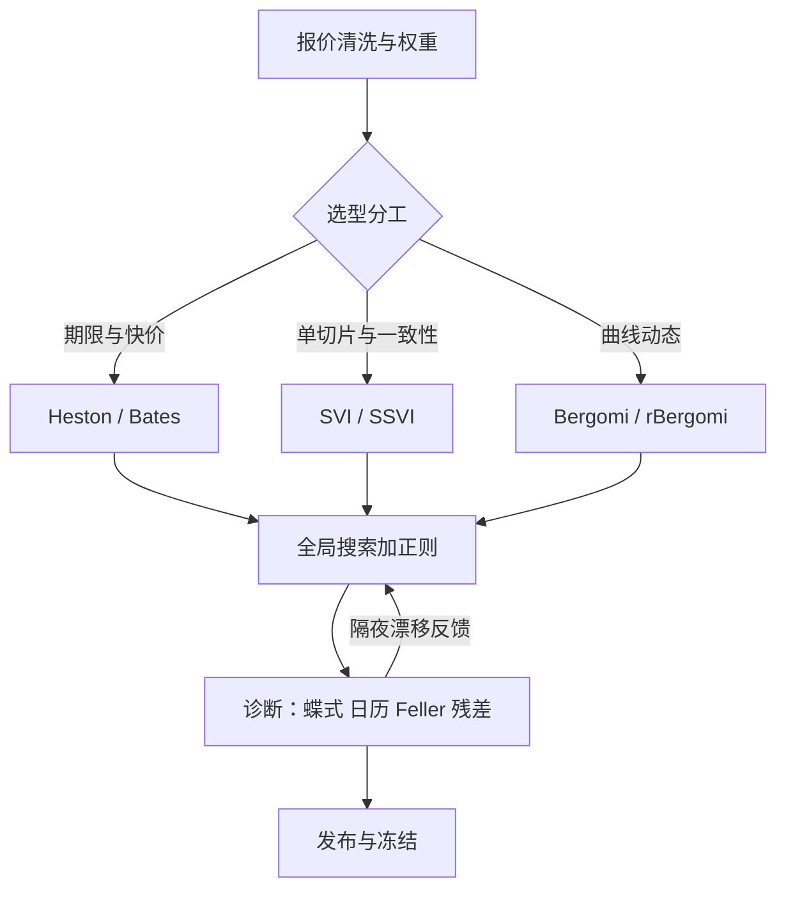

# 随机波动率的校准深入

校准不是拟合比赛：正则与权重是建模选择，它们决定你的参数隔夜跳多少，从而决定你的希腊字母信不信得过。

<footer>—— 据 Gatheral and Jacquier, 2014；Hagan et al., 2002 整理</footer>

[上一课](/quant/vt-product-hedging)的对冲价由模型给出；模型从校准来。原理课有 [Heston](/quant/heston)、[SABR 校准](/quant/sabr-calib)与 [SVI/SSVI](/quant/svi-ssvi)，工程课有[全局优化在校准](/quant/calibration-global-opt)与[校准正则化](/quant/calibration-regularization)。本课把它们装进一条生产管线，聚焦随机波动族的校准深入：选型、加权、稳定、诊断——校准到什么，就等于对冲到什么。

## 问题

Heston 五参数不可正交识别：$v_0$ 与 $\theta$ 管水平、$\kappa$ 管期限结构、$\sigma$ 管曲率、$\rho$ 管偏斜，但短端偏斜与长端水平会互相借用参数，同一张曲面有整族等价解。单到期可以贴得很漂亮，跨到期与隔夜稳定性一塌糊涂；每天重校准又让希腊字母跟着参数抖。没有管线约束的校准，输出的是每天换一个模型的幻觉稳定。

### 管线五段

一、报价清洗与权重：坏价剔除后用 Vega 加权或价格域加权保护平值——权重表决定解往哪里偏，要和对冲手册放同一页。二、选型分工：Heston 给期限结构与仿射特征函数快价（[heston-cf](/quant/heston-cf)），[Bates](/quant/bates) 的跳补短端偏斜，SVI/SSVI 管单切片与跨期一致性（[SVI 无套利参数化](/quant/svi-arb-params)、[SSVI 期限结构一致性](/quant/ssvi-term-consistency)），[Bergomi](/quant/bergomi) 与 [rBergomi](/quant/rough-bergomi) 管曲线动态与陡短偏斜。没有万能参数化，只有按产品分工。三、优化：全局搜索防局部极小；正则项把「对昨日参数的距离」写进目标函数，正则强度是风控参数，不是拟合参数。四、快价与模拟：仿射族走傅里叶反演，Bergomi 族只能模拟，模拟规格属于模型定义。五、诊断：蝶式与日历扫描、残差热图、[Feller 条件](/quant/heston-feller)检查、隔夜参数漂移曲线。

## 方法

诊断的验收标准先于拟合优度：蝶式扫描不许出负密度，日历扫描不许出总方差倒挂，残差热图不许在某个执行价带上长期同号。三项过了再看误差平方和——顺序反了，拟合越好病越重。稳定性用一条可执行指标：隔夜参数相对变化超过正则带宽的天数占比。占比高说明目标函数里等价解太多，先加正则再谈模型升级；多数「模型不行」的诊案，病根在目标函数而不是模型族。

Heston 的 $\kappa$ 调大、$\theta$ 调小可以在形状几乎不变的情况下把长端压平，参数悄悄漂出 Feller 边界。此时模拟必须显式声明边界规则，否则隔夜 PnL 归因指向的是一个不存在的模型——检查条件比检查拟合更要紧。

## 机制

校准是反问题：数据有限而参数自由，正则决定解落在解族的哪里。每天重校准等于隐式换模型：希腊字母的不稳定多半不是模型错，而是正则太弱让参数在等价解之间游走。权重的传导同样直接：给平值高权重的解，平值对冲就稳、翼部对冲就漂——「校准到什么就等于对冲到什么」是本课的机制核心，权重表因此属于风控文档，不属于研究附件。

## 边界

本课不重推特征函数与 Riccati 方程；[局部-随机混合校准](/quant/lsv-hybrid-calib)是下一课的邻居；跨市场参数迁移（用外汇的 $\rho$ 猜股指）一律禁止。正则的贝叶斯解释一句带过：先验越强越稳、越弱越贴，选择要在压力测试里做，不在回测里挑。

## 小结

- Heston 参数不可正交识别，等价解族要靠正则挑出一个稳定的。
- 选型按产品分工：仿射快价、跳补短端、SVI 管切片、Bergomi 管动态。
- 诊断先于拟合：蝶式、日历、残差三扫描不过，误差再小也不发布。
- 稳定性指标：隔夜参数漂移超正则带宽的天数占比，先加正则再升级模型。
- 权重表与正则强度是风控参数：校准到什么，就等于对冲到什么。
- 出处：Heston, 1993；Hagan et al., 2002；Gatheral and Jacquier, 2014；Bayer, Friz and Gatheral, 2016。
