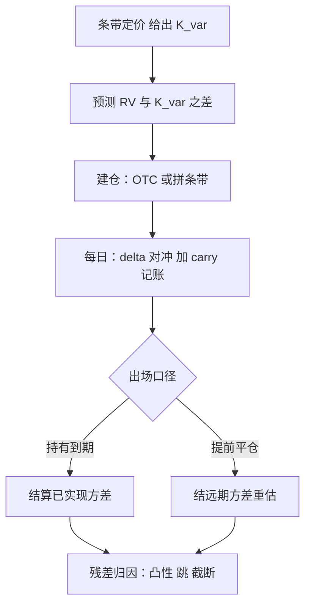

# 方差互换的深化

方差互换把一段路径压缩成一个执行价；签名只要一行，持有期的全部麻烦——delta、carry、凸性、跳、拥挤——都藏在那一行底下。

<footer>—— 据 Demeterfi, Derman, Kamal and Zou, 1999；Carr and Madan, 1998 整理</footer>

[上一课](/quant/vt-forecast-competition)把波动预测整理成可竞赛、可评估的栈，并说明预测只有接上正确的收益几何才有用。缺口随之而来：预测的对象是已实现方差，要下注必须把方差变成可持有、可对冲、可盯市的合同。[方差互换复制](/quant/var-swap-replication)讲过条带怎么给出公平方差，[方差互换与 VIX](/quant/variance-swap-vix) 讲了与 VIX 的关系，[方差与波动互换](/quant/var-vs-vol-swap)拆过开方凸性。本课不再推导复制，写持有期本身：怎么进、怎么记账、怎么对冲、怎么死。

## 问题

$K_{\mathrm{var}}$ 是今天条带按无套利给出的公平方差，不是你对 RV 的预测；交易的本质是「预测减执行价」。但持有期的盈亏不是「结算 RV 减 $K$」一条线：盯市先于结算，复制条带给合同带来 delta，[期限结构](/quant/vix-term-structure-trade)在动，凸性与跳的残差不对称。更麻烦的是方向：做空方差是收[方差风险溢价](/quant/variance-risk-premium)的主流做法，但隐波跳升时空头按盯市先赔钱——把路径盈亏与到期结算混在一个桶里，任何复盘都说不清这笔交易是错在了预测还是错在了活不到结算。

### 持有期四栏账

- carry：把（预测 RV 减 $K_{\mathrm{var}}$）除以 $K_{\mathrm{var}}$ 年化当预期收益，同时把预测误差的分布写进同一份报告。
- delta：复制条带随现货移动产生 delta，集中在平值附近，用期货按公式对冲；对冲本身在赚赔 $\tfrac12\Gamma S^2(\mathrm{RV}-\sigma_{\mathrm{imp}}^2)$，见 [Gamma scalping 恒等式](/quant/gamma-scalping-pnl)。
- 期限结构：到期前的平仓价由曲面与方差曲线定，滚动仓位按方差桶记账，桶随到期挪动。
- 残差：开方凸性（若做的是波动互换）、跳余项与条带截断，列入「已知不可对冲」清单。

## 方法

进出场分两步。进场用条带：OTC 直接按 $K_{\mathrm{var}}$ 成交，或在上市市场用近月与次月期权拼条带——后者多了执行与保证金，少了对手方信用。出场分「持有到期」与「提前平仓」两种口径：前者结已实现方差，后者结远期方差的市场重估，两者不是同一个数，报告必须分开。滚动的仓位按方差桶而非月份标签管理，与 [VIX 期限结构](/quant/vix-term-structure-trade)的桶语言一致。

对冲按四栏账的第二栏执行：条带 delta 主要由平值跨式贡献，对冲工具用标的期货；[对冲频率](/quant/delta-hedge-freq)的带宽由 Gamma 与成本定，不因合同是 OTC 而改变。

## 机制

$1/K^2$ 权重使左翼主导定价：条带价值的大头来自虚值看跌，于是现货大跌后条带 delta 按凸性上跳，次日的对冲账单自动变大——对冲预算要按「跌过之后」留，不按平均日留。这也是方差互换「纯方差暴露」的另一面：纯的是结算变量，不是持有路径。

溢价的经济来路要写清：卖方差收的是风险价格，不是错误定价，尾部由[波动率卖方](/quant/short-vol-tail)的左尾凸性支付。与 [Gamma swap](/quant/gamma-swap) 的价差是干净的偏度仓位，别让方差与偏度混进同一个 PnL 桶，否则[偏度风险溢价](/quant/skew-risk-premium)与方差溢价会互相污染归因。

2007 年 8 月的量化危机复盘里，大量基金经由方差互换与期权结构做空波动；隐波跳升时空头按盯市先亏，保证金与限额在「收敛」到来之前就行动。合同结构决定了坏消息先到：共识正确救不了仓位，活得到结算才行。

## 边界

本课不重推条带复制，也不处理 OTC 的信用与抵押——那是合同工程，归场外课程。个股方差互换的股息与借券处理一句带过：股息不确定时条带要用股息互换配套。「方差互换是纯波动暴露」这句话在本课程里不成立：它是纯方差暴露，对波动平方根的凸性差额是另一份合同的事。

## 小结

- 交易的本质是预测 RV 减 $K_{\mathrm{var}}$；持有期盈亏必须拆成 carry、delta、期限、残差四栏。
- 出场分「结算已实现」与「盯市平仓」两种口径，报告分开写。
- 条带左翼主导：大跌后 delta 凸性上升，对冲预算按跌后账单留。
- 卖方收的是风险溢价，与 Gamma swap 的价差是偏度仓位，归因不得混桶。
- 拥挤是结构性风险：盯市先于收敛，活到结算是仓位设计的一部分。
- 出处：Carr and Madan, 1998；Demeterfi, Derman, Kamal and Zou, 1999；凸性与条带详见复制与凸性两课。
