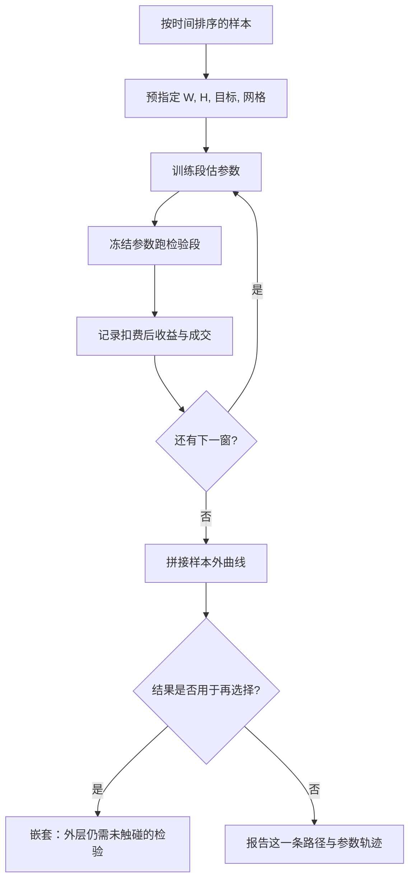

# 样本外与滚动检验

把一段历史切成「先优化、再检验」，并不能自动消除选择偏差：若检验段仍被用来挑规则、挑窗口、挑最好的那一次滚动，它就不再是样本外。

<footer>—— 据 Bailey, Borwein, López de Prado and Zhu, Notices of the AMS, 2014；López de Prado, Advances in Financial Machine Learning, 2018</footer>

回测最常见的自我安慰是：样本内优化参数，样本外看净值。滚动检验（walk-forward）把这条切割沿时间反复推进——用 $[t-W,t)$ 训练，用 $[t,t+H)$ 交易，再把窗口向前平移。Pardo 把它写成交易系统评估的标准程序；López de Prado 在 *Advances in Financial Machine Learning* 里则提醒：单条滚动路径仍然只是一条路径，尝试次数一大，它同样会被过拟合。本篇把滚动检验当成**时间上的样本外协议**，而不是当成「已经证明策略可部署」的证书。它要回答的是：参数是否随样本漂移、样本外是否仍有边缘，以及你有没有在滚动结果上做第二次选择。

## 问题

金融收益不是独立同分布。波动集群、体制切换、交易成本随拥挤变化，使得「全样本一次切分」既浪费数据，又把某段特殊历史的运气锁进结论。固定的 train/test 切分还有一个操作问题：研究者看到检验段不好，就会改切点、改窗口、改优化目标，直到检验段变好。此时检验段已经参与了模型选择，[多重检验](/quant/multiple-testing-factors)从切分那一刻重新开始。

滚动检验的动机是双重的。第一，模拟真实决策：你在 $t$ 只能使用 $t$ 之前的信息去定参数，然后用随后一段看不见的收益来评价。第二，产生多段相邻的样本外，而不是单一的末端窗口，从而看到边缘是否只存在于某一个十年。Bailey、Borwein、López de Prado 与 Zhu（2014）指出，样本内最优夏普随尝试次数膨胀；若不把「滚动本身」也算进尝试，滚动检验会变成另一种数据挖掘的外壳。

### 锚定窗口与滚动窗口

两种实现不要混用。滚动窗口（rolling）：训练长度 $W$ 固定，每次丢掉最旧的数据，对局部非平稳更敏感，也更容易在短窗口里拟合噪声。锚定窗口（anchored / expanding）：训练总从样本起点开始，只拉长右端，参数更稳，但对早期体制赋予持久权重。Pardo 的实务建议是先声明一种，并报告两种作为稳健性，而不是看完结果再选「好看」的那种。步长 $H$ 同样是协议的一部分：步长等于持有期时，样本外段互不重叠，统计更干净；步长很短则相邻检验段高度相关，有效独立样本外长度远小于你数出来的窗口个数。

「样本外夏普 1.8」若来自二十次滚动里被挑出来的那一次窗口与目标函数组合，它的信息量接近样本内。真正的滚动协议是：窗口、目标、约束、再优化频率全部预指定，只报告这一条路径，或报告路径的分布而不是最大值。

## 方法

最低限度的滚动协议包含：训练窗口 $W$、检验窗口 $H$、滚动步长、优化目标（扣费后效用还是毛夏普）、参数网格或估计器、以及是否允许在检验段再调一次仓位规则。每一期只在训练段上估计或搜索，把得到的参数冻结核到随后的 $H$，记录该段的成交、换手与[扣费后收益](/quant/net-edge)。全部窗口拼接成一条样本外权益曲线——这是 walk-forward 的主报告，不是训练段的那条更光滑的曲线。

Walk-forward 效率（Pardo）把样本外绩效除以样本内绩效。接近 1 并不证明 alpha 真实，只说明优化没有把样本内机会全部用光；远小于 1 则是过拟合或非平稳的直接证据。效率高也可能只是参数不敏感：网格里大家都差不多，滚动「稳」是因为没什么可学。因此必须同时报：参数路径是否剧烈跳动、检验段换手是否被训练段的换手低估、以及扣费后样本外是否过零。

### 嵌套滚动：检验段不能再当验证段

若还要用滚动结果在多种信号、多种网格、多种 $W$ 之间做选择，外层滚动的检验段就泄漏了。正确做法是嵌套：内层滚动只在训练段里做参数搜索，外层保留一段从未参与任何选择的最终检验。这与机器学习里 nested cross-validation 是同一逻辑，López de Prado 强调金融里更必要，因为一次「看起来很好的滚动」会被写成研报标题。White 的 Reality Check 与 Hansen 的 SPA 则从另一头处理同一问题：显式承认你比较了 $N$ 个规则，对最大统计量做共同检验，而不是假装只滚动了一次。

把滚动窗口写进代码还不够。Git 里若留着二十个被放弃的 $W$ 与目标函数，论文却写「我们采用三年滚动」，读者看到的是被选择过的协议。搜索日志应进入备忘录，并进入 [Deflated Sharpe](/quant/deflated-sharpe) 的尝试次数 $N$。

## 机制

滚动检验能抓住的，是**可适应的局部规律**是否在相邻时段重复。若信号来自缓慢的风险溢价，锚定窗口通常更合适，因为有效样本越大、估计越稳；若信号来自短暂的微观结构或拥挤状态，滚动窗口更诚实，因为它强迫你忘记旧体制。两种都无法创造独立性：相邻检验段共享波动状态与同一组交易者，样本外均值的标准误不能按窗口个数的平方根缩小。

过拟合在滚动里的形状不同于全样本网格搜索。全样本过拟合给出一条漂亮的样本内曲线和一截难看的末端；滚动过拟合给出一条尚可的拼接样本外曲线——因为每段检验都很短，噪声的夏普可以很高——但参数路径像随机游走，换手被训练段低估，一换真实成本或一换品种就垮。Bailey 等人所谓回测过拟合的概率，在滚动设定下应把「窗口长度 × 网格 × 信号家族」都算进试验次数，而不是只数参数组合。

### 与单次切分、交叉验证的分工

单次切分适合预注册的、几乎不调参的策略，优点是协议简单、难以事后改切点而不被发现。$K$ 折交叉验证在独立同分布假设下更有效地使用数据，但金融标签在时间上重叠，普通 $K$ 折会泄漏，见[交叉验证泄漏](/quant/cv-leakage-finance)。滚动检验介于二者之间：它尊重时间方向，产生可拼接的交易记录，路径条数却很少——通常只有十几个窗口。若要估计「在很多种训练/检验划分下，样本内冠军的样本外是否仍高于中位数」，需要[组合过拟合 CPCV](/quant/cpcv) 那种组合路径，而不是把滚动再加密一些。

## 边界与工程取舍

滚动不能修复前视、幸存者与迟到数据。训练段若用了修订后的基本面、用了后来才纳入指数的成份、用了当时不可借的空头，滚动只是把同一种偏差复制很多段，见[迟到数据与对账](/quant/late-data-recon)。它也不能替代成本与容量：每段检验仍需按当时的 ADV 与价差扣费，否则样本外夏普描述的是纸面账户。

不要用滚动去证明「最优参数稳定」。参数稳定可能来自网格太粗、目标函数太平，或正则把参数钉死。应报告参数的时间序列、约束是否经常打在边界上。也不要把样本外拼接曲线再做一次优化（例如按滚动夏普再加权各个子策略），除非这层优化本身处于更外层的冻结协议里。[研究与实盘隔离](/quant/research-sim-prod) 的意义正在于此：滚动属于研究环境的评估器，其超参一旦被实盘结果回头修改，评估器就失效了。

危机年会主导某几个窗口的损益。正确处理是预先声明是否把该窗口纳入优化、纳入报告，而不是事后删掉「异常窗口」。删窗口与改切点是同类自由度。

## 小结

- 滚动检验是沿时间重复「只在过去上学习、在随后一段上交易」的协议，用来暴露参数漂移与非平稳，而不是用来颁发可部署证书。
- 窗口类型（滚动或锚定）、长度、步长、优化目标必须预指定；在滚动结果上挑最好的窗口或网格，检验段就不再是样本外。
- Pardo 的 walk-forward 效率是诊断，需与参数路径、换手和扣费后是否过零一起读。
- 路径条数很少时，滚动无法替代多重检验调整、Deflated Sharpe 或 CPCV；嵌套滚动才能把模型选择关在内层。
- 滚动不修复前视与成本错误；偏差会被复制到每一窗。
- 出处：Pardo, *The Evaluation and Optimization of Trading Strategies*, Wiley；Bailey, Borwein, López de Prado and Zhu, *Notices of the AMS*, 2014；López de Prado, *Advances in Financial Machine Learning*, Wiley, 2018；White, *Econometrica*, 2000；Hansen, *JBES*, 2005。
