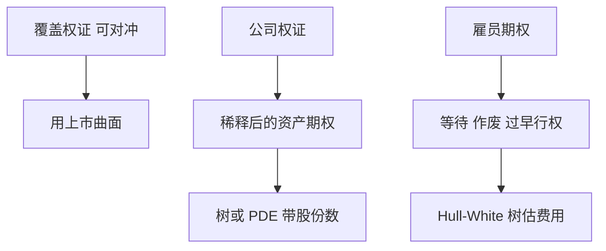

# 权证与雇员期权

雇员期权不可转让、可能作废、且持有人不能对冲；用上市香草的 BSM 去估费用，会把不可交易的限制当成波动率折减。

<footer>—— Hull and White, How to Value Employee Stock Options, Financial Analysts Journal, 2004</footer>

[上一课](/quant/option-strategies)的组合默认腿可交易、可对冲。权证与雇员股票期权（ESO）的缺口是**合约与持有人约束**：公司发行稀释、雇员不可卖出、离职作废、以及权证的稀释与做市。主干 [美式期权](/quant/american-exercise) 已写提前行权；本课只补这些市场微结构与会计估值里多出来的状态，不重写美式树。

## 问题

上市权证常是公司或券商发行的美式看涨，条款含稀释、赎回、停牌。ESO 更极端：等待期（vesting）、离职后短暂可行权窗口、不可转让，持有人往往过早行权。问题是定价核：市场香草假设对冲与可转让，ESO 的「公平费用」若仍用同一 [BSM](/quant/bsm) 隐波，等于忽略作废率与过早行权，通常**高估**费用。Hull–White（2004）把退出率与行权倍数（现价相对执行价的门槛）写进树，对象是费用计量，不是给雇员一个可对冲的交易价格。

稀释：权证行权时公司发新股，标的从 $S$ 变成对资产池的摊薄要求权。Galai–Schneller 把权证写成公司价值上的期权，而不是对已上市股票的普通期权。把权证当「股票看涨」会在发行量大时系统性偏贵。

### 过早行权不是「美式比欧式贵」那句话

美式看涨在无分红下不应提前行权；ESO 持有人为了分散、流动与税，会在价内不深时就行权。这是效用与约束，不是无套利。模型里用外生的行权强度或门槛倍数去拟合历史行权行为，会把行为风险当成波动率。会计上可接受，交易上不能用这个「折减 vol」去对冲上市权证。

覆盖性认购（covered warrant）由券商发行、用对冲簿复制，更接近普通权证；公司认股权证才有稀释。两者不要共用 Galai 公式。

## 方法

公司权证：在公司资产或稀释后股权上建树，行权时增加股份数，支付用摊薄后价格。上市覆盖权证：按条款当美式/欧式香草，用与上市期权一致的曲面，注意报价货币与除权。ESO：Hull–White 树或等价的强度模型，输入预期退出率、行权倍数、等待期；费用在授予日按不可转让约束计算，后续按会计规则摊销——那是账，不是盯市。

对冲上市权证用香草与期货；对冲 ESO 费用不是交易台的复制问题，公司若买回股份是资本结构决策。

## 机制

不可转让切断了持有人把期权卖给能更好对冲的人，于是提前行权被拿来当流动性工具。作废是一个跳跃：离职强度把存活概率从定价核里乘掉。稀释把标的从「每股」改成「对资产的份额」，行权同时改变份额。三者都不是新的随机波动，而是合约状态。

## 边界

退出率与行权倍数不稳定，危机年与牛市年差一截；用历史均值估当年授予费用会偏。税务（ISO/NSO、境内个人所得税时点）改变最优行权，模型若不含税就不是雇员的真实问题。权证做市还受涨跌停与流动性，希腊值在停牌时无法对冲。

本课不写如何设计期权池去规避激励会计。对象是估值约束与稀释。

## 小结

- 覆盖权证接近可对冲香草；公司权证要稀释；ESO 要作废与过早行权。
- 用上市 BSM 隐波估 ESO 费用通常偏高；Hull–White 把行为写进树。
- 行为折减不能拿去对冲可交易权证。
- 出处：Hull and White, *FAJ*, 2004；Galai and Schneller, *Journal of Finance*, 1978。
