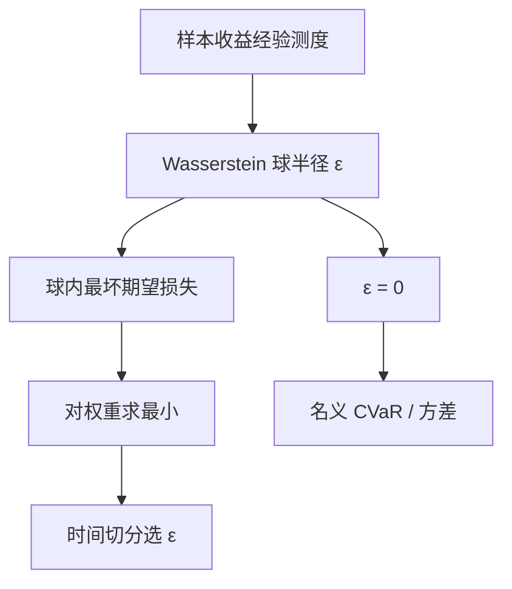

# Wasserstein DRO 组合

经验分布只是真实测度的一个样本；在以经验测度为球心的 Wasserstein 球里取最坏期望，再对配置求最小，得到的是带半径的稳健规划，而不是把样本协方差再求一次逆。

<footer>—— Mohajerin Esfahani and Kuhn, Data-driven distributionally robust optimization using the Wasserstein metric, Mathematical Programming, 2018；组合估计不稳定性对照 Caccioli, Kondor and Papp 等</footer>

[Markowitz](/quant/markowitz) 与样本 [CVaR 优化](/quant/cvar-opt) 都把经验分布当成真实分布。[Ledoit–Wolf](/quant/ledoit-wolf) 收缩协方差；Caccioli、Kondor 与 Papp 一类工作则指出：在高维、尤其是 ES 目标下，估计误差会让权重炸裂，需要正则。Wasserstein 分布稳健优化（DRO）把正则写成概率度量上的球：决策对球内最坏 $\mathbb{P}$ 最优。Mohajerin Esfahani 与 Kuhn（2018）证明，相当一类 Wasserstein DRO 可化为有限维凸规划，并给出有限样本保证；文中的例正是均值–风险组合。Esfahani–Kuhn 提供工具，Caccioli 等提供高维组合为何会炸的动机，二者不是同一篇论文。Blanchet、Chen 与 Zhou 随后把均值–方差放进 Wasserstein 球，得到带正则的经验方差问题。本篇写球、半径、与样本 CVaR 的关系。

## 问题

观测到收益样本 $\{r_s\}_{s=1}^n$，经验测度 $\hat{\mathbb{P}}_n=\frac1n\sum_s\delta_{r_s}$。名义问题 $\min_w\mathbb{E}_{\hat{\mathbb{P}}_n}[\ell(w,r)]$ 在 $n$ 不大、$w$ 维数高时过拟合：优化器把样本里最坏那几天的特有结构当成永久状态，Caccioli、Kondor 与 Papp 对 ES 组合的不稳定性描述的就是这类现象。DRO 改为

$$
\min_w\ \sup_{\mathbb{P}:\,W(\mathbb{P},\hat{\mathbb{P}}_n)\le\varepsilon}\mathbb{E}_{\mathbb{P}}[\ell(w,r)],
$$

$W$ 为 Wasserstein 距离（通常 $p=1$ 或 $2$），$\varepsilon$ 是半径。$\varepsilon=0$ 退回名义样本问题；$\varepsilon$ 增大，最坏分布可以把质量挪到更差的收益上，最优 $w$ 被推向更分散、更少押注样本特有方向。问题是 $\varepsilon$ 从哪来、$\ell$ 取均值–方差还是 CVaR、以及球是否允许把质量移出历史上从未出现的象限——Wasserstein 球允许在支撑附近连续移动，这与只扰动概率权重的 $\phi$-散度球不同。

### 为什么是 Wasserstein 而不是矩不确定

矩不确定（均值、协方差落在某个集合里）不直接使用样本点的几何；$\phi$-散度球要求最坏分布与 $\hat{\mathbb{P}}_n$ 绝对连续，不能把质量放到样本外的新点。Wasserstein 球按运输成本移动质量，最坏情形可以在样本点邻域长出新支撑，这更接近「未来会出现与历史相似但不相同的坏日子」。Esfahani–Kuhn 的关键技术结果是：对相当广的损失函数，内层 $\sup_{\mathbb{P}}$ 有对偶，外层对 $w$ 仍凸，可交给锥规划，而不必在测度空间里做全局优化。

半径 $\varepsilon$ 不是风险厌恶参数，虽然增大 $\varepsilon$ 看起来更「保守」。它是对 $\hat{\mathbb{P}}_n$ 可信度的预算。用同一 $\varepsilon$ 跨资产类、跨日频与月频，量纲错了：Wasserstein 距离继承收益的范数单位。应在标准化收益上选 $\varepsilon$，或按维数与 $n$ 的理论速率标定。

## 方法

**CVaR 型损失。** 组合损失 $\ell(w,r)=-w^\top r$（或相对基准）。Rockafellar–Uryasev 的 CVaR 对 $r$ 分段线性，正好落在 Esfahani–Kuhn 可处理的一类。对偶后出现与 $\varepsilon$ 成正比的范数罚项：最坏期望 $\approx$ 经验 CVaR $+$ $\varepsilon\cdot L(w)$，其中 $L(w)$ 由运输成本的对偶范数决定（常见为 $\|w\|_*$ 一类）。$\varepsilon=0$ 回到 [CVaR 优化](/quant/cvar-opt)；$\varepsilon$ 上升，解趋向更均等的权重，这与实践中加大收缩强度同向。

**均值–方差。** Blanchet–Chen–Zhou 表明，Wasserstein 均值–方差 DRO 可化为经验方差加正则，半径同时影响目标收益约束的稳健形式。它给 [Ledoit–Wolf](/quant/ledoit-wolf) 一类收缩一个运输度量上的解释：不是任意把 $S$ 拉向 $F$，而是对分布扰动的最坏方差付费。实践中仍要选目标矩阵或范数；DRO 不自动给出行业中性。

**选 $\varepsilon$。** Esfahani–Kuhn 给出有限样本保证：$\varepsilon_n$ 可取与 $n^{-1/d}$ 相关的阶（$d$ 为收益维数），使真实分布以高概率落在球内。维数高时该阶极慢，理论半径会大到把组合推成近似等权。工程上用时间切分交叉验证：在训练窗上扫 $\varepsilon$，在随后块上比较实现 CVaR 或方差，禁止用全样本事后挑 $\varepsilon$。这与任何超参相同，见 [重叠](/quant/label-horizon-overlap) 与泄漏。

### 与收缩、约束的分工

DRO 的半径正则作用于**分布**，持仓约束（行业中性、换手、多空）作用于 **$w$**。二者互补：约束表达投资政策，半径表达「我有多不信这段历史」。不要用很大的 $\varepsilon$ 去代替明确的杠杆上限——最坏分布下的最优仍可能在某只样本外更差的资产上加码，若该资产在范数上「便宜」。支持集约束（收益不能超出历史极值太多）应写进运输成本或硬性盒子，否则最坏情形会把单日收益移到无界。

## 机制

运输直觉：对手方获准花费 $\varepsilon$ 的运输预算，把样本点移到使你的损失更大的位置。对线性损失，最坏移动沿着 $w$ 的方向把收益推低，于是对偶出现 $\|w\|_*$ 罚项——这正是「不要把权重集中在样本特有方向」的几何。Caccioli 等指出的 ES 不稳定性，来自少数尾部情景决定目标；Wasserstein 最坏情形等于承认这些情景还可以更坏一点点，从而提前付正则，而不是等样本外真的更坏。

与稳健控制（Hansen–Sargent）的差别：那里常用相对熵球，最坏分布改变概率权重、不创造新支撑。相对熵对「完全未见到的跳跃」收费极高（或无穷）。Wasserstein 对近处的新点收费按距离，更愿意承认「类似的坏日」。选哪一种球是建模判断：担心未见到的跳，可加大运输成本里对极端位移的罚，或改用含跳的生成模型，而不是无限加大 $\varepsilon$。

### 维数灾难与等权

$d$ 大时，覆盖真实分布所需的 $\varepsilon$ 迅速变大，DRO 解趋向等权或趋向约束边界。这不是缺陷，是高维下「不信样本」的诚实结论。若你不愿等权，应先降维（因子收益上做 DRO），或先 [收缩协方差](/quant/ledoit-wolf) 再在低维残差上做，而不是在 3000 只股票的日收益上直接套理论半径。Esfahani–Kuhn 的数值例是低维均值–风险组合，不是全市场个股。

把 DRO 的最坏分布当成「真实压力情景」去写叙事，会过度解读对偶变量。最坏 $\mathbb{P}^\star$ 是内层优化的工具，不必在经济上可实现。对外只报告 $w^\star$ 与所选 $\varepsilon$ 的样本外损失，不报告「最坏世界里哪些股票跌了 40%」除非那是显式压力表。

## 边界与工程取舍

不要声称 Wasserstein DRO 消除了模型风险：损失 $\ell$、范数、支持集仍是模型。不要在含重叠收益的窗口上交叉验证 $\varepsilon$。不要把 $\varepsilon$ 按夏普在全历史上网格搜索再报告该夏普。计算上，分段线性 CVaR DRO 是 LP/锥规划，规模随 $n$ 与分段数增长；日频十年、资产上百，需要求解器与情景压缩，不能假装「公式已闭式」。

Caccioli 路线的正则（$\ell_2$ 等来自冲击函数）与 Wasserstein 对偶罚项可以看起来像同一个岭。它们的故事不同：一个来自交易冲击与估计噪声的统计物理，一个来自概率度量球。可以同时用，但要说明两个强度参数各自对应什么，避免把同一个 $\lambda$ 解释两次。

出处：Mohajerin Esfahani and Kuhn, *Mathematical Programming*, 2018。均值–方差 Wasserstein 见 Blanchet, Chen and Zhou, *Management Science*。组合 ES 不稳定性见 Caccioli, Kondor, Papp 及先前工作。CVaR 可优化形式见 Rockafellar and Uryasev。

## 小结

- Wasserstein DRO 在经验测度的运输球内做最坏期望，再优化组合，半径 $\varepsilon$ 是对样本的不信任预算。
- Esfahani–Kuhn（2018）给出可处理凸重构与有限样本保证，例题即均值–风险组合；Caccioli 等提供高维 ES 不稳定的动机。
- CVaR 等分段线性损失对偶后常出现权重范数罚，使解随 $\varepsilon$ 走向分散。
- $\varepsilon$ 须按收益量纲与时间切分选择；高维理论半径会把解推向等权，宜先降维。
- 与 Ledoit–Wolf、持仓约束分工：分布稳健、协方差结构、投资政策不是同一个旋钮。
- 出处：Mohajerin Esfahani and Kuhn, 2018；Blanchet, Chen and Zhou；Caccioli, Kondor and Papp。
