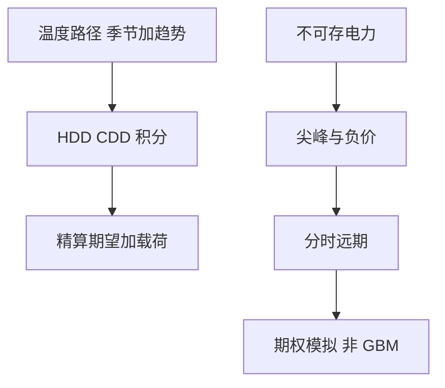

# 天气与电力衍生

HDD 与 CDD 是温度对阈值的积分，不是可储存商品的期货价格；电力几乎不能库存，尖峰使对数正态成为差的第一近似。

<footer>—— Geman, Commodities and Commodity Derivatives 中的电力与天气章；天气衍生见 Jewson 与 Brix 对 HDD 的精算处理</footer>

[上一课](/quant/commodity-options-seasonality)还在可储存商品的期货期权。天气与电力的缺口是**不可储或几乎不可储**：温度指数没有便利收益与库存套利，电力现货有极端尖峰与负价。本课写 HDD/CDD、天气期权、以及电力远期/期权为何不能套用 WTI 的 Black-76 习惯。后课通胀回到可金融化的 CPI。

## 问题

天气衍生：支付是某站、某季的 HDD $\sum\max(T_{\mathrm{ref}}-T_d,0)$ 或 CDD 对执行值的差。标的不是交易的期货曲线（除非有 CME 天气期货），对冲用的是相关商品（天然气）或再保险，而不是 Delta 到「温度期货」的完整复制。问题是定价更接近精算：历史温度、趋势（气候）、以及与能源负荷的相关，而不是 GK 式的风险中性完备市场。硬套 BSM 隐波，会把不可对冲的基差藏进 $\sigma$。

电力：日前/实时、节点电价、容量与阻塞。远期是分月、分峰谷的合约。期权在尖峰月对虚值看涨极度昂贵，负电价使看跌也非标准。库存套利几乎不存在，远期曲线可以剧烈 backwardation 而不被现货交易抹平。

### 完备市场假设先坏掉

股权与 FX 课默认可以用标的对冲。温度不能存，也不能无摩擦交易。风险中性测度不唯一，市价来自再保供给与能源商的对冲需求。报告应把「精算期望 + 风险载荷」与「若存在液体期货则 Black」分开，不要混成一个公式。

电力尖峰可用带跳或机制转换的现货模型，再积分到月度远期。用年化 80% 的 GBM 去拟合尖峰月，尾部仍然不够，还会把非尖峰月估贵。

## 方法

天气：去趋势的历史模拟或温度的 Ornstein–Uhlenbeck + 季节，支付在物理测度下取期望，再加载荷；若有交易所期货，用其价格锚定期望，期权用残差波动。电力：分合约（峰/谷/月）的远期曲线，现货模型校准到远期与历史尖峰，期权用模拟。负价用移位或截断分布。对冲：电力用对应节点与时段的远期；天气用相关能源与地理基差限额。

## 机制

不可储意味着现货可以与「合理」的远期长期脱节，尖峰是约束（容量）而不是扩散噪声。HDD 是阈值积分，凸性在冷冬，与天然气看涨相关但不等于天然气期权。把天气当天然气的 quanto，相关不稳定（暖冬可以同时压气价与 HDD）。

## 边界

气候趋势使历史均值偏低或偏高，纯历史模拟有偏差。地理基差（机场站 vs 负荷区）可以吞掉整份天气期权的价值。电力市场规则（价格帽、稀缺定价）改变尾部，模型必须跟规则版本。本课不写如何在节点市场做物理交割套利。

## 小结

- 天气衍生是指数精算加或不加期货锚定，不是完备市场 BSM。
- 电力几乎不可储，尖峰与负价要求分时远期与跳/机制模型。
- 与天然气的相关是对冲工具，不是定价恒等式。
- 出处：Geman 对电力与商品的论述；Jewson and Brix, *Weather Derivative Valuation*。
