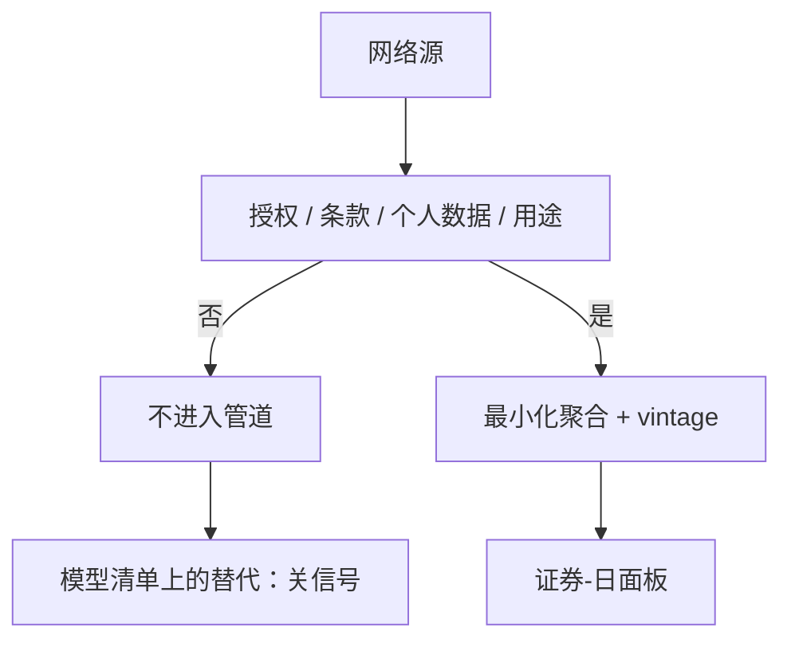

# 网络数据合规

网页上公开可见，不等于可以无限制采集、存储、再分发或用来识别个人。另类数据的边界是法律与合同，不是爬虫的技术能力。

<footer>—— 据对公开信息采集、网站服务条款与个人数据保护的一般法律原则整理；具体义务随司法管辖与合同而变</footer>

[卫星到特征](/quant/satellite-to-feature)把特征停在设施统计量。本课的缺口是：网页、社交、招聘、评论等网络源，采集与使用受到服务条款、版权、个人数据保护与市场法规约束。另类数据课序在本课收束。本课写研究与交易可以使用的**合规框架**（授权、目的限制、最小化、禁止识别个人），不写如何绕过技术或合同去抓取。没有合规，面板与 vintage 都建在不可持续的输入上。

## 问题

网络数据看起来像「已经公开」。公开不等于进数据库合法，更不等于可交易使用合法。限制来自多层：网站服务条款是否允许自动采集；版权是否覆盖文本与图片的复制；个人数据（姓名、账号、位置轨迹、车牌）是否被处理；内幕与市场滥用规则是否把某些非公开组合当成禁止使用的信息。研究团队若只问「IC 高不高」，会把法律风险当成外部噪音。缺口是把合规当成数据管道的第一道过滤器：进不来的源，不进入面板设计。

目的限制：为信用风险采集的数据，不能默认转去交易。最小化：不需要个人标识就不存。存储：vintage 快照与「删帖后仍保存原文」可能冲突，需要法律设计而不是偷偷存。

### 个人数据与设施统计量的分界

卫星课已要求停在停车场计数而非车牌。网页侧同样：可以在授权下统计「某零售商招聘岗位数变化」，不应存储应聘者简历；可以统计产品评论星级分布，不应存储可识别的用户主页。分界是聚合与识别。面板的单位是证券-日，不是用户-日。

供应商合同往往禁止再分发原始抓取、限制客户范围、要求删除权。点-in-time 存档必须与合同的保留条款一致，否则 vintage 管道本身违约。

## 方法

采购前清单：来源类型、司法管辖、是否含个人数据、服务条款与 robots 是否构成合同约束、是否有授权 API、版权许可、能否提供 vintage、退出与删除如何执行。只有过清单的源才进入[面板构造](/quant/alt-panel-construction)。内部抓取即使技术可行，也要同等清单，不能因为「我们自己写的爬虫」而豁免。

使用中：访问控制、用途记录、禁止把原始文本对着单一公司的未公开事件做再识别。市场操纵与滥用规则要求：策略不能设计成散布或利用非法取得的信息。本课只强调负向约束——哪些不做。

研究沟通：论文与内部备忘录使用聚合结果，不粘贴可识别原文。这与 Tufte 式引用真实文献不冲突：文献是已发表作品，网页用户生成内容不是你可以随意再发表的语料。

### 合规失败是运营风险，会变成模型风险

源突然被切断、合同终止、监管询问，等于特征消失。模型清单应把「网络源可获得性」写成假设，替代方案是关掉该信号。这与流动性螺旋不同，但同属模型风险课的「错误用途 / 输入契约」。

## 机制

不合规采集的「alpha」有两种假。一是法律上不可持续，样本外会因切断而消失。二是可能含有你本不该有的非公开组合信息，回测不可作为可交易期望。合规过滤会降低覆盖、降低 IC，这是成本，像交易成本一样必须在期望里扣掉。把过滤前的 IC 当研究成功，与用零滑点回测同类。

跨司法管辖：同一网页在 A 国可采、在 B 国因个人数据法不可采。面板的 $i$ 若是全球股票，特征对一部分名字结构性缺失，不是随机缺失。缺失机制要写进面板课的第三张表。

本课不引用不存在的判决或伪造的法规编号。实施以你所在司法管辖的现行法律、交易所规则与合同文本为准，并经法律审查。

### 源切断应预先写在模型清单上

合同终止、条款变更、监管询问会使特征消失。这与流动性螺旋不同，但同属输入契约破裂。替代是关信号或换授权源，不能临时改去无授权采集。

## 边界

新闻许可、交易所动态、监管公告通常有正式分发渠道，优先走授权源。暗网、破解数据库、未授权的付费墙绕过，不在研究范围。加密链上数据的公开性与网页不同，仍可能有隐私与制裁名单问题，需单独审查。另类数据主干在此结束。

研究备忘录使用聚合结果，不粘贴可识别的用户生成原文。文献引用是已发表作品，网页评论不是可再分发的语料。

## 小结

- 公开可见 ≠ 可采集、可存储、可交易使用。
- 管道第一道是合规清单，不是 IC。
- 特征单位停在证券聚合，不停在个人。
- vintage 存档不得违反合同保留与删除义务。
- 源切断是模型风险，预先写替代。
- 出处：个人数据保护与合同的一般原则；服务条款作为合同约束的法律实践；市场滥用框架以所在司法管辖为准。具体条文不在本课伪造。
