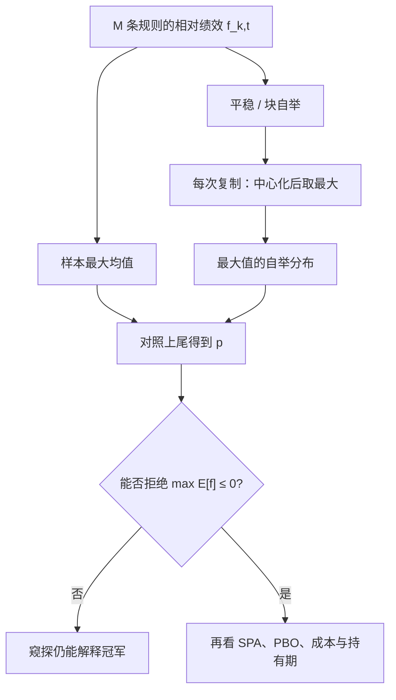

# White Reality Check

    
在一堆技术规则里挑出样本内最好的那一个之后，必须问：这个最大值相对基准的优势，是否仍能在数据窥探下站住。

    <footer>—— White, A Reality Check for Data Snooping, Econometrica, 2000</footer>

数据窥探（data snooping）不是说回归写错，而是说你报告的统计量是许多次尝试之后的最大值。White（2000）给这个问题一个可计算的检验：Reality Check。原假设是「最好的那条规则也不优于基准」（零技能、买入持有、或某个预指定策略）。备择是至少有一条规则的期望绩效超过基准。因为比较的是最大值，临界值必须来自最大值的抽样分布，而不是来自单条规则的 $t$。方法是对收益序列做平稳自举，在每一次复制上重新计算所有规则相对基准的绩效，记下最大值，用这个自举极值分布去读真实样本上的最大绩效。本篇写检验对象、自举细节，以及它相对 [Hansen SPA](/quant/hansen-spa) 的功效问题。它处理的是「是否有人赢过基准」，不是 [PBO](/quant/pbo) 里的相对中位排名。

## 问题

记规则 $k=1,\ldots,M$ 在 $t$ 的相对绩效为 $f_{k,t}$（例如超额收益、相对基准的效用差）。关心的参数是 $\mathbb{E}[f_{k,t}]$。若只检验预先指定的某一个 $k$，普通 $t$ 或 Diebold–Mariano 即可。若 $k$ 是看过结果之后才锁定的，正确的原假设是

$$
H_0:\ \max_{k\le M}\mathbb{E}[f_{k,t}]\le 0.
$$

拒绝 $H_0$ 才配声称「搜索产生了优于基准的规则」。不拒绝并不证明所有规则都无用，只是说在这套依赖结构与样本长度下，最大值还没有超出窥探所能解释的范围。Sullivan、Timmermann 与 White 把同一框架用到日历规则与技术交易规则的长历史，结论往往比单条规则的 $t$ 严厉得多。

困难在于 $f_{k,t}$ 跨规则相关、跨时间相关。移动平均族共享同一价格路径，最大值的方差不是独立极值公式。解析临界值几乎不可得，所以 White 用自举直接模拟「在 $H_0$ 下最大值有多大」。

### 基准必须预先指定

$f_{k,t}$ 是相对谁的差。基准可以是零（绝对技能）、无风险利率、买入持有市场、或某个已部署策略。换基准等于换检验。把基准选成一个故意很弱的规则，Reality Check 容易拒绝，但这只说明你赢了弱者。把基准选成已经过搜索的「历史冠军」，则原假设过强。纪律是：基准在看规则集合之前锁定，并与将要承担的风险一致——用毛收益赢一个不交易的基准，忽略 [价差](/quant/spread-cost) 与换手，拒绝没有经济内容。

$M$ 同样必须诚实。论文脚注里的二十条规则，若来自曾试过两百条的实验室，自举只覆盖了被展示的子集，p 值偏低。与 PBO 一样，未报告的搜索是暗数。

## 方法

**统计量。** 样本均值 $\bar f_k=T^{-1}\sum_t f_{k,t}$，Reality Check 的核心量是 $\max_k \sqrt{T}\,\bar f_k$（或等价的最大 $t$，但原文对未学生化均值做极值）。在 $H_0$ 下用中心化自举：对平稳自举或块自举的每一次复制 $b$，计算 $\bar f_k^{(b)}-\bar f_k$，再取最大值，得到最大值在「均值为零」附近的分布。真实样本的 $\max_k\bar f_k$ 对照该分布的上尾，得到 p 值。Politis 与 Romano 的平稳自举用来保留收益的弱依赖；块长度是调谐参数，应报告敏感性。

**学生化与否。** 未学生化时，方差特别大的差规则会主导最大值——它们的 $\bar f_k$ 噪声大，更容易碰巧成为样本冠军，自举也会反映这一点，但功效被一堆糟糕规则稀释。这正是 Hansen 后来要改的地方。White 的原始 Reality Check 在「很多明显很差的替代」时偏保守：难以拒绝 $H_0$，即使有一两条真正较好的规则。实务上应同时报告 Reality Check 与 SPA，而不是只报那个更好看的 p。

### 规则集合如何进入自举

每一次自举复制必须重算**全部** $M$ 条规则的绩效，再取最大，而不是只自举已经选中的那一条。若规则是参数网格上的连续族，应把网格点全部纳入，或对参数做与原搜索相同的离散化。特征若在全样本上选过，规则集合本身已经泄漏，自举无法修复，见 [嵌套交叉验证](/quant/nested-cv)。成本假设必须写进 $f_{k,t}$：用同一套扣费后收益去做自举，否则检验的是零成本世界里的窥探。

Reality Check 的 p 值高，不授权把冠军拿去加杠杆；它只是说还不能拒绝「最大值可被窥探解释」。p 值低，仍要过容量、非平稳与真正持有期样本。检验替代不了部署协议。

## 机制

选择偏差抬高 $\mathbb{E}[\max_k\bar f_k]$。自举通过重抽样价格路径，保留规则之间的相关，模拟在没有技能时这个最大值会冲到多高。相关越高，有效试验越少，临界值越接近单次检验——这是自举相对 Bonferroni 的优点：Bonferroni 按名义 $M$ 罚，自举按依赖结构罚。时间依赖（波动集群）由块自举承担；块太短会低估依赖，p 值过小；块太长则复制次数有效下降。

与因子研究的多重检验相比：Harvey–Liu–Zhu 给的是截面因子发现的 $t$ 门槛；Reality Check 给的是**同一价格序列上的规则搜索**。技术分析、日历效应、日内过滤，都属于后者。因子动物园也可以写成 $f_{k,t}$ 去做 Reality Check，但因子之间的经济相关与宏观周期使块自举的设计更难，FDR / 逐步法往往更常用。不要用一种调整替代另一种适用对象。

### 与 PBO、DSR 的对象不同

Reality Check：$p$ 针对 $\max\mathbb{E}[f_k]\le 0$。PBO：冠军相对候选中位的掉队频率，可以在全体都优于基准时仍然很高（选择无相对优势），也可以在全体都差时很低（稳定地少亏）。DSR：对已经选出的那一个夏普做解析放气。三者可同时做。只报 Reality Check 拒绝、却把网格藏起来，仍然是窥探；只报 DSR 高、却相对一个从未纳入检验的基准，故事不完整。

## 边界与工程取舍

White 原文对差规则的功效问题是已知的：Hansen SPA、Romano–Wolf 逐步法是后续。样本短时自举的有限样本表现不稳定，应给出块长度与 $M$ 的敏感性表。非平稳使「整段历史的 $\mathbb{E}[f_k]$」这个参数本身可疑——体制切换后期望会变，拒绝的是历史均值，不是未来可交易边缘。

不要对经过样本外拼接、再挑选窗口的曲线做 Reality Check 却把 $M$ 设为规则个数而不计窗口选择。切分、成本、宇宙都是规则的一部分。也不要把连续调参的梯度上升当成 $M=1$：路径上的每一个早停点都是一次窥探，除非预注册停机规则。计算上 $M$ 很大时应对收益矩阵向量化，自举只重抽样时间下标，不重跑订单簿。

把 Reality Check 做成「通过即可上线」的闸门，会激励缩小 $M$ 或弱化基准。预注册规则集合与基准，比追求某一个 p 值更重要。p 值是该协议下的数字，不是策略的内在属性。

## 小结

- White Reality Check 检验的是：在数据窥探下，最好规则的期望绩效是否仍不优于预指定基准。
- 临界值来自对全部规则重算最大值的平稳自举，而不是单条 $t$。
- 差规则会稀释功效，这是 SPA 要学生化与再中心化的原因；应同时报告。
- 规则集合、基准与成本必须在看结果前锁定；$M$ 的暗数使 p 值不可信。
- 拒绝不等于可交易；不拒绝不等于所有规则无用。
- 出处：White, *Econometrica*, 2000；Sullivan, Timmermann and White, *Journal of Finance*, 1999；Politis and Romano, *Journal of the American Statistical Association*, 1994。
