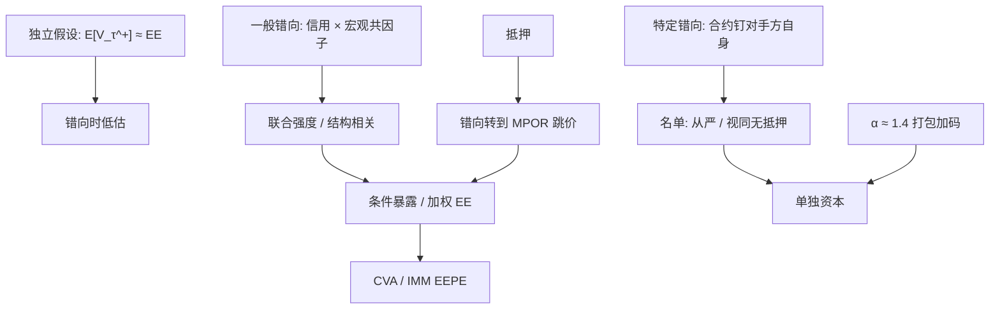

# 错向风险

    
当对手方违约的发生与我对它的正暴露同向变大时，无条件期望暴露会低估违约时损失；错向不是「相关高」的别名，而是违约时刻的条件化。

    <footer>—— 对照 Basel 对 general / specific wrong-way risk 的区分，以及 Canabarro–Duffie 对暴露与信用依赖的讨论</footer>

[对手方](/quant/counterparty-credit) 与 [CVA](/quant/cva-lite) 都提到独立假设一破，公式偏低。本篇把错向风险（wrong-way risk, WWR）单独写成对象：一般错向相对特定错向、它如何让 $\mathbb{E}[V_\tau^+]>\mathbb{E}[V_t^+]$、[SA-CCR](/quant/sa-ccr-ead) 的 α 与 [IMM EEPE](/quant/imm-eepe) 各自补了哪一层、以及为什么用无条件相关去「加一个 ρ」常常加错地方。它补的是违约与暴露的联合，不是再讲一遍净额与抵押。

## 问题

单边损失在违约时约为 $(1-R)V_\tau^+$。若强度（或结构模型里的资产价值）与驱动 $V$ 的市场因子独立，则 $\mathbb{E}[V_\tau^+]$ 可用无条件 EE 曲线对违约密度积分，这就是教科书 CVA。错向是指：$\tau$ 更容易落在 $V^+$ 已经很大的路径上。于是条件期望高于无条件截面均值，独立 CVA 与独立 EEPE 都偏乐观。反错向（right-way）相反，常见于对商品生产者卖出以该商品计价的应收保护——对手方在商品涨时更健康，而你的正暴露也可能在涨时出现；资本公式很少因此减 α，识别的不对称是故意的。

监管把错向分成两类。**一般错向**：对手方信用与宏观因子同向（衰退里人人 CDS 走阔，同时衍生品 MtM 对你有利）。**特定错向**：暴露与该名字自身的信用事件直接耦合——最干净的例子是买入以对手方自己股票为标的的看跌、或以对手方高度相关的抵押品为担保。特定错向在巴塞尔里要求识别、单独资本或视同无抵押 / 跳违约，不能埋进组合相关矩阵的一个非对角元。问题是作业上如何列名单、模型上如何把一般错向写进联合动态而不把噪声相关当成永久错向。

### 错向是对违约时刻取条件，不是 ρ(CDS, MtM) 的符号

交易员常看对手方 CDS 与净额集 MtM 的历史相关。相关为正只是一般错向的弱探针：CDS 是利差，违约是第一次跳跃；利差与 $V$ 同涨，可能是流动性共因子，未必提高 $\mathbb{E}[V_\tau^+]$。真正的对象是违约示性与 $V^+$ 的协矩，或强度 $\lambda_t$ 对市场因子的载荷。结构模型里，对手方资产 $A_t$ 与组合驱动因子相关，违约在 $A$ 击穿负债时发生，同时 $V(A,\ldots)$ 若在 $A$ 低时为正，错向成立。简化模型把 $\lambda_t=\lambda(X_t)$，$X$ 也驱动估值。没有违约时钟，只估收益相关，会把「同涨同跌的交易日」当成「违约日的暴露」。

有 CSA 并不消灭错向。抵押把当前 $V^+$ 压住，违约时损失转向保证金期跳价；若跳价的方向与违约强度同向（对手方崩溃当天你的接收腿缺口），MPOR 损失才是错向的载体。2008 年的催缴是流动性与错向叠在一起，不是「有抵押所以独立假设可用」。

## 方法

**名单法（特定错向）。** 产品分类规则：标的是对手方自身权益或债务；抵押品与对手方信用高度同质（母公司债押子公司暴露、主权债押该主权风险）；保险与信用衍生的参照实体与对手方为同一法律经济体。命中则：从 IMM 净额集中拿出按更严规则计资本，或假设担保品在违约时为零、暴露跳到无抵押重置。规则要法律实体级，不能只按评级。

**联合模拟（一般错向）。** 在 IMM / CVA 引擎里让信用状态与市场因子相关。做法包括：高斯 Copula 把违约时间与 $V_T$ 相关（参数极难稳）；随机强度对利率、外汇、商品、股票指数回归；结构模型用资产相关。校准数据是 CDS 与市场因子的共跳，不是平静期的日相关。压力：在利差走阔的路径上提高 EE 的权重，或直接用压力窗 EEPE 托底——这是巴塞尔已经要求的粗替代，不是精细 WWR 溢价。

**标准化加码。** SA-CCR 与未自估 IMM 的 α≈1.4 把一般错向、粒度不足与其他模型误差打包。它不识别单笔特定错向。因此 α 与名单必须同时存在：α 覆盖「平均来说违约不是发生在平均路径上」，名单覆盖「这一笔在法律上就是买对手方自己的尾部」。用 α 替代名单，是把可定位的产品风险摊到所有净额集上，既惩罚无辜组合，又放过真正的错向结构。

### 抵押品错向与资金错向

抵押品错向：合格抵押的价值在你需要变现时下跌，且往往与对手方违约同日（主权危机里的本币国债、金融机构债作押）。haircut 是对波动的标准化折扣，不是对「违约日变现」的条件折扣。内部应把高相关抵押在违约情景里的回收单独压力，而不是只看监管 haircut 表。资金错向：自身融资利差与对手方违约同时上升，FVA / 流动性附加与 CVA 同向恶化；这已超出经典 WWR 定义，但 2008 年的联合分布就是这样。资本公式不自动收这一层，须在流动性与资金部门另列。

CVA 定价若卖独立假设，错向溢价应体现在更高的有效 EE 或随机强度。市场很少有可观察的 WWR 价差单列，溢价往往藏在 CDS 映射与回收假设里。治理上应报告：独立 CVA、强度相关后的 CVA、特定错向名义，三列并排，避免只在模型变更时才出现一个跳。

## 机制

机制是**违约取样在暴露分布的右尾过密**。无条件 EE 是对所有路径平均 $V^+$；违约条件期望是对「信用状态坏」的路径平均。若信用坏的路径上利率、外汇或股权刚好让你的组合处于收款方，均值被右尾拉高。一般错向来自共因子（全球风险偏好、美元流动性）；特定错向来自合约设计（你在对手方死亡时持有对它的看跌）。后者可以在 $V$ 与信用几乎不相关的日子里仍然成立——因为耦合写在法律条款里，不写在日收益相关里。

α 的机制是常数乘子，对所有净额集同一比例放大 RC+PFE 或 EEPE，不论该集是反错向还是错向。精细管理必须在模拟或名单层完成。错向对期权卖方、长日期接收、错币种抵押特别大；对每日 IM 且 MPOR 短、标的与对手方行业正交的组合较小。但不能把「正交」写成零：危机里行业相关升，一般错向的载荷会变。这与 [相关崩溃](/quant/correlation-breakdown) 是同一现象在 CCR 上的投影。

把错向写成「CDS 与 MtM 的滚动相关大于 0.3 则 α 加 0.1」，是把探针当定义。相关阈值会在平静期全绿、在已发生的危机里全红，且对特定错向的期权结构可以永远不触发——因为该期权的 MtM 在违约前可以一直很小，直到跳跃。

### 与 CVA 对冲的冲突

对冲独立 CVA 用对手方 CDS 对冲信用腿、用市场对冲暴露腿。错向下两腿不分离：买 CDS 的对手方可能与原对手方同行业，对冲引入新的一般错向；指数对冲在单名跳违约时基差爆炸。暴露腿的市场对冲（把 $V$ 压小）会同时改变错向协矩——有时降低 WWR（压掉正暴露），有时把剩余暴露集中到更错向的因子上。CVA 台的对冲手册应声明独立对冲与错向情景下的残留，而不是只报对冲后的独立 CVA。资本侧 IMM 若已含强度相关，对冲后的 EEPE 应重算，不能假设线性叠加。

## 边界与工程取舍

不要用无条件高相关当特定错向名单。不要在没有违约时钟的引擎里声称「已经建模 WWR」。不要把反错向拿来申请降低 α——监管公式不对称。不要对清算 CCP 暴露套用与双边相同的错向故事而不改法律与违约基金结构。回收 $R$ 若在错向情景里同时下降（违约时抵押与回收双杀），$(1-R)V_\tau^+$ 的高估不止来自 $V^+$，LGD 也应压力，否则只修了暴露均值。

数据上，单名违约时的衍生品暴露样本极少，一般错向参数不可用高频 MLE「估准」。可用的是：压力路径加权、结构模型情景、产品名单、以及资本公式已经给出的 α 与压力 EEPE。模型风险应写成「独立假设的偏差方向」，而不是写成一个精确的 WWR 基点价。

SA-CCR 的 α 与 IMM 的 α 都不是错向的度量，是错向未被精细建模时的监管补丁。精细建模之后 α 通常也不能降到 1：粒度、模型误差、未识别的特定错向仍在。

## 小结

- 错向风险是违约时刻对正暴露取条件后的上偏，不是 CDS 与 MtM 日相关的符号。
- 一般错向用共因子或强度载荷进入模拟；特定错向必须靠产品与法律名单，不能靠 ρ。
- 有抵押时错向常表现为保证金期内与违约同向的跳价，而不是当前 $V^+$。
- SA-CCR / IMM 的 α 是一般错向与模型误差的固定补丁；压力 EEPE 是另一层粗替代。
- CVA 对冲在错向下不线性：信用对冲与暴露对冲会引入新的对手方与基差。
- 出处：BCBS 对 general / specific wrong-way risk 的资本条款；Canabarro & Duffie, *Measuring and Marking Counterparty Risk*；Gregory 对 CVA 与错向的论述；结构故事对照 Merton（1974）。
